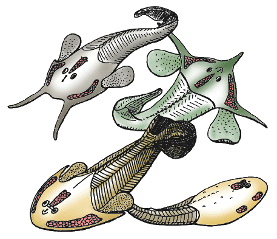
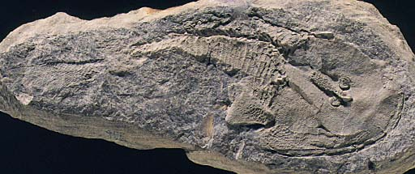

---
aliases:
- Cá giáp xương
- kilpikalat
- Kostnopancerne
- Kostnopanciernatce
- Osteostraci
- Остеостраци
- אוסטסטרקים
- استخوانزرهان
- مدرعات العظم
- 骨甲目
- 骨甲魚綱
- 骨甲鱼纲
title: Osteostraci
has_id_wikidata: Q132935
dv_has_:
  name_:
    an: Osteostraci
    ar: مدرعات العظم
    arz: مدرعات العظم
    ast: Osteostraci
    bg: Osteostraci
    ca: Osteostraci
    ceb: Osteostraci
    de: Osteostraci
    en: Osteostraci
    eo: Osteostraci
    es: Osteostraci
    eu: Osteostraci
    ext: Osteostraci
    fa: استخوانزرهان
    fi: kilpikalat
    fr: Osteostraci
    ga: Osteostraci
    gl: Osteostraci
    he: אוסטסטרקים
    hu: Osteostraci
    ia: Osteostraci
    ie: Osteostraci
    io: Osteostraci
    it: Osteostraci
    ja: 骨甲目
    la: Osteostraci
    mul: Osteostraci
    nl: Osteostraci
    oc: Osteostraci
    pl: Kostnopancerne
    pt: Osteostraci
    pt_br: Osteostraci
    ro: Osteostraci
    ru: Osteostraci
    sk: Kostnopanciernatce
    sq: Osteostraci
    sr: Остеостраци
    sr_ec: Остеостраци
    sr_el: Osteostraci
    uk: Osteostraci
    vi: Cá giáp xương
    vo: Osteostraci
    war: Osteostraci
    zh: 骨甲魚綱
    zh_cn: 骨甲鱼纲
    zh_hans: 骨甲鱼纲
---
# [[Osteostraci]]

[Philippe Janvier](http://www.tolweb.org/) 

 

Interrelationships of the Osteostraci

The main characteristics supporting the nodes of this phylogeny are:

-   **Node 1**: Narrow-based paired fins, oralobranchial cavity closed
    ventrally by large dermal platelets
-   **Node 2**: Anterior dorsal fin reduced to a large median dorsal
    scute
-   **Cornuata**: Cornual processes
-   **Node 3**: Large median dorsal scute lost.
-   **Node 4**: First canal leading from the inner ear to lateral fields
    branches close to the orbit.
-   **Node 5**: Posterior ventral myodome of the orbit (for recti eye
    muscles) reduced.

## #has_/text_of_/abstract 

> The class **Osteostraci** (meaning "bony shells") is an extinct taxon of bony-armored jawless fish, termed "ostracoderms", that lived in what is now North America, Europe and Russia from the Middle Silurian to Late Devonian.
>
> Anatomically speaking, the osteostracans, especially the Devonian species, were among the most advanced of all known agnathans.
>
> This is due to the development of paired fins, and their complicated cranial anatomy. The osteostracans were more similar to lampreys than to jawed vertebrates in possessing two pairs of semicircular canals in the inner ear, as opposed to the three pairs found in the inner ears of jawed vertebrates. They are thought to be the sister-group to pituriaspids, and together, these two taxa of jawless vertebrates are the sister-group of gnathostomes. Several synapomorphies support this hypothesis, such as the presence of: sclerotic ossicles, paired pectoral fins, a dermal skeleton with three layers (a basal layer of isopedin, a middle layer of spongy bone, and a superficial layer of dentin), and perichondral bone.
>
> Most osteostracans had a massive cephalothorac shield, but all Middle and Late Devonian species appear to have had a reduced, thinner, and often micromeric dermal skeleton. This reduction may have occurred at least three times independently because the pattern of reduction is different in each taxon. The largest known osteostracan is Parameteoraspis, its crescent-shaped headshield was 35 to 40 cm wide.
>
> They were probably relatively good swimmers, possessing dorsal fins, paired pectoral fins, and a strong tail. The shield of bone covering the head formed a single piece, and so presumably did not grow during adult life. However, the way in which the bone was laid down makes it possible to examine the imprints of nerves and other soft tissues. This reveals the presence of complex sensory organs and the sides and upper surface of the head, which may have been used to sense vibrations.
>
> [Wikipedia](https://en.wikipedia.org/wiki/Osteostraci) 

## Introduction

The Osteostraci, or osteostracans, are a major clade (about 200 species)
of fossil, armored jawless vertebrates which lived from the Early
Silurian (about 430 million years) to the Late Devonian (about 370
million years). Most of them have a characteristic horseshoe-shaped
head, which consists of a massive endoskeletal skull, covered with a
shield of dermal bone. On the dorsal surface of the head are the
closely-set eyes, a pineal foramen, and a median, keyhole-shaped
nasohypophysial opening. In addition, there are peculiar \"fields\" (in
fact, depressions of the braincase, covered with loose platelets of
dermal bone), which have been regarded as either sense organs or
electric organs. The mouth and gill openings are, like in the
Galeaspida, situated on the ventral side of the head. Osteostracans also
have large, pad-shaped paired fins. Most osteostracans are about 20 to
40 cm. in total length, but some species could be extremely small (about
4 cm in length). The largest species is about one metre in length.

------------------------

The zenaspidid osteostracan Zenaspis pagei, from the Lower Devonian of
Scotland.

------------------------

Osteostracans, also known as \"cephalaspids\", played an important role
in the history of vertebrate palaeontology, as they were the first
fossil jawless fishes whose internal anatomy has been described in
detail, thereby raising heated debates about the organization of the
primitive vertebrate head.

Most osteostracans lived in marginal, marine environments, some of them
being regarded as fresh water. Their horseshoe-shaped headshield
suggests a benthic mode of life, but it is possible that some of them,
such as the Boreaspididae or the Kiaeraspidida were more active
swimmers. They are most diverse in the Early Devonian and become very
rare in the Middle and Late Devonian. Osteostracans are widely
distributed in North America, Europe, Siberia, and Central Asia, north
of the Tian-Shan.

### Characteristics

Osteostracans are characterized by:

-   Two lateral and one median depression in the dorsal surface of the
    endoskeletal headshield, referred to as \"cephalic fields\". These
    fields are covered by polygonal, exoskeletal platelets and are
    connected to the inner ear by means of large branching canals. They
    have been variously interpreted as having housed electric organs,
    expansions of the labyrinth, or special organs of the sensory-line
    system. To date, their function remains unknown.
-   A peculiar, leaf-shaped, horizontal fin underlying the caudal fin.
    This may be a modified anal fin.

Osteostracans resemble the Galeaspida and Pituriaspida in having a
massive endoskeletal headshield, made up by cartilage (sometimes with
globular calcifications) lined with a thin layer of cellular
perichondral bone. As in the latter two groups, this endoskeletal
headshield is hollowed ventrally by a large oralobranchial cavity, the
roof of which shows impressions of the gills and velum. It is undecided
whether this headshield only represents the braincase, or also includes
part of the visceral and scapular skeleton. This endoskeletal headshield
is covered with an exoskeletal headshield, generally made up by
polygonal platelets of cellular bone and bearing tubercles of
mesodentine. The oralobranchial cavity is closed ventrally by either
minute scales or larger dermal platelets. The mouth and gill openings (8
to 10) open ventrally, along the rim of the oralobranchial cavity.
Dorsally, the headshield is pierced by two closely-set orbits, between
which opens a pineal foramen (often piercing a small, separate plate),
and a median, keyhole-shaped nasohypophysial opening. The
nasohypophysial opening is the external opening of the small olfactory
organ and the blind hypophysial tube. This remarkable similarity to
lampreys has long suggested that the two groups were close relatives and
were included, along with the Anaspida in a clade Cephalaspidomorphi.
Current theories of craniate interrelationships suggest, however, that
this characteristic is homoplastic.

Thanks to the perichondral ossification of the endoskeletal headshield,
the internal anatomy of osteostracans could be studied in great details.
It shows the brain cavity, with a paired recess for the cerebellum, the
orbits, with myodomes for the eye muscles, the labyrinth cavity, with
two vertical semicircular canals, and the canals for the cranial nerves
and blood vessels. There have been heated debates about the path of the
cranial nerves, in particular those innervating the gill arches. Some
considered that the maxillary branch of the trigeminus nerve innervated
a premandibular gill arch. Others considered that the gill anatomy of
osteostracans was similar to that of larval lampreys, the foremost gill
being that of the hyoid arch. The most intriguing feature of
osteostracan anatomy is the large, branching canals which lead from the
labyrinth to the lateral and dorsal cephalic \"fields\". Some interpret
then as expansions of the membranous labyrinth, containing endolymph,
whereas others regard them as having housed either sensory or
electromotor nerves.

Osteostracans have paired fins which contained a musculature and were
attached to the posterolateral region of the endoskeletal headshield.

The body of osteostracans is massive, covered with large, diamond-shaped
scales, and bears primitively two dorsal fins (reduced to one or none in
the more advanced forms). The tail is epicercal (i.e. the lobe
containing the notochord points posterodorsally, as in sharks). The
caudal fin web is underlain by a peculiar horizontal, leaf-shaped, fin
web, which may represent a modified anal fin. Sensory-line canals are
developed on the head and part of the body.

### Discussion of Phylogenetic Relationships

The Osteostraci include a major clade, the Cornuata, characterized by
pointed lateral processes of the headshield, in front of the paired fins
(homoplastic with the cornual processes of the Galeaspida and
Pituriaspida), and a few primitive genera (Ateleaspis, Aceraspis,
Hirella, Hemicyclaspis) which represent \"basal\" osteostracans. The
Early Silurian Ateleaspis is regarded as the most generalized
osteostracan.

The Cornuata comprise five major taxa: the Cephalaspidida, Zenaspidida,
Benneviaspidida, Kiaeraspidida, and Tyestiida. There are a few other
minor taxa of uncertain affinities, such as the Tannuaspidida from
Central Asia (Tuva).

The Cephalaspidida are characterized by broad and flattened cornual
processes, onto which extend the lateral fields. Cephalaspis is the
classical representative of this group which, however, includes many
other forms, such as the large Parameteoraspis, whose headshield can
reach 45 cm in breadth.

The Zenaspidida have a more massive headshield, often bearing a
posterior median crest or spinal process. They have a characteristic
ornamentation of large tubercles, surrounded by smaller ones.

The Benneviaspidida have a flattened headshield and their exoskeleton
has lost the polygonal pattern of the platelets, to form a continuous
layer. Some benneviaspidids, such as the Boreaspididae, develop a long
rostral process, like some galeaspids and pituriaspids. One of them,
Tauraspis, is unique in having a pair of forward pointing \"horns\".

The Kiearaspidida are small osteostracans whose headshield extends
posteriorly into a long abdominal division and whose cornual processes
are extremely reduced or lost. Some of them, the Acrotomaspididae, are
very specialized forms, with extremely reduced cephalic fields and their
mouth opens anterodorsally.

The Thyestiida are also small osteostracans, characterized by the
special structure of their sensory-line canals. They include forms, the
Tremataspididae, which have lost the paired fins and cornual process,
their headshield becoming olive-shaped. This may represent an adaptation
to burrowing habits.

Among all \"ostracoderms\", osteostracans (possibly along with
pituriaspids) share the largest number of uniquely derived
characteristics with the gnathostomes: cellular bone, sclerotic ring in
eyes, paired fins containing musculature, and epicercal caudal fin.

## Phylogeny 

-   « Ancestral Groups  
    -   [Vertebrata](../Vertebrata.md)
    -   [Craniata](../../Craniata.md)
    -   [Chordata](../../../Chordata.md)
    -   [Deuterostomia](../../../../Deutero.md)
    -  [Bilateria](../../../../../Bilateria.md) 
    -  [Animals](../../../../../../Animals.md) 
    -  [Eukarya](../../../../../../../Eukarya.md) 
    -   [Tree of Life](../../../../../../../Tree_of_Life.md)

-   ◊ Sibling Groups of  Vertebrata
    -   [Hyperoartia](Hyperoartia.md)
    -   [Euconodonta](Euconodonta.md)
    -   [Pteraspidomorphi](Pteraspidomorphi.md)
    -   [Thelodonti](Thelodonti.md)
    -   [Anaspida](Anaspida.md)
    -   [Galeaspida](Galeaspida.md)
    -   [Pituriaspida](Pituriaspida.md)
    -   Osteostraci
    -   [Gnathostomata](Gnath.md)

-   » Sub-Groups 

## Title Illustrations

Osteostracans are known from the Silurian and Devonian of Europe,
Siberia and North America. They are characterized by peculiar \"cephalic
fields\" of unknown function, on the dorsal surface of the head-shield
(red). Although jawless, they share with jawed vertebrates
well-developed paired fins, an epicercal tail, cellular bone, and a
sclerotic ring in eyes. Their mouth and gill opening are ventrally
placed, as in galeaspids and pituriaspids. Their median, dorsal,
nasohypophysial aperture, anterior to the eyes, is strikingly similar to
that of lampreys but is now regarded as a convergence. All the
osteostracans reconstructed here belong to the major clade Cornuata,
whose generalized morphology is exemplified by the zenaspidid Zenaspis
(bottom left). Some highly derived head-shield morphologies are
exemplified by the benneviaspidids Hoelaspis (top right) and Tauraspis
(top left), or the thyestiid Tremataspis (bottom right). The latter has
lost the paired fins, possibly as a consequence of an adaptation to
burrowing habits. (based on Janvier 1985a,b; Mark-Kurik & Janvier 1995)
 
copyright ::   © 1997 Philippe Janvier

## Confidential Links & Embeds: 

### #is_/same_as :: [[/_Standards/bio/bio~Domain/Eukarya/Animal/Bilateria/Deutero/Chordata/Craniata/Vertebrata/Osteostraci|Osteostraci]] 

### #is_/same_as :: [[/_public/bio/bio~Domain/Eukarya/Animal/Bilateria/Deutero/Chordata/Craniata/Vertebrata/Osteostraci.public|Osteostraci.public]] 

### #is_/same_as :: [[/_internal/bio/bio~Domain/Eukarya/Animal/Bilateria/Deutero/Chordata/Craniata/Vertebrata/Osteostraci.internal|Osteostraci.internal]] 

### #is_/same_as :: [[/_protect/bio/bio~Domain/Eukarya/Animal/Bilateria/Deutero/Chordata/Craniata/Vertebrata/Osteostraci.protect|Osteostraci.protect]] 

### #is_/same_as :: [[/_private/bio/bio~Domain/Eukarya/Animal/Bilateria/Deutero/Chordata/Craniata/Vertebrata/Osteostraci.private|Osteostraci.private]] 

### #is_/same_as :: [[/_personal/bio/bio~Domain/Eukarya/Animal/Bilateria/Deutero/Chordata/Craniata/Vertebrata/Osteostraci.personal|Osteostraci.personal]] 

### #is_/same_as :: [[/_secret/bio/bio~Domain/Eukarya/Animal/Bilateria/Deutero/Chordata/Craniata/Vertebrata/Osteostraci.secret|Osteostraci.secret]] 

