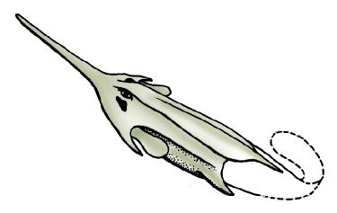

# [[Pituriaspida]]

 

## Introduction

[Philippe Janvier]() 

The Pituriaspida are a small group of fossil, armored jawless
vertebrates, only known by two genera, Pituriaspis and Neeyambaspis,
from the late Early Devonian or early Middle Devonian (about 390 million
years) of Queensland, Australia. The best documented form, however, is
only Pituriaspis, which resembles the Osteostraci, although devoid of
any median dorsal nasohypophysial opening. The nasal or nasohypophysial
opening is supposed to lie ventrally, anteriorly to the mouth. The
headshield of Pituriaspis shows a ventral oralobranchial chamber, as in
the Osteostraci and Galeaspida, a long anterior rostral process, and two
lateral cornual processes which bound anteriorly the area for the
attachment of the paired fins. The headshield extends posteriorly to
form a long abdominal division which probably reached the anal region.

Pituriaspids lived in a marine, deltaic environment, along with various
placoderms.

### Characteristics

The only unique characteristic of the Pituriaspida is a peculiar pit, of
unknown function, ventrally to the orbits.

## Phylogeny 

-   « Ancestral Groups  
    -   [Vertebrata](../Vertebrata.md)
    -   [Craniata](../../Craniata.md)
    -   [Chordata](../../../Chordata.md)
    -   [Deuterostomia](../../../../Deutero.md)
    -  [Bilateria](../../../../../Bilateria.md))
    -  [Animals](../../../../../../Animals.md))
    -  [Eukarya](../../../../../../../Eukarya.md))
    -   [Tree of Life](../../../../../../../Tree_of_Life.md)

-   ◊ Sibling Groups of  Vertebrata
    -   [Hyperoartia](Hyperoartia.md)
    -   [Euconodonta](Euconodonta.md)
    -   [Pteraspidomorphi](Pteraspidomorphi.md)
    -   [Thelodonti](Thelodonti.md)
    -   [Anaspida](Anaspida.md)
    -   [Galeaspida](Galeaspida.md)
    -   Pituriaspida
    -   [Osteostraci](Osteostraci.md)
    -   [Gnathostomata](Gnath.md)

-   » Sub-Groups 
	-   *Pituriaspis* †
	-   *Neeyambaspis* †

## Title Illustrations

Pituriaspids are mainly known by Pituriaspis, from the Devonian of
Australia. As a whole, their headshield is quite similar to that of
osteostracans, though devoid of a naso-hypophysial opening. The mouth,
gill openings and presumably the nasal aperture were all situated on the
ventral side of the head. Well-developed paired fins attached on either
sides of the headshield. The only diagnostic feature of pituriaspids is
an enigmatic pit adjacent to the eyes. (Based on Young 1991.)
)

  Copyright ::   © 1997 Philippe Janvier

## Confidential Links & Embeds: 

### #is_/same_as :: [Pituriaspida](/_Standards/bio/bio~Domain/Eukarya/Animal/Bilateria/Deutero/Chordata/Craniata/Vertebrata/Pituriaspida.md) 

### #is_/same_as :: [Pituriaspida.public](/_public/bio/bio~Domain/Eukarya/Animal/Bilateria/Deutero/Chordata/Craniata/Vertebrata/Pituriaspida.public.md) 

### #is_/same_as :: [Pituriaspida.internal](/_internal/bio/bio~Domain/Eukarya/Animal/Bilateria/Deutero/Chordata/Craniata/Vertebrata/Pituriaspida.internal.md) 

### #is_/same_as :: [Pituriaspida.protect](/_protect/bio/bio~Domain/Eukarya/Animal/Bilateria/Deutero/Chordata/Craniata/Vertebrata/Pituriaspida.protect.md) 

### #is_/same_as :: [Pituriaspida.private](/_private/bio/bio~Domain/Eukarya/Animal/Bilateria/Deutero/Chordata/Craniata/Vertebrata/Pituriaspida.private.md) 

### #is_/same_as :: [Pituriaspida.personal](/_personal/bio/bio~Domain/Eukarya/Animal/Bilateria/Deutero/Chordata/Craniata/Vertebrata/Pituriaspida.personal.md) 

### #is_/same_as :: [Pituriaspida.secret](/_secret/bio/bio~Domain/Eukarya/Animal/Bilateria/Deutero/Chordata/Craniata/Vertebrata/Pituriaspida.secret.md)

