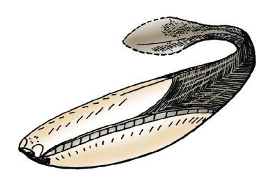
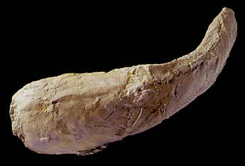

---
aliases:
  - Arandaspida
title: Arandaspida
---

# [[Arandaspida]]

[Philippe Janvier](http://www.tolweb.org/) 

## #has_/text_of_/abstract 

> **Arandaspida** is a taxon of very early, jawless prehistoric fish which lived during the Ordovician period.  Arandaspids represent some of the oldest known vertebrates. The group represents a subclass within the class Pteraspidomorphi, and contains only one order, the Arandaspidiformes. The oldest known genus of this group is Sacabambaspis found in South America.
>
> [Wikipedia](https://en.wikipedia.org/wiki/Arandaspida) 

## Introduction

The Arandaspida, or arandaspids, are a small group of armored, fossil
jawless vertebrates, which lived in the Ordovician (from -480 to -440
million years ago). They are thus among the earliest known craniates, if
one excepts the controversial Euconodonta. They are regarded as
belonging to the Pteraspidomorphi, because of the large, median dorsal
and ventral plates of their head armor. Arandaspids were marine and are
recorded only from Australia and South America (Bolivia and Argentina).

An almost complete specimen of Sacabambaspis janvieri, from the
Ordovician (Caradoc) of Bolivia.

### Characteristics

Arandaspids are characterized by:

-   Frontally placed eyes, included in an anterior notch of the dorsal
    shield.
-   long, posteriorly slanting series of about twenty diamond-shaped
    platelets which separate the dorsal from the ventral shield of the
    head armor. Between these platelets open minute external gill
    openings.

The head armor of arandaspids is elongated, fusiform, with a rather flat
dorsal shield, and a bulging ventral shield. The eyes, surrounded by a
sclerotic ring, are housed in a notch at the anterior end of the dorsal
shield. The nostrils are nor clearly located, but may have been situated
between the eyes. Ventrally, the ventral lip of the mouth is armed with
long series of small oral plates which recall those of heterostracans.
In the anterior part of the dorsal shield are two, closely-set holes,
which have been thought to be a paired pineal opening, but which are
more likely the external openings of the endolymphatic ducts. The gill
openings are probably numerous (more than 15) and minute. They opened
between the diamond-shaped platelets which separate the dorsal from the
ventral shield.

The body is covered with rod-shaped scales arranged in chevrons, and the
tail is probably pad-shaped and diphycercal. The dermal bones of
arandaspids consist of aspidine (acellular bone) and are ornamented with
oakleaf-shaped tubercles which seem to contain no dentine. The
sensory-lines were housed in narrow grooves between the tubercles.

### Discussion of Phylogenetic Relationships

The Arandaspida comprise four monospecific genera, Arandaspis,
Porophoraspis, Sacabambaspis, and Andinaspis, which occur in the Middle
Ordovician of Australia, Bolivia, and Argentina, Sacabambaspis is the
best known genus. Fragments of arandaspid bones are, however known from
the base (Arenig; 480 million years) to the top (Ashgill; 440 million
years) of the Ordovician. They are thus the earliest known undisputed
craniate remains.

To date, there is no phylogeny of the Arandaspida and, considering the
fragmentary state of the material of Porophoraspis and Andinaspis, the
only available characteristics would be in the aspect of the dermal
ornamentation. The tubercles of Arandaspis are drop-shaped and
scalloped, those of Sacabambaspis and Andinaspis oakleaf-shaped, and
those of Porophoraspis are perforated by large pores. Which of these
types of ornamentation is primitive for the group is unknown, although
one may note that the earliest known arandaspid fragments are of the
Porophoraspis type.

## Phylogeny 

-   « Ancestral Groups  
    -   [Pteraspidomorphi](../Pteraspidomorphi.md)
    -   [Vertebrata](../../Vertebrata.md)
    -   [Craniata](../../../Craniata.md)
    -   [Chordata](../../../../Chordata.md)
    -   [Deuterostomia](../../../../../Deutero.md)
    -  [Bilateria](../../../../../../Bilateria.md) 
    -  [Animals](../../../../../../../Animals.md) 
    -  [Eukarya](../../../../../../../../Eukarya.md) 
    -   [Tree of Life](../../../../../../../../Tree_of_Life.md)

-   ◊ Sibling Groups of  Pteraspidomorphi
    -   [Heterostraci](Heterostraci.md)
    -   [Eriptychiida](Eriptychiida.md)
    -   [Astraspida](Astraspida.md)
    -   Arandaspida

-   » Sub-Groups 
	-   *Arandaspis* †
	-   *Porophoraspis* †
	-   *Sacabambaspis* †
	-   *Andinaspis* †

## Title Illustrations

The best known arandaspid, Sacabambaspis, from the Ordovician of
Bolivia, shows the characteristic, frontally positioned eyes, like car
head lamps. (after Janvier 1996)
 
copyright ::   © 1997 Philippe Janvier

## Confidential Links & Embeds: 

### #is_/same_as :: [[/_Standards/bio/bio~Domain/Eukarya/Animal/Bilateria/Deutero/Chordata/Craniata/Vertebrata/Pteraspidomorphi/Arandaspida|Arandaspida]] 

### #is_/same_as :: [[/_public/bio/bio~Domain/Eukarya/Animal/Bilateria/Deutero/Chordata/Craniata/Vertebrata/Pteraspidomorphi/Arandaspida.public|Arandaspida.public]] 

### #is_/same_as :: [[/_internal/bio/bio~Domain/Eukarya/Animal/Bilateria/Deutero/Chordata/Craniata/Vertebrata/Pteraspidomorphi/Arandaspida.internal|Arandaspida.internal]] 

### #is_/same_as :: [[/_protect/bio/bio~Domain/Eukarya/Animal/Bilateria/Deutero/Chordata/Craniata/Vertebrata/Pteraspidomorphi/Arandaspida.protect|Arandaspida.protect]] 

### #is_/same_as :: [[/_private/bio/bio~Domain/Eukarya/Animal/Bilateria/Deutero/Chordata/Craniata/Vertebrata/Pteraspidomorphi/Arandaspida.private|Arandaspida.private]] 

### #is_/same_as :: [[/_personal/bio/bio~Domain/Eukarya/Animal/Bilateria/Deutero/Chordata/Craniata/Vertebrata/Pteraspidomorphi/Arandaspida.personal|Arandaspida.personal]] 

### #is_/same_as :: [[/_secret/bio/bio~Domain/Eukarya/Animal/Bilateria/Deutero/Chordata/Craniata/Vertebrata/Pteraspidomorphi/Arandaspida.secret|Arandaspida.secret]] 

