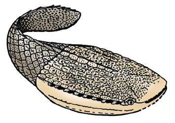

---
aliases:
  - Astraspida
title: Astraspida
---

# [[Astraspida]]

[Philippe Janvier](http://www.tolweb.org/)

 

## #has_/text_of_/abstract 

> **Astraspida**, or astraspids, are a small group of extinct armored jawless vertebrates, which lived in the Late Ordovician (about 450 million years ago) in North America. They are placed among the Pteraspidomorphi because of the large dorsal and ventral shield of their head armor. They are represented by a single genus, Astraspis, including possibly two species, A. desiderata and A. splendens but their remains are fairly abundant in Ordovician sandstones of the USA (Colorado, Arizona, Oklahoma, Wyoming) and Canada (Quebec). The head armor of Astraspis is rather massive, with a series of ten gill openings lining the margin of the dorsal shield, and laterally placed eyes. The dorsal shield is ribbed by strong longitudinal crests, and the tail is covered with large, diamond-shaped scales. They are often grouped together with the Arandaspidida.
>
> [Wikipedia](https://en.wikipedia.org/wiki/Astraspida) 

## Introduction

The Astraspida, or astraspids, are a small group of fossil, armored,
fossil jawless vertebrates, which lived in the Middle Ordovician (about
450 million years ago) in North America. They are placed among the
Pteraspidomorphi because of the large dorsal and ventral shield of their
head armor. They are represented by a single genus, Astraspis, including
possibly two species, A. desiderata and A. splendens, but their remains
are fairly abundant in Ordovician sandstones of the USA (Colorado,
Arizona, Oklahoma, Wyoming) and Canada (Quebec). The head armor of
Astraspis is rather massive, with a series of ten gill openings lining
the margin of the dorsal shield, and laterally placed eyes. The dorsal
shield is ribbed by strong longitudinal crests, and the tail is covered
with large, diamond-shaped scales.

### Characteristics

Astraspids are characterized by:

-   A dermal ornamentation of large, mushroom shaped tubercles of
    fine-tubuled dentine (\'astraspidine\'), covered with a thick,
    glassy cap of enameloid.

Astraspids and eriptychiids (see Eriptychiida) were the first Ordovician
vertebrates ever discovered in the nineteeth century, and they have long
been the only known Ordovician vertebrates, until the discovery of the
arandaspids, in the 1970\'s. Therefore, their structure, though poorly
known, has often been used in evolutionary scenarios to illustrate the
primitive condition of the vertebrate dermal skeleton. Because of the
acellular structure of their dermal skeleton, they were first regarded
as heterostracans. Now, we know that they are widely different from
heterostracans, in particular in retaining about ten separate external
gill openings. However, they share with heterostracans the relatively
dorsal position of these openings. Their dorsal and ventral shield is
made up by numerous polygonal platelets of aspidine, ornamented with
large dentine tubercles capped with a thick enameloid layer. Nothing is
known of their internal anatomy, but they possessed a sensory-line
system housed in grooves of the dermal plates.

### Discussion of Phylogenetic Relationships

Astraspids are regarded as more closely related to heterostracans than
to arandaspids, because of the dorsolateral position of their gill
openings.

## Phylogeny 

-   « Ancestral Groups  
    -   [Pteraspidomorphi](../Pteraspidomorphi.md)
    -   [Vertebrata](../../Vertebrata.md)
    -   [Craniata](../../../Craniata.md)
    -   [Chordata](../../../../Chordata.md)
    -   [Deuterostomia](../../../../../Deutero.md)
    -  [Bilateria](../../../../../../Bilateria.md) 
    -  [Animals](../../../../../../../Animals.md) 
    -  [Eukarya](../../../../../../../../Eukarya.md) 
    -   [Tree of Life](../../../../../../../../Tree_of_Life.md)

-   ◊ Sibling Groups of  Pteraspidomorphi
    -   [Heterostraci](Heterostraci.md)
    -   [Eriptychiida](Eriptychiida.md)
    -   Astraspida
    -   [Arandaspida](Arandaspida.md)

-   » Sub-Groups 
	-   *Astraspis desiderata* †
	-   *Astraspis splendens* †

## Title Illustrations

Astraspids are still poorly known but recent discoveries of partially
complete specimens of Astraspis desiderata, from the Ordovician of
Colorado, have considerably increased their knowledge. Their dorsal
headshield is made up by large, polygonal bone units and the gill
openings are situated more dorsally than in arandaspids. (After Janvier
1996, modified from Elliott 1987.)
)

Copyright ::   © 1997 Philippe Janvier

## Confidential Links & Embeds: 

### #is_/same_as :: [[/_Standards/bio/bio~Domain/Eukarya/Animal/Bilateria/Deutero/Chordata/Craniata/Vertebrata/Pteraspidomorphi/Astraspida|Astraspida]] 

### #is_/same_as :: [[/_public/bio/bio~Domain/Eukarya/Animal/Bilateria/Deutero/Chordata/Craniata/Vertebrata/Pteraspidomorphi/Astraspida.public|Astraspida.public]] 

### #is_/same_as :: [[/_internal/bio/bio~Domain/Eukarya/Animal/Bilateria/Deutero/Chordata/Craniata/Vertebrata/Pteraspidomorphi/Astraspida.internal|Astraspida.internal]] 

### #is_/same_as :: [[/_protect/bio/bio~Domain/Eukarya/Animal/Bilateria/Deutero/Chordata/Craniata/Vertebrata/Pteraspidomorphi/Astraspida.protect|Astraspida.protect]] 

### #is_/same_as :: [[/_private/bio/bio~Domain/Eukarya/Animal/Bilateria/Deutero/Chordata/Craniata/Vertebrata/Pteraspidomorphi/Astraspida.private|Astraspida.private]] 

### #is_/same_as :: [[/_personal/bio/bio~Domain/Eukarya/Animal/Bilateria/Deutero/Chordata/Craniata/Vertebrata/Pteraspidomorphi/Astraspida.personal|Astraspida.personal]] 

### #is_/same_as :: [[/_secret/bio/bio~Domain/Eukarya/Animal/Bilateria/Deutero/Chordata/Craniata/Vertebrata/Pteraspidomorphi/Astraspida.secret|Astraspida.secret]] 

