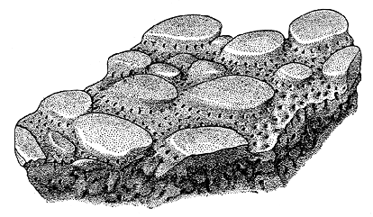

# [[Eriptychiida]]

## #has_/text_of_/abstract 

> **Eriptychiida** is an extinct marine taxon of vertebrate in the group Pteraspidomorphi.
>
> The order contains the genus, Eriptychius, and fossilized specimens from this genus have been found in the Gull River Formation of Ontario, the Harding Formation of Colorado, and the Bighorn Dolomite of Wyoming. The group contains two documented species: Eriptychius americanus and Eriptychius orvigi.
>
> [Wikipedia](https://en.wikipedia.org/wiki/Eriptychiida) 

## Introduction

[Philippe Janvier]() 

The Eriptychiida, or eriptychiids, are a group of armored, fossil
jawless vertebrates, which lived in the Middle Ordovician (about 450
million years ago) in North America. It is represented by two species,
Eriptychius americanus and E. orvigi, known by only scales and armor
fragments. A single specimen shows a partly articulated snout, whith
traces of a calcified endoskeleton. Isolated branchial plates with a
notch for the branchial opening suggest that their overall morphology
was rather similar to that of the Astraspida. Eriptychius is found in
association with the Astraspida.

### Characteristics

Eriptychiids are characterized by:

-   Large, flattened tubercles made up by orthodentine with very large
    tubules, possibly capped with true enamel.

The structure of the dentine of eriptychiids is in many respects closer
to that of heterostracans that to that of astraspids. This is the only
argument to place them as the closest relatives to heterostracans, among
the Ordovician vertebrates. However, eriptychiids differ from all other
pteraspidomorphs in having a massively calcified endoskeleton, pervaded
by canals for blood vessels.

### Discussion of Phylogenetic Relationships

The Eriptychiida are represented by a single, poorly known genus,
Eriptychius, which superficially resembles Astraspis in having a
tessellate headshield, but whose bone and dentine microstructure looks
closer to that of heterostracans than to that of Astraspis. Eriptychiids
occur in North America, usually in association with Astraspis.

## Phylogeny 

-   « Ancestral Groups  
    -   [Pteraspidomorphi](../Pteraspidomorphi.md)
    -   [Vertebrata](../../Vertebrata.md)
    -   [Craniata](../../../Craniata.md)
    -   [Chordata](../../../../Chordata.md)
    -   [Deuterostomia](../../../../../Deutero.md)
    -  [Bilateria](../../../../../../Bilateria.md))
    -  [Animals](../../../../../../../Animals.md))
    -  [Eukarya](../../../../../../../../Eukarya.md))
    -   [Tree of Life](../../../../../../../../Tree_of_Life.md)

-   ◊ Sibling Groups of  Pteraspidomorphi
    -   [Heterostraci](Heterostraci.md)
    -   Eriptychiida
    -   [Astraspida](Astraspida.md)
    -   [Arandaspida](Arandaspida.md)

-   » Sub-Groups 
	-   *Eriptychius americanus* †
	-   *Eriptychius orvigi* †

## Title Illustrations

The overall morphology of eriptychiids is still unknown, despite the
abundance of their dermal bone fragments bearing large, oval tubercles,
in the Ordovician of Colorado. (From Ørvig 1958.)
)
Copyright ::   © 1997 Philippe Janvier

## Confidential Links & Embeds: 

### #is_/same_as :: [Eriptychiida](/_Standards/bio/bio~Domain/Eukarya/Animal/Bilateria/Deutero/Chordata/Craniata/Vertebrata/Pteraspidomorphi/Eriptychiida.md) 

### #is_/same_as :: [Eriptychiida.public](/_public/bio/bio~Domain/Eukarya/Animal/Bilateria/Deutero/Chordata/Craniata/Vertebrata/Pteraspidomorphi/Eriptychiida.public.md) 

### #is_/same_as :: [Eriptychiida.internal](/_internal/bio/bio~Domain/Eukarya/Animal/Bilateria/Deutero/Chordata/Craniata/Vertebrata/Pteraspidomorphi/Eriptychiida.internal.md) 

### #is_/same_as :: [Eriptychiida.protect](/_protect/bio/bio~Domain/Eukarya/Animal/Bilateria/Deutero/Chordata/Craniata/Vertebrata/Pteraspidomorphi/Eriptychiida.protect.md) 

### #is_/same_as :: [Eriptychiida.private](/_private/bio/bio~Domain/Eukarya/Animal/Bilateria/Deutero/Chordata/Craniata/Vertebrata/Pteraspidomorphi/Eriptychiida.private.md) 

### #is_/same_as :: [Eriptychiida.personal](/_personal/bio/bio~Domain/Eukarya/Animal/Bilateria/Deutero/Chordata/Craniata/Vertebrata/Pteraspidomorphi/Eriptychiida.personal.md) 

### #is_/same_as :: [Eriptychiida.secret](/_secret/bio/bio~Domain/Eukarya/Animal/Bilateria/Deutero/Chordata/Craniata/Vertebrata/Pteraspidomorphi/Eriptychiida.secret.md)

