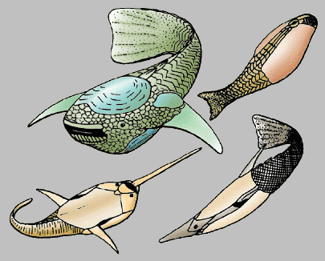
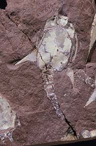
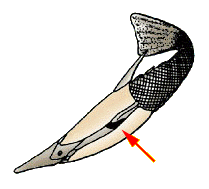

---
title: Heterostraci
---

# [[Heterostraci]]

[Philippe Janvier](http://www.tolweb.org/) 

 

Interrelationships of the Heterostraci

The main characteristics supporting the nodes of this phylogeny are:

-   **Node 1**: Cyathaspidiformes: dermal ornamentation of parallel,
    longitudinal, and finely crenulated dentine ridges.
-   **Node 2**: Pteraspidiformes: dermal ornamentation of concentric and
    serrated dentine ridges. Separate orbital, pineal and rostral
    plates, median dorsal spinal plate.

## #has_/text_of_/abstract 

> **Heterostraci** (Ancient Greek, ἕτερος+ὄστρακον "those [with] a different shell" [-i is pl. of -us]) is an extinct subclass of pteraspidomorph, ostracoderm, jawless vertebrate that lived primarily in marine and estuary environments. Heterostraci existed from the mid-Ordovician to the conclusion of the Devonian.
>
> [Wikipedia](https://en.wikipedia.org/wiki/Heterostraci) 

## Introduction

The Heterostraci, or heterostracans, is a large clade of the
Pteraspidomorphi, i.e. a group of fossil, armored jawless vertebrates,
which lived from the Early Silurian to the Late Devonian (about 430 to
370 million years ago). They generally possess a fusiform head armor and
a fan-shaped tail. Some forms, however, can have a rather depressed
armor, with broadly expanded branchial plates. Some text-books still
include the Astraspida, Eriptychiida and Arandaspida in the
Heterostraci, but heterostracans clearly differ from these groups in
having a single, common branchial opening on each side.

The protopteraspidid *Doryaspis nathorsti*, from the Lower Devonian of
Spitsbergen.

Heterostracans are represented by nearly 300 species. They were marine
but lived in sandy lagoons or deltas. Some species, however, are
regarded as fresh water. They are known exclusively from North America,
Europe and Siberia. They probably fed by scraping the bottom with their
fan-shaped oral plates that armed their lower lip. They were poor
swimmers and probably bottom-dewellers. It has been suggested that their
posteriorly placed common gill opening could serve as a jet propulsion
device and that made them moved like Cousteau\'s diving saucer.

Although most heterostracans are relatively small (5 to 30 cm in total
length), some of them, the Psammosteidae, could grow to a very large
size (up to 1.5 m in length) and developed steer-like branchial plates.

### Characteristics

Heterostracans are characterized by:

-   A single, common external branchial opening on each side of the head
    armor.

Heterostracans are characterized by a single, common external opening on
either side of the head armor (red arrow).

The heterostracan head armor comprises large ventral and dorsal shields
and a variable number of separate plates, laterally (cornual, branchial
plates) and around the mouth (oral, postoral, orogonal plates). In some
taxa (Pteraspidiformes, Traquairaspidiformes), the dorsal shield can be
compound of several distinct plates (orbital, pineal, rostral), but
there always remains a large median dorsal \"disk\".

Since heterostracans have no calcified endoskeleton, their internal
anatomy is only known from the impressions of the internal organs on the
internal surface of the dermal armor. One may trace the impressions of
the brain, gills, eyeballs, paired olfactory organ, and two distinct
vertical semicircular canals of the labyrinth. Although paired, the
olfactory organs seem to have opened ventrally into a large, median
inhalent duct, as in extant hagfishes (see Hyperotreti).

### Discussion of Phylogenetic Relationships

Most heterostracans fall into two major clades, the Cyathaspidiformes
(Silurian-Early Devonian) and the Pteraspidiformes (Late Silurian-Late
Devonian). There is, however, a number of minor taxa of debated
affinities (Traquairaspidiformes, Lepidaspis, Tesseraspis, Cardipeltida,
Tolypelepida). Cyathaspidiforms are characterized by the parallel and
finely crenulated dentine ridges which form the ornamentation of the
dermal plates. Some cyathaspidiforms, the Amphiaspidida, display a
remarkable adaptation to benthic habits, with entirely fused plates of
the armor and a peculiar opening near the orbit, which may as served as
a spiracle. Pteraspidiforms are characterized by concentric dentine
ridges with serrated margins. They usually have a median, spine-shaped
dermal plate, and their dorsal shield consists of five separate plates
(a dorsal \"disc\" and two orbital, one pineal, and one rostral plate).
They also have separate branchial and cornual plates. Pteraspidiforms
and cyathaspidiforms are probably sister-groups, and the other, minor
groups are regarded as \"basal\" heterostracan taxa.

## Phylogeny 

-   « Ancestral Groups  
    -   [Pteraspidomorphi](../Pteraspidomorphi.md)
    -   [Vertebrata](../../Vertebrata.md)
    -   [Craniata](../../../Craniata.md)
    -   [Chordata](../../../../Chordata.md)
    -   [Deuterostomia](../../../../../Deutero.md)
    -  [Bilateria](../../../../../../Bilateria.md))
    -  [Animals](../../../../../../../Animals.md))
    -  [Eukarya](../../../../../../../../Eukarya.md))
    -   [Tree of Life](../../../../../../../../Tree_of_Life.md)

-   ◊ Sibling Groups of  Pteraspidomorphi
    -   Heterostraci
    -   [Eriptychiida](Eriptychiida.md)
    -   [Astraspida](Astraspida.md)
    -   [Arandaspida](Arandaspida.md)

-   » Sub-Groups 

## Title Illustrations

)

Scientific Name ::     Protopteraspididae, Pteraspididae, Tolypelepidida, and Psammosteidae
Comments             Heterostracans are the most diverse group of pteraspidomorphs and lived during the Silurian and Devonian periods. Among the most primitive heterostracans are tolypelepids (top right). Most heterostracans are pteraspidiforms, such as the pteraspidids (bottom right), protopteraspidids (bottom left) and the huge psammosteids (top left), which are the youngest known members of the group.
Reference            After Janvier 1996 AND Soehn, K. L. and Wilson, M. K. V. (1990). A complete, articulated heterostracan from Wenlockian (Silurian) beds of the Delorme Group, Mackenzie Mountains, Northwest territories, Canada. Journal of Vertebrate Paleontology, 10:405-419.
Specimen Condition   Fossil
Copyright ::            © 1997 [Philippe Janvier](mailto:janvier@cimrs1.mnhn.fr) 

## Confidential Links & Embeds: 

### #is_/same_as ::[Heterostraci](Heterostraci.md)) 

### #is_/same_as :: [Heterostraci.public](/_public/bio/bio~Domain/Eukarya/Animal/Bilateria/Deutero/Chordata/Craniata/Vertebrata/Pteraspidomorphi/Heterostraci.public.md) 

### #is_/same_as :: [Heterostraci.internal](/_internal/bio/bio~Domain/Eukarya/Animal/Bilateria/Deutero/Chordata/Craniata/Vertebrata/Pteraspidomorphi/Heterostraci.internal.md) 

### #is_/same_as :: [Heterostraci.protect](/_protect/bio/bio~Domain/Eukarya/Animal/Bilateria/Deutero/Chordata/Craniata/Vertebrata/Pteraspidomorphi/Heterostraci.protect.md) 

### #is_/same_as :: [Heterostraci.private](/_private/bio/bio~Domain/Eukarya/Animal/Bilateria/Deutero/Chordata/Craniata/Vertebrata/Pteraspidomorphi/Heterostraci.private.md) 

### #is_/same_as :: [Heterostraci.personal](/_personal/bio/bio~Domain/Eukarya/Animal/Bilateria/Deutero/Chordata/Craniata/Vertebrata/Pteraspidomorphi/Heterostraci.personal.md) 

### #is_/same_as :: [Heterostraci.secret](/_secret/bio/bio~Domain/Eukarya/Animal/Bilateria/Deutero/Chordata/Craniata/Vertebrata/Pteraspidomorphi/Heterostraci.secret.md)

