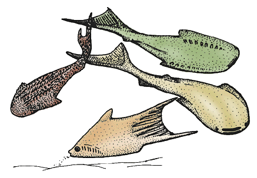

---
aliases:
  - Thelodonti
title: Thelodonti
---

# [[Thelodonti]] 

[Philippe Janvier](http://www.tolweb.org/)

 

## #has_/text_of_/abstract 

> **Thelodonti** (from Greek: "nipple teeth") is a class of extinct Palaeozoic jawless fishes with distinctive scales instead of large plates of armor.
>
> There is much debate over whether the group represents a monophyletic grouping, or disparate stem groups to the major lines of jawless and jawed fish.
>
> Thelodonts are united in possession of "thelodont scales". This defining character is not necessarily a result of shared ancestry, as it may have been evolved independently by different groups. Thus the thelodonts are generally thought to represent a polyphyletic group, although there is no firm agreement on this point.  On the basis that they are monophyletic, they are reconstructed as being ancestrally marine and invading freshwater on multiple occasions.
>
> "Thelodonts" were morphologically very similar, and probably closely related, to fish of the classes Heterostraci and Anaspida, differing mainly in their covering of distinctive, small, spiny scales. These scales were easily dispersed after death; their small size and resilience makes them the most common vertebrate fossil of their time.
>
> The fish lived in both freshwater and marine environments, first appearing during the Ordovician, and perishing during the Frasnian–Famennian extinction event of the Late Devonian. Traditionally they were considered predominantly deposit-feeding bottom dwellers, but more recent studies have shown they occupied various ecological roles in various parts of the water column, much like modern bony fishes and sharks. In particular, a large variety of species preferred reef ecosystems, and it has been suggested that this preference was the reason for the development of their unique scales, protecting against abrasion and allowing for the development of more flexible bodies than other jawless fish, which had inflexible armors and were restricted to open habitats.
>
> [Wikipedia](https://en.wikipedia.org/wiki/Thelodonti)
## Introduction

Thelodonts are an ensemble of fossil, presumably jawless vertebrates,
distinguished from other jawless vertebrate taxa by the structure of
their exoskeleton, which is entirely made up by minute scales. These
scales are hollowed by a pulp cavity and superficially resemble the
placoid scales of sharks. They are known from the Lowermost Silurian
(and possibly the Late Ordovician) to the Late Devonian (430 to 370
million years ago).

Thelodonts lived in shallow-water marine environments. They seem to have
survived longer in the Gondwana than in Euramerica, where they disappear
from the fossil record after the early Middle Devonian.

### Characteristics

There are two competing theories regarding the affinities of the
thelodonts. Some consider them as clade, characterized by:

-   Scales with a growing base and special processes to anchor them in
    the dermis.

Others consider them as paraphyletic; that is, an ensemble of primitive
forms respectively related to other major vertebrate groups. Some
thelodonts would thus be relatives of the pteraspidomorphs, others of
anaspids, galeaspids, osteostracans, and the gnathostomes.

The overall morphology of the thelodonts is only known from a few forms
but seems to be relatively homogeneous. Most of them have a
dorsoventrally flattened head with lateral flaps (or paired fins?),
small eyes, and eight, ventrally placed gill slits. There is one dorsal
fin, one anal fin, and the caudal fin is slightly hypocercal, with a
large dorsal web strengthened by radials. Other thelodonts are
deep-bodied, with larger eyes, laterally placed gill slits, and a large
fork-shaped tail.

There are very few information on the internal anatomy of thelodonts,
although some distinctly show imprints of paired olfactory organs. Some
thelodonts have minute, internal denticles which cover the pharynx and
possibly a large, median, inhalent duct comparable to the median dorsal
opening of the Galeaspida. The presence of such denticles is unique
among jawless vertebrates and recalls the condition in the gnathostomes.
Well preserved thelodonts from Canada show the impression of a large,
barrel-shaped stomach, a characteristic which is shared with the
gnathostomes.

### Discussion of Phylogenetic Relationships

When thelodonts are regarded as clade, they are placed as the
sister-group of either the Pteraspidomorphi, or the Gnathostomata (see
Vertebrata page). When considered as being paraphyletic, they may
include stem forms of all \"ostracoderm\" groups (pteraspidomorphs,
galeaspids, anaspids, osteostracans, and pituriaspids) and the
gnathostomes. In particular, one group of thelodonts, the Katoporida,
shares with the osteostracans, the presence of a special type of
dentine, called mesodentine, in the scales. It is probable that the
fork-tailed thelodonts (unamed to date) are more closely related to the
Heterostraci (or all the Pteraspidomorphi) than to any other vertebrate
taxon, as they share the same tail structure. Thelodonts with internal
denticles, such as Loganellia, may be more closely related to the
gnathostomes than to any group of jawless vertebrate.

Thelodont taxa have been defined on the basis of scale histology and
morphology, but recent studies on articulated thelodonts show that scale
morphology can be misleading, as a wide range of scale morphologies can
occur in the same individual. Thelodonts are currently classified into
four groups: Achanolepida, Loganiida, Turiniida, and Katoporida, on the
basis of scale histology and morphology, but this is merely a phenetic
classification.

## Phylogeny 

-   « Ancestral Groups  
    -   [Vertebrata](../Vertebrata.md)
    -   [Craniata](../../Craniata.md)
    -   [Chordata](../../../Chordata.md)
    -   [Deuterostomia](../../../../Deutero.md)
    -  [Bilateria](../../../../../Bilateria.md) 
    -  [Animals](../../../../../../Animals.md) 
    -  [Eukarya](../../../../../../../Eukarya.md) 
    -   [Tree of Life](../../../../../../../Tree_of_Life.md)

-   ◊ Sibling Groups of  Vertebrata
    -   [Hyperoartia](Hyperoartia.md)
    -   [Euconodonta](Euconodonta.md)
    -   [Pteraspidomorphi](Pteraspidomorphi.md)
    -   Thelodonti
    -   [Anaspida](Anaspida.md)
    -   [Galeaspida](Galeaspida.md)
    -   [Pituriaspida](Pituriaspida.md)
    -   [Osteostraci](Osteostraci.md)
    -   [Gnathostomata](Gnath.md)

-   » Sub-Groups 

## Title Illustrations

Thelodonts are a still poorly known group of Silurian and Devonian
jawless vertebrates, whose dermal skeleton consists of minute scales.
Most thelodonts have a dorsoventrally depressed body and head, the gill
openings being situated on the ventral side. It is assumed that the
snout was more or less as in primitive galeaspids; that is, with a
broad, inhalent median opening and a slightly ventral mouth. Among the
flat-bodied forms are Lanarkia (top left), provided with long,
spine-shaped scales, and Loganellia (top right and middle). Other
thelodonts, such as an unnamed form from the Devonian of Canada (bottom)
are deep-bodied, with lateral gill openings and a very large, forked
tail. (Based on Turner 1991, 1992; Wilson & Cadwell 1993.)
)
Copyright ::   © 1997 Philippe Janvier

## Confidential Links & Embeds: 

### #is_/same_as :: [[/_Standards/bio/bio~Domain/Eukarya/Animal/Bilateria/Deutero/Chordata/Craniata/Vertebrata/Thelodonti|Thelodonti]] 

### #is_/same_as :: [[/_public/bio/bio~Domain/Eukarya/Animal/Bilateria/Deutero/Chordata/Craniata/Vertebrata/Thelodonti.public|Thelodonti.public]] 

### #is_/same_as :: [[/_internal/bio/bio~Domain/Eukarya/Animal/Bilateria/Deutero/Chordata/Craniata/Vertebrata/Thelodonti.internal|Thelodonti.internal]] 

### #is_/same_as :: [[/_protect/bio/bio~Domain/Eukarya/Animal/Bilateria/Deutero/Chordata/Craniata/Vertebrata/Thelodonti.protect|Thelodonti.protect]] 

### #is_/same_as :: [[/_private/bio/bio~Domain/Eukarya/Animal/Bilateria/Deutero/Chordata/Craniata/Vertebrata/Thelodonti.private|Thelodonti.private]] 

### #is_/same_as :: [[/_personal/bio/bio~Domain/Eukarya/Animal/Bilateria/Deutero/Chordata/Craniata/Vertebrata/Thelodonti.personal|Thelodonti.personal]] 

### #is_/same_as :: [[/_secret/bio/bio~Domain/Eukarya/Animal/Bilateria/Deutero/Chordata/Craniata/Vertebrata/Thelodonti.secret|Thelodonti.secret]] 

