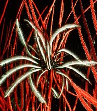
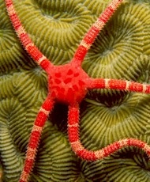
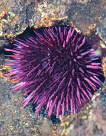
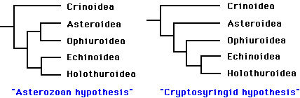

---
aliases:
- echinoderm
title: Echinodermata
---

# [[Echinodermata]]

Spiny-skinned animals: sea urchins, starfish, and their allies 

     

## #has_/text_of_/abstract 

> An echinoderm is any animal of the phylum **Echinodermata**, which includes starfish, brittle stars, 
> sea urchins, sand dollars and sea cucumbers, as well as the sessile sea lilies or "stone lilies". 
> 
> While bilaterally symmetrical as larvae, as adults echinoderms are recognisable by their 
> usually five-pointed radial symmetry (pentamerous symmetry), 
> and are found on the sea bed at every ocean depth from the intertidal zone to the abyssal zone. 
> 
> The phylum contains about 7,600 living species, 
> making it the second-largest group of deuterostomes after the chordates, 
> as well as the largest marine-only phylum. 
> 
> The first definitive echinoderms appeared near the start of the Cambrian.
>
> Echinoderms are important both ecologically and geologically. Ecologically, there are few other groupings so abundant in the deep sea, as well as shallower oceans. Most echinoderms are able to reproduce asexually and regenerate tissue, organs and limbs; in some cases, they can undergo complete regeneration from a single limb. Geologically, the value of echinoderms is in their ossified dermal endoskeletons, which are major contributors to many limestone formations and can provide valuable clues as to the geological environment. They were the most used species in regenerative research in the 19th and 20th centuries. Further, some scientists hold that the radiation of echinoderms was responsible for the Mesozoic Marine Revolution.
>
> [Wikipedia](https://en.wikipedia.org/wiki/Echinoderm) 

## Introduction

[Gregory A. Wray]() 

Echinoderms form a well-defined and highly-derived clade of metazoans.
They have attracted much attention due to their extensive fossil record,
ecological importance in the marine realm, intriguing adult morphology,
unusual biomechanical properties, and experimentally manipulable
embryos. The approximately 7,000 species of extant echinoderms fall into
five well-defined clades: Crinoidea (sea lilies and feather stars),
Ophiuroidea (basket stars and brittle stars), Asteroidea (starfishes),
Echinoidea (sea urchins, sand dollars, and sea biscuits), and
Holothuroidea (sea cucumbers). The phylogenetic position of the
Concentricycloidea (sea daisies; 2 species), remains controversial
(Baker et al. 1986; Smith 1988b; Pearse and Pearse 1994; Mooi et al.
1997).

Approximately 13,000 echinoderm species are known from the fossil
record. All Mesozoic and Cenozoic forms clearly fall into the five
extant clades, but the Paleozoic record contains numerous distinct and
often bizarre forms that have been placed into approximately 15
additional classes. Phylogenetic relationships, and in some cases status
as monophyletic groups, remains unclear for the extinct classes.
Unquestionable echinoderms first appear in the fossil record during the
mid-Cambrian. Arkarua, a possible echinoderm, has been described from
the Vendian (latest Proterozoic) (Gehling 1987).

### Characteristics

#### Synapomorphies of the Echinodermata

Echinoderms are among the most distinctive of all animal phyla.
Inclusion in the phylum is readily diagnosable on basis of the four
synapomorphies below. Most of these features are present, or can be
inferred, even in the earliest fossils. Together, these synapomorphies
define much of what makes the functional biology of echinoderms
distinctive from that of other metazoans.

1.  **Calcitic skeleton composed of many ossicles.**

    The biomineral matrix of echinoderm skeletons is composed of calcium
    carbonate and several proteins. The calcite is deposited as numerous
    tiny crystals, but all of them lie on the same crystal axis within
    an ossicle. For this reason, ossicles are birefringent under
    polarizing light. Ossicles are not solid, but have a sponge-like
    microstructure called stereom that is unique to the phylum.
    Embryologically, echinoderm ossicles are a true endoskeleton, since
    they are produced by mesenchymal cells and are usually covered by
    epidermis. Functionally, however, the majority of ossicles act more
    like an exoskeleton, lying just under the epidermis and enclosing
    most other tissues in a flexible but tough covering.

2.  **Water vascular system.**

    The water vascular system performs many important functions in
    echinoderms, including locomotion, respiration, and feeding; in
    addition, most sensory neurons are located at the termini of podia
    (tubefeet) which are part of this organ system. The water vascular
    system may have evolved from simple tentacular systems similar to
    those in other deuterostome phyla, such as the tentacles of
    pterobranch hemichordates. However, there are many derived features
    of the water vascular system in echinoderms, including: an
    embryological origin from left mesocoel, podia arranged along
    branches (ambulacra), and a central circumesophageal ring.

3.  **Mutable collagenous tissue.**

    The ossicles of echinoderms are connected by ligaments composed
    predominantly of collagen. The material properties of this
    connective tissue are mutable on short timescales, under neuronal
    control. Ligaments are normally \"locked\" (rigid), but can be
    temporarily \"unlocked\" (loosened). This provides some interesting
    mechanical advantages, including the ability to maintain a variety
    of postures with no muscular effort. In holothuroids, which contain
    only microscopic ossicles, the entire body wall contains mutable
    collagenous tissue.

4.  **Pentaradial body organization in adults.**

    The adults of all extant echinoderms are radially symmetrical. A
    superficial bilateral organization has evolved twice, in irregular
    echinoids and holothuroids, but is based on an underlying five-fold
    organization of skeleton and most organ systems, and is clearly
    secondary. Higher order radial symmetry (e.g., seven-fold or
    nine-fold) has evolved on several occasions, and is also clearly a
    secondary modification. The evolutionary origins of five-fold
    symmetry remain obscure. Some early Paleozoic echinoderms are not
    radially symmetrical (e.g., carpoids and helicoplacoids), while a
    possible echinoderm from the Vendian (Arkarua) has five-fold radial
    body organization.

#### Plesiomorphies and other features

1.  **Marine habit.**

    All extant echinoderms live in the ocean, and there is no fossil
    evidence of any exception to this. Within the marine realm,
    echinoderms occupy nearly all habitats, where they often constitute
    a major proportion of the biomass.

2.  **Pelago-benthic life cycle.**

    With rare exception, echinoderms are gonochoric (separate sexes)
    with no overt sexual dimorphism. Fertilization is almost always
    external. Ancestrally (and still, typically), the life cycle is
    complex, with a free-living larva that is planktotrophic (grazes on
    unicellular algae). Larvae are plesiomorphically bilaterally
    symmetrical, have a recurved gut and transparent ectoderm, and feed
    by upstream particle capture using the ciliated band. Metamorphosis
    is typically radical and occurs during settlement onto the benthos.

3.  **Coelomate.**

    Echinoderms form their coeloms as outpocketings from the archenteron
    (embryonic gut), a process called enterocoely. In most species, the
    coeloms are trimerous, and initially bilaterally symmetrical. The
    fates of the various coelomic compartments vary among echinoderms,
    but some features seem broadly similar and may reflect a common
    evolutionary origin deep within the phylum: left mesocoel gives rise
    to most or all of the water vascular system, and one or both
    somatocoels form the lining of the body cavity.

4.  **Deuterostome.**

    Like some related phyla, the blastopore (site where gastrulation
    begins) in echinoderm embryos becomes the larval anus; the larval
    mouth is a secondary opening. In some extant forms, the larval mouth
    is preserved as the adult mouth, while in others the entire
    digestive system is re-plumbed during metamorphosis and a new mouth
    and anus form.

5.  **Simple hemal/excretory system.**

    The hemal and excretory systems of echinoderms are linked into what
    Nielsen (1996) calls the \"axial complex\". This organ system shows
    similarities, and may be homologous, to those of other deuterostome
    phyla. In echinoderms, it is composed of: a thickened vessel (the
    \"heart\") lacking an endothelium and surrounded by a pericardium; a
    region where ultrafiltration occurs via podocytes; a closed
    circulatory system; and an opening to the external environment
    called the madreporite.

6.  **Decentralized nervous system.**

    The arrangment of the central nervous sytem of echinoderms is quite
    different from that in other deuterostomes. Radial nerves run under
    each of the ambulacra, and contain the cell bodies of almost all
    motor neurons and interneurons. A central nerve ring surrounds the
    gut, and is composed primarily of fiber tracks connecting the radial
    nerves. No known echinoderm contains anything that could be called a
    brain, although ganglia are present along the radial nerves in some
    echinoderms. Unlike most bilaterian phyla, echinoderms lack any
    trace of cephalization, and have no specialized sense organs.
    Sensory neurons are located primarily within the ectoderm of podia,
    and send axons to the radial nerves.

### Discussion of Phylogenetic Relationships

With the possible exception of two species, all extant echinoderms fall
into five well-defined clades, traditionally ranked as Classes: the
Crinoidea, Asteroidea, Ophiuroidea, Echinoidea, and Holothuroidea. The
monophyly of these Classes is not in serious doubt. The phylogenetic
position of two species, however, remains unresolved at the Class level.
Both species belong to the recently-described \"sixth\" class, the
Concentricycloidea; they may be highly derived asteroids, perhaps
related to caymanostellids (Baker et al. 1986; Smith 1988b), but this
remains controversial (Pearse 1994; Mooi et al. 1997).

Phylogenetic relationships among the five extant classes have been the
subject of considerable debate. Renewed interest in resolving this
problem during the past decade has greatly narrowed the number of likely
topologies (Littlewood et al. 1997). It is generally agreed that the
lineage leading to the Crinoidea branched most basally, and that the
Echinoidea and Holothuroidea are extant sister clades. Debate now
centers on whether the Ophiuroidea and Asteroidea form a clade. The two
best-supported hypotheses are:

The \"Asterozoan\" hypothesis was first proposed by Bather (1900), and
has recently been supported by the work of Mooi and David (1997). The
alternative hypothesis dates back to MacBride (1906). More recently,
(Smith 1988a) advocated the same topology, and proposed the name
Cryptosyringida for the clade (Ophuroidea + Echinoidea + Holothuroidea).
These two hypotheses are preferred, to a nearly equal degree, by
molecular analyses (18S and 26S rRNA sequences) and \"total evidence\"
analyses (summarized in Littlewood et al. 1997). Mitochondrial gene
order seems to support the Asterozoan hypothesis (Smith et al. 1993),
but information from crinoids is needed to clarify the polarity of the
character transformations.

Including fossil taxa, the number of echinoderm classes rises to
approximately 20. The lack of a clear understanding of homologies among
ossicles in various extinct classes has hampered attempts to reconstruct
their phylogenetic relationships (Mooi and David 1997), and it is fair
to say that much work remains to be done. Analyses by Smith and Paul
(1984), Smith (1988a), and Sumrall and Sprinkle (1997) are the most
comprehensive and rigorous available for Paleozoic echinoderms.

## Phylogeny 

-   « Ancestral Groups  
    -   [Deuterostomia](../Deutero.md)
    -  [Bilateria](../../Bilateria.md))
    -  [Animals](../../../Animals.md))
    -  [Eukarya](../../../../Eukarya.md))
    -   [Tree of Life](../../../../Tree_of_Life.md)

-   ◊ Sibling Groups of  Deuterostomia
    -   Echinodermata
    -   [Hemichordata](Hemichordata.md)
    -   [Chordata](Chordata.md)

-   » Sub-Groups
    -   [Crinoidea](Echinodermata/Crinoidea.md)
    -   [Asteroidea](Echinodermata/Asteroidea.md)
    -   [Somasteroidea](Echinodermata/Somasteroidea.md)
    -   [Holothuroidea](Echinodermata/Holothuroidea.md)

## Title Illustrations

---------------------------)
Scientific Name ::     Crinoidea
Location ::           Palau, Micronesia
Comments             Feather star
Specimen Condition   Live Specimen
Copyright ::            © 1998 [Edoardo Bellotti, e&c Photo Gallery](http://www.e-bellotti.com/)

--------------------------)
Scientific Name ::     Ophioderma rubicundum
Location ::           Grand Cayman, British West Indies
Comments             Ruby brittle star on brain coral
Specimen Condition   Live Specimen
Copyright ::            © 1998 [M. Benjamin Cowan, Ocean Images](http://www.uwphotos.com/)

--------------------------------------------------------------------------)
Scientific Name ::     Strongylocentrotus purpuratus
Location ::           Cape Perpetua, Oregon, USA
Comments             Sea urchin
Specimen Condition   Live Specimen
Image Use ::    [Attribution-NonCommercial 2.5 Creative Commons License](http://creativecommons.org/licenses/by-nc/2.5/).
Copyright ::            © 1997 [Katja Schulz](mailto:treegrow@ag.arizona.edu) 

## Confidential Links & Embeds: 

### #is_/same_as :: [Echinodermata](/_Standards/bio/bio~Domain/Eukarya/Animal/Bilateria/Deutero/Echinodermata.md) 

### #is_/same_as :: [Echinodermata.public](/_public/bio/bio~Domain/Eukarya/Animal/Bilateria/Deutero/Echinodermata.public.md) 

### #is_/same_as :: [Echinodermata.internal](/_internal/bio/bio~Domain/Eukarya/Animal/Bilateria/Deutero/Echinodermata.internal.md) 

### #is_/same_as :: [Echinodermata.protect](/_protect/bio/bio~Domain/Eukarya/Animal/Bilateria/Deutero/Echinodermata.protect.md) 

### #is_/same_as :: [Echinodermata.private](/_private/bio/bio~Domain/Eukarya/Animal/Bilateria/Deutero/Echinodermata.private.md) 

### #is_/same_as :: [Echinodermata.personal](/_personal/bio/bio~Domain/Eukarya/Animal/Bilateria/Deutero/Echinodermata.personal.md) 

### #is_/same_as :: [Echinodermata.secret](/_secret/bio/bio~Domain/Eukarya/Animal/Bilateria/Deutero/Echinodermata.secret.md)

