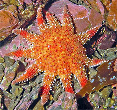
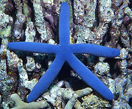
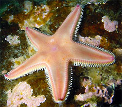
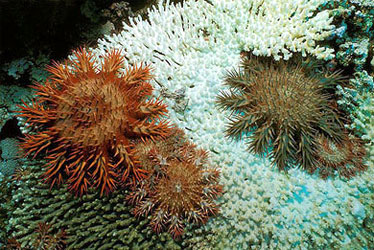
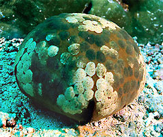
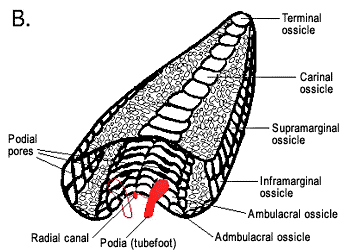
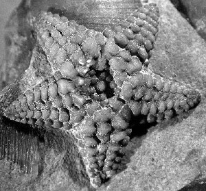
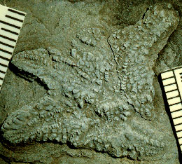
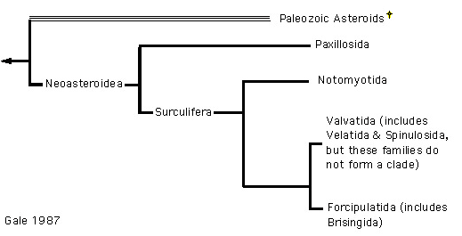
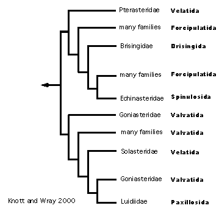

---
aliases:
  - Asteroidea
title: Asteroidea
---

# [[Asteroidea]] 

Sea stars and starfishes 

    
  

## #has_/text_of_/abstract 

> Starfish or sea stars are star-shaped echinoderms belonging to the class **Asteroidea** (). Common usage frequently finds these names being also applied to ophiuroids, which are correctly referred to as brittle stars or basket stars. Starfish are also known as asteroids due to being in the class Asteroidea. About 1,900 species of starfish live on the seabed in all the world's oceans, from warm, tropical zones to frigid, polar regions. They are found from the intertidal zone down to abyssal depths, at 6,000 m (20,000 ft) below the surface.
>
> Starfish are marine invertebrates. They typically have a central disc and usually five arms, though some species have a larger number of arms. The aboral or upper surface may be smooth, granular or spiny, and is covered with overlapping plates. Many species are brightly coloured in various shades of red or orange, while others are blue, grey or brown. Starfish have tube feet operated by a hydraulic system and a mouth at the centre of the oral or lower surface. They are opportunistic feeders and are mostly predators on benthic invertebrates. Several species have specialized feeding behaviours including eversion of their stomachs and suspension feeding. They have complex life cycles and can reproduce both sexually and asexually. Most can regenerate damaged parts or lost arms and they can shed arms as a means of defense. 
>
> The Asteroidea occupy several significant ecological roles. Starfish, such as the ochre sea star (Pisaster ochraceus) and the reef sea star (Stichaster australis), have become widely known as examples of the keystone species concept in ecology. The tropical crown-of-thorns starfish (Acanthaster planci) is a voracious predator of coral throughout the Indo-Pacific region, and the Northern Pacific seastar is on the list of the World's 100 Worst Invasive Alien Species.
>
> The fossil record for starfish is ancient, dating back to the Ordovician around 450 million years ago, but it is rather sparse, as starfish tend to disintegrate after death. Only the ossicles and spines of the animal are likely to be preserved, making remains hard to locate. With their appealing symmetrical shape, starfish have played a part in literature, legend, design and popular culture. They are sometimes collected as curios, used in design or as logos, and in some cultures, despite possible toxicity, they are eaten.
>
> [Wikipedia](https://en.wikipedia.org/wiki/Starfish) 

### Information on the Internet

-   [Classification of the Extant     Echinodermata](http://www.calacademy.org/research/izg/echinoderm/classify.htm)
-   [Sladen 1889 HMS Challenger     Report](http://www.hmschallenger.org/report_on_asteroidea/)
-   [The Echinoderm     Newsletter](http://www.nrm.se/ev/echinoderms/echinonews.html.en)
-   [Crown-of-thorns starfish Questions and     Answers](http://www.aims.gov.au/pages/reflib/cot-starfish/pages/cot-000.html)
-   [University of Illinois     Paleontology](http://www.geology.uiuc.edu/%7Efossils/table.html)
-   [Growth of a Starfish. Micscape     Magazine](http://www.microscopy-uk.org.uk/mag/art98/janstar.html)

## Introduction

[Emily Knott](http://www.tolweb.org/) 

The Asteroidea is one of the largest and most familiar classes within
the Phylum Echinodermata. These animals, commonly known as sea stars or
starfishes, form a diverse and speciose group. There are approximately
1600 extant species (Hyman 1955; Clark 1977; Clark and Downey 1992)
which are found throughout the world\'s oceans. Following the
classification of Blake (1987), these species are grouped into seven
orders: Brisingida, Forcipulatida, Notomyotida, Paxillosida,
Spinulosida, Valvatida and Velatida.

Like other echinoderms, asteroids are important members of many marine
benthic communities. They can be voracious predators, having significant
impacts on community structure. For example, Paine (1966) used *Pisaster
ochraceus* to illustrate his concept of the role keystone species play
in community ecology. The crown-of-thorns starfish, *Acanthaster
planci*, is particularly well-known because it can cause extreme
detrimental effects to coral reefs, particularly during population
outbreaks (Moran 1988).

Figure 1: *Pisaster ochraceus* and *Acanthaster planci*, two asteroids
of great ecological significance.\
*Pisaster* image by Sherry Ballard, courtesy
[CalPhotos](http://elib.cs.berkeley.edu/photos/), copyright © 1999
California Academy of Sciences. *Acanthaster* image copyright © [Borut Furlan](http://www.borutfurlan.com/).

The controversial Concentricycloidea (a proposed sixth class of the
Echinodermata; Baker et al. 1986, Rowe et al. 1988, Pearse and Pearse
1994) have been diagnosed as unusual asteroids (Smith 1988, Belyaev
1990, Janies and Mooi 1999). Their relationship to other asteroid taxa
is not well resolved, but alliances with species from the Velatida and
the Forcipulatida have been proposed. The unique morphology of the
concentricycloids makes it difficult to assign this group to the
recognized asteroid orders and is cited as sufficient distinction for
class recognition.

### Characteristics

Like other asterozoans, asteroids have a characteristic star-shaped body
plan consisting of a central disc and multiple (typically 5) radiating
arms. Asteroids are most easily distinguished from other asterozoans
(the Ophiuroidea) by the structure of the arms. In asteroids, skeletal
support for the arms is provided by the ossicles of the body wall, which
merge with those of the central disc, giving the arm a very broad based
attachment to the disc. This skeletal arrangement allows for the
extension of a comparatively large coelomic cavity from the central disc
into the arms, which serves to hold some of the animal\'s organ systems,
namely the gonads and pyloric caeca. Additionally, this skeletal
arrangement also limits lateral flexion of the arms. Locomotion by
asteroids is accomplished almost exclusively by means of the podia
(tubefeet) from the water vascular system. Differences in morphology
between asteroids and ophiuroids are described further in Blake (1998)
and Dean (1999).

Figure 2: A typical starfish, *Asterias rubens*, with tubefeet visible
on the edge of the arm in the foreground. Image copyright © 2004 [Kåre Telnes](http://www.seawater.no/fauna/index.htm). Cushion stars, like
this *Culcita novaeguineae*, may have arms so short that they look more
like a ball than a star. Image copyright © 2003 [Massimo Boyer](http://www.edge-of-reef.com/).

Taxonomy of asteroids usually is based on externally observable
characteristics of the skeleton, particularly the primary ossicular
series which define the body wall (ambulacrals, adambulacrals,
marginals, terminals, actinals, abactinals), as well as secondary
ossicles such as spines, spinelets and pedicellariae. Works by Perrier
(1884) and Sladen (1889) laid the taxonomic foundation of most asteroid
groups. Many other authors have contributed to and/or refined the
asteroid classification scheme, notably Fisher (1911, 1928), Verrill
(1914), Fell (1963), Spencer and Wright (1966) and McKnight (1975).
Blake and Elliot (2003) provide clear definition of ossicle terminology.
Blake (1987) provides classification and diagnoses of asteroid groups.

Perhaps the most important ossicular series defining the Asteroidea is
the ambulacral column, found along the oral surface of the disk and
radiating arms and associated with two or four rows of podia. The
asteroid ambulacrum is distinguished by erect ambulacral ossicles
arranged in series along the length of the ambulacral column. Critical
differences in structure and arrangement of the ossicles of the
ambulacral column define two groups of asteroids: an extinct fauna
restricted to the Paleozoic and the mostly extant (mostly)
post-Paleozoic asteroids (Blake 1987, Gale 1987). Blake and Hagdorn
(2003) recently recognized this distinction formally with diagnosis of a
new subclass: Ambuloasteroidea, containing the Paleozoic
Calliasterellidae and Compsasteridae in addition to post-Paleozoic
asteroids (Infraclass Neoasteroidea Gale 1987).

Figure 3: Morphology of asteroids. A, aboral and oral surfaces of a
generalized asteroid. Image ©
[BIODIDAC](http://biodidac.bio.uottawa.ca/). B, transverse section and
perspective view of a generalized arm (soft tissues and spines removed);
note the arched ambulacral ossicles forming the ambulacral groove and
the dorsal podial pores between ambulacral ossicles. One podium
(tubefoot) on the left is drawn in outline only to illustrate how the
podia descend through the podial pores. Image © 2004 Emily Knott.

Application of the extraxial-axial theory (EAT) to asteroid morphology
significantly aids our understanding of ossicle homologies within the
Asteroidea and between asteroids and other echinoderms (Mooi and David
2000, Blake and Elliot 2003, Blake and Hagdorn 2003). According to the
EAT, the ambulacral and terminal ossicles of asteroids are axial
elements. These ossicles are formed according to the Ocular Plate Rule
(OPR) and are associated with the developing water vascular system
during ontogeny as are the axial ossicles of other echinoderms. The
remaining asteroid ossicle series are extraxial elements, which can be
added during ontogeny without any particular ordering system (although
secondarily ordered serial homologous elements are common in the
asteroids, e.g. adambulacrals and marginals). In comparison to axial
elements, extraxial ossicles are prone to much more evolutionary
lability (Mooi and David 1997).

#### Synapomorphies of the crown group: Ambuloasteroidea

Summarized from Blake (1998; 2000), Mooi and David (2000) and Blake and
Hagdorn (2003).

1.  Deep ambulacral groove---The paired ambulacral ossicles are erect
    and arch across the arm axis forming a clearly defined furrow. The
    extent of the arch and definition of the furrow are expected to be
    weaker in the earliest asteroids, but these characters are difficult
    to observe in most fossil specimens.
2.  Dorsal podial pores---The dorsal podia pores are passageways between
    ambulacral ossicles through which the tubefeet descend. These pores
    allow for internal protection of the ampullae, dorsal outpockets of
    the podia, which contract and expand with extension and retraction
    of the podia. The ampullae of earlier asteroids were external, in
    closed, cup-like podial basins formed by the ossicles of the
    ambulacral column.
3.  Offset positioning of the ambulacral and adambulacral ossicles and
    differentiation of articulation structures in ossicles of the
    ambulacrum---These features describe a variety of related apomorphic
    characteristics of ambuloasteroids. Offset positioning of the
    ambulacral and adambulacral ossicles allows for soft tissue
    connections between the ambulacral and both adjacent adambulacrals
    which is further enhanced with differentiation of articulation
    structures on the ossicles. This arrangement allows more complex
    movement in the ambuloasteroids. In non-ambuloasteroids a single
    ambulacral ossicle abuts a single adambulacral.
4.  Presence of an odontophore---The odontophore is a small interradial
    ossicle associated with the mouth angle ossicle. The odontophore is
    expected to the homologue of the axillary in Paleozoic asteroids.

### Fossil Record

The earliest asteroids appeared in the Ordovician (Figure 4). However,
at least two major faunal transitions have occurred within the
Asteroidea concomitantly with large extinction events: in the Late
Devonian (Blake and Glass in Webster et. al. 1999) and in the Late
Permian (Blake 1987, Gale 1987, Blake et al. 2000, Blake and Elliot
2003, Blake and Hagdorn 2003). The asteroid orders as described here
contain all extant and some extinct species which have a morphology
distinct from Paleozoic forms (i.e. Ambuloasteroidea; see
Characteristics, Blake 1982, 1987, 1988; Gale 1987, Blake and Elliott
2003, Blake and Hagdorn 2003). The asteroid orders are thought to have
appeared and diversified very rapidly (within approximately 60 million
years) during the Lower and early Middle Jurassic, frustrating our
understanding of ordinal relationships (see discussion below).

Figure 4: *Hudsonaster* sp. (USNM 40882), an early asteroid from the
Ordovician.\
Image copyright © [Daniel B. Blake](http://www.geology.uiuc.edu/%7Eblake/)

Relationships among Paleozoic asteroids, as well as between Paleozoic
asteroids and extant asteroids, are difficult if not impossible to
determine because of the limitations of the asteroid fossil record.
Asteroid fossils are rare because 1) the skeletal elements rapidly
dissociate after death of the animals 2) asteroids typically have a
large body cavity that collapses with deterioration of the organs,
resulting in misshapen forms and 3) asteroids often live on hard
substrates which are not conducive to fossil formation. From the limited
fossil evidence that is available we know that the basic body plan of
the asteroids has remained the same since the Ordovician. Several papers
by Blake (e.g 1989, 2000) describe limitations of the fossil record in
detail.

Despite the paucity of the asteroid fossil record, fossil evidence has
aided our understanding of asteroid evolution within both the Paleozoic
and post-Paleozoic groups. One unique fossil fauna is that from the
Hunsrück Slate of Germany from the Lower Devonian. These Paleozoic forms
are well preserved and show a variety of morphologies. The diversity
exhibited in this faunal representation suggests that the diversity of
life habits of Paleozoic asteroids was probably very similar to what we
see today in modern species (Blake 2000). Fossil members of the
post-Paleozoic fauna have also been found. The oldest known neoasteroid
is the extinct Triassic genus *Trichasteropsis* (Blake and Hagdorn 2003,
Figure 5). Blake (1987) recognized a new order, Trichasteropsida, to
contain this taxon. The slightly younger Triassic genus *Noriaster
barberoi*, diagnosed to the extant family Poraniidae (Valvatida), is the
oldest-known fossil species belonging to a surviving family (Blake et
al. 2000, Figure 5).

Figure 5: Early neoasteroids from the Triassic. Images copyright ©
[Daniel B. Blake](http://www.geology.uiuc.edu/%7Eblake/)

Left: *Trichasteropsis weissmanni* (MHI 843/1), Trichasteropsida.
Center: *Trichasteropsis weissmanni* (SMNS 3173/5), Trichasteropsida.
Right: *Noriaster barberoi* (MPUM 8420), Valvatida: Poraniidae
### Extant Orders of the Asteroidea

A survey of asteroid nomenclature arranged by order has been compiled.
Clark (1989, 1993, 1996) and Clark and Mah (2001) list accepted names as
well as synonyms, otherwise invalid names, references and ranges of type
localities.

**Brisingida---**Brisingids are deep-sea dwelling asteroids. They
usually have many (6-16) long, attenuated arms which are used in
suspension feeding. The Brisingida contains about 100 species in 17
genera and 6 families. A preliminary phylogeny for this order has been
produced by Mah (1998).

**Forcipulatida---**These asteroids are distinguished by their
forcipulate pedicellariae, which are generally quite conspicuous on the
body surface. The Forcipulatida contains about 300 species in 68 genera
and 6 families. A preliminary phylogeny for this order has been produced
by Mah (2000).

**Notomyotida---**These are deep-sea dwelling asteroids having flexible
arms with characteristic longitudinal muscle bands along the inner
dorsolateral surface. The Notomyotida contains about 75 species in 12
genera and 1 family.

**Paxillosida---**These asteroids are considered to be somewhat infaunal
in that they can bury themselves partially under sandy sediments. They
are characterized by some morphological features (e.g. pointed,
unsuckered tubefeet) which have been considered primitive by some (see
Discussion of Phylogenetic Relationships, below). The Paxillosida
contains about 255 species in 46 genera and 5 families.

**Spinulosida---**These asteroids have a relatively delicate skeletal
arrangement and completely lack pedicellariae. No fossil spinulosids
have been found. The Spinulosida contains about 120 species in 9 genera
and 1 family.

**Valvatida---**These asteroids are quite diverse, but are often
characterized by their conspicuous marginal ossicles. Definition of this
group has been the most variable and the ordinal definition of many
families included here has been controversial (see Discussion of
Phylogenetic Relationships, below). The Valvatida contains about 695
species in 165 genera and 14 families.

**Velatida---**These asteroids typically have thick bodies with large
discs and interradial depressions. Contrary to Blake\'s (1987)
classification, molecular evidence suggests a relationship between some
velatid and valvatid families (see Discussion of Phylogenetic
Relationships, below). The Velatida contains about 200 species in 25
genera and 5 families.

### Discussion of Phylogenetic Relationships

Specific use of phylogenetic methods in studies of asteroid evolutionary
relationships began in the late 1980s. These analyses (using both
morphological and molecular data) have resulted in conflicting
hypotheses of asteroid phylogeny. Phylogenetic analyses are continuing
to be re-evaluated with additional data. Since their results are still
somewhat contentious, they have yet to initiate changes in our
classification system.

#### Evidence from morphological characters

In 1987, two differing hypotheses of order level relationships were
proposed based on analyses of morphological characteristics (Blake 1987,
Gale 1987, Figure 6,7). These two phylogenies differ due to differences
in opinion about character polarity (assigning ancestral or derived
status to a particular state of a character) and the different
morphological characters used in the analyses (note that Gale does not
specifically use phylogenetic methods). Both authors emphasized the
importance of ambulacral characters to asteroid classification and
recognized the distinction between Paleozoic and post-Paleozoic forms
(i.e. Ambuloasteroidea, Blake and Hagdorn 2003).

However, Gale (following McKnight 1975) focuses on the lack of suckered
tubefeet in the Paxillosida, considering them primitive. As a result,
his phylogeny reflects two major groups: a basal Paxillosida and the
remaining asteroids, all having suckered tubefeet, which he termed
superorder Surculifera. Blake considers suckered tubefeet to be the
ancestral condition. His phylogeny reflects two major asteroid groups:
superorder Forcipulatacea (Forcipulatida + Brisingida) and a clade of
the superorders Valvatacea + Spinulosacea (Valvatida, Notomyotida,
Paxillosida, Spinulosida and Velatida). Outgroup comparison with
*Calliasterella* and inclusion of the Trichasteropsida results in a
basal Forcipulatacea.

Figure 7. Gale\'s (1987) hypothesis of Asteroidea relationships.

The differences in these proposed phylogenies highlight questions about
asteroid relationships that are still unresolved. The identification of
the basal (neo)asteroid group has been the driving question of
additional studies (see Evidence from molecular characters, below).
Additionally, ordinal definition, particularly for Blake\'s Valvatida,
Velatida and Spinulosida, is problematic. Such problems were not new to
Blake and Gale. Although many asteroid groups can be clearly defined
morphologically (Forcipulatida, Brisingida, Notomyotida), asteroid
morphology is complex and diverse. Other groups are less clearly
defined.

#### Evidence from molecular characters

Additional phylogenetic analyses incorporating molecular data with
morphological data (Lafay et al. 1995) and using molecular data alone
(Wada et al. 1996; Knott and Wray 2000) were presented in an effort to
resolve phylogenetic arguments. Unexpectedly, these studies have done
little to elucidate asteroid relationships and may have only added to
the confusion.

Lafay et al. (1995) present an unrooted phylogeny deduced from analysis
of a combined morphological data set taken from Blake (1987) and Gale
(1987) with unordered character states (Figure 8). Although very few
taxa were studied, their phylogeny supports the definition of asteroid
orders proposed by Blake but separates the Paxillosida from the
Valvatida. Their analysis with molecular data alone (sequence data from
28S rRNA) results in several conflicting topologies due to weak
phylogenetic signal. Most of this signal is masked by that from the
morphological data set when the two data sets are combined. However,
after evaluating several rooting positions using molecular data from
other echinoderms in outgroup comparison, Lafay et al. (1995) conclude
that the Paxillosida may not be monophyletic and that the paxillosid
genus *Astropecten* may be the sister group to the remaining asteroids,
reminiscent of Gale\'s phylogeny.

Wada et al. (1996) include more taxa for additional investigation of
ordinal monophyly (Figure 9). In multiple analyses of their molecular
data set (sequence data from 12S and 16S rDNA), they find that
paxillosids are paraphyletic with the paxillosid genus *Luidia* as the
basal asteroid taxon. In addition, the Valvatida is not monophyletic and
a forcipulatid clade falls within a group of valvatids, a velatid and
spinulosids, a relationship in stark contrast to that proposed by Blake
(1987). Further, the Spinulosida are never grouped with the Velatida,
which Blake (1987) proposed as their sister group and which previously
were considered a group within the Spinulosida (Spencer and Wright 1966,
McKnight 1975, Blake 1981a).

Knott and Wray (2000) expand taxon sampling even more, but their
molecular data set (sequence data from mitochondrial tRNA and COI genes)
fails to resolve questions of asteroid phylogeny (Figure 10).
Significantly, the Paxillosida is not basal in their results (although
*Astropecten* is not included). The results of different tree
reconstruction methods are not in agreement, and basal groupings are
only supported by bootstrapping in the Neighbor-Joining analysis. The
proposed phylogeny is similar to Blake (1987) in that two lineages (one
largely of forcipulatids and the other largely of valvatids) are
recovered, but Valvatida and Velatida are not monophyletic and some
velatids plus the Spinulosida fall in the forcipulatid clade.

Figure 10. Knott & Wray\'s (2000) hypothesis of Asteroidea
relationships.

#### Evidence that the Concentricycloidea are asteroids

The position of the Concentricycloidea has been contentious since its
discovery in 1986. Close relationship between the Concentricycloidea and
asterozoans is expected (see Baker et al. 1986, Rowe et al. 1988, Pearse
and Pearse 1994, Mooi et al. 1998), but argument over its taxonomic
position continues. As yet, no changes in taxonomy have been made. The
morphological features of concentricycloids are so distinct (e.g. two
circumoral canals, a single peripheral ring of podia) that the tendency
to recognize them as a separate echinoderm class is quite strong. Pearse
and Pearse (1994) included the Concentricycloidea in a phylogenetic
analysis using morphological characters defined by Blake (1987) and
found that Concentricycloidea fall outside the asteroid clade. Further
clarification of skeletal homologies between concentricycloids and
asteroids (Mooi et al. 1998) supports asterozoan affinities, but
questioned placing concentricycloids as close relative to the asteroid
order Caymanostellidae (Velatida; Rowe et al. 1988, Smith 1988, Belyaev
1990). Caymanostellids and concentricycloids have superficially similar
body plans which may be due to convergence rather than true
relationships (Pearse and Pearse 1994, Mooi et al. 1998). Contribution
of DNA sequence data from *Xyloplax turnerae* and phylogenetic analysis
of a combined morphological and molecular data set (Janies and Mooi
1999, Janies 2001), however, supports recognizing concentricyloids as
asteroids. In these analyses, *Xyloplax* is in a clade with the
forcipulatid *Rathbunaster* and not with velatids (although
Caymanostellidae is not represented). Support for relationships within
the Asteroidea is low, but *Xyloplax* is positioned well within the
asteroid clade.

## Phylogeny 

-   « Ancestral Groups  
    -   [Echinodermata](../Echinodermata.md)
    -   [Deuterostomia](../../Deutero.md)
    -  [Bilateria](../../../Bilateria.md) 
    -  [Animals](../../../../Animals.md) 
    -  [Eukarya](../../../../../Eukarya.md) 
    -   [Tree of Life](../../../../../Tree_of_Life.md)

-   ◊ Sibling Groups of  Echinodermata
    -   [Crinoidea](Crinoidea.md)
    -   Asteroidea
    -   [Somasteroidea](Somasteroidea.md)
    -   [Holothuroidea](Holothuroidea.md)

-   » Sub-Groups 

## Title Illustrations

----------------------------------------------------------------------------
 
Scientific Name ::     Crossaster papposus (Velatida)
Location ::           Stord - Hordaland, Norway, 6 meters
Specimen Condition   Live Specimen
Copyright ::            © 2004 [Kåre Telnes](http://www.seawater.no/fauna/index.htm) 

---------------------------------------------------------------------------- 
)
Scientific Name ::     Linckia laevigata (Valvatida)
Location ::           Indo-Pacific
Specimen Condition   Live Specimen
Size                 Diameter 30 cm
Copyright ::            © 2003 [Massimo Boyer](http://www.edge-of-reef.com/) 

------------------------------------------------------------------------- 
)
Scientific Name ::     Astropecten irregularis (Paxillosida)
Location ::           Lauvsnes - North Trøndelag, Norway, 12 meters
Specimen Condition   Live Specimen
Copyright ::            © 2004 [Kåre Telnes](http://www.seawater.no/fauna/index.htm) 

## Confidential Links & Embeds: 

### #is_/same_as :: [[/_Standards/bio/bio~Domain/Eukarya/Animal/Bilateria/Deutero/Echinodermata/Asteroidea|Asteroidea]] 

### #is_/same_as :: [[/_public/bio/bio~Domain/Eukarya/Animal/Bilateria/Deutero/Echinodermata/Asteroidea.public|Asteroidea.public]] 

### #is_/same_as :: [[/_internal/bio/bio~Domain/Eukarya/Animal/Bilateria/Deutero/Echinodermata/Asteroidea.internal|Asteroidea.internal]] 

### #is_/same_as :: [[/_protect/bio/bio~Domain/Eukarya/Animal/Bilateria/Deutero/Echinodermata/Asteroidea.protect|Asteroidea.protect]] 

### #is_/same_as :: [[/_private/bio/bio~Domain/Eukarya/Animal/Bilateria/Deutero/Echinodermata/Asteroidea.private|Asteroidea.private]] 

### #is_/same_as :: [[/_personal/bio/bio~Domain/Eukarya/Animal/Bilateria/Deutero/Echinodermata/Asteroidea.personal|Asteroidea.personal]] 

### #is_/same_as :: [[/_secret/bio/bio~Domain/Eukarya/Animal/Bilateria/Deutero/Echinodermata/Asteroidea.secret|Asteroidea.secret]] 

