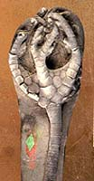
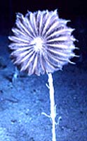
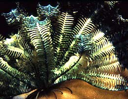
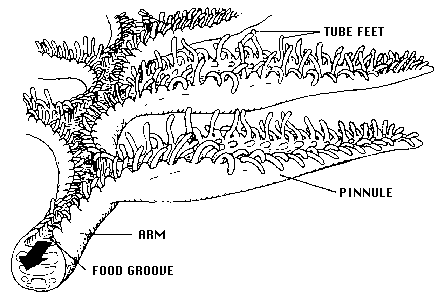
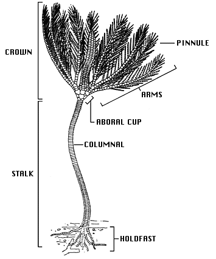
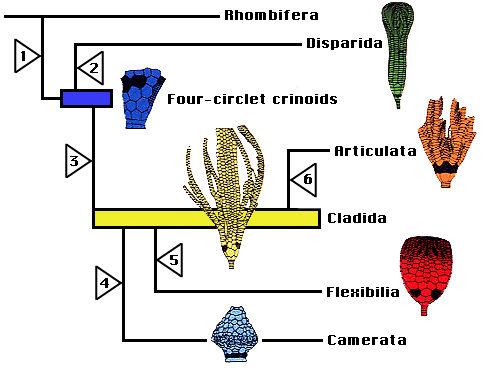

---
aliases:
  - Crinoidea
title: Crinoidea
---

# [[Crinoidea]] 

Sea lilies and feather stars 

 

## #has_/text_of_/abstract 

> Crinoids are marine invertebrates that make up the class **Crinoidea**. Crinoids that remain attached to the sea floor by a stalk in their adult form are commonly called sea lilies, while the unstalked forms, called feather stars or comatulids, are members of the largest crinoid order, Comatulida. Crinoids are echinoderms in the phylum Echinodermata, which also includes the starfish, brittle stars, sea urchins and sea cucumbers.  They live in both shallow water and in depths of over 9,000 metres (30,000 ft).
>
> Adult crinoids are characterised by having the mouth located on the upper surface. This is surrounded by feeding arms, and is linked to a U-shaped gut, with the anus being located on the oral disc near the mouth. Although the basic echinoderm pattern of fivefold symmetry can be recognised, in most crinoids the five arms are subdivided into ten or more. These have feathery pinnules and are spread wide to gather planktonic particles from the water. At some stage in their lives, most crinoids have a short stem used to attach themselves to the substrate, but many live attached only as juveniles and become free-swimming as adults.
>
> There are only about 700 living species of crinoid, but the class was much more abundant and diverse in the past. Some thick limestone beds dating to the mid-Paleozoic era to Jurassic period are almost entirely made up of disarticulated crinoid fragments.
>
> [Wikipedia](https://en.wikipedia.org/wiki/Crinoid) 

### Information on the Internet

-   [Charles Messing\'s Crinoid     Page](http://www.nova.edu/ocean/messing/crinoids/index.html)

## Introduction

[William I. Ausich and Charles G. Messing](http://www.tolweb.org/)

Although crinoids are the least understood of living echinoderms, their
skeletal remains are among the most abundant and important of fossils.
They appeared during the Lower Ordovician and underwent several major
radiations during the Paleozoic Era. Crinoids were major carbonate
producing organisms during the Paleozoic and Mesozoic. In fact, in many
Paleozoic and Mesozoic settings entire carbonate shelves were composed
predominantly of crinoidal remains (Ausich 1997). In such examples, the
enormous volume of skeletal material controlled the sedimentary
environment. Short stratigraphic ranges of many species make them
important as at least local biostratigraphic index taxa. The broad
morphological diversity of crinoids includes forms characteristic of
specific habitats and oceanographic conditions. More than 5000 fossil
species have been described.

A persistent, traditional view treats living crinoids as chiefly
deep-sea organisms, relicts of their opulent Paleozoic past, holding off
final extinction in remote abyssal habitats. This view is generally
applied to stalked crinoids, or sea lilies, as typical of the entire
group, because they most closely resemble their fossil forebears. It is
true that the approximately 80 extant species of stalked crinoids are
chiefly restricted to depths greater than 200 m (the shallowest occurs
in 100 m). However, 85% of extant crinoids (approximately 540 named
species) are unstalked feather stars, or comatulids, the products of a
continuing post-Paleozoic radiation (Meyer & Macurda 1977). Comatulids
are a monophyletic clade classified within the subclass Articulata
(Simms 1988). About 65% of living comatulids occur at shelf depths
(\<200 m). In the tropical Indo-West Pacific, the richest region, single
reefs may support as many as 50 species, almost as many as recorded for
any individual fossil assemblage. Here, abundance and diversity reach
115 specimens and 12 species per m^2^, respectively (Messing 1994).
Although far fewer comatulid species exist in cold waters, local
abundance may be much greater.

All crinoids are passive suspension feeders. They produce no
feeding/respiratory current but, rather, rely on extrinsic, ambient
water movement. In extant crinoids, the food-gathering apparatus
functions as follows: each featherlike arm that radiates from the
central body bears an open ambulacral groove bordered by triads of
fingerlike podia, or tube feet, which are terminal extensions of the
water vascular system (see figure below). The longest tube foot in each
triad, 0.43-0.85 mm in length, is held out at a right angle and flicks
passing food particles into the groove. After a food particle is
captured by a crinoid, the shortest tube foot wraps it in mucous
secretions; ciliary tracts on the groove floor then transport it toward
the mouth. In living crinoids, food particle size ranges from about 50
to 400 µm. Diets include a variety of protists (e.g., diatoms and other
unicellular algae, foraminiferans, actinopods), invertebrate larvae,
small crustaceans, and detrital particles.

Arm and ambulacrum morphology of a living crinoid (from Messing, 1987,
copyright © 1987 Charles Messing)

### Characteristics

Crinoids are pentamerous, stalked echinoderms with a cuplike body
bearing five usually branched and commonly featherlike arms (see figure
below). Most of a crinoid\'s body consists of an endoskeleton composed
of numerous calcareous pieces, called plates or ossicles. The visceral
mass of the crinoid animal is encased in the aboral cup that is
typically composed of 2-3 circlets of plates. The mouth and anus are on
the upper or oral surface of the animal. Additional circlets of fixed
arm plates and fixed interradial plates may occur above the aboral cup,
making a larger calyx. Five radial plates (the uppermost circlet of
aboral cup plates) are aligned with the radial water vascular canals and
give rise to five arms on the oral side of the body. Each arm is an
articulated series of ossicles extending outward from the body. Arms
contain extensions of coelomic, nervous, water vascular, and
reproductive systems and bear an ambulacral groove bordered by
fingerlike tube feet, or podia (terminal extensions of the water
vascular system), used in suspension feeding and respiration (see figure
[above](#arm)). Arms may be nonbranching or branch in many different
ways. All living crinoids are pinnulate, that is, they bear a small side
branch (pinnule) on alternating sides of successive ossicles along the
arm. In living crinoids, the pinnules bear the food-gathering tube feet.
Pinnules arose in several lineages during the Paleozoic and are
characteristic of all post-Palaeozoic crinoids.

General morphology of a stalked crinoid (modified from Bather, 1900,
copyright © 1998 William Ausich)

The crinoid stalk typically consists of numerous discoidal skeletal
pieces called columnals, held together by ligaments and penetrated by a
central canal containing coelomic and neural tissue. In most species,
the stalk serves to anchor the animal permanently to the substrate via
one of a variety of terminal structures, e.g., a discoidal or encrusting
holdfast, rootlike radix, or grapnel. In others, such as the living
isocrinids, whorls of hooklike cirri (sing., cirrus) along the stalk
allow the crinoid to release its hold and crawl with its arms. Several
crinoid groups, notably the comatulids, which include the only living
shallow-water crinoids, have lost the stalk. Comatulids anchor via
numerous cirri that arise from the retained topmost columnal (the
centrodorsal).

### Discussion of Phylogenetic Relationships

Traditionally, crinoids were subdivided into four subclasses: the
Paleozoic Camerata, Inadunata, and Flexibilia, and the post-Paleozoic
Articulata. However, a fifth subclass, the Echmatocrinea, was added in
Moore & Teichert (1978). Phylogenetic relationships among these
subclasses have long been poorly understood, with the exception of
Flexibilia and Articulata derived from the cladid inadunates. Crinoid
phylogeny and its implied classification are now the subject of
intensive research and somewhat differing opinions based on differing
assumptions of the crinoid outgroup and calyx plate homologies that
yield different phylogenies.

Simms & Sevastopulo (1993) recognized that three major groups of
crinoids were already distinct by the Lower to Middle Ordovician: the
Camerata, Disparida, and Cladida. They recognized the Camerata as
traditionally understood. However, they followed the suggestions of
Kelly (1982, 1986) and disregarded the Inadunata as a group, because the
disparids and cladids were separate, unrelated lineages. The flexibles
and articulates both evolved from the cladids, so Simms and Sevastopulo
(1993) placed these within the Cladida. Phylogenetic relationships in
Simms and Sevastopulo (1993) were based on a limited number of
characters with synapomorphies listed on a cladogram. No quantitative
analyses were performed, and an emphasis was placed on Articulata
characters.

Simms (1994) presented an alternative phylogeny based on a greatly
revised scheme of calyx plate homologies. Rather than the radial plates
(the upper plates of an aboral cup, sensu Moore & Teichert, 1978) being
homologous among all crinoids and the landmark for determining all calyx
plate homologies, Simms (1994) proposed that the lowest plates in the
aboral cup (the infrabasal plates of three-circlet forms but the basal
plates of two-circlet forms) were homologous and the homology landmarks.
This substantially altered more traditional views on crinoid phylogeny,
as Simms (1994) illustrated using a cladogram with inferred
synapomorphies. Few workers have followed Simms (1994).

Ausich (1996a, 1997, 1998a,b) presented a phylogeny based on another
alternative calyx plate homology scheme (Ausich 1996b), a differing
outgroup, and parsimony-based character analyses. In this scheme, the
most primitive crinoid aboral cup construction had four circlets of
plates, inherited directly from rhombiferan echinoderm ancestors (Ausich
1999). An early rhombiferan echinoderm is suggested as the putative
ancestor to crinoids because of shared characters among some early
rhombiferans and some early crinoids. Also, Conway Morris (1993) and
Ausich & Babcock (1996, 1998) do not regard **Echmatocrinus** from the
Middle Cambrian as a crinoid. Thus, the oldest known crinoids are Early
Ordovician. However, note that Sprinkle & Collins (1995), Sprinkle &
Guensburg (1997), and Guensburg & Sprinkle (1997) do not follow this
revision. The fourth, lowermost circlet of plates was previously
unrecognized. Homologies of Ausich (1996b) only require revisions for
four-circlet crinoids and disparids. The phylogeny of crinoids presented
[above](#top) is based on the homology scheme and PAUP parsimony
analyses of Ausich (1996a, 1998a). Primitive crinoids have four
circlets. Ausich followed Simms & Sevastopulo (1993) by eliminating the
Inadunata and recognizing the Disparida and Cladida as separate, early
crinoid lineages . The camerates are recognized by Ausich (1998a) as are
the Flexibilia and Articulata. Furthermore, the camerates, flexibles,
and articulates all evolved from different cladid lineages.

### Evolution of Crinoidea

The four-circlet crinoids, disparids, cladids, and camerates all arose
during the Early Ordovician; the flexibles arose during the Middle
Ordovician, and the articulates evolved during the earliest Mesozoic.
Camerates, disparids, flexibles, and cladids were extinct by the end of
the Paleozoic Era, about 225 million years ago. The Articulata are the
only post-Paleozoic crinoids. Either they evolved during the
Permo-Triassic mass extinction or immediately thereafter.

Major evolutionary steps in the crinoid phylogeny discussed above
include the following (see phylogenetic tree below): Crinoids diverged
from rhombiferan echinoderms through (1) loss of pore rhombs, gonopore,
and biserial brachioles; development of true arms with extension of the
ambulacra; movement of the anus to the tegmen; addition of anal plates;
and better pentameral symmetry. The resulting primitive crinoids were
four-circlet forms constituting a low diversity, basal group (Ausich,
1998a). From this four-circlet construction, disparids arose through
loss of the basal circlet (2). The cladid lineage, arose by loss of the
lintel circlet (3) and gave rise to three additional very successful
lineages: camerates (4) with fixed brachials and fixed interradials
incorporated into the calyx, symmetrical posterior plating, and rigid
plate sutures; flexibles (5) with the mouth exposed on the tegmen and
loose plate sutures; and the articulates (6) with loss of the anal plate
and an entoneural system enclosed within the calyx plates. The
monophyletic nature of the subclass Articulata has been argued by Simms
& Sevastopulo (1993).

Phylogenetic hypothesis of crinoid relationships, based on Ausich
(1996b, 1999).

### Major Subgroups of Crinoidea

As mentioned above, Moore & Teichert (1978) recognized the four major
lineages that they identified as subclasses (Camerata, Inadunata,
Flexibilia, and Articulata), and they placed the single species of
**Echmatocrinus** into its own subclass, as the primitive, basal
crinoid. Revisions since 1978 include elimination of the subclass
Inadunata because the disparids and cladids are quite separate lineages,
elimination of Echmatocrinus as a crinoid (not universally accepted),
and recognition of the oldest Early Ordovician crinoids as the initial
constructional style of crinoids.

In current classification hypotheses, the Cladida, Disparida, and
Camerata are regarded as subclasses (Simms and Sevastopulo 1993; Ausich
1998a). Simms and Sevastopulo (1993) group the Flexibilia and Articulata
within the Cladida as a single monophyletic lineage. These relationships
are not disputed by Ausich (1998a), but he proposes a partially
paraphyletic classification to more accurately describe the evolutionary
history of the Crinoidea. Thus, the Flexibilia and Articulata are
designated as monophyletic subclasses leaving the Cladida as a
paraphyletic subclass. Furthermore, the Camerata are also derived from
cladids in the phylogeny of Ausich (1998a). The primitive, four-circlet
crinoids are constructionally distinctive from all other crinoids and
cannot be placed within any existing subclass. A new subclass is erected
for these forms, however it also is paraphyletic because it gave rise to
both disparids and cladids (Ausich 1998b).

Five distinct groups of articulates survive in modern seas. Their
interrelationships will be treated on a separate page. The bathyal and
abyssal hyocrinids have long stalks, thin discoidal columnals, and a
terminal attachment disk. The bathyal and abyssal bourgueticrinids have
columnals articulated by synarthries (two ligament bundles flanking a
fulcral ridge) and attach via a terminal disk or rootlike radix. The
bathyal isocrinids have whorls of hooklike cirri along the stalk. In the
bathyal cyrtocrinids, a short stalk consists of up to two columnals, or
an expanded, thickened calyx cements directly to the substrate. The
comatulids, which occur from intertidal to abyssal depths, retain a
stalk as postlarvae, but shed all but the topmost segment and take up a
free existence as juveniles and adults.

## Phylogeny 

-   « Ancestral Groups  
    -   [Echinodermata](../Echinodermata.md)
    -   [Deuterostomia](../../Deutero.md)
    -  [Bilateria](../../../Bilateria.md) 
    -  [Animals](../../../../Animals.md) 
    -  [Eukarya](../../../../../Eukarya.md) 
    -   [Tree of Life](../../../../../Tree_of_Life.md)

-   ◊ Sibling Groups of  Echinodermata
    -   Crinoidea
    -   [Asteroidea](Asteroidea.md)
    -   [Somasteroidea](Somasteroidea.md)
    -   [Holothuroidea](Holothuroidea.md)

-   » Sub-Groups 

## Title Illustrations

-------------------------------------------------------------------------------- 
)
Scientific Name ::     Onychocrinus exsculptus
Location ::           Indiana
Comments             Cladida
Specimen Condition   Fossil \-- Period: Lower Mississippian
Copyright ::            © 1997 [William I. Ausich](http://www.geology.ohio-state.edu/%7Eausich/) 

-------------------------------------------------------------------------------- 
)
Scientific Name ::  Neocrinus decorus
Location ::        Grand Bahama Island, 420m
Comments          Isocrinidae
Copyright ::         © 1997 [Charles G. Messing](http://www.nova.edu/ocean/messing/index.html) 

-------------------------------------------------------------------------------

Scientific Name ::     Lamprometra palmata
Location ::           Mabul Island, Sabah, Malaysia
Comments             Mariametridae
Specimen Condition   Live Specimen
Copyright ::            © 1997 [Charles G. Messing](http://www.nova.edu/ocean/messing/index.html) 

## Confidential Links & Embeds: 

### #is_/same_as :: [[/_Standards/bio/bio~Domain/Eukarya/Animal/Bilateria/Deutero/Echinodermata/Crinoidea|Crinoidea]] 

### #is_/same_as :: [[/_public/bio/bio~Domain/Eukarya/Animal/Bilateria/Deutero/Echinodermata/Crinoidea.public|Crinoidea.public]] 

### #is_/same_as :: [[/_internal/bio/bio~Domain/Eukarya/Animal/Bilateria/Deutero/Echinodermata/Crinoidea.internal|Crinoidea.internal]] 

### #is_/same_as :: [[/_protect/bio/bio~Domain/Eukarya/Animal/Bilateria/Deutero/Echinodermata/Crinoidea.protect|Crinoidea.protect]] 

### #is_/same_as :: [[/_private/bio/bio~Domain/Eukarya/Animal/Bilateria/Deutero/Echinodermata/Crinoidea.private|Crinoidea.private]] 

### #is_/same_as :: [[/_personal/bio/bio~Domain/Eukarya/Animal/Bilateria/Deutero/Echinodermata/Crinoidea.personal|Crinoidea.personal]] 

### #is_/same_as :: [[/_secret/bio/bio~Domain/Eukarya/Animal/Bilateria/Deutero/Echinodermata/Crinoidea.secret|Crinoidea.secret]] 

