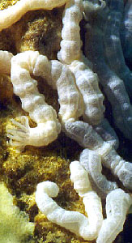
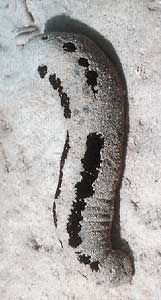
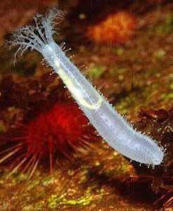
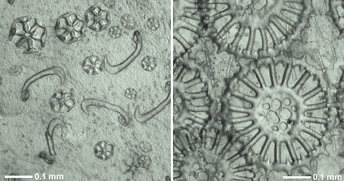
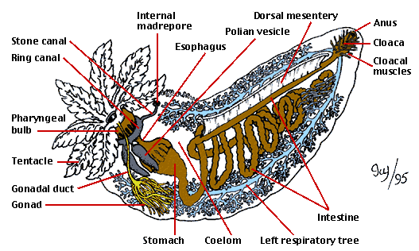
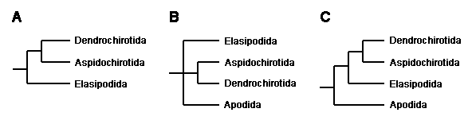
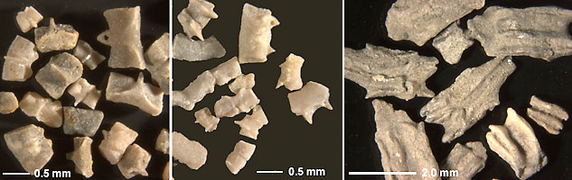

---
aliases:
  - Sea cucumber
  - Holothuroidea
title: Holothuroidea
has_id_wikidata: Q127470
---
# [[Holothuroidea]]

Sea cucumbers 

## #has_/text_of_/abstract 

> Sea cucumbers are echinoderms from the class **Holothuroidea** ( HOL-ə-thyuu-ROY-dee-ə, HOH-lə-). 
> They are benthic marine animals found on the sea floor worldwide, 
> and the number of known holothuroid species worldwide is about 1,786, 
> with the greatest number being in the Asia–Pacific region. 
> 
> Sea cucumbers serve a useful role in the marine ecosystem 
> as detritivores who help recycle nutrients, 
> breaking down detritus and other organic matter, 
> after which microbes can continue the decomposition process.
>
> Sea cucumbers have a leathery skin and an elongated body containing a single, branched gonad, are named for their overall resemblance to the fruit of the cucumber plant. Like all echinoderms, sea cucumbers have a calcified dermal endoskeleton, which is usually reduced to isolated microscopic ossicles (or sclerietes) joined by connective tissue. In some species these can sometimes be enlarged to flattened plates, forming an armoured cuticle. In some abyssal or pelagic species such as Pelagothuria natatrix (order Elasipodida, family Pelagothuriidae), the skeleton is absent and there is no calcareous ring.
>
> Many species of sea cucumbers are foraged as food by humans, and some species are cultivated in aquaculture systems. They are considered a delicacy seafood, especially in Asian cuisines, and the harvested product is variously referred to as trepang, namako, bêche-de-mer, or balate.
>
> [Wikipedia](https://en.wikipedia.org/wiki/Sea%20cucumber) 

### Information on the Internet

-   [UCMP Berkeley     Holothuroidea](http://www.ucmp.berkeley.edu/echinodermata/holothuroidea.html).
-   [Beche-de-mer Information     Bulletin](http://www.spc.org.nc/coastfish/News/bdm/12/BDM12.htm).
    Coordinated by Chantal Conand.
-   [Taxonomy of Sea     Cucumbers](http://rbcm1.rbcm.gov.bc.ca/nh_papers/taxing.html).
    Philip Lambert, Royal British Columbia Museum.

## Introduction

[Alexander M. Kerr](http://www.tolweb.org/) 

The Holothuroidea, or sea cucumbers, are an abundant and diverse group
of worm-like and usually soft-bodied echinoderms. They are found in
nearly every marine environment, but are most diverse on tropical
shallow-water coral reefs. They range from the intertidal, where they
may be exposed briefly at low tide, to the floor of the deepest oceanic
trenches. The oldest undoubted fossils of sea cucumbers are of isolated
spicules from the Silurian (ca. 400 million years ago; Gilliland, 1993).
Considerable diversification has occurred since then with about 1400
living species in a variety of forms. Some of these are about 20 cm in
length, though adults of some diminutive species may not exceed a
centimeter, while one large species can reach lengths of 5 m (*Synapta
maculata*). Several species can swim and there are even forms that live
their entire lives as plankton, floating with the ocean currents.

Economically, sea cucumbers are important in two main ways. First, some
species produce toxins that are of interest to pharmaceutical firms
seeking to learn their medical value. Some compounds isolated to date
exhibit antimicrobial activity or act as anti-inflammatory agents and
anticoagulants. Second, as a gourmet food item in the orient, they form
the basis of a multimillion-dollar industry that processes the body wall
for sale as beche-de-mer or trepang. However, the high value of some
species, the ease with which such shallow-water forms can be collected
and their top-heavy age structures all contribute to over-exploitation
and collapse of the fisheries in some regions. Fishermen in the Pacific
islands use the toxins, some of which act as respiratory inhibitors, to
entice fish and octopus from crevices so that they may be more easily
speared. Furthermore, the sticky Cuvierian tubules (see description
below) are placed over bleeding wounds as a bandage.

### Characteristics

The most important feature distinguishing the sea cucumbers is a
calcareous ring that encircles the pharynx or throat. This ring serves
as an attachment point for muscles operating the oral tentacles and for
the anterior ends of other muscles that contract the body
longitudinally. Sea cucumbers are also distinct as echinoderms in having
a circlet of oral tentacles. These may be simple, digitate (with
finger-like projections), pinnate (feather-like), or peltate (flattened
and shield-like). A third key feature, found in 90% of living species,
is the reduction of the skeleton to microscopic ossicles (Figure 1). In
some species, the ossicles may be enlarged and plate-like.

**Figure 1**. Calcareous skeletal ossicles from the body wall (in situ)
of two recent holothurians.\
**Left**: Wheels and hook-shaped rods of *Trochodota allani* (Apodida:
Chiridotidae).\
**Right**: Spinose wheels with perforated hub and simple rods of
*Siniotrochus phoxus* (Apodida: Myriotrochidae).\
Photographs copyright © 2000 [Mike Reich](http://www.echinodermata.de/).

As in other echinoderms, the holothurian water vascular system consists
of an anterior ring canal from which arise long canals running
posteriorly (not shown in Figure 2). Despite their similarity to the
radial canals of other echinoderms, these latter structures arise
embryologically in a quite different manner. For this reason these
canals in holothurians have been recently renamed longitudinal canals
(Mooi and David 1997). In holothurians, the larval structures that would
form the radial canals in other echinoderms instead become the five
primary tentacles. Also, holothurians with the exception of members in
Elasipodida have a madrepore that opens into the coelom (body cavity).
In contrast, elasipodans and nearly all other echinoderms have a
madrepore that opens externally.

**Figure 2**: Main internal anatomical features of a cucumariid sea
cucumber (Dendrochirotida).\
Drawing by Ivy Livingstone. Copyright © 1995
[BIODIDAC](http://biodidac.bio.uottawa.ca/index.htm).

Some sea cucumbers possess organs not found in other invertebrates. In
some Aspidochirotida, the respiratory trees display Cuvierian tubules.
In most species, these are apparently defensive structures. They can be
expelled through the anus, whereupon they dramatically expand in length
and become sticky, entangling or deterring would-be predators, such as
crabs and gastropods. Many forms, with the exception of members of
Elasipodida and Apodida, possess respiratory trees used in gas exchange.
These are paired, heavily branched tubes attached to the intestine near
the anus. This type of breathing (\"cloacal breathing\") is also present
in an unrelated group, the echiuran worms.

Hyman (1955) provides a useful account of holothuroid gross anatomy,
Smiley (1994) covers microscopic aspects, while Smiley et al. (1991)
reviews reproduction and larval development.

### The Orders of Holothuroidea

The ancestors of the Apodida, Elasipodida and the lineage leading to the
remaining orders diverged in the middle to late Paleozoic Era between
about 350 to 250 million years ago. The Aspidochirotida, Molpadiida,
Dendrochirotida and Dactylochirotida began diverging somewhat later in
the Triassic and Jurassic of the early Mesozoic Era about 200 million
years ago. Assignment to different orders is largely based on the form
of the calcareous ring and tentacles, as well as the presence of certain
organs, such as the respiratory trees or the muscles that retract the
oral region.

Descriptions of each order given below are modified from Pawson (1982)
and Smiley (1994):

Apodida
:   Contains about 269 species in 32 genera and three families.
    Tentacles are digitate, pinnate or, in some small species, simple.
    Respiratory trees are absent. Tube feet are completely absent. The
    calcareous ring is without posterior projections. The body wall is
    very thin and often transparent. Found in both shallow and deep
    water.

Elasipodida
:   Contains about 141 species in 24 genera and five families. Tentacles
    are shield-shaped and used in shovelling sediment. Respiratory trees
    are present. The calcareous ring is without posterior projections.
    With the exception of Deimatidae, the body wall is soft to
    gelatinous. All forms live in deep water.

Aspidochirotida
:   There are about 340 species in 35 genera and three families.
    Tentacles are shield-shaped. Respiratory trees are present. The
    calcareous ring is without posterior projections. The body wall is
    generally soft and pliant. Most forms live in shallow water, though
    one family is restricted to the deep sea.

Molpadiida
:   There are about 95 species in 11 genera and four families. Tentacles
    are simple. Respiratory trees are present. The calcareous ring is
    without posterior projections. The body wall is generally soft and
    pliant. Most forms live in shallow water, though one family is
    restricted to the deep sea.

Dendrochirotida
:   Contains about 550 species in 90 genera and seven families.
    Tentacles are highly branched and extended to filter material from
    the water column. Respiratory trees are present. Some members with a
    calcareous ring composed of numerous small pieces or having long
    posterior extensions. Possess muscles for retracting the oral
    introvert. The body wall may be hardened from enlarged plate-like
    ossicles. Live either attached to hard bottoms or burrow in soft
    sediment. Most species live in shallow water.

Dactylochirotida
:   Contains about 35 species in seven genera and three families.
    Tentacles are simple or with a few small digits. Respiratory trees
    are present. The calcareous ring is without posterior projections.
    Possess muscles for retracting the oral introvert. All members have
    a rigid body encased in enlarged flattened ossicles. The body is
    usually \"U\" shaped. All members live burrowed in soft sediment.
    Most live in deep water.

### Discussion of Phylogenetic Relationships

The evolutionary relationships of the major holothuroid lineages were,
until quite recently, poorly understood. This was in part due to their
lack of an integrated skeleton like that providing the extensive fossil
record and numerous morphological characters of other groups of
echinoderms. There have been numerous speculations about the
relationships within Holothuroidea extending well back into the 19th
century. The methods of modern comparative biology had not been applied
to these problems until quite recently. Then Littlewood et al. (1997),
in an effort to resolve class-level relationships within echinoderms,
sequenced two ribosomal genes from a total of four orders. Their
analyses consistently supported a close relationship between
Dendrochirotida and Aspidochirotida, but they could not resolve the
phylogenetic position of Elasipodida and Apodida (Figure 3: A, B). Smith
(1997) subsequently argued that the Elasipodida are more closely related
to (Dendrochirotida + Aspidochirotida) than the Apodida (Figure 3: C).
This hypothesis recalls an early speculation (Semper 1868) whereby
Apodida is sister to the remaining holothuroids.

**Figure 3**. Recent hypotheses about holothuroid relationships.\
**A.** Tree based on complete 18S rDNA sequences (Littlewood et al.,
1997).\
**B.** Tree based on partial 28S rDNA sequences (Littlewood et al.,
1997).\
**C.** Interpretation of the 18S and 28S rDNA data favored by Smith
(1997).

More comprehensive cladistic analyses of morphological and DNA data
(Kerr, 2000) agree with Smith\'s hypothesis. Further, it appears that
Dendrochirotida is paraphyletic due to the Dactylochirotida lineage
arising from within the Dendrochirotida. This arrangement of the two
orders is so far supported by few characters, and an alternate
arrangement may ultimately prevail. Kerr (2000) also places Molpadiida
as sister to Dendrochirotida plus Dactylochirotida. Together with
Aspidochirotida, the aforementioned orders form a group united, most
notably, by the presence of respiratory trees. The placement of two rare
families currently referred to the Molpadiida, Eupyrgidae and
Gephyrothuriidae, is uncertain; they may turn out to be only distantly
related to one another and other ordinal level groups of holothurians.
Based on the presence of respiratory trees, however, they are unlikely
to be closely related to either the Apodida or Elasipodida, which lack
such structures. The remaining features of the higher level
relationships shown in the figure at the top of this page, though,
appear solidly supported and unlikely to change with the consideration
of new characters.

### Fossil History

As for most soft-bodied animals, holothuroids have a poor fossil record.
Published accounts exist of body fossils for about 19 species, though at
least that many body-fossil species lay undescribed on museum shelves.
Most ancient holothuroids are known from fossils of isolated ossicles.
This complicates the taxonomy somewhat since ossicles can differ even
within an individual depending on age, habitat and geography. How then
does one identify a single species? As a result, most fossil
holothuroids have been described as paraspecies based on unique ossicle
types. Entire or isolated elements of the calcareous ring are also
known, though less work has been done on these potentially informative
structures. The rarity of holothuroid fossils in part may be due to a
lack of collecting effort, since the microscopic ossicles require
special collecting methods, and there are few specialists working on the
group. In addition, isolated ring elements may sometimes be confused
with the robust plates of other echinoderms.

**Figure 4.** Isolated pieces of the calcareous rings of fossil
holothurians.\
**Left**: Interradial pieces; **Center**: Radial pieces; both from
apodid holothurians from the Upper Liassic of Germany, approx. 180 Ma;\
**Right**: Pieces from fossil molpadiid holothurians from the
Hauterivian of Germany, approx. 130 Ma.\
Photographs copyright © 2000 [Mike Reich](http://www.echinodermata.de/).

Holothuroids probably evolved by at least the Lower Silurian, most
likely from a little-known group of extinct Palaeozoic echinoderms
called ophiocistioids. However, the oldest reported body fossil of a
holothuroid is from the Lower Devonian, while the oldest undoubted
ossicle is from the Upper Silurian. Plate ossicles are known from the
Ordovician, but their identity as holothuroid is uncertain because they
resemble the plates of other echinoderms. Still, plate ossicles
ascribable to holothuroids are well known and, when combined with the
phylogenetic evidence, suggest that several groups of ancient plated
forms existed that are only distantly related to living plated
dendrochirotes and dactylochirotes. Alternatively, these living forms
have retained their ancient armour and Holothuroidea has had a long and
repeated history of losing a plated morphology.

A comprehensive account of holothurian palaeontology is found in
Gilliland (1993), while an up-to-date bibliography and other
palaeontological information is available from Mike Reich\'s [Fossil Holothuroidea Page](http://www.echinodermata.de/P224.htm).

## Phylogeny 

-   « Ancestral Groups  
    -   [Echinodermata](../Echinodermata.md)
    -   [Deuterostomia](../../Deutero.md)
    -  [Bilateria](../../../Bilateria.md) 
    -  [Animals](../../../../Animals.md) 
    -  [Eukarya](../../../../../Eukarya.md) 
    -   [Tree of Life](../../../../../Tree_of_Life.md)

-   ◊ Sibling Groups of  Echinodermata
    -   [Crinoidea](Crinoidea.md)
    -   [Asteroidea](Asteroidea.md)
    -   [Somasteroidea](Somasteroidea.md)
    -   Holothuroidea

-   » Sub-Groups 

## Title Illustrations

---------------------------- 
 
scientific_name ::     Synaptula (Apodida)
location ::           coral reef on the Eastern Coast of Thailand
specimen_condition ::  Live Specimen
copyright ::            © 2000 [Sumaitt Putchakarn](http://www.nrm.se/ev/dok/thaiechinod.html.en)

---------------------------- 
 
scientific_name ::     Holothuria (Halodeima) atra (Aspidochirotida)
location ::           coral reef on the Eastern Coast of Thailand
specimen_condition ::  Live Specimen
copyright ::            © 2000 [Sumaitt Putchakarn](http://www.nrm.se/ev/dok/thaiechinod.html.en)

---------------------------- 
 
scientific_name ::     Cucumaria (Dendrochirotida)
location ::           Ross Sea, Antarctica
specimen_condition ::  Live Specimen
copyright ::            © 2000 [Norbert Wu](http://www.norbertwu.com/)

## Confidential Links & Embeds: 

### #is_/same_as :: [[/_Standards/bio/bio~Domain/Eukarya/Animal/Bilateria/Deutero/Echinodermata/Holothuroidea|Holothuroidea]] 

### #is_/same_as :: [[/_public/bio/bio~Domain/Eukarya/Animal/Bilateria/Deutero/Echinodermata/Holothuroidea.public|Holothuroidea.public]] 

### #is_/same_as :: [[/_internal/bio/bio~Domain/Eukarya/Animal/Bilateria/Deutero/Echinodermata/Holothuroidea.internal|Holothuroidea.internal]] 

### #is_/same_as :: [[/_protect/bio/bio~Domain/Eukarya/Animal/Bilateria/Deutero/Echinodermata/Holothuroidea.protect|Holothuroidea.protect]] 

### #is_/same_as :: [[/_private/bio/bio~Domain/Eukarya/Animal/Bilateria/Deutero/Echinodermata/Holothuroidea.private|Holothuroidea.private]] 

### #is_/same_as :: [[/_personal/bio/bio~Domain/Eukarya/Animal/Bilateria/Deutero/Echinodermata/Holothuroidea.personal|Holothuroidea.personal]] 

### #is_/same_as :: [[/_secret/bio/bio~Domain/Eukarya/Animal/Bilateria/Deutero/Echinodermata/Holothuroidea.secret|Holothuroidea.secret]] 

