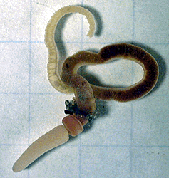

---
aliases:
  - Hemichordata
title: Hemichordata
---

# [[Hemichordata]] 

Acorn worms and pterobranchs 

## #has_/text_of_/abstract 

> **Hemichordata** ( HEM-ih-kor-DAY-tə) is a phylum which consists of triploblastic, eucoelomate, and bilaterally symmetrical marine deuterostome animals, generally considered the sister group of the echinoderms. They appear in the Lower or Middle Cambrian and include two main classes: Enteropneusta (acorn worms), and Pterobranchia. A third class, Planctosphaeroidea, is known only from the larva of a single species, Planctosphaera pelagica. The class Graptolithina, formerly considered extinct, is now placed within the pterobranchs, represented by a single living genus Rhabdopleura.
>
> Acorn worms are solitary worm-shaped organisms. They generally live in burrows (the earliest secreted tubes) and are deposit feeders, but some species are pharyngeal filter feeders, while the family  are free living detritivores. Many are well known for their production and accumulation of various halogenated phenols and pyrroles. Pterobranchs are filter-feeders, mostly colonial, living in a collagenous tubular structure called a coenecium.
>
> The discovery of the stem group hemichordate Gyaltsenglossus shows that early hemichordates combined aspects of the two morphologically disparate classes.
>
> [Wikipedia](https://en.wikipedia.org/wiki/Hemichordate) 

## Phylogeny 

-   « Ancestral Groups  
    -   [Deuterostomia](../Deutero.md)
    -  [Bilateria](../../Bilateria.md) 
    -  [Animals](../../../Animals.md) 
    -  [Eukarya](../../../../Eukarya.md) 
    -   [Tree of Life](../../../../Tree_of_Life.md)

-   ◊ Sibling Groups of  Deuterostomia
    -   [Echinodermata](Echinodermata.md)
    -   Hemichordata
    -   [Chordata](Chordata.md)

-   » Sub-Groups 
	-   *Planctosphaeroidea*
	    -   *Planctosphaeridae*
	-   *Pterobranchia*
	    -   *Cephalodiscidae*
	    -   *Rhabdopleuridae*
	    -   *Atubaridae*
	-   *Enteropneusta*
	    -   *Ptychoderidae*
	    -   *Harrimaniidae*
	    -   *Spengelidae*
	    -   *Saxipendiidae*

## Title Illustrations

Saccoglossus kowalevskii (Enteropneusta: Harrimaniidae). 
The grid lines are 0.25 inches apart. 
Photograph by David Remsen, copyright © 1995,
[Marine Biological Laboratory](http://www.mbl.edu/), Woods Hole.
)

## Confidential Links & Embeds: 

### #is_/same_as :: [Hemichordata](/_Standards/bio/bio~Domain/Eukarya/Animal/Bilateria/Deutero/Hemichordata.md) 

### #is_/same_as :: [Hemichordata.public](/_public/bio/bio~Domain/Eukarya/Animal/Bilateria/Deutero/Hemichordata.public.md) 

### #is_/same_as :: [Hemichordata.internal](/_internal/bio/bio~Domain/Eukarya/Animal/Bilateria/Deutero/Hemichordata.internal.md) 

### #is_/same_as :: [Hemichordata.protect](/_protect/bio/bio~Domain/Eukarya/Animal/Bilateria/Deutero/Hemichordata.protect.md) 

### #is_/same_as :: [Hemichordata.private](/_private/bio/bio~Domain/Eukarya/Animal/Bilateria/Deutero/Hemichordata.private.md) 

### #is_/same_as :: [Hemichordata.personal](/_personal/bio/bio~Domain/Eukarya/Animal/Bilateria/Deutero/Hemichordata.personal.md) 

### #is_/same_as :: [Hemichordata.secret](/_secret/bio/bio~Domain/Eukarya/Animal/Bilateria/Deutero/Hemichordata.secret.md)

