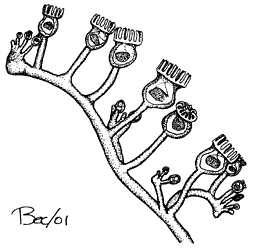

---
aliases:
- begermakkar
- begerormer
- bägardjur
- Chʼosh bitsiiní
- Endoproctos
- Entoprocta
- Entoprocte
- Entoprocto
- Entoprokti
- Kadehimsi solucanlar
- Kamptozoa
- Kamptozoylar
- Kelchwürmer
- Kelkwormen
- Kelkwörm
- Kielichowate
- kinyama-kidoto
- Kummarloomad
- Mananap nga tasa
- Mechovnatci
- nyelesférgek
- Pamachovky
- pikarimadot
- Sonboşluqlar
- Stilkormar
- čaškarji
- внутрішньопорошицеві
- внутрипорошицевые
- ентопрокти
- Ийилгичтер, камптозоа
- унутрыпарашыцавыя
- אנטופרוקטה
- داخليات الشرج
- درونمورزیان
- ಎಂಟೊಪ್ರಾಕ್ಟ
- 內肛動物
- 內肛動物門
- 内肛动物门
- 内肛動物
- 내항동물
title: Entoprocta
has_id_wikidata: Q208580
dv_has_:
  name_:
    an: Entoprocta
    ar: داخليات الشرج
    arz: داخليات الشرج
    ast: Entoprocta
    az: Sonboşluqlar
    be_tarask: унутрыпарашыцавыя
    bg: ентопрокти
    bs: Entoprocta
    ca: Entoprocte
    ceb: Mananap nga tasa
    cs: Mechovnatci
    de: Kelchwürmer
    en: Entoprocta
    eo: Entoprocta
    es: Entoprocta
    et: Kummarloomad
    eu: Entoprocta
    ext: Entoprocta
    fa: درونمورزیان
    fi: pikarimadot
    fr: Entoprocta
    frr: Entoprocta
    ga: Entoprocta
    gl: Endoproctos
    he: אנטופרוקטה
    hr: Entoprocta
    hu: nyelesférgek
    ia: Entoprocta
    id: Entoprocta
    ie: Entoprocta
    io: Entoprocta
    is: Stilkormar
    it: Entoprocta
    ja: 内肛動物
    kn: ಎಂಟೊಪ್ರಾಕ್ಟ
    ko: 내항동물
    ky: Ийилгичтер, камптозоа
    la: Entoprocta
    lfn: Entoprocto
    li: Kelkwörm
    lv: Entoprokti
    mul: Entoprocta
    nb: begerormer
    nl: Kelkwormen
    nn: begermakkar
    nv: Chʼosh bitsiiní
    oc: Entoprocta
    pl: Kielichowate
    pt: Entoprocta
    pt_br: Entoprocta
    ro: Entoprocta
    ru: внутрипорошицевые
    sk: Pamachovky
    sl: čaškarji
    sq: Entoprocta
    sr: Entoprocta
    sr_ec: Entoprocta
    sr_el: Entoprocta
    sv: bägardjur
    sw: kinyama-kidoto
    th: Entoprocta
    tl: Entoprocta
    tr: Kadehimsi solucanlar
    uk: внутрішньопорошицеві
    uz: Kamptozoylar
    vi: Entoprocta
    vo: Entoprocta
    war: Kamptozoa
    wuu: 内肛动物门
    yue: 內肛動物
    zh: 内肛动物门
    zh_cn: 内肛动物门
    zh_hans: 内肛动物门
    zh_hant: 內肛動物門
    zh_hk: 內肛動物門
    zh_sg: 内肛动物门
    zh_tw: 內肛動物門
---
# [[Entoprocta]]

goblet worms, nodding heads, kamptozoans 
 

## #has_/text_of_/abstract 

> **Entoprocta**  (lit. 'inside rectum/anus'), or Kamptozoa , is a phylum of mostly sessile aquatic animals, ranging from 0.1 to 7 millimetres (0.004 to 0.3 in) long. Mature individuals are goblet-shaped, on relatively long stalks. They have a "crown" of solid tentacles whose cilia generate water currents that draw food particles towards the mouth, and both the mouth and anus lie inside the "crown". The superficially similar Bryozoa (Ectoprocta) have the anus outside a "crown" of hollow tentacles. Most families of entoprocts are colonial, and all but 2 of the 150 species are marine. A few solitary species can move slowly.
>
> Some species eject unfertilized ova into the water, while others keep their ova in brood chambers until they hatch, and some of these species use placenta-like organs to nourish the developing eggs. After hatching, the larvae swim for a short time and then settle on a surface. There they metamorphose, and the larval gut rotates by up to 180°, so that the mouth and anus face upwards. Both colonial and solitary species also reproduce by cloning — solitary species grow clones in the space between the tentacles and then release them when developed, while colonial ones produce new members from the stalks or from corridor-like stolons.
>
> Fossils of entoprocts are very rare, and the earliest specimens that have been identified with confidence date from the Late Jurassic. Most studies from 1996 onwards have regarded entoprocts as members of the Trochozoa, which also includes molluscs and annelids. However, a study in 2008 concluded that entoprocts are closely related to bryozoans. Other studies place them in a clade Tetraneuralia, together with molluscs.
>
> [Wikipedia](https://en.wikipedia.org/wiki/Entoprocta) 

## Phylogeny 

-   « Ancestral Groups  
    -  [Bilateria](../Bilateria.md) 
    -  [Animals](../../Animals.md) 
    -  [Eukarya](../../../Eukarya.md) 
    -   [Tree of Life](../../../Tree_of_Life.md)

-   ◊ Sibling Groups of  Bilateria
    -   [Deuterostomia](Deutero.md)
    -  [Arthropoda](Arthropoda.md) 
    -  [Onychophora](Onychophora.md) 
    -   [Tardigrade](Tardigrade.md)
    -  [Nematoda](Nematoda.md) 
    -  [Nematomorpha](Nematomorpha.md) 
    -  [Kinorhyncha](Kinorhyncha.md) 
    -  [Loricifera](Loricifera.md) 
    -  [Priapulida](Priapulida.md) 
    -   [Arrow_Worm](Arrow_Worm.md)
    -  [Gastrotricha](Gastrotricha.md) 
    -  [Rotifera](Rotifera.md) 
    -  [Gnathostomulida](Gnathostomulida.md) 
    -   [Limnognathia maerski](Limnognathia_maerski)
    -  [Cycliophora](Cycliophora.md) 
    -  [Mesozoa](Mesozoa.md) 
    -  [Platyhelminthes](Platyhelminthes.md) 
    -  [Annelida](Annelida.md) 
    -  [Bryozoa](Bryozoa.md) 
    -  [Sipuncula](Sipuncula.md) 
    -  [Mollusca](Mollusca.md) 
    -  [Nemertea](Nemertea.md) 
    -   Entoprocta
    -  [Phoronida](Phoronida.md) 
    -  [Brachiopoda](Brachiopoda.md) 
-   » Sub-Groups 
	-   *Solitaria*
	    -   *Loxosomatidae*
	-   *Coloniales*
	    -   *Astolonata*
	        -   *Loxokalypodidae*
	    -   *Stolonata*
	        -   *Pedicellinidae*
	        -   *Barentsiidae*

## Title Illustrations

Pedicellina (Pedicellinidae). Part of an entoproct colony.\
Drawing by Stritch. Copyright © 2001
[BIODIDAC](http://biodidac.bio.uottawa.ca/index.htm)

-------------------------------------------------------------------------- 
 
copyright ::   © 2001 [BIODIDAC](http://biodidac.bio.uottawa.ca/index.htm) 

## Confidential Links & Embeds: 

### #is_/same_as :: [[/_Standards/bio/bio~Domain/Eukarya/Animal/Bilateria/Entoprocta|Entoprocta]] 

### #is_/same_as :: [[/_public/bio/bio~Domain/Eukarya/Animal/Bilateria/Entoprocta.public|Entoprocta.public]] 

### #is_/same_as :: [[/_internal/bio/bio~Domain/Eukarya/Animal/Bilateria/Entoprocta.internal|Entoprocta.internal]] 

### #is_/same_as :: [[/_protect/bio/bio~Domain/Eukarya/Animal/Bilateria/Entoprocta.protect|Entoprocta.protect]] 

### #is_/same_as :: [[/_private/bio/bio~Domain/Eukarya/Animal/Bilateria/Entoprocta.private|Entoprocta.private]] 

### #is_/same_as :: [[/_personal/bio/bio~Domain/Eukarya/Animal/Bilateria/Entoprocta.personal|Entoprocta.personal]] 

### #is_/same_as :: [[/_secret/bio/bio~Domain/Eukarya/Animal/Bilateria/Entoprocta.secret|Entoprocta.secret]] 

