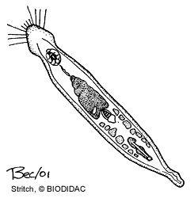

---
aliases:
- Gnathostomulid
- Gnathostomulida
- Gnatostomulīdi
- Gnatostomúlid
- Gnatostomúlidos
- kampaleukamadot
- Kiefermündchen
- kjevemunnar
- kjevemunner
- käkmaskar
- Lõugsuud
- Mnyoo-taya
- Qnatostomulidlər
- Szczękogębe
- Tandjmóndjwörm
- Tandmondwormen
- Tjaapmüswirmer
- Táyiʼ naatʼiʼí biwooʼ dahólónígíí
- Ulod nga papangig
- Çeneli solucanlar
- Čelistovky
- Čeľusťoústky
- Γναθοστοματυλίδες
- Гнатостомуліди
- гнатостомулиды
- челюстноустни
- גנתוסטומולידה
- ديدان فكية
- ديدان فكيه
- چنهلی سوْلوجانلار
- کرمهای آروارهدار
- นาโธสโทมูลิดา
- 顎口動物
- 顎胃動物門
- 颚胃动物门
- 악구동물
title: Gnathostomulida
has_id_wikidata: Q459276
dv_has_:
  name_:
    an: Gnathostomulida
    ar: ديدان فكية
    arz: ديدان فكيه
    ast: Gnathostomulida
    az: Qnatostomulidlər
    azb: چنهلی سوْلوجانلار
    bg: челюстноустни
    bs: Gnathostomulida
    ca: Gnatostomúlid
    ceb: Ulod nga papangig
    cs: Čelistovky
    de: Kiefermündchen
    el: Γναθοστοματυλίδες
    en: Gnathostomulida
    en-ca: Gnathostomulid
    en-gb: Gnathostomulid
    eo: Gnathostomulida
    es: Gnathostomulida
    et: Lõugsuud
    eu: Gnathostomulida
    ext: Gnathostomulida
    fa: کرمهای آروارهدار
    fi: kampaleukamadot
    fr: Gnathostomulida
    frr: Tjaapmüswirmer
    ga: Gnathostomulida
    gl: Gnatostomúlidos
    he: גנתוסטומולידה
    hr: Gnathostomulida
    hu: Gnathostomulida
    ia: Gnathostomulida
    ie: Gnathostomulida
    io: Gnathostomulida
    it: Gnathostomulida
    ja: 顎口動物
    ko: 악구동물
    la: Gnathostomulida
    li: Tandjmóndjwörm
    lv: Gnatostomulīdi
    mul: Gnathostomulida
    nb: kjevemunner
    nl: Tandmondwormen
    nn: kjevemunnar
    nv: Táyiʼ naatʼiʼí biwooʼ dahólónígíí
    oc: Gnathostomulida
    pl: Szczękogębe
    pt: Gnathostomulida
    pt-br: Gnathostomulida
    ro: Gnathostomulida
    ru: гнатостомулиды
    sk: Čeľusťoústky
    sq: Gnathostomulida
    sr: Gnathostomulida
    sr-ec: Gnathostomulida
    sr-el: Gnathostomulida
    sv: käkmaskar
    sw: Mnyoo-taya
    th: นาโธสโทมูลิดา
    tl: Gnathostomulida
    tr: Çeneli solucanlar
    uk: Гнатостомуліди
    vi: Gnathostomulida
    vo: Gnathostomulida
    war: Gnathostomulida
    zh: 颚胃动物门
    zh-cn: 颚胃动物门
    zh-hans: 颚胃动物门
    zh-hant: 顎胃動物門
    zh-hk: 顎胃動物門
    zh-sg: 颚胃动物门
    zh-tw: 顎胃動物門
---
# [[Gnathostomulida]] 

Jaw Worms 

 

## #has_/text_of_/abstract 

> Gnathostomulids, or jaw worms, are a small phylum of nearly microscopic marine animals. They inhabit sand and mud beneath shallow coastal waters and can survive in relatively anoxic environments. They were first recognised and described in 1956.
>
> [Wikipedia](https://en.wikipedia.org/wiki/Gnathostomulid) 

## Phylogeny 

-   « Ancestral Groups  
    -  [Bilateria](../Bilateria.md) 
    -  [Animals](../../Animals.md) 
    -  [Eukarya](../../../Eukarya.md) 
    -   [Tree of Life](../../../Tree_of_Life.md)

-   ◊ Sibling Groups of  Bilateria
    -   [Deuterostomia](Deutero.md)
    -  [Arthropoda](Arthropoda.md) 
    -  [Onychophora](Onychophora.md) 
    -   [Tardigrade](Tardigrade.md)
    -  [Nematoda](Nematoda.md) 
    -  [Nematomorpha](Nematomorpha.md) 
    -  [Kinorhyncha](Kinorhyncha.md) 
    -  [Loricifera](Loricifera.md) 
    -  [Priapulida](Priapulida.md) 
    -   [Arrow_Worm](Arrow_Worm.md)
    -  [Gastrotricha](Gastrotricha.md) 
    -  [Rotifera](Rotifera.md) 
    -   Gnathostomulida
    -   [Limnognathia maerski](Limnognathia_maerski)
    -  [Cycliophora](Cycliophora.md) 
    -  [Mesozoa](Mesozoa.md) 
    -  [Platyhelminthes](Platyhelminthes.md) 
    -  [Annelida](Annelida.md) 
    -  [Bryozoa](Bryozoa.md) 
    -  [Sipuncula](Sipuncula.md) 
    -  [Mollusca](Mollusca.md) 
    -  [Nemertea](Nemertea.md) 
    -  [Entoprocta](Entoprocta.md) 
    -  [Phoronida](Phoronida.md) 
    -  [Brachiopoda](Brachiopoda.md) 

-   » Sub-Groups 

## Title Illustrations

Representative body plan of a gnathostomulid.\
Drawing by Stritch. Copyright ©
[BIODIDAC](http://biodidac.bio.uottawa.ca/index.htm).

------------------------------------------------------------------------

copyright ::   © [BIODIDAC](http://biodidac.bio.uottawa.ca/index.htm) 

## Confidential Links & Embeds: 

### #is_/same_as :: [[/_Standards/bio/bio~Domain/Eukarya/Animal/Bilateria/Gnathostomulida|Gnathostomulida]] 

### #is_/same_as :: [[/_public/bio/bio~Domain/Eukarya/Animal/Bilateria/Gnathostomulida.public|Gnathostomulida.public]] 

### #is_/same_as :: [[/_internal/bio/bio~Domain/Eukarya/Animal/Bilateria/Gnathostomulida.internal|Gnathostomulida.internal]] 

### #is_/same_as :: [[/_protect/bio/bio~Domain/Eukarya/Animal/Bilateria/Gnathostomulida.protect|Gnathostomulida.protect]] 

### #is_/same_as :: [[/_private/bio/bio~Domain/Eukarya/Animal/Bilateria/Gnathostomulida.private|Gnathostomulida.private]] 

### #is_/same_as :: [[/_personal/bio/bio~Domain/Eukarya/Animal/Bilateria/Gnathostomulida.personal|Gnathostomulida.personal]] 

### #is_/same_as :: [[/_secret/bio/bio~Domain/Eukarya/Animal/Bilateria/Gnathostomulida.secret|Gnathostomulida.secret]] 

