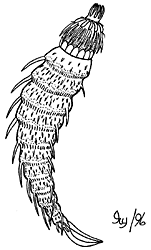

---
aliases:
- Bodljoglavci
- Chʼosh doo yitʼíinii bidaaʼ dichʼízhí
- Cinorhyncha
- Derisi dikenli solucanlar
- Dragoni-matope
- Hakenrüssler
- Hnykkhöfðar
- kaveljčniki
- Kinorhyncha
- kinorhyncher
- Kinorinhi
- Kinorinxlər
- Kinorxincha
- mudderdrage
- okapäämadot
- pansarmaskar
- Quinorrinc
- Quinorrincos
- ryjkogłowy
- rypečky
- Siilussid
- stekelwormen
- Stikelwirmer
- Ulod nga armadura
- övesférgecskék
- кіноринхи
- Киноринха
- киноринхи
- Киноринхтер
- хоботопридвижващи се
- קינורהינכה
- متحركات الخطم
- کرمهای تیغبهسر
- కినోర్హించా
- ไคโนรินชา
- კინორინქები
- 动吻动物门
- 動吻動物
- 동문동물
title: Kinorhyncha
has_id_wikidata: Q5182
dv_has_:
  name_:
    an: Kinorhyncha
    ar: متحركات الخطم
    arz: متحركات الخطم
    ast: Kinorhyncha
    az: Kinorinxlər
    be: Kinorhyncha
    bg: хоботопридвижващи се
    bs: Kinorhyncha
    ca: Quinorrinc
    ceb: Ulod nga armadura
    cs: rypečky
    da: mudderdrage
    de: Hakenrüssler
    en: Kinorhyncha
    eo: Kinorhyncha
    es: Kinorhyncha
    et: Siilussid
    eu: Kinorhyncha
    ext: Kinorhyncha
    fa: کرمهای تیغبهسر
    fi: okapäämadot
    fr: Kinorhyncha
    frr: Stikelwirmer
    ga: Kinorhyncha
    gl: Quinorrincos
    he: קינורהינכה
    hr: Bodljoglavci
    hu: övesférgecskék
    ia: Kinorhyncha
    id: Kinorhyncha
    ie: Kinorhyncha
    io: Kinorhyncha
    is: Hnykkhöfðar
    it: Kinorhyncha
    ja: 動吻動物
    ka: კინორინქები
    kk: Киноринха
    ko: 동문동물
    ky: Киноринхтер
    la: Cinorhyncha
    lv: Kinorinhi
    ms: Kinorhyncha
    mul: Kinorhyncha
    nb: kinorhyncher
    nl: stekelwormen
    nv: Chʼosh doo yitʼíinii bidaaʼ dichʼízhí
    oc: Kinorhyncha
    pl: ryjkogłowy
    pt: Kinorhyncha
    pt_br: Kinorhyncha
    ro: Kinorhyncha
    ru: киноринхи
    sl: kaveljčniki
    sq: Kinorhyncha
    sr: Kinorhyncha
    sv: pansarmaskar
    sw: Dragoni-matope
    te: కినోర్హించా
    th: ไคโนรินชา
    tl: Kinorhyncha
    tr: Derisi dikenli solucanlar
    uk: кіноринхи
    uz: Kinorxincha
    vec: Kinorhyncha
    vi: Kinorhyncha
    vo: Kinorhyncha
    war: Kinorhyncha
    wuu: 动吻动物门
    zh: 动吻动物门
    zh_cn: 动吻动物门
    zh_hans: 动吻动物门
---
# [[Kinorhyncha]] 

## #has_/text_of_/abstract 

> **Kinorhyncha**  (Ancient Greek: κινέω, romanized: kīnéō, lit. 'I move', ῥύγχος rhúnkhos "snout") is a phylum of small marine invertebrates that are widespread in mud or sand at all depths as part of the meiobenthos. They are commonly called mud dragons. Modern species are 1 mm (0.039 in) or less, but Cambrian forms could reach 4 cm (1.6 in).
>
> [Wikipedia](https://en.wikipedia.org/wiki/Kinorhyncha) 

## Phylogeny 

-   « Ancestral Groups  
    -  [Bilateria](../Bilateria.md) 
    -  [Animals](../../Animals.md) 
    -  [Eukarya](../../../Eukarya.md) 
    -   [Tree of Life](../../../Tree_of_Life.md)

-   ◊ Sibling Groups of  Bilateria
    -   [Deuterostomia](Deutero.md)
    -  [Arthropoda](Arthropoda.md) 
    -  [Onychophora](Onychophora.md) 
    -   [Tardigrade](Tardigrade.md)
    -  [Nematoda](Nematoda.md) 
    -  [Nematomorpha](Nematomorpha.md) 
    -   Kinorhyncha
    -  [Loricifera](Loricifera.md) 
    -  [Priapulida](Priapulida.md) 
    -   [Arrow_Worm](Arrow_Worm.md)
    -  [Gastrotricha](Gastrotricha.md) 
    -  [Rotifera](Rotifera.md) 
    -  [Gnathostomulida](Gnathostomulida.md) 
    -   [Limnognathia maerski](Limnognathia_maerski)
    -  [Cycliophora](Cycliophora.md) 
    -  [Mesozoa](Mesozoa.md) 
    -  [Platyhelminthes](Platyhelminthes.md) 
    -  [Annelida](Annelida.md) 
    -  [Bryozoa](Bryozoa.md) 
    -  [Sipuncula](Sipuncula.md) 
    -  [Mollusca](Mollusca.md) 
    -  [Nemertea](Nemertea.md) 
    -  [Entoprocta](Entoprocta.md) 
    -  [Phoronida](Phoronida.md) 
    -  [Brachiopoda](Brachiopoda.md) 

-   » Sub-Groups 
	-   *Cyclorhagida*
	    -   *Echinoderidae*
	    -   *Dracoderidae*
	    -   *Zelinkaderidae*
	    -   *Centroderidae*
	    -   *Semnoderidae*
	    -   *Cateridae*
	-   *Homalorhagida*
	    -   *Neocentrophyidae*
	    -   *Pycnophyidae*

## Title Illustrations

Major external features of a kinorhynchan.\
Drawing by Ivy Livingstone. Copyright © 1996
[BIODIDAC](http://biodidac.bio.uottawa.ca/index.htm).

--------------------------------------------------------------------------
 
copyright ::   © 1996 [BIODIDAC](http://biodidac.bio.uottawa.ca/index.htm) 

## Confidential Links & Embeds: 

### #is_/same_as :: [[/_Standards/bio/bio~Domain/Eukarya/Animal/Bilateria/Kinorhyncha|Kinorhyncha]] 

### #is_/same_as :: [[/_public/bio/bio~Domain/Eukarya/Animal/Bilateria/Kinorhyncha.public|Kinorhyncha.public]] 

### #is_/same_as :: [[/_internal/bio/bio~Domain/Eukarya/Animal/Bilateria/Kinorhyncha.internal|Kinorhyncha.internal]] 

### #is_/same_as :: [[/_protect/bio/bio~Domain/Eukarya/Animal/Bilateria/Kinorhyncha.protect|Kinorhyncha.protect]] 

### #is_/same_as :: [[/_private/bio/bio~Domain/Eukarya/Animal/Bilateria/Kinorhyncha.private|Kinorhyncha.private]] 

### #is_/same_as :: [[/_personal/bio/bio~Domain/Eukarya/Animal/Bilateria/Kinorhyncha.personal|Kinorhyncha.personal]] 

### #is_/same_as :: [[/_secret/bio/bio~Domain/Eukarya/Animal/Bilateria/Kinorhyncha.secret|Kinorhyncha.secret]] 

