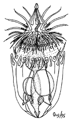

# [[Loricifera]] 

 

## #has_/text_of_/abstract 

> **Loricifera** (from Latin, lorica, corselet (armour) + ferre, to bear) is a phylum of very small to microscopic marine cycloneuralian sediment-dwelling animals with 43 described species and approximately 100 more that have been collected and not yet described. Their sizes range from 100 μm to ca. 1 mm.
>
> They are characterised by a protective outer case called a lorica and their habitat is in the spaces between marine gravel to which they attach themselves. The phylum was discovered in 1983 by R.M. Kristensen, near Roscoff, France. They are among the most recently discovered groups of animals. They attach themselves quite firmly to the substrate, and hence remained undiscovered for so long. The first specimen was collected in the 1970s, and described in 1983. They are found at all depths, in different sediment types, and in all latitudes.
>
> [Wikipedia](https://en.wikipedia.org/wiki/Loricifera) 

## Phylogeny 

-   « Ancestral Groups  
    -  [Bilateria](../Bilateria.md))
    -  [Animals](../../Animals.md))
    -  [Eukarya](../../../Eukarya.md))
    -   [Tree of Life](../../../Tree_of_Life.md)

-   ◊ Sibling Groups of  Bilateria
    -   [Deuterostomia](Deutero.md)
    -  [Arthropoda](Arthropoda.md))
    -  [Onychophora](Onychophora.md))
    -   [Tardigrade](Tardigrade.md)
    -  [Nematoda](Nematoda.md))
    -  [Nematomorpha](Nematomorpha.md))
    -  [Kinorhyncha](Kinorhyncha.md))
    -   Loricifera
    -  [Priapulida](Priapulida.md))
    -   [Arrow_Worm](Arrow_Worm.md)
    -  [Gastrotricha](Gastrotricha.md))
    -  [Rotifera](Rotifera.md))
    -  [Gnathostomulida](Gnathostomulida.md))
    -   [Limnognathia maerski](Limnognathia_maerski)
    -  [Cycliophora](Cycliophora.md))
    -  [Mesozoa](Mesozoa.md))
    -  [Platyhelminthes](Platyhelminthes.md))
    -  [Annelida](Annelida.md))
    -  [Bryozoa](Bryozoa.md))
    -  [Sipuncula](Sipuncula.md))
    -  [Mollusca](Mollusca.md))
    -  [Nemertea](Nemertea.md))
    -  [Entoprocta](Entoprocta.md))
    -  [Phoronida](Phoronida.md))
    -  [Brachiopoda](Brachiopoda.md))
-   » Sub-Groups 
	-   *Nanaloricus*
	-   *Pliciloricus*
	-   *Rugiloricus*

## Title Illustrations

Major anatomical features of a loriciferan.\
Drawing by Ivy Livingstone. Copyright © 1995
[BIODIDAC](http://biodidac.bio.uottawa.ca/index.htm).

--------------------------------------------------------------------------

Copyright ::   © 1995 [BIODIDAC](http://biodidac.bio.uottawa.ca/index.htm) 

## Confidential Links & Embeds: 

### #is_/same_as :: [Loricifera](/_Standards/bio/bio~Domain/Eukarya/Animal/Bilateria/Loricifera.md) 

### #is_/same_as :: [Loricifera.public](/_public/bio/bio~Domain/Eukarya/Animal/Bilateria/Loricifera.public.md) 

### #is_/same_as :: [Loricifera.internal](/_internal/bio/bio~Domain/Eukarya/Animal/Bilateria/Loricifera.internal.md) 

### #is_/same_as :: [Loricifera.protect](/_protect/bio/bio~Domain/Eukarya/Animal/Bilateria/Loricifera.protect.md) 

### #is_/same_as :: [Loricifera.private](/_private/bio/bio~Domain/Eukarya/Animal/Bilateria/Loricifera.private.md) 

### #is_/same_as :: [Loricifera.personal](/_personal/bio/bio~Domain/Eukarya/Animal/Bilateria/Loricifera.personal.md) 

### #is_/same_as :: [Loricifera.secret](/_secret/bio/bio~Domain/Eukarya/Animal/Bilateria/Loricifera.secret.md)

