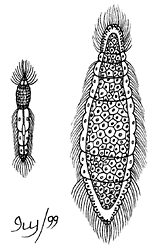
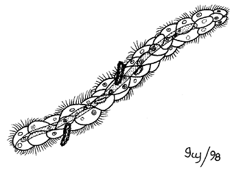

---
aliases:
- harvasoluiset
- mellomdyr
- Mesozoa
- Mesozon
- Mesozoos
- Mezozoa
- Mezozoe
- Mezozoylar
- Middendiertjes
- Morulovce
- Morulovci
- méiseasóin
- Vaheloomad
- Wielokomórkowce pośrednie
- мезозої
- мезозоа
- Мезозое
- мезозои
- Мезозоолор
- מזוזואה
- حيوانات متوسطة
- حيوانات متوسطه
- میانزیان
- 中生动物
- 中生動物
- 중생동물
title: Mesozoa
has_id_wikidata: Q462431
dv_has_:
  name_:
    an: Mesozoa
    ar: حيوانات متوسطة
    arz: حيوانات متوسطه
    ast: Mesozoa
    az: Mezozoylar
    bg: мезозоа
    bs: Mezozoa
    ca: Mesozoa
    ceb: Mesozoa
    cs: Morulovci
    de: Mesozoa
    en: Mesozoa
    eo: Mesozoa
    es: Mesozoa
    et: Vaheloomad
    eu: Mesozoa
    ext: Mesozoa
    fa: میانزیان
    fi: harvasoluiset
    fr: Mesozoa
    ga: méiseasóin
    gl: Mesozoos
    he: מזוזואה
    ia: Mesozoa
    id: Mesozoa
    ie: Mesozoa
    io: Mesozoa
    it: Mesozoa
    ja: 中生動物
    jv: Mesozoa
    ko: 중생동물
    ky: Мезозоолор
    la: Mesozoa
    lfn: Mesozon
    li: Mesozoa
    mul: Mesozoa
    nb: mellomdyr
    nl: Middendiertjes
    nn: Mesozoa
    oc: Mesozoa
    pl: Wielokomórkowce pośrednie
    pt: Mesozoa
    pt_br: Mesozoa
    ro: Mesozoa
    ru: мезозои
    sk: Morulovce
    sq: Mesozoa
    sr: Мезозое
    sr_ec: Мезозое
    sr_el: Mezozoe
    sv: Mesozoa
    tl: Mesozoa
    tr: Mesozoa
    uk: мезозої
    vi: Mesozoa
    vo: Mesozoa
    war: Mesozoa
    zh: 中生动物
    zh_cn: 中生动物
    zh_hans: 中生动物
    zh_hant: 中生動物
    zh_hk: 中生動物
    zh_sg: 中生动物
    zh_tw: 中生動物
---
# [[Mesozoa]] 

    

## #has_/text_of_/abstract 

> The **Mesozoa** are minuscule, worm-like parasites of marine invertebrates. Generally, these tiny, elusive creatures consist of a somatoderm (outer layer) of ciliated cells surrounding one or more reproductive cells.
>
> A 2017 study recovered Mesozoa as a monophyletic group that emerged in the Lophotrochozoa as sister of the Rouphozoa.
>
> Some workers previously classified Mesozoa as the sole phylum of the lonely subkingdom Agnotozoa. Cavalier-Smith argued that at least some of the mesozoans are in fact protistans, not animals.
>
> In the 19th century, the Mesozoa were a wastebasket taxon for multicellular organisms which lacked the invaginating gastrula which was thought to define the Metazoa.
>
> [Wikipedia](https://en.wikipedia.org/wiki/Mesozoa) 

## Phylogeny 

-   « Ancestral Groups  
    -  [Bilateria](../Bilateria.md) 
    -  [Animals](../../Animals.md) 
    -  [Eukarya](../../../Eukarya.md) 
    -   [Tree of Life](../../../Tree_of_Life.md)

-   ◊ Sibling Groups of  Bilateria
    -   [Deuterostomia](Deutero.md)
    -  [Arthropoda](Arthropoda.md) 
    -  [Onychophora](Onychophora.md) 
    -   [Tardigrade](Tardigrade.md)
    -  [Nematoda](Nematoda.md) 
    -  [Nematomorpha](Nematomorpha.md) 
    -  [Kinorhyncha](Kinorhyncha.md) 
    -  [Loricifera](Loricifera.md) 
    -  [Priapulida](Priapulida.md) 
    -   [Arrow_Worm](Arrow_Worm.md)
    -  [Gastrotricha](Gastrotricha.md) 
    -  [Rotifera](Rotifera.md) 
    -  [Gnathostomulida](Gnathostomulida.md) 
    -   [Limnognathia maerski](Limnognathia_maerski)
    -  [Cycliophora](Cycliophora.md) 
    -   Mesozoa
    -  [Platyhelminthes](Platyhelminthes.md) 
    -  [Annelida](Annelida.md) 
    -  [Bryozoa](Bryozoa.md) 
    -  [Sipuncula](Sipuncula.md) 
    -  [Mollusca](Mollusca.md) 
    -  [Nemertea](Nemertea.md) 
    -  [Entoprocta](Entoprocta.md) 
    -  [Phoronida](Phoronida.md) 
    -  [Brachiopoda](Brachiopoda.md) 

-   » Sub-Groups 
	-   *Rhombozoa*
	    -   *Conocyemidae*
	    -   *Dicyemidae*
	    -   *Kantharellidae*
	-   *Orthonectida*
	    -   *Pelmatosphaeridae*
	    -   *Rhopaluridae*

## Title Illustrations

-   Rhopalura (Orthonectida) male and female
-   Dicyema (Rhombozoa) adult, nematogen stage

--------------------------------------------------------------------------
Drawings by by Ivy Livingstone. Copyright © [BIODIDAC](http://biodidac.bio.uottawa.ca/index.htm)

copyright ::   © 1999 [BIODIDAC](http://biodidac.bio.uottawa.ca/index.htm) 

--------------------------------------------------------------------------

copyright ::   © 1998 [BIODIDAC](http://biodidac.bio.uottawa.ca/index.htm) 

## Confidential Links & Embeds: 

### #is_/same_as :: [[/_Standards/bio/bio~Domain/Eukarya/Animal/Bilateria/Mesozoa|Mesozoa]] 

### #is_/same_as :: [[/_public/bio/bio~Domain/Eukarya/Animal/Bilateria/Mesozoa.public|Mesozoa.public]] 

### #is_/same_as :: [[/_internal/bio/bio~Domain/Eukarya/Animal/Bilateria/Mesozoa.internal|Mesozoa.internal]] 

### #is_/same_as :: [[/_protect/bio/bio~Domain/Eukarya/Animal/Bilateria/Mesozoa.protect|Mesozoa.protect]] 

### #is_/same_as :: [[/_private/bio/bio~Domain/Eukarya/Animal/Bilateria/Mesozoa.private|Mesozoa.private]] 

### #is_/same_as :: [[/_personal/bio/bio~Domain/Eukarya/Animal/Bilateria/Mesozoa.personal|Mesozoa.personal]] 

### #is_/same_as :: [[/_secret/bio/bio~Domain/Eukarya/Animal/Bilateria/Mesozoa.secret|Mesozoa.secret]] 

