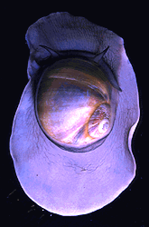
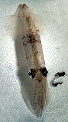

---
aliases:
- Bijáád Ádaadinígíí
- blautdyr
- Blotvil
- blötdjur
- bløddyr
- bløtdyr
- gliemji
- Ikinyamushongo
- Imlwaɣen
- Kinhason
- Kregynnek
- Limused
- lindýr
- Llamp'uka
- mehkužci
- Mekušci
- mięczaki
- Mjechkuše
- moileasc
- Moliuskai
- Mollusca
- Molluska
- mollusques
- Molluuskn
- Mollyuskalar
- Mollüskad
- molusco
- moluscos
- Moluska
- molusko
- molusku
- molusse
- Molwsg
- Molyusklar
- mol·luscs
- Mołusco
- muolioskā
- Mäkkýše
- měkkýši
- nilviäiset
- Niōng-tā̤ dông-ŭk
- Nńg-thé tōng-bu̍t
- puhatestűek
- qolaalqabeeyyii
- soweli pi sijelo ko
- Syrymbe
- Weakdieren
- Weechdéieren
- Weekdeerter
- Weekdiere
- Weekdieren
- Weichtiere
- Weikdere
- Wokdiarten
- Yumuşakçalar
- động vật thân mềm
- Μαλάκια
- Зөөлэн бэетэн
- малюскі
- Мегучкаре
- мекотели
- мекушци
- Моллюск
- Моллюскалар
- Моллюскаш
- моллюски
- моллюсклар
- Моллюсктæ
- моллюскъёс
- Моллюскылар
- молюски
- Нармбаданҳо
- Հաւախխունջներ
- փափկամարմիններ
- מאלוסקן
- רכיכות
- رخويات
- مولسکا
- مولسڪا
- مولیوسکلار
- نرمتنان
- मोलस्का
- কোমলদেহী প্ৰাণী
- মলাস্কা
- ਮੋਲਸਕਾ
- મૃદુકાય સમુદાય
- ସନ୍ଧିପଦ
- மெல்லுடலி
- మొలస్కా
- ಮೃದ್ವಂಗಿಗಳು
- മൊളസ്ക
- มอลลัสกา
- ကျိချွဲသတ္တဝါ
- მოლუსკები
- ዛጎል ለበስ
- 軟体動物
- 軟體動物
- 軟體動物門
- 软体动物
- 软体动物门
- ꯃꯣꯂꯨꯁꯀꯥ
- 연체동물
has_id_wikidata: Q25326
Basisklassifikation: 42.73
Colon_Classification: K7
Commons_category: Mollusca
Commons_gallery: Mollusca
described_by_source:
- '[[../../../../../WikiData/WD~Brockhaus_and_Efron_Encyclopedic_Dictionary,602358]]'
- '[[_Standards/WikiData/WD~Encyclopædia_Britannica_11th_edition,867541]]'
- '[[_Standards/WikiData/WD~Small_Brockhaus_and_Efron_Encyclopedic_Dictionary,19180675]]'
- '[[_Standards/WikiData/WD~New_Encyclopedic_Dictionary,19190511]]'
- '[[_Standards/WikiData/WD~Meyers_Konversations-Lexikon,_4th_edition_(1885–1890),19219752]]'
- '[[_Standards/WikiData/WD~Great_Soviet_Encyclopedia_(1926–1947),20078554]]'
Dewey_Decimal_Classification: 594
EPPO_Code: 1MOLLP
equivalent_class: http://dbpedia.org/ontology/Mollusca
GS1_GPC_code: 10005449
Iconclass_notation: 25F72
image: http://commons.wikimedia.org/wiki/Special:FilePath/Mollusca.jpg
instance_of: '[[_Standards/WikiData/WD~taxon,16521]]'
ITIS_TSN: 69458
Krugosvet_article: nauka_i_tehnika/biologiya/MOLLYUSKI.html
MeSH_tree_code: B01.050.500.644
montage_image: http://commons.wikimedia.org/wiki/Special:FilePath/Mollusca%20Diversity.jpg
OmegaWiki_Defined_Meaning: 2397
pronunciation_audio: http://commons.wikimedia.org/wiki/Special:FilePath/Wa%20molusse.ogg
spoken_text_audio: http://commons.wikimedia.org/wiki/Special:FilePath/Nl-Weekdieren-article.ogg
Stack_Exchange_tag: https://biology.stackexchange.com/tags/molluscs
start_time: -500000000-01-01
studied_in: '[[_Standards/WikiData/WD~malacology,190993]]'
taxon_common_name:
- Weichtiere
- bløtdyr
- Weekdieren
- mehkužci
taxon_name: Mollusca
taxon_rank: '[[_Standards/WikiData/WD~phylum,38348]]'
this_taxon_is_source_of:
- '[[_Standards/WikiData/WD~mollusc_shell,6445670]]'
- '[[_Standards/WikiData/WD~shellfish,6501235]]'
title: Mollusca
topic_s_main_template:
- '[[_Standards/WikiData/WD~Q10636788,10636788]]'
- '[[_Standards/WikiData/WD~Template_Mollusca,14334405]]'
- '[[_Standards/WikiData/WD~Template_Mollusc_classes,25733663]]'
topic_s_main_Wikimedia_portal: '[[_Standards/WikiData/WD~Q42353303,42353303]]'
UMLS_CUI: C0026391
union_of: '[[_Standards/WikiData/WD~list_of_values_as_qualifiers,23766486]]'
dv_has_:
  name_:
    af: Weekdiere
    am: ዛጎል ለበስ
    an: Mollusca
    ar: رخويات
    ary: رخويات
    arz: رخويات
    as: কোমলদেহী প্ৰাণী
    ast: Mollusca
    az: Molyusklar
    azb: مولیوسکلار
    ba: Моллюскылар
    bar: Mollusca
    be: малюскі
    be_tarask: малюскі
    bg: мекотели
    bn: মলাস্কা
    br: Blotvil
    bs: Mekušci
    bxr: Зөөлэн бэетэн
    ca: mol·luscs
    cdo: Niōng-tā̤ dông-ŭk
    ceb: Kinhason
    co: Mollusca
    cs: měkkýši
    cv: Моллюск
    cy: Molwsg
    da: bløddyr
    de: Weichtiere
    de-at: Mollusca
    de_ch: Mollusca
    diq: Mollusca
    el: Μαλάκια
    en: Mollusca
    en_ca: Mollusca
    en_gb: Mollusca
    eo: molusko
    es: moluscos
    et: Limused
    eu: molusku
    ext: Mollusca
    fa: نرمتنان
    fi: nilviäiset
    fj: Mollusca
    fo: lindýr
    fr: mollusques
    frp: Mollusca
    frr: Wokdiarten
    fur: Mollusca
    fy: Weakdieren
    ga: moileasc
    gd: Mollusca
    gl: molusco
    gn: Syrymbe
    gsw: Weichtiere
    gu: મૃદુકાય સમુદાય
    he: רכיכות
    hi: मोलस्का
    hif: Mollusca
    hr: mekušci
    hsb: Mjechkuše
    hu: puhatestűek
    hy: փափկամարմիններ
    hyw: Հաւախխունջներ
    ia: Mollusca
    id: Moluska
    ie: Mollusca
    ig: Mollusca
    inh: Моллюскаш
    io: Molusko
    is: lindýr
    it: Mollusca
    ja: 軟体動物
    jv: Moluska
    ka: მოლუსკები
    kg: Mollusca
    kk: Моллюскалар
    kn: ಮೃದ್ವಂಗಿಗಳು
    ko: 연체동물
    kw: Kregynnek
    ky: Моллюскалар
    la: Mollusca
    lb: Weechdéieren
    lfn: Molusco
    li: Weikdere
    lij: Mollusca
    lt: Moliuskai
    lv: gliemji
    mg: Mollusca
    min: Mollusca
    mk: Мекотели
    ml: മൊളസ്ക
    mni: ꯃꯣꯂꯨꯁꯀꯥ
    ms: Moluska
    mt: Molluska
    mul: Mollusca
    my: ကျိချွဲသတ္တဝါ
    nan: Nńg-thé tōng-bu̍t
    nap: Mollusca
    nb: bløtdyr
    nds: Weekdeerter
    nds_nl: Mollusca
    nl: weekdieren
    nn: blautdyr
    nrm: Mollusca
    nv: Bijáád Ádaadinígíí
    nys: Mollusca
    oc: Mollusca
    om: qolaalqabeeyyii
    or: ସନ୍ଧିପଦ
    os: Моллюсктæ
    pa: ਮੋਲਸਕਾ
    pap: molusko
    pap-aw: molusco
    pcd: Mollusca
    pl: mięczaki
    pms: Mollusca
    pnb: مولسکا
    pt: Moluscos
    pt_br: Mollusca
    qu: Llamp'uka
    rm: Mollusca
    ro: Mollusca
    roa-tara: Mollusca
    rsk: Мегучкаре
    ru: моллюски
    rup: Mollusca
    rw: Ikinyamushongo
    sc: Mollusca
    scn: Mollusca
    sco: Mollusca
    sd: مولسڪا
    sgs: muolioskā
    sh: mekušci
    shi: Imlwaɣen
    sk: Mäkkýše
    sl: mehkužci
    sq: Mollusca
    sr: мекушци
    sv: blötdjur
    sw: Moluska
    ta: மெல்லுடலி
    te: మొలస్కా
    tet: Molusku
    tg: Нармбаданҳо
    th: มอลลัสกา
    tl: Mollusca
    tok: soweli pi sijelo ko
    tr: Yumuşakçalar
    tt: моллюсклар
    udm: моллюскъёс
    uk: молюски
    ur: مولسکا
    uz: Mollyuskalar
    vec: Mołusco
    vep: Mollüskad
    vi: động vật thân mềm
    vls: Molluuskn
    vo: Mollusca
    wa: molusse
    war: Mollusca
    wo: Mollusca
    wuu: 软体动物
    yi: מאלוסקן
    yue: 軟體動物
    zh: 软体动物门
    zh_cn: 软体动物门
    zh_hans: 软体动物门
    zh_tw: 軟體動物門
    zu: Mollusca
---
# [[Mollusca]]

Snails, clams, mussels, squids, octopi, chitons, and tusk shells 

    ) 

#is_/same_as :: [[../../../../../WikiData/WD~Mollusca,25326|WD~Mollusca,25326]] 

## #has_/text_of_/abstract 

> **Mollusca** is a phylum of protostomic invertebrate animals, whose members are known as molluscs or mollusks (). Around 76,000 extant species of molluscs are recognized, making it the second-largest animal phylum after Arthropoda. The number of additional fossil species is estimated between 60,000 and 100,000, and the proportion of undescribed species is very high. Many taxa remain poorly studied.
>
> Molluscs are the largest marine phylum, comprising about 23% of all the named marine organisms. They are highly diverse, not just in size and anatomical structure, but also in behaviour and habitat, as numerous groups are freshwater and even terrestrial species. The phylum is typically divided into 7 or 8 taxonomic classes, of which two are entirely extinct. Cephalopod molluscs, such as squid, cuttlefish, and octopuses, are among the most neurologically advanced of all invertebrates—and either the giant squid or the colossal squid is the largest known extant invertebrate species. The gastropods (snails, slugs and abalone) are by far the most diverse class and account for 80% of the total classified molluscan species.
>
> The four most universal features defining modern molluscs are a soft body composed almost entirely of muscle, a mantle with a significant cavity used for breathing and excretion, the presence of a radula (except for bivalves), and the structure of the nervous system. Other than these common elements, molluscs express great morphological diversity, so many textbooks base their descriptions on a "hypothetical ancestral mollusc" (see image below). This has a single, "limpet-like" shell on top, which is made of proteins and chitin reinforced with calcium carbonate, and is secreted by a mantle covering the whole upper surface. The underside of the animal consists of a single muscular "foot". Although molluscs are coelomates, the coelom tends to be small.
>
> The main body cavity is a hemocoel through which blood circulates; as such, their circulatory systems are mainly open. The "generalized" mollusc's feeding system consists of a rasping "tongue", the radula, and a complex digestive system in which exuded mucus and microscopic, muscle-powered "hairs" called cilia play various important roles. The generalized mollusc has two paired nerve cords, or three in bivalves. The brain, in species that have one, encircles the esophagus. Most molluscs have eyes, and all have sensors to detect chemicals, vibrations, and touch. The simplest type of molluscan reproductive system relies on external fertilization, but more complex variations occur. Nearly all produce eggs, from which may emerge trochophore larvae, more complex veliger larvae, or miniature adults. The coelomic cavity is reduced. They have an open circulatory system and kidney-like organs for excretion.
>
> Good evidence exists for the appearance of gastropods, cephalopods, and bivalves in the Cambrian period, 541–485.4 million years ago. However, the evolutionary history both of molluscs' emergence from the ancestral Lophotrochozoa and of their diversification into the well-known living and fossil forms are still subjects of vigorous debate among scientists.
>
> 
>
> Molluscs have been and still are an important food source for humans. Toxins that can accumulate in certain molluscs under specific conditions create a risk of food poisoning, and many jurisdictions have regulations to reduce this risk. Molluscs have, for centuries, also been the source of important luxury goods, notably pearls, mother of pearl, Tyrian purple dye, and sea silk. Their shells have also been used as money in some preindustrial societies.
>
> A handful of mollusc species are sometimes considered hazards or pests for human activities. The bite of the blue-ringed octopus is often fatal, and that of Enteroctopus dofleini causes inflammation that can last over a month. Stings from a few species of large tropical cone shells of the family Conidae can also kill, but their sophisticated, though easily produced, venoms have become important tools in neurological research. Schistosomiasis (also known as bilharzia, bilharziosis, or snail fever) is transmitted to humans by water snail hosts, and affects about 200 million people. Snails and slugs can also be serious agricultural pests, and accidental or deliberate introduction of some snail species into new environments has seriously damaged some ecosystems.
>
> [Wikipedia](https://en.wikipedia.org/wiki/Mollusca) 

## Phylogeny 

-   « Ancestral Groups  
    -  [Bilateria](../Bilateria.md) 
    -  [Animals](../../Animals.md) 
    -  [Eukarya](../../../Eukarya.md) 
    -   [Tree of Life](../../../Tree_of_Life.md)

-   ◊ Sibling Groups of  Bilateria
    -   [Deuterostomia](Deutero.md)
    -  [Arthropoda](Arthropoda.md) 
    -  [Onychophora](Onychophora.md) 
    -   [Tardigrade](Tardigrade.md)
    -  [Nematoda](Nematoda.md) 
    -  [Nematomorpha](Nematomorpha.md) 
    -  [Kinorhyncha](Kinorhyncha.md) 
    -  [Loricifera](Loricifera.md) 
    -  [Priapulida](Priapulida.md) 
    -   [Arrow_Worm](Arrow_Worm.md)
    -  [Gastrotricha](Gastrotricha.md) 
    -  [Rotifera](Rotifera.md) 
    -  [Gnathostomulida](Gnathostomulida.md) 
    -   [Limnognathia maerski](Limnognathia_maerski)
    -  [Cycliophora](Cycliophora.md) 
    -  [Mesozoa](Mesozoa.md) 
    -  [Platyhelminthes](Platyhelminthes.md) 
    -  [Annelida](Annelida.md) 
    -  [Bryozoa](Bryozoa.md) 
    -  [Sipuncula](Sipuncula.md) 
    -   Mollusca
    -  [Nemertea](Nemertea.md) 
    -  [Entoprocta](Entoprocta.md) 
    -  [Phoronida](Phoronida.md) 
    -  [Brachiopoda](Brachiopoda.md) 

-   » Sub-Groups
    -   [Chitons](Mollusca/Chitons.md)
    -  [Bivalvia](Mollusca/Bivalvia.md) 
    -  [Gastropoda](Mollusca/Gastropoda.md) 
    -  [Cephalopoda](Mollusca/Cephalopoda.md) 

## Title Illustrations

-------------------------------------------------------------------------------- 
 
scientific_name ::   Lunatia
Acknowledgements   Gray Museum Slide Collection
copyright ::          © 1995 [Marine Biological Laboratory, Woods Hole](http://www.mbl.edu/) 

------------------------------------------------------------------------------ 
 
scientific_name ::   Placopecten magellanicus (top), Polyplacophora (bottom)
Acknowledgements   Gray Museum Slide Collection
copyright ::          © [Marine Biological Laboratory, Woods Hole](http://www.mbl.edu/) 

-------------------------------------------------------------------------------- 
 
scientific_name ::   Loligo pealei
Creator            Photograph by David Remsen
Acknowledgements   Gray Museum Slide Collection
copyright ::          © 1995 [Marine Biological Laboratory, Woods Hole](http://www.mbl.edu/) 

## Confidential Links & Embeds: 

### #is_/same_as :: [[/_Standards/bio/bio~Domain/Eukarya/Animal/Bilateria/Mollusca|Mollusca]] 

### #is_/same_as :: [[/_public/bio/bio~Domain/Eukarya/Animal/Bilateria/Mollusca.public|Mollusca.public]] 

### #is_/same_as :: [[/_internal/bio/bio~Domain/Eukarya/Animal/Bilateria/Mollusca.internal|Mollusca.internal]] 

### #is_/same_as :: [[/_protect/bio/bio~Domain/Eukarya/Animal/Bilateria/Mollusca.protect|Mollusca.protect]] 

### #is_/same_as :: [[/_private/bio/bio~Domain/Eukarya/Animal/Bilateria/Mollusca.private|Mollusca.private]] 

### #is_/same_as :: [[/_personal/bio/bio~Domain/Eukarya/Animal/Bilateria/Mollusca.personal|Mollusca.personal]] 

### #is_/same_as :: [[/_secret/bio/bio~Domain/Eukarya/Animal/Bilateria/Mollusca.secret|Mollusca.secret]] 

