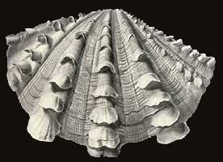

---
aliases:
- Bivalva
- Bivalve
- bivalves
- Bivalvia
- Bivalvo
- Bivalvos
- Chʼosh bitsʼaʼígíí
- Cragen ddeuglawr
- Daougleureged
- Duvalvulo
- Dvigeldžiai
- débhlaoscach
- gliemenes
- Ikki pallalilar
- kagylók
- Karbid
- Lakachu
- Lastúrniky
- małże
- Midyeler
- mlži
- Muschelen
- Muscheln
- Muslingar
- Muslinger
- Musseln
- Musslor
- Mymba ijyta mokõi
- Samlokur
- Siang-khak-kong
- simpukat
- skjell
- Thân mềm hai mảnh vỏ
- Tweekleppige
- tweekleppigen
- Twiiskaalagen
- Twêekleppign
- Ukab-ukab
- İkitaylılar
- školjkaši
- Školjke
- Δίθυρα
- двостулкові
- двустворчатые
- двухстворкавыя
- Ике кабырчыклы моллюсклар
- Ике ҡабырсаҡлы моллюскылар
- Кош капкалуу моллюскалар
- миди
- шкољке
- Школки
- Қосжақтаулы былқылдақденелілер
- երկփեղկանիներ
- צדפות
- ایکیتایلیلار
- دوکفهایها
- ذوات الصدفتين
- سپیاں
- पटलक्लोमी
- বাইভালভিয়া
- ਸਿੱਪੀਆਂ
- ఆల్చిప్ప
- ടാക്സോഡോണ്ട
- ชั้นไบวาลเวีย
- ကမာမျိုးနွယ်များ
- ორსაგდულიანები
- ᱡᱷᱤᱱᱩᱠ
- 二枚貝
- 双壳纲
- 雙殼綱
- 이매패류
has_id_wikidata: Q25368
title: Bivalvia
dv_has_:
  name_:
    af: Tweekleppige
    an: Bivalvia
    ar: ذوات الصدفتين
    arz: ذوات الصدفتين
    ast: Bivalvia
    az: İkitaylılar
    azb: ایکیتایلیلار
    ba: Ике ҡабырсаҡлы моллюскылар
    be: двухстворкавыя
    be-tarask: двухстворкавыя
    bg: миди
    bn: বাইভালভিয়া
    br: Daougleureged
    bs: Bivalvia
    ca: bivalves
    ceb: Ukab-ukab
    cs: mlži
    cy: Cragen ddeuglawr
    da: Muslinger
    de: Muscheln
    el: Δίθυρα
    en: Bivalvia
    eo: Duvalvulo
    es: Bivalvia
    et: Karbid
    eu: Bivalvia
    ext: Bivalvia
    fa: دوکفهایها
    fi: simpukat
    fr: Bivalvia
    frr: Twiiskaalagen
    ga: débhlaoscach
    gl: Bivalvos
    gn: Mymba ijyta mokõi
    he: צדפות
    hi: पटलक्लोमी
    hr: školjkaši
    hu: kagylók
    hy: երկփեղկանիներ
    ia: Bivalvia
    id: Bivalvia
    ie: Bivalvia
    io: Bivalvo
    is: Samlokur
    it: Bivalvia
    ja: 二枚貝
    jv: Bivalvia
    ka: ორსაგდულიანები
    kk: Қосжақтаулы былқылдақденелілер
    ko: 이매패류
    ky: Кош капкалуу моллюскалар
    la: Bivalvia
    lb: Muschelen
    lfn: Bivalva
    lt: Dvigeldžiai
    lv: gliemenes
    mk: Школки
    ml: ടാക്സോഡോണ്ട
    ms: Bivalvia
    mul: Bivalvia
    my: ကမာမျိုးနွယ်များ
    nan: Siang-khak-kong
    nb: skjell
    nds: Musseln
    nl: tweekleppigen
    nn: Muslingar
    nv: Chʼosh bitsʼaʼígíí
    oc: Bivalve
    pa: ਸਿੱਪੀਆਂ
    pap: Bivalvo
    pl: małże
    pnb: سپیاں
    pt: Bivalvia
    pt-br: Bivalvia
    qu: Lakachu
    ro: bivalve
    ru: двустворчатые
    sat: ᱡᱷᱤᱱᱩᱠ
    sco: Bivalvia
    sh: Školjke
    sk: Lastúrniky
    sl: školjke
    sq: Bivalvia
    sr: шкољке
    sv: Musslor
    te: ఆల్చిప్ప
    th: ชั้นไบวาลเวีย
    tl: Bivalvia
    tr: Midyeler
    tt: Ике кабырчыклы моллюсклар
    uk: двостулкові
    uz: Ikki pallalilar
    vec: Bivalvia
    vi: Thân mềm hai mảnh vỏ
    vls: Twêekleppign
    vo: Bivalvia
    war: Bivalvia
    wuu: 双壳纲
    yue: 雙殼綱
    zh: 双壳纲
    zh-cn: 双壳纲
    zh-hans: 双壳纲
    zh-tw: 雙殼綱
---
# [[Bivalvia]]

Mussels, clams, oysters, cockles, etc. 

 )) 

#is_/same_as :: [[../../../../../../WikiData/WD~Bivalvia,25368|WD~Bivalvia,25368]] 

## #has_/text_of_/abstract 

> **Bivalvia** or bivalves, in previous centuries referred to as the Lamellibranchiata and Pelecypoda, 
> is a class of aquatic molluscs (marine and freshwater) that have laterally compressed soft bodies 
> enclosed by a calcified exoskeleton consisting of a hinged pair of half-shells known as valves. 
> 
> As a group, bivalves have no head 
> and lack some typical molluscan organs such as the radula and the odontophore. 
> Their gills have evolved into ctenidia, specialised organs for feeding and breathing.
>
> Common bivalves include clams, oysters, cockles, mussels, scallops, and numerous other families that live in saltwater, as well as a number of families that live in freshwater. Majority of the class are benthic filter feeders that bury themselves in sediment, where they are relatively safe from predation. Others lie on the sea floor or attach themselves to rocks or other hard surfaces. Some bivalves, such as scallops and file shells, can swim. Shipworms bore into wood, clay, or stone and live inside these substances.
>
> The shell of a bivalve is composed of calcium carbonate, and consists of two, usually similar, parts called valves. These valves are for feeding and for disposal of waste. These are joined together along one edge (the hinge line) by a flexible ligament that, usually in conjunction with interlocking "teeth" on each of the valves, forms the hinge. This arrangement allows the shell to be opened and closed without the two halves detaching. The shell is typically bilaterally symmetrical, with the hinge lying in the sagittal plane. Adult shell sizes of bivalves vary from fractions of a millimetre to over a metre in length, but the majority of species do not exceed 10 cm (4 in).
>
> Bivalves have long been a part of the diet of coastal and riparian human populations. Oysters were cultured in ponds by the Romans, and mariculture has more recently become an important source of bivalves for food. Modern knowledge of molluscan reproductive cycles has led to the development of hatcheries and new culture techniques. A better understanding of the potential hazards of eating raw or undercooked shellfish has led to improved storage and processing. Pearl oysters (the common name of two very different families in salt water and fresh water) are the most common source of natural pearls. The shells of bivalves are used in craftwork, and the manufacture of jewellery and buttons. Bivalves have also been used in the biocontrol of pollution.
>
> Bivalves appear in the fossil record first in the early Cambrian more than 500 million years ago. The total number of known living species is about 9,200. These species are placed within 1,260 genera and 106 families. Marine bivalves (including brackish water and estuarine species) represent about 8,000 species, combined in four subclasses and 99 families with 1,100 genera. The largest recent marine families are the Veneridae, with more than 680 species and the Tellinidae and Lucinidae, each with over 500 species. The freshwater bivalves include seven families, the largest of which are the Unionidae, with about 700 species.
>
> [Wikipedia](https://en.wikipedia.org/wiki/Bivalvia) 

## Phylogeny 

-   « Ancestral Groups  
    -  [Mollusca](../Mollusca.md) 
    -  [Bilateria](../../Bilateria.md) 
    -  [Animals](../../../Animals.md) 
    -  [Eukarya](../../../../Eukarya.md) 
    -   [Tree of Life](../../../../Tree_of_Life.md)

-   ◊ Sibling Groups of  Mollusca
    -   [Chitons](Chitons.md)
    -   Bivalvia
    -  [Gastropoda](Gastropoda.md) 
    -  [Cephalopoda](Cephalopoda.md) 

-   » Sub-Groups 
	-   *Protobranchia*
	-   *Anomalodesmata*
	-   *Pteriomorphia*
	-   *Palaeoheterodonta*
	-   *Heterodonta*

## Title Illustrations

-------------------------------------------- 
 
scientific_name ::    Cardiidae
Comments            a cockle
Reference           Ernst Haeckel\'\'s Kunstformen der Natur published 1899-1904 by Verlag des Bibliographischen Instituts, Leipzig and Vienna.
Source Collection   [BioLib Online Library of Biological Books](http://www.biolib.de/)

-------------------------------------------- 
 
scientific_name ::    Tridacnidae
Comments            a giant clam
Reference           Ernst Haeckel\'\'s Kunstformen der Natur published 1899-1904 by Verlag des Bibliographischen Instituts, Leipzig and Vienna.
Source Collection   [BioLib Online Library of Biological Books](http://www.biolib.de/)

-------------------------------------------- 
 
scientific_name ::    Veneridae
Comments            a venus clam
Reference           Ernst Haeckel\'\'s Kunstformen der Natur published 1899-1904 by Verlag des Bibliographischen Instituts, Leipzig and Vienna.
Source Collection   [BioLib Online Library of Biological Books](http://www.biolib.de/)

## Confidential Links & Embeds: 

### #is_/same_as :: [[/_Standards/bio/bio~Domain/Eukarya/Animal/Bilateria/Mollusca/Bivalvia|Bivalvia]] 

### #is_/same_as :: [[/_public/bio/bio~Domain/Eukarya/Animal/Bilateria/Mollusca/Bivalvia.public|Bivalvia.public]] 

### #is_/same_as :: [[/_internal/bio/bio~Domain/Eukarya/Animal/Bilateria/Mollusca/Bivalvia.internal|Bivalvia.internal]] 

### #is_/same_as :: [[/_protect/bio/bio~Domain/Eukarya/Animal/Bilateria/Mollusca/Bivalvia.protect|Bivalvia.protect]] 

### #is_/same_as :: [[/_private/bio/bio~Domain/Eukarya/Animal/Bilateria/Mollusca/Bivalvia.private|Bivalvia.private]] 

### #is_/same_as :: [[/_personal/bio/bio~Domain/Eukarya/Animal/Bilateria/Mollusca/Bivalvia.personal|Bivalvia.personal]] 

### #is_/same_as :: [[/_secret/bio/bio~Domain/Eukarya/Animal/Bilateria/Mollusca/Bivalvia.secret|Bivalvia.secret]] 

