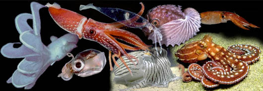

---
aliases:
  - Cephalopoda
title: Cephalopoda
---

# [[Cephalopoda]] 

Octopods, squids, nautiluses, etc. 

 

## #has_/text_of_/abstract 

> A cephalopod  is any member of the molluscan class **Cephalopoda**  (Greek plural κεφαλόποδες, kephalópodes; "head-feet") such as a squid, octopus, cuttlefish, or nautilus. These exclusively marine animals are characterized by bilateral body symmetry, a prominent head, and a set of arms or tentacles (muscular hydrostats) modified from the primitive molluscan foot. Fishers sometimes call cephalopods "inkfish", referring to their common ability to squirt ink. The study of cephalopods is a branch of malacology known as teuthology.
>
> Cephalopods became dominant during the Ordovician period, represented by primitive nautiloids. The class now contains two, only distantly related, extant subclasses: Coleoidea, which includes octopuses, squid, and cuttlefish; and Nautiloidea, represented by Nautilus and Allonautilus. In the Coleoidea, the molluscan shell has been internalized or is absent, whereas in the Nautiloidea, the external shell remains. About 800 living species of cephalopods have been identified. Two important extinct taxa are the Ammonoidea (ammonites) and Belemnoidea (belemnites). Extant cephalopods range in size from the 10 mm (0.3 in) Idiosepius thailandicus to the 700 kilograms (1,500 lb) heavy colossal squid, the largest extant invertebrate.
>
> [Wikipedia](https://en.wikipedia.org/wiki/Cephalopod) 

## Phylogeny 

-   « Ancestral Groups  
    -  [Mollusca](../Mollusca.md) 
    -  [Bilateria](../../Bilateria.md) 
    -  [Animals](../../../Animals.md) 
    -  [Eukarya](../../../../Eukarya.md) 
    -   [Tree of Life](../../../../Tree_of_Life.md)

-   ◊ Sibling Groups of  Mollusca
    -   [Chitons](Chitons.md)
    -  [Bivalvia](Bivalvia.md) 
    -  [Gastropoda](Gastropoda.md) 
    -   Cephalopoda

-   » Sub-Groups
    -   [Nautilidae](Nautilidae)
    -  [Coleoidea](Cephalopoda/Coleoidea.md) 
	-   *Endoceratoidea* †
	-   *Actinoceratoidea* †
	-   *Orthoceratoidea*
	    -   *[Nautiloidea](Nautilidae)*
	    -   *Ammonoidea* †
	    -   [Coleoidea](Cephalopoda/Coleoidea.md "go to ToL page"))*[ Bather,
	        1888] [(octopods, squids, cuttlefishes and their
	        relatives)]

## Title Illustrations

-   **Histioteuthis pacifica** Hawaii. (Photograph copyright ©1996, R. E. Young).
-   **Cirroteuthis magna** (?) off Hawaii (courtesy of Alex Malahoff; photograph copyright © 1996, Hawaii Undersea Research Laboratory).
-   **Octopus ornatus**, Great Barrier Reef (photograph copyright © 1996, Mark Norman).
-   **Argonauta nodosa** juvenile, 58 mm shell length, captured off Melbourne (photograph copyright © 1996, David Paul).
-   **Sepioloidea lineolata**, off south Australia (photograph copyright © 1998, Mark Norman).
-   **Iridoteuthis iris**, off Hawaii, about 18 mm ML (photograph copyright :: © 1996, Thomas Burch).
-   **Nototodarus hawaiiensis**, off Hawaii (photograph copyright © 1996, R. E. Young)
-   **Leachia pacifica**, off Hawaii (photograph copyright © 1996, R. E. Young)

--------------------------------------------------------------------------- 
) 
copyright ::   © 1996, 1996 (2), 1996 (3), 1996 (4), 1998 (5), 1996 (6), 1996 (7), 1996 (8) R. E. Young, Hawaii Undersea Research Laboratory (2), Mark Norman (3), David Paul (4), Mark Norman (5), Thomas Burch (6), R. E. Young (7), R. E. Young (8)

## Confidential Links & Embeds: 

### #is_/same_as :: [[/_Standards/bio/bio~Domain/Eukarya/Animal/Bilateria/Mollusca/Cephalopoda|Cephalopoda]] 

### #is_/same_as :: [[/_public/bio/bio~Domain/Eukarya/Animal/Bilateria/Mollusca/Cephalopoda.public|Cephalopoda.public]] 

### #is_/same_as :: [[/_internal/bio/bio~Domain/Eukarya/Animal/Bilateria/Mollusca/Cephalopoda.internal|Cephalopoda.internal]] 

### #is_/same_as :: [[/_protect/bio/bio~Domain/Eukarya/Animal/Bilateria/Mollusca/Cephalopoda.protect|Cephalopoda.protect]] 

### #is_/same_as :: [[/_private/bio/bio~Domain/Eukarya/Animal/Bilateria/Mollusca/Cephalopoda.private|Cephalopoda.private]] 

### #is_/same_as :: [[/_personal/bio/bio~Domain/Eukarya/Animal/Bilateria/Mollusca/Cephalopoda.personal|Cephalopoda.personal]] 

### #is_/same_as :: [[/_secret/bio/bio~Domain/Eukarya/Animal/Bilateria/Mollusca/Cephalopoda.secret|Cephalopoda.secret]] 

