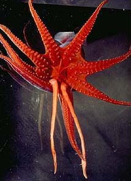
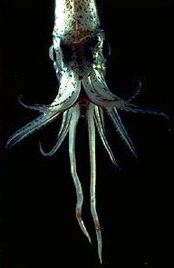
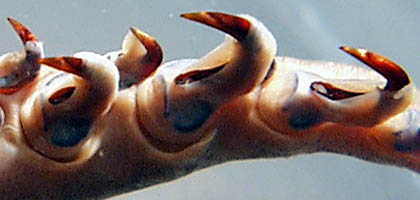
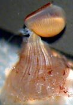
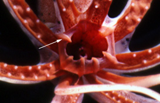
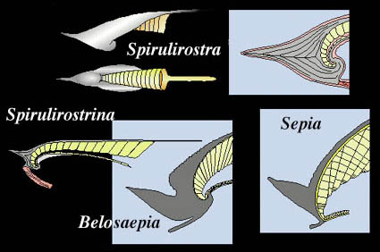

---
aliases:
  - Decapodiformes
title: Decapodiformes
---

# [[Decapodiformes]] 

Squids, cuttlefishes and their relatives 
) ) 

The Decapodiformes contains about 95 genera and 450 species in 31
families. Many of these families seem to form natural groups and these
are included below without formal names as the validity of the groups
has not yet been demonstrated by cladistic methods.

## #has_/text_of_/abstract 

> **Decapodiformes** is a superorder of Cephalopoda comprising all cephalopod species with ten limbs, specifically eight short arms and two long tentacles. It is hypothesized that the ancestral coleoid had five identical pairs of limbs, and that one branch of descendants evolved a modified arm pair IV to become the Decapodiformes, while another branch of descendants evolved and then eventually lost its arm pair II, becoming the Octopodiformes.
>
> [Wikipedia](https://en.wikipedia.org/wiki/Decapodiformes) 

## Introduction

[Richard E. Young, Michael Vecchione, and Katharina M. Mangold (1922-2003)]() 

The most distictive feature of decapods is the modification of the
fourth pair of arms into tentacles (see title photographs). In some
species these are long slender structures that are several times the
length of the body and probably function much like a fishing line. In
some others, they are short, muscular structures that can be quickly
extended (literally shot forward) to grasp prey then completely
retracted into pockets in the head.

The Decapodiformes includes species with a wide range of body forms and
habits. Muscular sepioids bury in the sand during the day; gelatinous
squids swim via slow jet propulsion in the deep-sea while in the same
habitat some squids with weak mantle muscles use large muscular fins for
swimming; surface-dwelling squid with powerful jet propulsion may
undertake migrations of a thousand miles and, when disturbed, dart from
the water and glide over the ocean surface like a flying fish. In size
they range from
*[**Idiosepius**](tree?group=Idiosepiidae&contgroup=Sepioid_families)*
with a mantle length of 8 mm at maturity to the giant squid
*[**Architeuthis**](tree?group=Architeuthis&contgroup=Decapodiformes)*
which reaches nearly 18 m in total length. Cephalopods are primarily
visual animals even though they possess lateral line analogs, very low
frequency hearing and olfaction. The dominance of the visual system is
particularly true of decapods. For example, the eye diameter of the
small
*[**Iridoteuthis**](tree?group=Iridoteuthis&contgroup=Sepiolidae)*
is over 40% of the mantle length and large squids have eyes that surpass
the eye-size of all other animals big or small. Among decapods, the
oegopsid squids characteristically produce small pelagic eggs and the
paralarvae develop in the near-surface plankton whereas myopsids and
sepioids have benthic eggs that often produce large demersal hatchlings.

The suckers of all decapods have horny rings. These rings often carry
sharp claw-like teeth and in some species these have been modified into
hooks. The advantages of hooks are uncertain. They could be designed for
sinking into soft-bodied prey, such as other squid, or they could act as
grappling hooks for hard-body spiny prey where suckers would be
ineffective (Young, *et al.*, 1999).
){width="420"}

**Figure**. Oral-lateral view of a portion of the tentacular club of a
preserved ***Ancistrocheirus lesueurii*** showing hooks with sheaths.
Photograph by R. Young.
### Characteristics

1.  Arms
    1.  Arms IV modified as tentacles (see title photographs).
    2.  Suckers bilaterally symmetrical.
    3.  Suckers horny rings present.
    4.  Suckers stalks with constricted necks.

       ){height="175" width="122"}
        **Figure**. Arm suckers. **Left** - Oral view of arm suckers of
        ***Sthenoteuthis oualaniensis***, preserved. The reddish,
        toothed portion is the inner horny ring; the yellow surrounding
        slats form the outer horny ring. **Right** - Lateral view of an
        arm sucker and stalk of ***Histioteuthis hoylei***, preserved.
        The skin has been removed from the sucker stalk to show its
        shape: a broad base tapering to a constricted neck where the
        stalk attaches to the sucker. Photographs by R. Young.

    5.  Arms IV without connecting web.\
        \
2.  Buccal crown
    1.  Buccal crown present.

       ){width="273"}
        **Figure**. Oral view of the brachial (=arm) crown surrounding
        the buccal crown of ***Histioteuthis*** sp. Arrow points to one
        of seven buccal supports of the buccal crown.

3.  Head
    1.  Statocyst with single capsule.
    2.  Superior and posterior buccal lobes widely separated.
    3.  Inferior frontal lobe system of brain absent.\
        \
4.  Photosensitive vesicles
    1.  Lie within cephalic cartilage.\
        \
5.  Fins
    1.  Present but without cartilagenous core.\
        \
6.  Viscera
    1.  Nidamental glands present.
    2.  Crop absent.
    3.  Oviducal glands bilaterally symmetrical.
    4.  Digestive gland duct appendages surrounded by nephridial coelom.
    5.  Nephridial coeloms fused

#### Comments

Comparisons of the major taxa within the Decapodiformes

  ------ --- ------------------ -----------
                   Cornea   Branchial canal   Buccal support suckers   Sucker circular muscle   Tentacle pocket   **Interstellate connective **
  Oegopsida        No       Yes               No                       No                       No                Yes 
  Bathyteuthoida   No       Yes               Yes                      No                       Yes               Yes 
  Myopsida         Yes      Yes               Yes/No                   Yes                      Yes               Yes 
  Idiosepiidae     Yes      No                No                       No                       Yes               ? 
  Spirulidae       No       No                No                       No                       Yes               No 
  Sepioidea        Yes      No                Yes/No                   Yes                      Yes               No 
  ------ --- ------------------ -----------

[A key to the families of the Decapodiformes can be found here.](http://www.mnh.si.edu/cephs/cephkeyintro.html)

### Discussion of Phylogenetic Relationships

At present we recognize four major lineages within the Decapodiformes
but the relationships between them are unresolved. Two additional taxa,
Bathyteuthoida and Idiosepiidae, which have subordinal rankings are
included here as their ordinal relationships are uncertain. The
Bathyteuthoida shows relationships with both the Oegopsida and the
Myopsida while the Idiosepiidae shows relationships with the Myopsida
and the Sepioidea. Among the orders, the Myopsida shows relationships
with both the Oegopsida and the Sepioidea and the Sepioidea and the
Spirulida show relationships.

Among the latter two orders, the closeness of the relationship is
uncertain. The Sepiidae of the Sepioidea and the Spirulidae of the
Spirulida have substantial fossil records and these records argue for a
close relationship between these two orders. In both cases, the presence
of an internal calcareous shell with a phragmocone, however, represents
the retention of an ancient and plesiomorphic character state, and does
not indicate that the animal is an early derivative of the decapod clade
or close relationships. The details of the shell structure do support a
close relationship.

***Spirula spirula***, the only living member of the Spirulida, is a
peculiar cephalopod that has stimulated much discussion regarding its
phylogenic position. While the relationships are still unresolved,
Young, *et al*. (1998) support its close relationship to the Sepiidae
and other sepioid families based on arguments mostly put forward by Naef
(1922). A cladistic study based on morphology has not been made.
)

**Figure**. Drawings from Young et al. (1998) modified from Naef (1922)
show the similarities between ***Spirulirostra**,* ***Spirulirostrina***
(fossil relatives of ***Spirula**)* and ***Belosaepia*** (a fossil
relative of ***Sepia**)* and ***Sepia**.* Note the gray-colored
\"guard-like sheath\" on all species illustrated (it forms the rostrum,
shield,etc. on the ***Sepia*** cuttlebone). The cuttlebone of
***Belosaepia*** lacks the cross-struts of the ***Sepia*** cuttlebone
and has distinct septa on the ventral side of the siphuncle. The
siphuncle is also more ventrally curved than in ***Sepia**.* The
presumed attachment of the mantle muscle (red) to the ventral process of
the sheath is shown in ***Spirulirostra*** and ***Spirulirostrina**.*
The mantle attaches similarly to the recurved ventral process of the
cuttlebones.

Both the spirulid and sepiid shells have a distinctive ventral curvature
of the apical end and the asymmetrical elaboration of the sheath that
includes such similarities as a rostrum and a ventral process (Young,
*et al*., 1998).
### Extinct clades

A large number of fossil species possessed a gladius but lacked a
phragmocone. They have been included by various authors in the
Decapodiformes and/or the Vampyromorpha. Resolution of their
relationships is badly needed (Young, *et al.*, 1999).

## Phylogeny 

-   « Ancestral Groups  
    -  [Coleoidea](../Coleoidea.md))
    -  [Cephalopoda](../../Cephalopoda.md))
    -  [Mollusca](../../../Mollusca.md))
    -  [Bilateria](../../../../Bilateria.md))
    -  [Animals](../../../../../Animals.md))
    -  [Eukarya](../../../../../../Eukarya.md))
    -   [Tree of Life](../../../../../../Tree_of_Life.md)

-   ◊ Sibling Groups of  Coleoidea
    -   Decapodiformes
    -  [Octopodiformes](Octopodiformes.md))

-   » Sub-Groups
    -  [Bathyteuthoida](Decapodiformes/Bathyteuthoida.md))
    -  [Idiosepiidae](Decapodiformes/Idiosepiidae.md))
    -  [Myopsida](Decapodiformes/Myopsida.md))
    -  [Oegopsida](Decapodiformes/Oegopsida.md))
    -  [Sepioidea](Decapodiformes/Sepioidea.md))
    -   [Spirula spirula](Spirula_spirula)

## Title Illustrations

-------------------------------------------------------------------------------)
Scientific Name ::  Histioteuthis
Location ::        Hawaii
View              Oral view showing eight arms and two tentacles
Copyright ::         © 1995 [Richard E. Young](http://www.soest.hawaii.edu/%7Eryoung/rey.html) 

-------------------------------------------------------------------------------)
Scientific Name ::  Pyroteuthis addolux
Location ::        Hawaii
View              Dorsal view showing eight arms and two tentacles
Copyright ::         © 1995 [Richard E. Young](http://www.soest.hawaii.edu/%7Eryoung/rey.html) 

## Confidential Links & Embeds: 

### #is_/same_as :: [Decapodiformes](/_Standards/bio/bio~Domain/Eukarya/Animal/Bilateria/Mollusca/Cephalopoda/Coleoidea/Decapodiformes.md) 

### #is_/same_as :: [Decapodiformes.public](/_public/bio/bio~Domain/Eukarya/Animal/Bilateria/Mollusca/Cephalopoda/Coleoidea/Decapodiformes.public.md) 

### #is_/same_as :: [Decapodiformes.internal](/_internal/bio/bio~Domain/Eukarya/Animal/Bilateria/Mollusca/Cephalopoda/Coleoidea/Decapodiformes.internal.md) 

### #is_/same_as :: [Decapodiformes.protect](/_protect/bio/bio~Domain/Eukarya/Animal/Bilateria/Mollusca/Cephalopoda/Coleoidea/Decapodiformes.protect.md) 

### #is_/same_as :: [Decapodiformes.private](/_private/bio/bio~Domain/Eukarya/Animal/Bilateria/Mollusca/Cephalopoda/Coleoidea/Decapodiformes.private.md) 

### #is_/same_as :: [Decapodiformes.personal](/_personal/bio/bio~Domain/Eukarya/Animal/Bilateria/Mollusca/Cephalopoda/Coleoidea/Decapodiformes.personal.md) 

### #is_/same_as :: [Decapodiformes.secret](/_secret/bio/bio~Domain/Eukarya/Animal/Bilateria/Mollusca/Cephalopoda/Coleoidea/Decapodiformes.secret.md)

