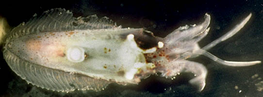

## Phylogeny 

-   « Ancestral Groups  
    -  [Decapodiformes](../Decapodiformes.md))
    -  [Coleoidea](../../Coleoidea.md))
    -  [Cephalopoda](../../../Cephalopoda.md))
    -  [Mollusca](../../../../Mollusca.md))
    -  [Bilateria](../../../../../Bilateria.md))
    -  [Animals](../../../../../../Animals.md))
    -  [Eukarya](../../../../../../../Eukarya.md))
    -   [Tree of Life](../../../../../../../Tree_of_Life.md)

-   ◊ Sibling Groups of  Decapodiformes
    -   Bathyteuthoida
    -  [Idiosepiidae](Idiosepiidae.md))
    -  [Myopsida](Myopsida.md))
    -  [Oegopsida](Oegopsida.md))
    -  [Sepioidea](Sepioidea.md))
    -   [Spirula spirula](Spirula_spirula)

-   » Sub-Groups
    -   [Bathyteuthis](Bathyteuthis)
    -   [Chtenopteryx](Chtenopteryx)

# Bathyteuthoida [Vecchione, Young and Sweeney, 2004] 

[Richard E. Young and Michael Vecchione](http://www.tolweb.org/)
)

-   *[Bathyteuthidae](Bathyteuthis)*[
    Pfeffer 1900]
-   *[Chtenopterygidae](Chtenopteryx)*[
    Grimpe 1922]

Containing group:[Decapodiformes](../Decapodiformes.md))

## Introduction

These are small mesopelagic to bathypelagic squids.

------------------------

#### Diagnosis

A decapodiform \...

-   with suckers on the buccal membrane.
-   without carpal locking-apparatus on tentacles.
-   with branchial canals in gills.

### Characteristics

1.  Arms
    1.  Suckers in four or more series at some point on arms I-III.
    2.  Suckers without circularis muscles.
2.  Tentacles
    1.  Club not divided into manus and dactylus.
    2.  Carpal locking-apparatus absent.
    3.  Club suckers in more than 7 irregular series.
    4.  Suckers without circularis muscles.
3.  Buccal crown
    1.  Buccal supports bear small suckers.

       ){height="200" width="269"}
        **Figure**. Side view of buccal crown and oral views of arms II
        and III of **Bathyteuthis berryi**. Arrows point to suckers on
        the buccal supports. Photograph by R. Young.

4.  Head
    1.  Head with tentacle pockets.
5.  Mantle
    1.  Mantle locking-apparatus reaches anterior mantle edge.
6.  Fins
    1.  Fins with posterior lobes.
7.  Shell
    1.  Shell a gladius with conus present in **Chtenopteryx** but
        absent in **Bathyteuthis**.
8.  Viscera
    1.  Gills with branchial canals.
    2.  Oviducts paired.
9.  Eggs
    1.  Egg masses unknown.

#### Comments

Buccal connectives attach to the ventral borders of Arms IV in the
Chtenopterygidae and to the dorsal borders in the Bathyteuthididae.
Suckers on the buccal supports are found in members of only four
families (Bathyteuthidae, Chtenopterygidae, Loliginidae, Sepiidae). The
suckers look much like the arm suckers but are much smaller.

### Discussion of Phylogenetic Relationships

The two genera that represent these families (**Bathyteuthis**,
**Cthenopteryx**) were, at one time, placed within the same family
(e.g., Naef, 1921) because they share a number of similar features. They
especially show strong similarities in the structure of the tentacular
clubs, the sucker arrangement on the arms and the morphology of their
gladii. Roper (1969) considered them to belong to separate families and
emphasized the differences in the attachment of the buccal crown to arms
IV. Others (e.g., Clarke, 1988) have considered them to be distantly
related. Their close relationship to one another, however, has been
confirmed by a molecular study (Carlini, 1998).

The relationship of the Bathyteuthoida to other groups is uncertain as
they share some characters with both the Oegopsida and the Myopsida.

### References

Clarke, M. R. (1988). Evolution of recent cephalopods \-- A brief
review. P. 331-313. In: Clarke, M. R. and E. R. Trueman (Eds.). The
Mollusca. Vol. 12. Paleontology and Neontology of Cephalopods. Academic
Press, New York. 355pp.

Carlini, D. B. The phylogeny of coleoid cephalopods inferred from
molecular evolutionary analyses of the cytochrome oxidase I, muscle
actin, and cytoplasmic actin genes. Ph.D. diss. Coll. William and Mary,
273 pp.

Naef, A. (1921/23). Cephalopoda. Fauna und Flora des Golfes von Neapel.
Monograph, no. 35. English translation: A. Mercado (1972). Israel
Program for Scientific Translations Ltd., Jerusalem, Israel. 863pp.,
IPST Cat. No. 5110/1,2.

Roper, C.F.E. 1969. Systematics and zoogeography of the worldwide
bathypelagic squid Bathyteuthis (Cephalopoda: Oegopsida). Bulletin of
the United States National Museum, 291:1-210.

## Title Illustrations

)

  ----------------
  Scientific Name ::  Bathyteuthis abyssicola
  Location ::        Antarctic waters
  Comments          Photographed in a shipboard aquarium.
  Copyright ::         © 1996 Edward McSweeny
  ----------------


  -------------------------------------------------------------------------------
  Scientific Name ::  Chtenopteryx sp.
  Location ::        Off Hawaii
  Comments          The visceral and ocular photophore are visible through the transparent mantle and head muscles.
  View              ventral
  Copyright ::         © 1996 [Richard E. Young](http://www.soest.hawaii.edu/%7Eryoung/rey.html) 
  -------------------------------------------------------------------------------

## Confidential Links & Embeds: 

### #is_/same_as :: [Bathyteuthoida](/_Standards/bio/bio~Domain/Eukarya/Animal/Bilateria/Mollusca/Cephalopoda/Coleoidea/Decapodiformes/Bathyteuthoida.md) 

### #is_/same_as :: [Bathyteuthoida.public](/_public/bio/bio~Domain/Eukarya/Animal/Bilateria/Mollusca/Cephalopoda/Coleoidea/Decapodiformes/Bathyteuthoida.public.md) 

### #is_/same_as :: [Bathyteuthoida.internal](/_internal/bio/bio~Domain/Eukarya/Animal/Bilateria/Mollusca/Cephalopoda/Coleoidea/Decapodiformes/Bathyteuthoida.internal.md) 

### #is_/same_as :: [Bathyteuthoida.protect](/_protect/bio/bio~Domain/Eukarya/Animal/Bilateria/Mollusca/Cephalopoda/Coleoidea/Decapodiformes/Bathyteuthoida.protect.md) 

### #is_/same_as :: [Bathyteuthoida.private](/_private/bio/bio~Domain/Eukarya/Animal/Bilateria/Mollusca/Cephalopoda/Coleoidea/Decapodiformes/Bathyteuthoida.private.md) 

### #is_/same_as :: [Bathyteuthoida.personal](/_personal/bio/bio~Domain/Eukarya/Animal/Bilateria/Mollusca/Cephalopoda/Coleoidea/Decapodiformes/Bathyteuthoida.personal.md) 

### #is_/same_as :: [Bathyteuthoida.secret](/_secret/bio/bio~Domain/Eukarya/Animal/Bilateria/Mollusca/Cephalopoda/Coleoidea/Decapodiformes/Bathyteuthoida.secret.md)

