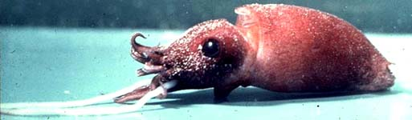
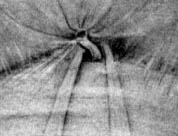
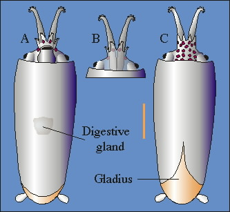
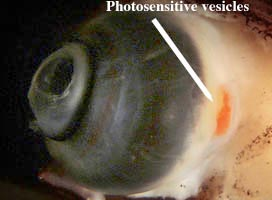

## Phylogeny 

-   « Ancestral Groups  
    -  [Bathyteuthoida](../Bathyteuthoida.md))
    -  [Decapodiformes](../../Decapodiformes.md))
    -  [Coleoidea](../../../Coleoidea.md))
    -  [Cephalopoda](../../../../Cephalopoda.md))
    -  [Mollusca](../../../../../Mollusca.md))
    -  [Bilateria](../../../../../../Bilateria.md))
    -  [Animals](../../../../../../../Animals.md))
    -  [Eukarya](../../../../../../../../Eukarya.md))
    -   [Tree of Life](../../../../../../../../Tree_of_Life.md)

-   ◊ Sibling Groups of  Bathyteuthoida
    -   Bathyteuthis
    -   [Chtenopteryx](Chtenopteryx)

-   » Sub-Groups
    -   [Bathyteuthis abyssicola](Bathyteuthis_abyssicola)
    -   [Bathyteuthis bacidifera](Bathyteuthis_bacidifera)
    -   [Bathyteuthis berryi](Bathyteuthis_berryi)

## Bathyteuthidae [Pfeffer 1900] 

# *Bathyteuthis* [Hoyle 1885] 

[Clyde F. E. Roper](http://www.tolweb.org/)
)

The family contains a single genus and the following three species:

-   *[Bathyteuthis     abyssicola](Bathyteuthis_abyssicola)*[
    Hoyle 1885]
-   *[Bathyteuthis     bacidifera](Bathyteuthis_bacidifera)*[
    Roper 1968]
-   *[Bathyteuthis     berryi](Bathyteuthis_berryi)*[ Roper
    1968]

Containing group:[Bathyteuthoida](../Bathyteuthoida.md))

## Introduction

Squids of the Bathyteuthidae are small, (less than 80 mm ML), compact
animals of the deep sea. They have a deep reddish maroon pigmentation,
short arms and somewhat tubular eyes directed anteriorly. The fins are
small, round and separate. A small photophore is embedded at the base of
each of the arms I-III. The **Bathyteuthis** species occupy the lower
mesopelagic to bathypelagic depth zones, and they are scattered
throughout the world's oceans.

------------------------

#### Diagnosis

A member of the bathyteuthid families \...

-   with buccal connectives attaching to dorsal border of arms IV.
-   with small, separate, paddle-like fins.

### Characteristics

1.  Arms
    a.  Arms short, joined by a low, fleshy web.
    b.  Arms I-III with 2 longitudinal series of suckers proximally,
        increasing to 4 series of irregularly placed suckers distally in
        adults.

         **Figure**. Oral view of brachial crown
        of **B. abyssicola**, Hawaiian waters. Suckers on the dorsal six
        arms are in two series at the base of each arm but merge into
        four series distally. Note the web between the arms. Photograph
        by R. Young.
    c.  Buccal connectives attach to dorsal border of arms IV.
2.  Tentacles
    a.  Tentacular club short, unexpanded, with 8-10 longitudinal series
        of numerous, minute suckers.
3.  Head
    a.  Eyes semitubular, anteriorly directed.

        **Figure**. Dorsal view of a 20 mm ML
        **B. abyssicola** showing forward-looking eyes and photophores
        (arrow) at the bases of the arms. Photograph by R. Young,
        R/V G. O. Sars, Mar-Eco cruise, North Atlantic.
4.  Funnel
    a.  mantle-funnel locking apparatus with a simple, straight ridge
        and groove.

        {vspace="50"} **Figure**. Left - Ventral view of
        Funnel locking-aparatus of **B. abyssicola** from Hawaiian
        waters. Photograph by R. Young. Right - Locking-apparatus of
        **B. bacidifera**. Ventral view of the funnel component on the
        left and dorsal view of the mantle component on the right.
        Drawing of from Roper (1968).
5.  Fins
    a.  Fins small, separate, round with anterior and posterior lobes.
6.  Photophores
    a.  Arms I-III with a single, simple photophore embedded in the
        subcutaneous aboral tissue at the bases (see Figure above).

#### Comments

Species of **Bathyteuthis** have a peculiar pore just anterior to the
funnel that lies between the embedded funnel adductor muscles. This pore
leads into a short canal that bifurcates then each branch ends blindly.
The function of this structure is unknown.
)\
**Figure**. Ventral view of suprafunnel canal.

### Nomenclature

**Bathyteuthis** was erected as a new genus by Hoyle (1885a) for a new
species of deep sea squid (**B. abyssicola**) captured from 2900 m
during the CHALLENGER Expedition. It was caught in the Southern Ocean,
Indian Ocean segment, between the subantarctic islands of Crozets Island
and Prince Edward Island. In the same year Verrill (1885) described a
new genus and species, **Benthoteuthis megalops**, captured the previous
year by the ALBATROSS in 1960 m off Martha's Vineyard, New England.

Neither author designated a family for these new genera. Hoyle (1885b)
immediately recognized that **Benthoteuthis** was a synonym of
**Bathyteuthis** (which had publication priority by 2 months), and he
mentioned in 1886 the possibility that the two species might be
conspecific. But it was not until 1900 that Pfeffer actually synonymized
**B. megalops** with **B. abyssicola** when he erected the Family
Bathyteuthidae.

The family also contained another unusual genus, **Chtenopteryx**, which
eventually was separated as a subfamily by Grimpe in 1922 and elevated
to family Chtenopterygidae by Allen (1945). Two additional species were
described in 1968 by Roper: **Bathyteuthis bacidifera** and
**Bathyteuthis berryi**, and the family was monographed by Roper (1969).

[A list of all nominal genera and species in the Bathyteuthidae can be found here](http://www.tolweb.org/accessory/Bathyteuthidae_Taxa?acc_id=1799).
The list includes the current status and type species of all genera, and
the current status, type repository and type locality of all species and
all pertinent references.

### Life History

The paralarva is easily recognized by the tentacle and arm IV bases that
extend well posterior to the bases of arms I-III. The position of the
digestive gland is well posterior to the cephalic cartilage but it is
not visible through the mantle of the preserved paralarva.
) **Figure**. A - Ventral view of the
paralarva of **B. abyssicola**. B - Ventral view of the head and
brachial crown with the funnel removed to show how far posteriorly the
bases of the tentacles and arms IV lie. The bases of arms I-III lie
anterior to the eyes. C- Dorsal view. Drawings of paralarva from
Hawaiian waters by R. Young. Bar = 1 mm.

### Unusual features

**Bathyteuthis** spp. have large, orange-colored photosensitive vesicles
just posterior to the forward-looking eye. The photosensitive vesicles
are extra-ocular photoreceptors that apparently monitor bioluminescent
light arising outside of the visual field, including the mantle cavity.
In the latter case, small, luminescent organisms inadvertently drawn
into the mantle cavity with the respiratory current could reveal the
presence of the squid to potential predators in the dark waters of the
deep-sea. The photosensitive vesicles of **Bathyteuthis** are among the
largest known in any cephalopod.
) **Figure**. Lateral view of the eye of **B.
abyssicola**, Hawaiian waters, with covering head tissue removed showing
the photosensitive vesicles located just posterior to the eye.
Photograph by R. Young.

### References

Allen, J. 1945. Planktonic cephalopod larvae from the eastern Australian
coast. Records of the Australian Museum, 21(6): 317-350.

Grimpe, G. 1922. Systematische Ubersicht der europaischen Cephalopoden.
Sber. Naturf. Ges. Leipzig, 45-48: 36-52.

Hoyle,W.E. 1885a. Narrative of the Voyage of the Challenger Expedition.
The Cephalopoda. Report on the Voyage of HMS Challenger (1873-1876), 1
(1): 269-274.

Hoyle, W.E. 1885b. Preliminary report on the Cephalopoda collected
during the cruise of HMS Challenger. The Decapoda. Proceedings of the
Royal Society of Edinburgh, 13(120):281-310.

Hoyle, W.E. 1886. Report on the Cephalopoda collected by HMS Challenger
during the years 1873-1876. Report on the Voyage of the Challenger,
Zoology, 16(44):1-346, 33 pls.

Pfeffer, G. 1900. Synopsis der oegopsiden Cephalopoden. Mitt.
Hamburgischen Zoologische Museum.17: 147-198.

Roper, C.F.E. 1968. Preliminary descriptions of two new species of the
bathypelagic squid *Bathyteuthis* (Cephalopoda: Oegopsida). Proceedings
of the Biological Society of Washington, 81:261-272.

Roper, C.F.E. 1969. Systematics and zoogeography of the worldwide
bathypelagic squid *Bathyteuthis* (Cephalopoda: Oegopsida). Bulletin of
the United States National Museum, 291:1-210.

Verrill, A.E. 1885. Third catalog of Mollusca recently added to the
fauna of the New England coast and the adjacent parts of the Atlantic,
consisting mostly of deep-sea species with notes on others previously
recorded. Transactions of the Connecticut Academy, 6(2): 395-452.

## Title Illustrations

)

  ----------------
  Scientific Name ::  Bathyteuthis abyssicola
  Location ::        Antarctic waters
  Comments          Photographed in a shipboard aquarium.
  Copyright ::         © 1996 Edward McSweeny
  ----------------

## Confidential Links & Embeds: 

### #is_/same_as :: [Bathyteuthidae](/_Standards/bio/bio~Domain/Eukarya/Animal/Bilateria/Mollusca/Cephalopoda/Coleoidea/Decapodiformes/Bathyteuthoida/Bathyteuthidae.md) 

### #is_/same_as :: [Bathyteuthidae.public](/_public/bio/bio~Domain/Eukarya/Animal/Bilateria/Mollusca/Cephalopoda/Coleoidea/Decapodiformes/Bathyteuthoida/Bathyteuthidae.public.md) 

### #is_/same_as :: [Bathyteuthidae.internal](/_internal/bio/bio~Domain/Eukarya/Animal/Bilateria/Mollusca/Cephalopoda/Coleoidea/Decapodiformes/Bathyteuthoida/Bathyteuthidae.internal.md) 

### #is_/same_as :: [Bathyteuthidae.protect](/_protect/bio/bio~Domain/Eukarya/Animal/Bilateria/Mollusca/Cephalopoda/Coleoidea/Decapodiformes/Bathyteuthoida/Bathyteuthidae.protect.md) 

### #is_/same_as :: [Bathyteuthidae.private](/_private/bio/bio~Domain/Eukarya/Animal/Bilateria/Mollusca/Cephalopoda/Coleoidea/Decapodiformes/Bathyteuthoida/Bathyteuthidae.private.md) 

### #is_/same_as :: [Bathyteuthidae.personal](/_personal/bio/bio~Domain/Eukarya/Animal/Bilateria/Mollusca/Cephalopoda/Coleoidea/Decapodiformes/Bathyteuthoida/Bathyteuthidae.personal.md) 

### #is_/same_as :: [Bathyteuthidae.secret](/_secret/bio/bio~Domain/Eukarya/Animal/Bilateria/Mollusca/Cephalopoda/Coleoidea/Decapodiformes/Bathyteuthoida/Bathyteuthidae.secret.md)

