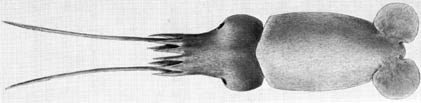

---
aliases:
  - bacidifera
title: Bathyteuthis bacidifera
---

## Phylogeny 

-   « Ancestral Groups  
    -   [Bathyteuthis](Bathyteuthis)
    -  [Bathyteuthoida](../../Bathyteuthoida.md) 
    -  [Decapodiformes](../../../Decapodiformes.md) 
    -  [Coleoidea](../../../../Coleoidea.md) 
    -  [Cephalopoda](../../../../../Cephalopoda.md) 
    -  [Mollusca](../../../../../../Mollusca.md) 
    -  [Bilateria](../../../../../../../Bilateria.md) 
    -  [Animals](../../../../../../../../Animals.md) 
    -  [Eukarya](../../../../../../../../../Eukarya.md) 
    -   [Tree of Life](../../../../../../../../../Tree_of_Life.md)

-   ◊ Sibling Groups of  Bathyteuthis
    -   [Bathyteuthis abyssicola](Bathyteuthis_abyssicola)
    -   Bathyteuthis bacidifera
    -   [Bathyteuthis berryi](Bathyteuthis_berryi)

-   » Sub-Groups 

# *Bathyteuthis bacidifera* [Roper 1968] 

[Clyde F. E. Roper]()
 

The holotype is located at the U.S. National Museum of Natural History,
Washington.

Containing group:[Bathyteuthidae](../Bathyteuthidae.md) 

## Introduction

**Bathyteuthis bacidifera** was described from a few specimens taken in
the Eastern Pacific Equatorial Water Mass, about 8° north and south of
the Equator off northern Peru and southern Equador. It is distinguished
from its sympatric congener, **B. abyssicola**, by the reduction of
protective membranes on the arms and the retention of the trabeculae as
free, finger like projections.

### Characteristics

1.  [Arms](http://www.tolweb.org/accessory/Bathyteuthis_bacidifera_Arms?acc_id=618)
    a.  Protective membranes reduced or absent; trabeculae free, fleshy,
        elongate, finger-like.
    b.  Arms short; tips blunt, not attenuate.
    c.  Arm suckers numerous, about 150 on each of arms I-III.
    d.  [Arm sucker         rings](http://www.tolweb.org/accessory/Bathyteuthis_bacidifera_Suckers_and_Tentacular_Clubs?acc_id=619)
        with 18-34 very closely packed, short, rounded to truncate teeth
        in the distal half grading to small, very closely packed (or
        touching) knobs in the proximal half.
2.  Tentacles
    a.  Tentacles and
        [clubs](http://www.tolweb.org/accessory/Bathyteuthis_bacidifera_Suckers_and_Tentacular_Clubs?acc_id=619)
        relatively long.
3.  Gills
    a.  Gills long, broad.

### Nomenclature

The nomenclatural history of **Bathyteuthis bacidifera** Roper, 1968 is
uncomplicated, as this species is so easily recognized, it occurs in a
region where the deep-sea fauna is not frequently sampled, and its
family was monographed shortly after the species was described (Roper,
1969).

### Life History

The smallest paralarva observed, 6 mm ML, has the diagnostic feature of
reduced protective membranes with free, finger-like trabeculae on the
proximal 1/2 to 2/3 of the arms.

### Distribution

The type locality is in the eastern South Pacific Ocean off northern
Peru.

**B. bacidifera** occurs in depths of 600-1550 m in the highly
productive waters of the Eastern Pacific Equatorial Water Mass and the
Indian Ocean Equatorial Water Mass. The significantly larger gills with
more lamellae in this species compared to other bathyteuthids,
correlates with its distribution which is associated with oxygen minimum
layers in the eastern tropical Pacific and equatorial Indian Oceans
(Roper, 1969).

### References

Roper, C.F.E. 1968. Preliminary descriptions of two new species of the
bathypelagic squid *Bathyteuthis* (Cephalopoda: Oegopsida). Proceedings
of the Biological Society of Washington, 81:261-272.

Roper, C.F.E. 1969. Systematics and zoogeography of the worldwide
bathypelagic squid *Bathyteuthis* (Cephalopoda: Oegopsida). Bulletin of
the United States National Museum, 291:1-210.

Verrill, A.E. 1885. Third catalog of Mollusca recently added to the
fauna of the New England coast and the adjacent parts of the Atlantic,
consisting mostly of deep-sea species with notes on others previously
recorded. Transactions of the Connecticut Academy, 6(2): 395-452.

## Title Illustrations

 

  ---------
  Copyright ::   © 1998 C. F. E. Roper
  ---------

## Confidential Links & Embeds: 

### #is_/same_as :: [[/_Standards/bio/bio~Domain/Eukarya/Animal/Bilateria/Mollusca/Cephalopoda/Coleoidea/Decapodiformes/Bathyteuthoida/Bathyteuthidae/bacidifera|bacidifera]] 

### #is_/same_as :: [[/_public/bio/bio~Domain/Eukarya/Animal/Bilateria/Mollusca/Cephalopoda/Coleoidea/Decapodiformes/Bathyteuthoida/Bathyteuthidae/bacidifera.public|bacidifera.public]] 

### #is_/same_as :: [[/_internal/bio/bio~Domain/Eukarya/Animal/Bilateria/Mollusca/Cephalopoda/Coleoidea/Decapodiformes/Bathyteuthoida/Bathyteuthidae/bacidifera.internal|bacidifera.internal]] 

### #is_/same_as :: [[/_protect/bio/bio~Domain/Eukarya/Animal/Bilateria/Mollusca/Cephalopoda/Coleoidea/Decapodiformes/Bathyteuthoida/Bathyteuthidae/bacidifera.protect|bacidifera.protect]] 

### #is_/same_as :: [[/_private/bio/bio~Domain/Eukarya/Animal/Bilateria/Mollusca/Cephalopoda/Coleoidea/Decapodiformes/Bathyteuthoida/Bathyteuthidae/bacidifera.private|bacidifera.private]] 

### #is_/same_as :: [[/_personal/bio/bio~Domain/Eukarya/Animal/Bilateria/Mollusca/Cephalopoda/Coleoidea/Decapodiformes/Bathyteuthoida/Bathyteuthidae/bacidifera.personal|bacidifera.personal]] 

### #is_/same_as :: [[/_secret/bio/bio~Domain/Eukarya/Animal/Bilateria/Mollusca/Cephalopoda/Coleoidea/Decapodiformes/Bathyteuthoida/Bathyteuthidae/bacidifera.secret|bacidifera.secret]] 

