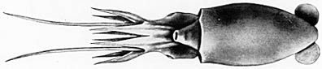

## Phylogeny 

-   « Ancestral Groups  
    -   [Bathyteuthis](Bathyteuthis)
    -  [Bathyteuthoida](../../Bathyteuthoida.md))
    -  [Decapodiformes](../../../Decapodiformes.md))
    -  [Coleoidea](../../../../Coleoidea.md))
    -  [Cephalopoda](../../../../../Cephalopoda.md))
    -  [Mollusca](../../../../../../Mollusca.md))
    -  [Bilateria](../../../../../../../Bilateria.md))
    -  [Animals](../../../../../../../../Animals.md))
    -  [Eukarya](../../../../../../../../../Eukarya.md))
    -   [Tree of Life](../../../../../../../../../Tree_of_Life.md)

-   ◊ Sibling Groups of  Bathyteuthis
    -   [Bathyteuthis abyssicola](Bathyteuthis_abyssicola)
    -   [Bathyteuthis bacidifera](Bathyteuthis_bacidifera)
    -   Bathyteuthis berryi

-   » Sub-Groups 

# *Bathyteuthis berryi* [Roper 1968] 

[Clyde F. E. Roper]()
)

The holotype is housed at the Santa Barbara Museum of Natural History,
California.

Containing group:[Bathyteuthidae](../Bathyteuthidae.md))

## Introduction

Several specimens of **Bathyteuthis** were discovered during a study of
the deep pelagic cephalopods off the coast of Southern California (see
Young, 1972). They were determined to be a new species based especially
on the extremely large number of suckers on arms I-III and the
proportionally longer, attenuate arms (Roper, 1968).

### Characteristics

1.  [Arms](http://www.tolweb.org/accessory/Bathyteuthis_berryi_Arms,_Tentacles,_Suckers?acc_id=623)
    a.  Protective membranes well developed and fleshy proximally,
        without free trabeculae.
    b.  Arms long; ends attenuate.
    c.  Arm suckers extremely numerous, about 275 on each of arms I-III.
    d.  Arm sucker rings with 10-14 very low, small, rounded or
        subtriangular, separated, knoblike teeth.
2.  [Tentacles](http://www.tolweb.org/accessory/Bathyteuthis_berryi_Arms,_Tentacles,_Suckers?acc_id=623)
    a.  Tentacles relatively long, robust; clubs short, unexpanded,
        undifferentiated.
3.  Gills
    a.  Gills long, broad.

### Nomenclature

The nomenclatural history of **B. berryi** is straightforward, because
it is the only bathyteuthid known in the eastern North Pacific Ocean off
North America. It has several distinguishing characters that make it
easy to identify.

### Life History

So few specimens of paralarvae and juveniles are known that little can
be said about the life history of the species. But the smallest
specimens available are identifiable to **B. berryi** by the greater
number of suckers and the longer attenuate arms in comparison with the
other 2 species. Also, the gills are proportionally larger than in **B.
abyssicola** (Roper, 1969).

### Distribution

The type locality is the Catalina Basin, south-southwest of Catalina
Island, off Southern California.

This species is bathypelagic at 800-1200 m (and probably much deeper) in
the eastern Pacific waters off Southern California (Young, 1972).

### References

Roper, C.F.E. 1968. Preliminary descriptions of two new species of the
bathypelagic squid Bathyteuthis (Cephalopoda: Oegopsida). Proceedings of
the Biological Society of Washington, 81:261-272.

Roper, C.F.E. 1969. Systematics and zoogeography of the worldwide
bathypelagic squid Bathyteuthis (Cephalopoda: Oegopsida). Bulletin of
the United States National Museum, 291:1-210.

Young, R. E. 1972. The systematics and areal distribution of pelagic
cephalopods from the seas off Southern California. Smithsonian
Contributions to Zoology, No. 97: 1-159

## Title Illustrations

)

  ---------
  Copyright ::   © 1998 C. F. E. Roper
  ---------

## Confidential Links & Embeds: 

### #is_/same_as :: [berryi](/_Standards/bio/bio~Domain/Eukarya/Animal/Bilateria/Mollusca/Cephalopoda/Coleoidea/Decapodiformes/Bathyteuthoida/Bathyteuthidae/berryi.md) 

### #is_/same_as :: [berryi.public](/_public/bio/bio~Domain/Eukarya/Animal/Bilateria/Mollusca/Cephalopoda/Coleoidea/Decapodiformes/Bathyteuthoida/Bathyteuthidae/berryi.public.md) 

### #is_/same_as :: [berryi.internal](/_internal/bio/bio~Domain/Eukarya/Animal/Bilateria/Mollusca/Cephalopoda/Coleoidea/Decapodiformes/Bathyteuthoida/Bathyteuthidae/berryi.internal.md) 

### #is_/same_as :: [berryi.protect](/_protect/bio/bio~Domain/Eukarya/Animal/Bilateria/Mollusca/Cephalopoda/Coleoidea/Decapodiformes/Bathyteuthoida/Bathyteuthidae/berryi.protect.md) 

### #is_/same_as :: [berryi.private](/_private/bio/bio~Domain/Eukarya/Animal/Bilateria/Mollusca/Cephalopoda/Coleoidea/Decapodiformes/Bathyteuthoida/Bathyteuthidae/berryi.private.md) 

### #is_/same_as :: [berryi.personal](/_personal/bio/bio~Domain/Eukarya/Animal/Bilateria/Mollusca/Cephalopoda/Coleoidea/Decapodiformes/Bathyteuthoida/Bathyteuthidae/berryi.personal.md) 

### #is_/same_as :: [berryi.secret](/_secret/bio/bio~Domain/Eukarya/Animal/Bilateria/Mollusca/Cephalopoda/Coleoidea/Decapodiformes/Bathyteuthoida/Bathyteuthidae/berryi.secret.md)

