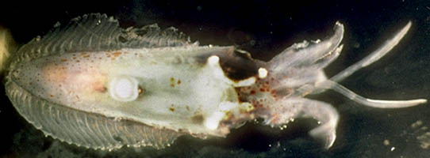
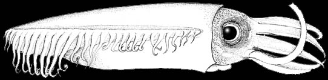
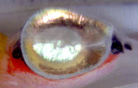
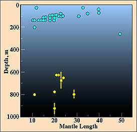

---
aliases:
  - Chtenopterygidae
title: Chtenopteryx
---

## Phylogeny 

-   « Ancestral Groups  
    -  [Bathyteuthoida](../Bathyteuthoida.md) 
    -  [Decapodiformes](../../Decapodiformes.md) 
    -  [Coleoidea](../../../Coleoidea.md) 
    -  [Cephalopoda](../../../../Cephalopoda.md) 
    -  [Mollusca](../../../../../Mollusca.md) 
    -  [Bilateria](../../../../../../Bilateria.md) 
    -  [Animals](../../../../../../../Animals.md) 
    -  [Eukarya](../../../../../../../../Eukarya.md) 
    -   [Tree of Life](../../../../../../../../Tree_of_Life.md)

-   ◊ Sibling Groups of  Bathyteuthoida
    -   [Bathyteuthis](Bathyteuthis)
    -   Chtenopteryx

-   » Sub-Groups
    -   [Chtenopteryx         canariensis](Chtenopteryx_canariensis)
    -   [Chtenopteryx         sepioloides](Chtenopteryx_sepioloides)
    -   [Chtenopteryx sicula](Chtenopteryx_sicula)

## Chtenopterygidae [Grimpe 1922] 

# *Chtenopteryx* [Appellof 1890]

## Combfin squid 

[Richard E. Young and Michael Vecchione]()

Three species are presently recognized in the family but more are known
to exist:

-   *[Chtenopteryx     canariensis](Chtenopteryx_canariensis)*[
    Salcedo-Vargas and Guerrero-Kommritz 2000]
-   *[Chtenopteryx     sepioloides](Chtenopteryx_sepioloides)*[
    Rancurel 1970]
-   *[Chtenopteryx     sicula](Chtenopteryx_sicula)*[
    (Verany 1851)]

Containing group:[Bathyteuthoida](../Bathyteuthoida.md) 

## Introduction

Members of this family are small, muscular, midwater squids that occupy
tropical to subtropical waters probably at depths of 500-1000m during
the day and near-surface waters at night. The posterior end of the
mantle is broadly rounded. The fins are peculiar: they consist of
muscular pillars (fin ribs) connected by thin membranes giving the
appearance of a comb (hence the family name). The fin extends nearly the
full length of the mantle.

A number of undescribed species are present in this genus. Little is
known of the biology of any species.

#### Diagnosis

A member of the bathyteuthid families \...

-   with buccal connectives attaching to ventral border of arms IV.
-   with long fins containing muscular ribs.

### Characteristics

1.  Arms
    1.  Dorsal six arms with suckers in six or more series at some point
        on arms.
    2.  Buccal connectives attach to the ventral margins of arms IV.\
2.  Tentacular club
    1.  Suckers in 8 or more irregular series.\
3.  Fins
    1.  Membranes connect slender muscle bundles (fin ribs) to produce
        comb-like appearance.
    2.  Fins attach to lateral walls of mantle.
    3.  Fins extend nearly full length of mantle.\
4.  Photophores
    1.  Large oval photophore on viscera (except in ***C. canariensis***
        and in ***C. sicula***).
    2.  Large photogenetic patches on eyeball (except in ***C.
        canariensis***).\
5.  Viscera
    1.  Females with an accessory nidamental gland.

#### Comments

Only a few species-level characters are known in ***Chtenopteryx***. At
present species are separated by (1) the maximum number of sucker series
on the arms and tentacular clubs, (2) the presence/absence of
photophores, (3) the size of the visceral photophore and (4) the mantle
width relative to the ML.
 

**Figure**. Photograph of the visceral photophore of ***Chtenopteryx***
sp., off Hawaii by R. E. Young. The visceral photophore present in some
species is constructed somewhat like a car headlight with double
reflectors. A silver central reflector bounces bioluminescent light back
into the photophore and onto the larger basal reflector which directs
the light out of the photophore. The red tissue beneath the photophore
is the digestive gland. The intestine is transparent and can barely be
seen passing over the surface of the photophore. In the title photograph
above, the visceral photophore is visible through the transparent
mantle.
### Nomenclature

Many authors have spelled the genus name for this taxon
\"**Ctenopteryx**.\" However, Bello and Giannuzzi-Savelli (1993)
documented that Appellof\'s original spelling (1890) was
\"**Chtenopteryx**.\" The spelling was changed by Joubin (1900) and this
change was solidified as an emendation by Pfeffer (1900) who decided
that the original spelling was in error because Appellof derived the
generic name from the Greek words for \"comb\" and \"wing.\" In addition
to pointing out that Pfeffer\'s emendation was unjustified, Bello and
Giannuzzi-Savelli (1993) noted that Guerra (1992) had found that the
Pfeffer/Joubin spelling is a junior homonym of **Ctenopteryx** Flach,
1889, a coleopteran subgenus. Therefore, although **Ctenopteryx** may
seem superficially to be the appropriate spelling for the squid genus,
the actual correct spelling is Appellof\'s original. Bello and
Giannuzzi-Savelli (1993) further petitioned the International Commission
on Zoological Nomenclature (ICZN) to place the name Chtenopterygidae
Grimpe, 1922 on the Official List of Family-Group Names in Zoology and
to place the name Ctenopterygidae Grimpe, 1922 on the Official List of
Rejected and Invalid Family-Group Names in Zoology as an incorrect
original spelling. These recommendations were accepted in ICZN Opinion
1793 (ICZN, 1995).

### Life History

[Members of the family have a very distinctive paralarva](http://www.tolweb.org/accessory/Chtenopteryx_Paralarva?acc_id=627).

### Behavior

Males of some species possess a large photophore that lies within the
shell sac. ***Chtenopteryx*** sp. in a shipboard aquarium has been
observed to produce a brilliant luminescent flash but the source of the
flash could not be determined (pers. obs.). It has been observed, in an
aquarium, to adjust the glowing visceral photophore in response to
changes in an overhead light (pers. obs.). This behavior is consistent
with counterillumination (concealment via matching the downwelling light
with bioluminescence) but the animal, in a horizontal attitude, did not
conceal itself effectively as the head and posterior third of the body
were relatively dark.

### Distribution

#### Vertical distribution

In Hawaiian waters relatively few captures were made during the daytime
but they suggest that ***Chtenopteryx* \"*sicula*\"** occupies depths
from about 600-1000 m while at night it migrates mostly into the upper
200m (Young, 1978).
){width="273"}

**Figure**. Vertical distribution of **C. \"sicula\"** in Hawaiian
waters. Captures were made with both open and opening/closing trawls.
Bars- fishing depth-range of opening/closing trawl. **Circle** - Modal
fishing depth for either trawl. **Square** - Middepth of tow while
fishing when no modal fishing depth was apparent. **Blue-filled
circles** - Night captures. **Yellow-filled circles** - Day captures.
Chart modified from Young (1978).

#### Geographical distribution

Species of ***Chtenopteryx*** are found throughout the tropical and
subtropical waters of the world\'s oceans (Nesis, 1982).

### References

Appellof, A. 1890. Teuthologische Beitrage. I. *Chtenopteryx* n.g.,
*Veranya sicula* Krohn. *Calliteuthis* Verrill. Bergens Museums
Aarsberetning. 1889(33):1-34.

Bello, G. and R. Giannuzzi-Savelli. 1993. Case 2874. *Chtenopteryx*
Appellof, 1890 (Mollusca, Cephalopoda): proposed confirmation as the
correct original spelling. Bulletin of Zoological Nomenclature.
50(4):270-272.

Guerra, A. 1992. Mollusca, Cephalopoda. Fauna Iberica, Vol. 1 327 pp.
Museo Nacional de Ciencias Naturales, CSIS, Madrid.

ICZN. 1995. OPINION 1793. *Chtenopteryx* Appellof, 1890 (Mollusca,
Cephalopoda):confirmed as the correct original spelling. Bulletin of
Zoological Nomenclature.52(1):96-97.

Joubin, L. 1900. Cephalopodes provenant des campagnes de la
Princesse-Alice (1891-1897). Resultats des Campagnes Scientifiques
accomplies sur son yacht par Albert Ier Prince Souverain de Monaco.
17:1-135.

Nesis, K. N. 1982. Abridged key to the cephalopod mollusks of the
world\'s ocean. 385+ii pp. Light and Food Industry Publishing House,
Moscow. (In Russian.). Translated into English by B. S. Levitov, ed. by
L. A. Burgess (1987), Cephalopods of the world. T. F. H. Publications,
Neptune City, NJ, 351pp.

Okutani, T. 1974. Epipelagic decapod cephalopods collected by
micronekton tows during the EASTROPAC expeditions, 1967-1968 (systematic
part). Bull. Tokai Reg. Fish. Res. Lab., 80: 29-118.

Pfeffer, G. 1900. Synopsis der oegopsiden Cephalopoden. Mitteilungen aus
dem Naturhistorischen Museum in Hamburg. 17:145-198.

## Title Illustrations



  -------------------------------------------------------------------------------
  Scientific Name ::  Chtenopteryx sp.
  Location ::        Off Hawaii
  Comments          The visceral and ocular photophore are visible through the transparent mantle and head muscles.
  View              ventral
  Copyright ::         © 1996 [Richard E. Young](http://www.soest.hawaii.edu/%7Eryoung/rey.html) 
 
  -------------------------------------------------------------------------------
 

  -------------------------------------------------------------------
  Scientific Name ::  Chtenopteryx sp.
  Location ::        eastern Tropical Pacific
  Reference         modified from Okutani, T. 1974. Epipelagic decapod cephalopods collected by micronekton tows during the EASTROPAC expeditions, 1967-1968 (systematic part). Bull. Tokai Reg. Fish. Res. Lab. 80:29-118.
  View              lateral
  -------------------------------------------------------------------

## Confidential Links & Embeds: 

### #is_/same_as :: [[/_Standards/bio/bio~Domain/Eukarya/Animal/Bilateria/Mollusca/Cephalopoda/Coleoidea/Decapodiformes/Bathyteuthoida/Chtenopterygidae|Chtenopterygidae]] 

### #is_/same_as :: [[/_public/bio/bio~Domain/Eukarya/Animal/Bilateria/Mollusca/Cephalopoda/Coleoidea/Decapodiformes/Bathyteuthoida/Chtenopterygidae.public|Chtenopterygidae.public]] 

### #is_/same_as :: [[/_internal/bio/bio~Domain/Eukarya/Animal/Bilateria/Mollusca/Cephalopoda/Coleoidea/Decapodiformes/Bathyteuthoida/Chtenopterygidae.internal|Chtenopterygidae.internal]] 

### #is_/same_as :: [[/_protect/bio/bio~Domain/Eukarya/Animal/Bilateria/Mollusca/Cephalopoda/Coleoidea/Decapodiformes/Bathyteuthoida/Chtenopterygidae.protect|Chtenopterygidae.protect]] 

### #is_/same_as :: [[/_private/bio/bio~Domain/Eukarya/Animal/Bilateria/Mollusca/Cephalopoda/Coleoidea/Decapodiformes/Bathyteuthoida/Chtenopterygidae.private|Chtenopterygidae.private]] 

### #is_/same_as :: [[/_personal/bio/bio~Domain/Eukarya/Animal/Bilateria/Mollusca/Cephalopoda/Coleoidea/Decapodiformes/Bathyteuthoida/Chtenopterygidae.personal|Chtenopterygidae.personal]] 

### #is_/same_as :: [[/_secret/bio/bio~Domain/Eukarya/Animal/Bilateria/Mollusca/Cephalopoda/Coleoidea/Decapodiformes/Bathyteuthoida/Chtenopterygidae.secret|Chtenopterygidae.secret]] 

