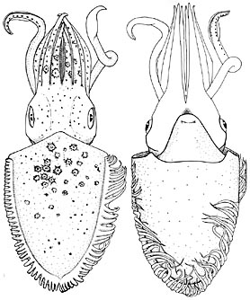
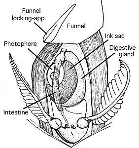

## Phylogeny 

-   « Ancestral Groups  
    -   [Chtenopteryx](Chtenopteryx)
    -  [Bathyteuthoida](../../Bathyteuthoida.md))
    -  [Decapodiformes](../../../Decapodiformes.md))
    -  [Coleoidea](../../../../Coleoidea.md))
    -  [Cephalopoda](../../../../../Cephalopoda.md))
    -  [Mollusca](../../../../../../Mollusca.md))
    -  [Bilateria](../../../../../../../Bilateria.md))
    -  [Animals](../../../../../../../../Animals.md))
    -  [Eukarya](../../../../../../../../../Eukarya.md))
    -   [Tree of Life](../../../../../../../../../Tree_of_Life.md)

-   ◊ Sibling Groups of  Chtenopteryx
    -   [Chtenopteryx         canariensis](Chtenopteryx_canariensis)
    -   Chtenopteryx sepioloides
    -   [Chtenopteryx sicula](Chtenopteryx_sicula)

-   » Sub-Groups 

# *Chtenopteryx sepioloides* [Rancurel 1970]

## Chubby combfin squid 

[Richard E. Young and Michael Vecchione]()
)

Containing group:[Chtenopterygidae](../Chtenopterygidae.md))

## Introduction

This species was described from a series of small squid (maximum size
was 19 mm ML) obtained from the stomach of the lancetfish **Alepisaurus
ferox**. In spite of its small size, the species was recognized as being
distinct by the presence of a relatively broad mantle and small visceral
photophore.

#### Diagnosis

A ***Ctenopteryx*** \...

-   with visceral and ocular photophores.
-   with arm suckers in up to 4 series.

### Characteristics

1.  Arms
    1.  Arms I-III with suckers in up to 4 series and about 50
        transverse rows.\
2.  Mantle
    1.  Mantle width 63-77% of ML.\
3.  Photophores
    1.  Oval photophore on viscera small, 2.5 by 1.75 mm in a 19 mm ML
        squid.
    2.  Large, ventral photogenetic patch on each eye; in small squid
        each patch consists of 5 lobes.

   )
    **Figure**. Ventral view of mantle-cavity viscera showing the small
    size of the visceral photophore, syntype, female, 19 mm ML. Drawing
    modified from Rancurel, 1970.

#### Comments

[More details of the description of ***C. sepioloides*** can be found here](http://www.tolweb.org/accessory/Chtenopteryx_sepioloides_Description?acc_id=635).

### Distribution

Squid were taken from the stomach of lancetfish captured at the
following localities: 27°07\'N, 178°16\'W; 19°30\'S, 133°15\'W and
18°02\'S, 136°17\'W.

### References

Rancurel, P. 1970. Les contenus stomacuax d'*Alepisaurus ferox* dans le
Sud-ouest Pacifique (cephalopodes). Cah. O.R.S.T.O.M., ser. Oceanogr.,
8: 3-87.

## Title Illustrations

)

  ------------------------------------------------------
  Scientific Name ::  Chtenopteryx sepioloides
  Reference         from Rancurel, P. 1970. Les contenus stomacuax d\'\'Alepisaurus ferox dans le Sud-ouest Pacifique (cephalopodes). Cah. O.R.S.T.O.M., ser. Oceanogr., 8:3-87.
  Sex ::             Female
  Size              19 mm ML
  Type              syntype
  ------------------------------------------------------

## Confidential Links & Embeds: 

### #is_/same_as :: [sepioloides](/_Standards/bio/bio~Domain/Eukarya/Animal/Bilateria/Mollusca/Cephalopoda/Coleoidea/Decapodiformes/Bathyteuthoida/Chtenopterygidae/sepioloides.md) 

### #is_/same_as :: [sepioloides.public](/_public/bio/bio~Domain/Eukarya/Animal/Bilateria/Mollusca/Cephalopoda/Coleoidea/Decapodiformes/Bathyteuthoida/Chtenopterygidae/sepioloides.public.md) 

### #is_/same_as :: [sepioloides.internal](/_internal/bio/bio~Domain/Eukarya/Animal/Bilateria/Mollusca/Cephalopoda/Coleoidea/Decapodiformes/Bathyteuthoida/Chtenopterygidae/sepioloides.internal.md) 

### #is_/same_as :: [sepioloides.protect](/_protect/bio/bio~Domain/Eukarya/Animal/Bilateria/Mollusca/Cephalopoda/Coleoidea/Decapodiformes/Bathyteuthoida/Chtenopterygidae/sepioloides.protect.md) 

### #is_/same_as :: [sepioloides.private](/_private/bio/bio~Domain/Eukarya/Animal/Bilateria/Mollusca/Cephalopoda/Coleoidea/Decapodiformes/Bathyteuthoida/Chtenopterygidae/sepioloides.private.md) 

### #is_/same_as :: [sepioloides.personal](/_personal/bio/bio~Domain/Eukarya/Animal/Bilateria/Mollusca/Cephalopoda/Coleoidea/Decapodiformes/Bathyteuthoida/Chtenopterygidae/sepioloides.personal.md) 

### #is_/same_as :: [sepioloides.secret](/_secret/bio/bio~Domain/Eukarya/Animal/Bilateria/Mollusca/Cephalopoda/Coleoidea/Decapodiformes/Bathyteuthoida/Chtenopterygidae/sepioloides.secret.md)

