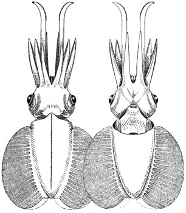
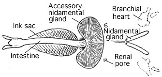
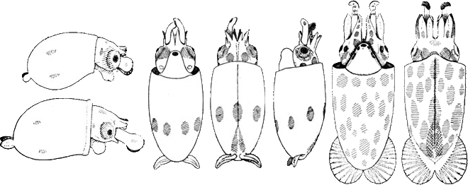

---
aliases:
  - sicula
title: Chtenopteryx sicula
---

## Phylogeny 

-   « Ancestral Groups  
    -   [Chtenopteryx](Chtenopteryx)
    -  [Bathyteuthoida](../../Bathyteuthoida.md) 
    -  [Decapodiformes](../../../Decapodiformes.md) 
    -  [Coleoidea](../../../../Coleoidea.md) 
    -  [Cephalopoda](../../../../../Cephalopoda.md) 
    -  [Mollusca](../../../../../../Mollusca.md) 
    -  [Bilateria](../../../../../../../Bilateria.md) 
    -  [Animals](../../../../../../../../Animals.md) 
    -  [Eukarya](../../../../../../../../../Eukarya.md) 
    -   [Tree of Life](../../../../../../../../../Tree_of_Life.md)

-   ◊ Sibling Groups of  Chtenopteryx
    -   [Chtenopteryx         canariensis](Chtenopteryx_canariensis)
    -   [Chtenopteryx         sepioloides](Chtenopteryx_sepioloides)
    -   Chtenopteryx sicula

-   » Sub-Groups 

# *Chtenopteryx sicula* [(Verany 1851)] 

[Richard E. Young and Michael Vecchione]()

Containing group:[Chtenopterygidae](../Chtenopterygidae.md) 

## Introduction

This is the type species of the genus. The type locality is off Messina,
Italy. The type is thought to be at the Museum National d\'Histoire
Naturelle, Nice (Sweeney and Roper, 1998). We have recently examined two
small squids from the Mediterranean Sea that do have the visceral
photophore in contrast to the description given by Naef below. As a
result, the identity of **C. sicula** remains uncertain as two species
appear to be present in the Mediterranean Sea.

#### Diagnosis

A ***Ctenopteryx*** \...

-   with ocular but without (?) visceral photophores.
-   with arm suckers in at least 4 series distally.
-   with club suckers in more than 8 series.

### Characteristics

1.  Arms
    1.  Formula: 4\>3\>2\>1.
    2.  Arms I-III with 2 sucker series proximally becoming at least 4
        series distally.\
2.  Tentacles
    1.  Club without keel or protective membranes (Naef\'s large
        specimen was damaged, this character has questionable validity).
    2.  Suckers of club in more than 8 series.\
3.  Photophores
    1.  Large photophore present on ventral surface of eye.
    2.  Visceral photophore absent (see illustration below), or
        present\*.

       )
        **Figure**. Ventral view of the viscera of ***C. sicula***,
        apparently the same specimen as in the title illustration,
        showing the absence of a visceral photophore and the presence of
        the accessory nidamental gland. Drawing modified from Naef,
        1921/23b.

        

        

#### Comments

A detailed description of this squid from the Mediterranean has not been
published to our knowledge. The description of Pfeffer (1912) was based
on squid of 13 mm ML and smaller. Joubin (1900) described a composite of
three squid of about 50 mm ML taken from the stomach of a dolphin caught
off Corsica. Unfortunately these specimens were in poor condition.
Earlier descriptions lacked detail. Naef, 1921-23a, made the most
detailed description of this species from squid captured off Naples. The
description presented here is based on his account.

\*We have examined a specimen of ***C. sicula*** from the Mediterranean
Sea that has the visceral photophore. There may be two species in the
Mediterranean going by the name ***C. sicula***, and we don\'t know
which is the true ***C. sicula***.

[More details of the description of ***C. sicula*** can be found here](http://www.tolweb.org/notes/?note_id=639).

### Nomenclature

***Chtenopteryx fimbriatus*** Appellof, 1890, (from off Messina,
Mediterranean Sea) ***Chtenopteryx cyprinoides*** Joubin, 1894 (from
Corsican waters, Messina, Mediterranean Sea stomach of a dolphin) and
***Chtenopteryx neuroptera*** Jatta, 1896 (from off Napels,
Mediterranean Sea) are considered synonyms of ***C. sicula*** by Pfeffer
(1912). We accept this view until it can be established that more than
one species of the genus is present in the Mediterranean Sea. Pfeffer
(1912) established a new form (***Chtenopteryx sicula*** forma
***chuni**)* based on a 7 mm ML squid described by Chun from the Indian
Ocean. The distinction was based on developmental differences in fin
length compared to Mediterranean specimens at similar sizes.

There is some confusion in the literature over the proper spelling of
the species name. The species was originally named as ***Sepioteuthis
sicula*** but the ending was emended by Pfeffer (1912) to ***siculus***
when he placed the species in ***Chtenopteryx***. Mike Sweeney checked
into this and replies, \"\...I just had a conversation with Ted Bayer.
Verany used ***sicula*** as an adjective for the ***Sepioteuthis*** of
Sicily. ***Chtenopteryx*** is feminine and therefore requires the
species ending as ***sicula*** (not ***siculus***).\"

### Life History

The paralarval stages are similar to those of other species of
***Chtenopteryx**.* Chromatophore differences, if present, have not been
identified as yet.
 

**Figure**. **Left** - Two very young paralarvae, ca. \...mm ML, side
view. The circular tentacular clubs have about 20 suckers, irregularly
arranged. Two chromatophores are present on each side of the mantle.
**Middle** - A more advanced paralarva, ca \... mm ML, ventral, dorsal
and side views. An equatorial circulet of 7 large yellow-brown
chromatophores is present on the mantle. Posteriorly the expanded vanes
of the gladius are visible in the dorsal view. **Right** - A even more
advanced paralarva, ca. \... mm ML, ventral and dorsal views. Drawings
and description of paralarvae paraphrased from Naef, 1921/23a.
### Distribution

#### Geographical distribution

Due to our poor understanding of the species-level systematics in this
genus, the presence of ***Chtenopteryx sicula*** outside of the
Mediterranean Sea is uncertain.

### References

Appellof, A. 1890. Teuthologische Beitrage. I. *Chtenopteryx* n.g.,
*Veranya sicula* Krohn. *Calliteuthis* Verrill. Bergens Museums
Aarsberetning. 1889(33):1-34.

Jatta, G. 1896. I Cefalopodi viventi nei Golfo di Napoli (Sistematica).
Fauna und Flora des Golfes von Neapel. 23: 268 pp.

Joubin, L. 1894. Note p;reliminaire sur les Cephalopodes provenents des
campagnes du Yacht, L\'Hirondelle. Memoires de la Societe Zoologique de
France, 7: 211-216.

Joubin, L. 1900. Cephalopodes provenant des campagnes de la
Princesse-Alice (1891-1897). Resultats des Campagnes Scientifiques
accomplies sur son yacht par Albert Ier Prince Souverain de Monaco.
17:1-135.

Naef, A. 1921-23a. Cephalopoda. Fauna und Flora des Golfes von Neapel.
Monograph, no. 35. English translation: A. Mercado (1972). Israel
Program for Scientific Translations Ltd., Jerusalem, Israel. 863pp.,
IPST Cat. No. 5110/1,2.

Naef, A. 1921-23b. Cephalopoda. Fauna e Flora de Golfo di Napoli.
Monograph, no. 35, 863 pp.

Pfeffer, G. 1912. Die Cephalopoden der Plankton-Expedition. Ergebnisse
der Plankton-Expedition der Humboldt-Stiftung. 2: 1-815.

Sweeney, M. J. and C. F. E. Roper. Classification, type localities and
type repositories of Recent Cephalopoda. Smithson. Contr. Zool., No. 586
(vol. II): 561-599.

## Title Illustrations

 

  -------------------------------------
  scientific_name ::  Chtenopteryx sicula
  location ::        off Naples
  Reference         modified from Naef, A. 1921-23b. Cephalopoda. Fauna e Flora de Golfo di Napoli. Monograph, no. 35, 863 pp.
  View              Dorsal and ventral
  -------------------------------------

## Confidential Links & Embeds: 

### #is_/same_as :: [[/_Standards/bio/bio~Domain/Eukarya/Animal/Bilateria/Mollusca/Cephalopoda/Coleoidea/Decapodiformes/Bathyteuthoida/Chtenopterygidae/sicula|sicula]] 

### #is_/same_as :: [[/_public/bio/bio~Domain/Eukarya/Animal/Bilateria/Mollusca/Cephalopoda/Coleoidea/Decapodiformes/Bathyteuthoida/Chtenopterygidae/sicula.public|sicula.public]] 

### #is_/same_as :: [[/_internal/bio/bio~Domain/Eukarya/Animal/Bilateria/Mollusca/Cephalopoda/Coleoidea/Decapodiformes/Bathyteuthoida/Chtenopterygidae/sicula.internal|sicula.internal]] 

### #is_/same_as :: [[/_protect/bio/bio~Domain/Eukarya/Animal/Bilateria/Mollusca/Cephalopoda/Coleoidea/Decapodiformes/Bathyteuthoida/Chtenopterygidae/sicula.protect|sicula.protect]] 

### #is_/same_as :: [[/_private/bio/bio~Domain/Eukarya/Animal/Bilateria/Mollusca/Cephalopoda/Coleoidea/Decapodiformes/Bathyteuthoida/Chtenopterygidae/sicula.private|sicula.private]] 

### #is_/same_as :: [[/_personal/bio/bio~Domain/Eukarya/Animal/Bilateria/Mollusca/Cephalopoda/Coleoidea/Decapodiformes/Bathyteuthoida/Chtenopterygidae/sicula.personal|sicula.personal]] 

### #is_/same_as :: [[/_secret/bio/bio~Domain/Eukarya/Animal/Bilateria/Mollusca/Cephalopoda/Coleoidea/Decapodiformes/Bathyteuthoida/Chtenopterygidae/sicula.secret|sicula.secret]] 

