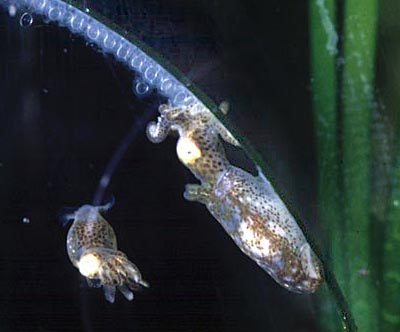

---
title: Idiosepiidae
---

## Phylogeny 

-   « Ancestral Groups  
    -  [Decapodiformes](../Decapodiformes.md))
    -  [Coleoidea](../../Coleoidea.md))
    -  [Cephalopoda](../../../Cephalopoda.md))
    -  [Mollusca](../../../../Mollusca.md))
    -  [Bilateria](../../../../../Bilateria.md))
    -  [Animals](../../../../../../Animals.md))
    -  [Eukarya](../../../../../../../Eukarya.md))
    -   [Tree of Life](../../../../../../../Tree_of_Life.md)

-   ◊ Sibling Groups of  Decapodiformes
    -  [Bathyteuthoida](Bathyteuthoida.md))
    -   Idiosepiidae
    -  [Myopsida](Myopsida.md))
    -  [Oegopsida](Oegopsida.md))
    -  [Sepioidea](Sepioidea.md))
    -   [Spirula spirula](Spirula_spirula)

-   » Sub-Groups 

# Idiosepiidae [Appellof, 1898]

## Pygmy squids 

[Katharina M. Mangold (1922-2003) and Richard E. Young]()
)

This family contains the single genus ***Idiosepius*** with about eight
species:

-   *Idiosepius biserialis*
-   *Idiosepius macrocheir*
-   *Idiosepius mimus (?)*
-   *Idiosepius notoides*
-   *Idiosepius picteti*
-   *Idiosepius paradoxus*
-   *Idiosepius pygmaeus*
-   *Idiosepius thailandicus*

Containing group:[Decapodiformes](../Decapodiformes.md))

## Introduction

This Idiosepiidae contains the smallest species within the Decapoda.
Males in some species mature at lengths of 6 mm ML and females at 8 mm
ML (Nesis, 1982/7). These cephalopods are elongate but have a rounded
posterior mantle and separate fins. A unique attachment organ is present
on the dorsal surface of the mantle which is used for attaching the
animal to seaweed. They are found in shallow water in the Indo-West
Pacific.

#### Diagnosis

A decapodiform \...

-   with an adhesive organ on the dorsal surface of the mantle.

### Characteristics

1.  Arms
    1.  Both arms IV hectocotylized.

       )
        **Figure**. **Top** - Dorsal view of ***Idiosepius*** sp.,
        preserved, with an enlargement of a portion of the dorsal
        adhesive organ showing the glandular (white reflection)
        epithelium. 12 mm ML, mature female, 05°27\'S, 134°27\'E. 
        Photograph by R. Young. **Bottom** -Side view of ***Idiosepius
        paradoxus*** in an aquarium attached by its adhesive organ to a
        blade of seagrass. Photograph by Takashi Kasugai, Port of Nagoya
        Public Aquarium.

    2.  Mantle not fused to head in nuchal region, but nuchal cartilage
        absent.
    3.  Mantle locking-apparatus does not reach anterior mantle margin.\
2.  Fins
    1.  Fins completely separate; with posterior lobes.\
3.  Shell
    1.  Shell a delicate gladius not reaching anterior or posterior ends
        of mantle.\
4.  Viscera
    1.  Right oviduct present but not functional.
    2.  Accessory nidamental glands present.
    3.  Gills without branchial canals.\
5.  Eggs
    1.  Eggs attach to substrate in flat masses.

### Nomenclature

[A list of all nominal genera and species in the Idiosepiidae can be found here](http://www.tolweb.org/accessory/Idiosepiidae_Taxa?acc_id=2329).
The list includes the current status and type species of all genera, the
current status, type repository and type locality of all species and all
pertinent references.

### Life History

 ***I. paradoxus*** spawns repeatedly in captivity. A single individual
may lay as many as 42 batches over a 70 day period (Kasugai, 2006).\
)\

**Figure**. Side view of a spawning female ***I. paradoxus*** in an
aquarium. The squid is attached to a blade of seagrass by its adhesive
organ and is attaching its eggs to the underside of the same blade.
Another ***I. paradoxus*** is swimming nearby, presumably a male.
Photograph by Takashi Kasugai.
### References

Kasugai, T. 2006. Spawning mode and reproductive output of the Japanese
pygmy squid *Idiosepius paradoxus* (Cephalopoda: Idiosepiidae). Program
and Abstract Book, CIAC \'06, Hobart Tasmania.

Nesis, K. N. 1982. Abridged key to the cephalopod mollusks of the
world\'s ocean. 385,ii pp. Light and Food Industry Publishing House,
Moscow. (In Russian.). Translated into English by B. S. Levitov, ed. by
L. A. Burgess (1987), Cephalopods of the world. T. F. H. Publications,
Neptune City, NJ, 351pp.

Voss, G. L. 1963. Cephalopoda of the Philippine Islands. Bull. U. S.
Nat. Mus., 234: 1-180.

## Title Illustrations

)

  ------------
  Scientific Name ::   Idiosepius notoides
  Location ::         off Australia
  Acknowledgements   provided by Mark Norman
  Copyright ::          © 1996 David Paul
  ------------
)

  ---------------------------------
  Scientific Name ::  Idiosepius pygmaeus
  Location ::        Off Philippine Islands
  Reference         Voss, G. L. 1963. Cephalopoda of the Philippine Islands. Bull. U. S. Nat. Mus., 234: 1-180.
  Sex ::             Male
  View              Dorsal and ventral
  Size              18 mm ML
  ---------------------------------

## Confidential Links & Embeds: 

### #is_/same_as ::[Idiosepiidae](Idiosepiidae.md)) 

### #is_/same_as :: [Idiosepiidae.public](/_public/bio/bio~Domain/Eukarya/Animal/Bilateria/Mollusca/Cephalopoda/Coleoidea/Decapodiformes/Idiosepiidae.public.md) 

### #is_/same_as :: [Idiosepiidae.internal](/_internal/bio/bio~Domain/Eukarya/Animal/Bilateria/Mollusca/Cephalopoda/Coleoidea/Decapodiformes/Idiosepiidae.internal.md) 

### #is_/same_as :: [Idiosepiidae.protect](/_protect/bio/bio~Domain/Eukarya/Animal/Bilateria/Mollusca/Cephalopoda/Coleoidea/Decapodiformes/Idiosepiidae.protect.md) 

### #is_/same_as :: [Idiosepiidae.private](/_private/bio/bio~Domain/Eukarya/Animal/Bilateria/Mollusca/Cephalopoda/Coleoidea/Decapodiformes/Idiosepiidae.private.md) 

### #is_/same_as :: [Idiosepiidae.personal](/_personal/bio/bio~Domain/Eukarya/Animal/Bilateria/Mollusca/Cephalopoda/Coleoidea/Decapodiformes/Idiosepiidae.personal.md) 

### #is_/same_as :: [Idiosepiidae.secret](/_secret/bio/bio~Domain/Eukarya/Animal/Bilateria/Mollusca/Cephalopoda/Coleoidea/Decapodiformes/Idiosepiidae.secret.md)

