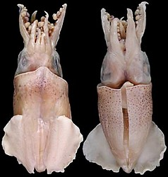
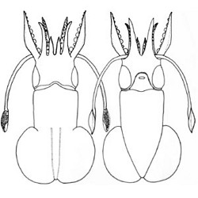
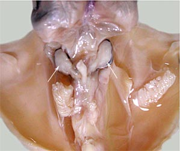
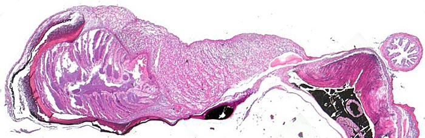

---
aliases:
  - Australiteuthidae
title: Australiteuthis aldrichi
---

## Phylogeny 

-   « Ancestral Groups  
    -  [Myopsida](../Myopsida.md) 
    -  [Decapodiformes](../../Decapodiformes.md) 
    -  [Coleoidea](../../../Coleoidea.md) 
    -  [Cephalopoda](../../../../Cephalopoda.md) 
    -  [Mollusca](../../../../../Mollusca.md) 
    -  [Bilateria](../../../../../../Bilateria.md) 
    -  [Animals](../../../../../../../Animals.md) 
    -  [Eukarya](../../../../../../../../Eukarya.md) 
    -   [Tree of Life](../../../../../../../../Tree_of_Life.md)

-   ◊ Sibling Groups of  Myopsida
    -   Australiteuthis aldrichi
    -  [Loliginidae](Loliginidae.md) 

-   » Sub-Groups 

## Australiteuthidae [Lu, 2005] 

# *Australiteuthis aldrichi* [Lu, 2005] 

[Chung Cheng Lu and Richard E. Young]()
))

Containing group:[Myopsida](../Myopsida.md) 

## Introduction

***Australiteuthis aldrichi*** was described from numerous specimens
collected from the inshore waters of Northern Australia. This is a dwarf
species, the largest squid described was a mature female of 27.6 mm ML.
The holotype is a mature male of 21.3 mm ML. The small squid has never
been observed alive.

#### Diagnosis:

A myopsid squid \...

-   with peculiar funnel locking-apparatus containing a boomerang-shaped
    groove.
-   with fins separated from one-another and with posterior lobes.
-   with dumbell-shaped photophore on ink sac.

### Characteristics

1.  Funnel
    1.  Funnel locking apparatus with subcircular shape and \"bisected
        by a boomerang-shaped groove running anteroposteriorly. Anterior
        wing of the boomerang-shaped groove deep, with wide anterior
        end, groove deepens and becomes slightly narrower posteriorly to
        form deep, broad pit. Pit becomes a narrow and shallow groove
        posteriorly and turns medially forming posterior limb of the
        boomerang, posterior end of groove slightly widened.\" (Lu,
        2005).\
    2.  Mantle component does not reach anterior mantle margin.
2.  Fins
    1.  Fins large, round, separate (length 47-63% of ML, width 80-104%
        of ML); separation at posterior end inconspicuous.\
    2.  Fins with free anterior and posterior lobes.

       ){width="299"}
        **Figure**. Photophore of ***A. aldirchi***, 22.3 mm ML, mature
        male. **A** - Ventral view of the mantle cavity with some
        viscera removed showing the two lobes of the photophore (arrows)
        and rectum between the lobes. **B** -

       )
        **Figure**. Histological section through one arm of the
        photophore. Note the inksac surrounding the photophore, the
        laminated structure (at the left) that presumably houses
        luminescent bacteria and the lens-like tissue (center top). At
        the far right is the rectum. Photograph from Lu (2005).Shell

#### Comments

[More details of the description can be found here.\ ](http://www.tolweb.org/notes/?note_id=3153)

### Distribution

Type locality: Joseph Bonaparte Gulf, Western Australia at 14°07.30S,
128°02.00\'E. In addition to Joseph Bonaparte Gulf, squids have been
collected from inshore waters near Darwin and Paupa New Giunea, which
suggests a rather broad distribution in shallow waters of this general
region.

### References

Lu, C. C. 2005. A new family of myopsid squid from Australasian waters
(Cephalopoda: Teuthida). P. 71-82. In: Chotiyaputta, C., E. M. C.
Hatfield and C. C. Lu (editors). Cephalopod biology, recruitment and
culture. International Cephalopod Symposium and Workshop, 17-21 Feb.
2003. Research Bulletin, Phyuket Marine Biological Center, No. 66, 365
pp.

## Title Illustrations

)

  -------------------------------------------------------------------------
  Scientific Name ::     Australiteuthis aldrichi
  Location ::           Off northern Australia
  Specimen Condition   Preserved
  Sex ::                Male
  View                 Dorsal, ventral
  Size                 21.3 mm ML
  Type                 Holotype
  Copyright ::            © [Chung Cheng Lu](mailto:cclu@dragon.nchu.edu.tw) 
 
  -------------------------------------------------------------------------
)

  -------------------------------------------------------------------------
  Scientific Name ::     Australiteuthis aldrichi
  Location ::           Off northern Australia
  Specimen Condition   Preserved
  Sex ::                Male
  Life Cycle Stage ::     Mature
  View                 Dorsal, ventral
  Size                 21.3 mm ML
  Type                 Holotype
  Copyright ::            © [Chung Cheng Lu](mailto:cclu@dragon.nchu.edu.tw) 
 
  -------------------------------------------------------------------------

## Confidential Links & Embeds: 

### #is_/same_as :: [[/_Standards/bio/bio~Domain/Eukarya/Animal/Bilateria/Mollusca/Cephalopoda/Coleoidea/Decapodiformes/Myopsida/Australiteuthidae|Australiteuthidae]] 

### #is_/same_as :: [[/_public/bio/bio~Domain/Eukarya/Animal/Bilateria/Mollusca/Cephalopoda/Coleoidea/Decapodiformes/Myopsida/Australiteuthidae.public|Australiteuthidae.public]] 

### #is_/same_as :: [[/_internal/bio/bio~Domain/Eukarya/Animal/Bilateria/Mollusca/Cephalopoda/Coleoidea/Decapodiformes/Myopsida/Australiteuthidae.internal|Australiteuthidae.internal]] 

### #is_/same_as :: [[/_protect/bio/bio~Domain/Eukarya/Animal/Bilateria/Mollusca/Cephalopoda/Coleoidea/Decapodiformes/Myopsida/Australiteuthidae.protect|Australiteuthidae.protect]] 

### #is_/same_as :: [[/_private/bio/bio~Domain/Eukarya/Animal/Bilateria/Mollusca/Cephalopoda/Coleoidea/Decapodiformes/Myopsida/Australiteuthidae.private|Australiteuthidae.private]] 

### #is_/same_as :: [[/_personal/bio/bio~Domain/Eukarya/Animal/Bilateria/Mollusca/Cephalopoda/Coleoidea/Decapodiformes/Myopsida/Australiteuthidae.personal|Australiteuthidae.personal]] 

### #is_/same_as :: [[/_secret/bio/bio~Domain/Eukarya/Animal/Bilateria/Mollusca/Cephalopoda/Coleoidea/Decapodiformes/Myopsida/Australiteuthidae.secret|Australiteuthidae.secret]] 

