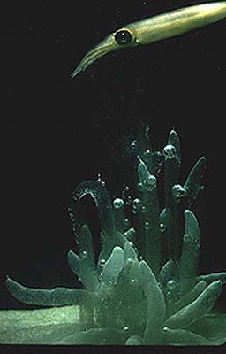
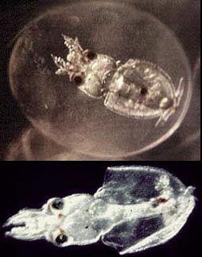

---
aliases:
  - Loliginidae
title: Loliginidae
---

## Phylogeny 

-   « Ancestral Groups  
    -  [Myopsida](../Myopsida.md) 
    -  [Decapodiformes](../../Decapodiformes.md) 
    -  [Coleoidea](../../../Coleoidea.md) 
    -  [Cephalopoda](../../../../Cephalopoda.md) 
    -  [Mollusca](../../../../../Mollusca.md) 
    -  [Bilateria](../../../../../../Bilateria.md) 
    -  [Animals](../../../../../../../Animals.md) 
    -  [Eukarya](../../../../../../../../Eukarya.md) 
    -   [Tree of Life](../../../../../../../../Tree_of_Life.md)

-   ◊ Sibling Groups of  Myopsida
    -   [Australiteuthis         aldrichi](Australiteuthis_aldrichi)
    -   Loliginidae

-   » Sub-Groups
    -  [Loligo](Loliginidae/Loligo.md) 
    -   [Afrololigo mercatoris](Afrololigo_mercatoris)
    -  [Alloteuthis](Loliginidae/Alloteuthis.md) 
    -  [Doryteuthis](Loliginidae/Doryteuthis.md) 
    -   [Heterololigo bleekeri](Heterololigo_bleekeri)
    -  [Loliolus](Loliginidae/Loliolus.md) 
    -  [Lolliguncula](Loliginidae/Lolliguncula.md) 
    -  [Pickfordiateuthis](Loliginidae/Pickfordiateuthis.md) 
    -  [Sepioteuthis](Loliginidae/Sepioteuthis.md) 
    -  [Uroteuthis](Loliginidae/Uroteuthis.md) 

# Loliginidae [Lesueur, 1821] 

[Michael Vecchione]()

At present the Loliginidae is divided into ten genera with 42 nominal
species. The generic affinities of three species currently are not
resolved.

Containing group:[Myopsida](../Myopsida.md) 

## Introduction

The family Loliginidae includes many species that are important in
trophic systems, fisheries, and biomedical studies. Brakoniecki (1996)
merged the Pickfordiateuthidae with the Loliginidae.

Loliginids are mostly neritic squids (i.e., they occupy waters over the
continental shelves). Most are very muscular, \"squid-like\" in
appearance and range in size from about 3 to 100 cm ML. All members of
the family have a cornea that covers the lens of each eye. Among
decapods, this feature is shared with all members of the Sepioidea but
is absent in all oegopsid squids. Loliginids differ from sepioids in
having a gladius that extends the full length of the mantle and a gill
that (except in ***Pickfordiateuthis***) has a branchial canal.

#### Diagnosis

A myposid \...

-   with straight funnel locking-apparatus.
-   with mantle locking-apparatus reaching mantle margin.

### Characteristics

\

1.  Buccal crown
    1.  buccal supports usually bear suckers.\
        \
2.  Funnel
    1.  Funnel locking-apparatus with a straight groove.\
        \
3.  Mantle
    1.  Mantle locking-apparatus reaches anterior mantle margin.\
        \
4.  Fins
    1.  Fins usually joined posteriorly and, except
        ***Pickfordiateuthis***, without posterior lobes.\
        \
5.  Viscera
    1.  Bacterial photophores on viscera present or absent. If present,
        form single, apparently unconnected, pair.\
        \
6.  Egg masses
    1.  Egg masses, where known, attached to substrate and with eggs
        organized in finger-like masses.

#### Generic characters

Characters that Vecchione et al. (1998) agreed were of generic
importance within the Loliginidae include:

1.  Fins.
    1.  lateral.
    2.  terminal.\
        \
2.  Tail-like extension of the posterior mantle.
    1.  extends beyond fins.
    2.  fins along sides to posterior tip.
    3.  absent.\
        \
3.  Eggs.
    1.  large (longest axis \>5mm).
    2.  small (longest axis \<4mm).\
        \
4.  Arm-sucker rings, proximal margin.
    1.  semicrescent plate.
    2.  square teeth.
    3.  pointed teeth.\
        \
5.  Arm-sucker rings, distal margin.
    1.  square teeth.
    2.  pointed teeth.\
        \
6.  Hectocotylus, ventral row of suckers.
    1.  reduction of suckers and elongation of sucker stalks along
        modified portion of arm to form papillae.
    2.  ventral crest formed by fusion of the protective membrane with
        ventral row of papillae such that original form of conical
        papillae is completely obscured.
    3.  unmodified.\
        \
7.  Hectocotylus, proximal region.
    1.  suckers and/or stalks modified.
    2.  unmodified.\
        \
8.  Photophores on ventral ink sac.
    1.  one pair present.
    2.  absent.\
        \
9.  Spermatophore, cement body.
    1.  short.
    2.  long.

#### Comments

The morphology of the gladius, as used formerly to distinguish the genus
***Doryteuthis***, is no longer considered to be of generic importance,
although it is important at the specific level (see also Alexeyev,
1989). The gladius is quite variable, both within and among species, and
could be highly adaptive in response to differences in swimming
behavior. Other traditional characters that Vecchione et al. (1998)
consider too variable to be of use in the generic systematics of the
Loliginidae include spermatophore deposition site, presence of suckers
on the buccal lappets, adult chromatophore patterns (e.g. lateral
\"flame stripes\"), and presence of a longitudinal mid-ventral ridge on
the mantle. 

Although the preliminary generic classification of Vecchione et al.
(1998) represented an important step toward consensus on the genera of
this family, subsequent analyses of DNA sequences (Anderson 2000) have
indicated that a holophyletic classification requires recognician of
generic-level species groups defined primarily on distributional
characteristics.

### Nomenclature

Lesueur (1821) erected a family that he called Loligoidea (afterwards
emended to Loliginidae, see Vecchione et al., 1998) to fit the
\"Loligos\" (***Leachia***, ***Loligo*** and ***Onykia***) into
Cuvier\'s \"natural order\". He stated (Lesueur, 1821:88)\--

\"It is of little consequence what characters we select for the
distribution of these animals into families and genera, if our
arrangement is the most convenient, and exhibits, as near as possible, a
graded transition from one to the other.\"

A consequence of the age of this family and its early inclusion of all
squids is that many taxa, both correctly and incorrectly described, have
been considered loliginids at one time or another. [A summary of this history is found here](http://www.tolweb.org/accessory/Loliginid_Nomenclatural_History?acc_id=1306).
Therefore, taxonomic nomenclature in the squid literature can be very
confusing.

A thorough nomenclatural review of the family can be found in Sweeney
and Vecchione (1998).

[A list of all nominal genera and species in the Loliginidae can be found here](http://www.tolweb.org/notes/?note_id=2326). The list
includes the current status and type species of all genera, and the
current status, type repository and type locality of all species and all
pertinent references.

### Discussion of Phylogenetic Relationships

The systematics of the myopsid squid family Loliginidae have long been
in disorder. In addition to many problems with differentiation of
species, loliginid systematics have been hampered throughout the past
several decades by the presence of two systems of generic-level
classification. The differences between these two systems primarily
involved a question of the importance of gladius structure at the
generic level. Both systems have been used widely in the scientific
literature, although many authors consistently qualified their use by
stating that the family was badly in need of revision based upon a
worldwide review.

Three separate morphological revisions have been completed (Natsukari,
1984b; Brakoniecki, 1986; Alexeyev, 1991); all concluded that a correct
generic-level classification of the family is radically different from
either of the previous classifications. Unfortunately, these new
classifications also differed substantially from each other, were
presented in unpublished dissertations and not widely disseminated, and
none has gained full acceptance.

Obviously, the existence of five contrasting systems of classification
can cause hopeless confusion to researchers studing these squids, in
addition to obfuscating real relationships among the species. Species
groupings into subgenera and genera have been based only on similarity.
In a workshop publication, Vecchione et al. (1998), recognized six
genera. Four of the genera are divided into subgenera:
***Lolliguncula*** (***Lolliguncula*** and ***Loliolopsis***);
***Uroteuthis*** (***Uroteuthis*** and ***Photololigo***);
***Loliolus*** (***Loliolus*** and ***Nipponololigo***); ***Loligo***
(***Loligo*** and ***Alloteuthis***). The generic affinities of several
species were unresolved.

A follow-up workshop consensus on generic and sub-generic taxonomy of
the family was published by Vecchione et al. (2005), based primarily on
the phylogenetic research of Anderson (1996; 2000a; 2000b) and Alexeyev
(1989; 1991).  Both of those authors built upon the previous workshop
proceedings.  The most noteworthy differences in Vecchione et al. (2005)
from the classification of Vecchione et al. (1998) include the
following: (1) removal of ***mercatoris*** from ***Lolliguncula*** based
primarily on gladius characters, DNA sequence data and biogeography, and
recognition of ***Afrololigo*** Brakoniecki as a valid genus for this
species; (2) elevation of ***Alloteuthis*** Wülker from sub-generic to
full generic status based on gladius structure and DNA sequence data;
(3) removal of American species from the genus ***Loligo*** because DNA
sequence analyses indicate that ***Loligo*** sensu Vecchione et al. is
probably paraphyletic. The generic name with priority for the American
species is ***Doryteuthis*** Naef. This genus further comprises two
natural subgroups based on differences in gladius and hectocotylus
structure; these subgroups are considered here to be the subgenera
***Doryteuthis*** Naef and ***Amerigo*** Brakoniecki. ***Doryteuthis
sanpaulensis*** does not belong in either of these subgenera and is
therefore considered to be the sole recognized species in an undescribed
subgenus; (4) removal of ***bleekeri*** from ***Loligo*** and
recognition of ***Heterololigo*** Natsukari as a valid genus based on
DNA sequence analysis; (5) removal of ***noctiluca*** from subgenus
***Uroteuthis*** of genus ***Uroteuthis*** and recognition of
***Aestuariolus*** Alexeyev as a valid monotypic subgenus of
***Uroteuthis*** primarily because of differences in photophore
structure from the rest of the genus.

### Life History

The egg masses typically are groups of finger-like gelatinous masses
containing a few to many eggs each often woven together and always
attached to the ocean floor.\
){height="323" hspace="3" width="254"}

**Figure**. **Left** - Side view of an egg mass of a loliginid that has
been pulled out of its anchor in the sand, found at low tide off San
Felipe, Baja California. Note the root like anchors at the bottom of the
picture. Photograph by Mike Lang. **Right** - Ventral views of a late
embryo within the swollen egg chorion, and a recently hatched paralarva
of ***Loligo pealeii***. Photographed by Clyde Roper.\

### References

Anderson, F.E. 1996. Preliminary Cladistic Analyses of Relationships
Among Loliginid Squids (Cephalopoda: Myopsida) Based on Morphological
Data. American Malacological Bulletin, 12: 113-128.

Anderson, F.E. 2000a. Phylogeny and Historical Biogeography of the
Loliginid Squids (Mollusca: Cephalopoda) Based on Mitochondrial DNA
Sequence Data. Molecular Phylogenetics and Evolution 15: 191-214.

Anderson, F. E. 2000b. Phylogenetic relationships among loliginid squids
(Cephalopoda: Myopsida) based on analyses of multiple data sets.
Zoological Journal of the Linnean Society 130:603-633.

Alexeyev, D.O. 1989. Advantages and limitations of using the gladius in
diagnosis of species and genera of the family Loliginidae (Cephalopoda).
Zoologichesky Zhurnal, 68(6):36-42.

Alexeyev, D.O. 1991. Systematics, phylogeny, propogation, biology and
business perspectives of the squid Myopsida. Dissertation, Academy of
Science USSR, P.P. Shirshov Institute of Oceanology.

Brakoniecki, T.F. 1986. A Generic Revision of the Family Loliginidae
(Cephalopoda; Myopsida) Based Primarily on the Comparative Morphology of
the Hectocotylus. Ph.D. Dissertation, University of Miami, Miami, FL,
USA. 163 pages.

Brakoniecki, T. F. 1996. A revision of the genus **Pickfordiateuthis**
Voss, 1953 (Cephalopoda; Myopsida). Bull. Mar. Sci. 58: 9-28.

Lesueur, C.A. 1821. Descriptions of Several New Species of Cuttle-fish.
Journal of the Academy of Natural Sciences of Philadelphia, 2(1):86-101.

Natsukari, Y. 1984b. Morphological and Taxonomical Studies on the Family
Loliginidae Steenstrup, 1861 (Cephalopoda: Mollusca). Ph.D.
Dissertation, University of Kyushu, Japan. 288 pages, 16 plates.

Sweeney, M. J. and M. Vecchione. 1998. Generic and specific names
introduced in the squid family Loliginidae (Cephalopoda: Myopsida).
Smithson. Contr. Zool., 586

Vecchione, M., T. F. Brakoniecki, Y. Natsukari and R. T. Hanlon. 1998. A
provisional generic classification of the family Loliginidae. Smithson.
Contr. Zool., 586

Vecchione, M., E. Shea, S. Bussarawit, F. Anderson, D. Alexeyev, C.-C.
Lu, T. Okutani, M. Roeleveld, C. Chotiyaputta, C. Roper, E. Jorgensen,
and N. Sukramongkol. 2005. Systematics of Indo-West Pacific Loliginids.
Phuket Mar. Biol. Center. Res. Bull. 66:23-36

## Title Illustrations

)

  ---------------------------------------------------------------------------
  Scientific Name ::     Loliginidae
  Comments             Loliginid swimming near egg mass
  Specimen Condition   Live Specimen
  Copyright ::            © 1996 [Clyde F. E. Roper](mailto:roper.clyde@nmnh.si.edu) 
 
  ---------------------------------------------------------------------------

## Confidential Links & Embeds: 

### #is_/same_as :: [[/_Standards/bio/bio~Domain/Eukarya/Animal/Bilateria/Mollusca/Cephalopoda/Coleoidea/Decapodiformes/Myopsida/Loliginidae|Loliginidae]] 

### #is_/same_as :: [[/_public/bio/bio~Domain/Eukarya/Animal/Bilateria/Mollusca/Cephalopoda/Coleoidea/Decapodiformes/Myopsida/Loliginidae.public|Loliginidae.public]] 

### #is_/same_as :: [[/_internal/bio/bio~Domain/Eukarya/Animal/Bilateria/Mollusca/Cephalopoda/Coleoidea/Decapodiformes/Myopsida/Loliginidae.internal|Loliginidae.internal]] 

### #is_/same_as :: [[/_protect/bio/bio~Domain/Eukarya/Animal/Bilateria/Mollusca/Cephalopoda/Coleoidea/Decapodiformes/Myopsida/Loliginidae.protect|Loliginidae.protect]] 

### #is_/same_as :: [[/_private/bio/bio~Domain/Eukarya/Animal/Bilateria/Mollusca/Cephalopoda/Coleoidea/Decapodiformes/Myopsida/Loliginidae.private|Loliginidae.private]] 

### #is_/same_as :: [[/_personal/bio/bio~Domain/Eukarya/Animal/Bilateria/Mollusca/Cephalopoda/Coleoidea/Decapodiformes/Myopsida/Loliginidae.personal|Loliginidae.personal]] 

### #is_/same_as :: [[/_secret/bio/bio~Domain/Eukarya/Animal/Bilateria/Mollusca/Cephalopoda/Coleoidea/Decapodiformes/Myopsida/Loliginidae.secret|Loliginidae.secret]] 

