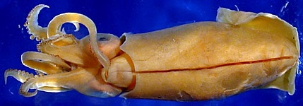

## Phylogeny 

-   « Ancestral Groups  
    -  [Loliginidae](../Loliginidae.md))
    -  [Myopsida](../../Myopsida.md))
    -  [Decapodiformes](../../../Decapodiformes.md))
    -  [Coleoidea](../../../../Coleoidea.md))
    -  [Cephalopoda](../../../../../Cephalopoda.md))
    -  [Mollusca](../../../../../../Mollusca.md))
    -  [Bilateria](../../../../../../../Bilateria.md))
    -  [Animals](../../../../../../../../Animals.md))
    -  [Eukarya](../../../../../../../../../Eukarya.md))
    -   [Tree of Life](../../../../../../../../../Tree_of_Life.md)

-   ◊ Sibling Groups of  Loliginidae
    -  [Loligo](Loligo.md))
    -   Afrololigo mercatoris
    -  [Alloteuthis](Alloteuthis.md))
    -  [Doryteuthis](Doryteuthis.md))
    -   [Heterololigo bleekeri](Heterololigo_bleekeri)
    -  [Loliolus](Loliolus.md))
    -  [Lolliguncula](Lolliguncula.md))
    -  [Pickfordiateuthis](Pickfordiateuthis.md))
    -  [Sepioteuthis](Sepioteuthis.md))
    -  [Uroteuthis](Uroteuthis.md))

-   » Sub-Groups 

## *Afrololigo* [Brakoniencki 1986] 

# *Afrololigo mercatoris* [(Adam, 1941)] 

[Michael Vecchione]()
)

A single species is presently recognized in ***Afrololigo***.

Type species. \-- ***Lolliguncula mercatoris*** Adam, 1941 by original
designation.

Containing group:[Loliginidae](../Loliginidae.md))

## Introduction

***A. mercatoris*** is a small species with females reaching 5 cm ML and
males 3.5 cm ML. In general appearance it resembles species of
***Lolliguncula*** and ***Loliolus***. ***A. mercatoris*** is known only
from the west African coast.

#### Diagnosis

A loliginid \...

-   with short mantle, rounded posteriorly; fins wider than long but
    without posterior lobes.
-   without a ventral crest on the hectocotylus.
-   with distribution restricted to waters off West Africa.

### Characteristics

Arms

Arms I extremely short compared to other arms.

Arm sucker rings with square, plate-like teeth around entire margin.

Suckers on mid-sections of lateral arms of males greatly enlarged.

Many of the morphological characters of ***Afrololigo mercatoris*** are
shared with species of ***Lolliguncula***, the genus in which it was
originally described. DNA sequence analysis by Anderson (2000) supports
Brakoniecki\'s (1986) conclusion that ***Afrololigo*** is a distinct
genus.

### Distribution

Eastern central Atlantic: limited to the west coast of Africa from Rio
de Oro (Mauritania) to Lüderitz Bay (Namibia).

### References

Anderson, F.E. 2000. Phylogeny and Historical Biogeography of the
Loliginid Squids (Mollusca: Cephalopoda) Based on Mitochondrial DNA
Sequence Data. Molecular Phylogenetics and Evolution 15: 191-214.

Brakoniecki, T.F. 1986. A Generic Revision of the Family Loliginidae
(Cephalopoda; Myopsida) Based Primarily on the Comparative Morphology of
the Hectocotylus. Ph.D. Dissertation, University of Miami, Miami, FL,
USA. 163 pages.

Vecchione, M., E. Shea, S. Bussarawit, F. Anderson, D. Alexeyev, C.-C.
Lu, T. Okutani, M. Roeleveld, C. Chotiyaputta, C. Roper, E. Jorgensen
and N. Sukramongkol. 2005. Systematics of Indo-West Pacific loliginids.
Phuket Mar. Biol. Cent. Res. Bull. 66: 23-26.

## Title Illustrations

)

  ------------------------------------------------------------------------------
  Scientific Name ::     Afrololigo mercatoris
  Location ::           04°06\'N, 05°58\'E
  Specimen Condition   Preserved
  Sex ::                Female
  View                 Ventral
  Copyright ::            © [Richard E. Young](http://www.soest.hawaii.edu/%7Eryoung/rey.html) 
  ------------------------------------------------------------------------------
::::::::::::::::::::::

## Confidential Links & Embeds: 

### #is_/same_as :: [Afrololigo](/_Standards/bio/bio~Domain/Eukarya/Animal/Bilateria/Mollusca/Cephalopoda/Coleoidea/Decapodiformes/Myopsida/Loliginidae/Afrololigo.md) 

### #is_/same_as :: [Afrololigo.public](/_public/bio/bio~Domain/Eukarya/Animal/Bilateria/Mollusca/Cephalopoda/Coleoidea/Decapodiformes/Myopsida/Loliginidae/Afrololigo.public.md) 

### #is_/same_as :: [Afrololigo.internal](/_internal/bio/bio~Domain/Eukarya/Animal/Bilateria/Mollusca/Cephalopoda/Coleoidea/Decapodiformes/Myopsida/Loliginidae/Afrololigo.internal.md) 

### #is_/same_as :: [Afrololigo.protect](/_protect/bio/bio~Domain/Eukarya/Animal/Bilateria/Mollusca/Cephalopoda/Coleoidea/Decapodiformes/Myopsida/Loliginidae/Afrololigo.protect.md) 

### #is_/same_as :: [Afrololigo.private](/_private/bio/bio~Domain/Eukarya/Animal/Bilateria/Mollusca/Cephalopoda/Coleoidea/Decapodiformes/Myopsida/Loliginidae/Afrololigo.private.md) 

### #is_/same_as :: [Afrololigo.personal](/_personal/bio/bio~Domain/Eukarya/Animal/Bilateria/Mollusca/Cephalopoda/Coleoidea/Decapodiformes/Myopsida/Loliginidae/Afrololigo.personal.md) 

### #is_/same_as :: [Afrololigo.secret](/_secret/bio/bio~Domain/Eukarya/Animal/Bilateria/Mollusca/Cephalopoda/Coleoidea/Decapodiformes/Myopsida/Loliginidae/Afrololigo.secret.md)

