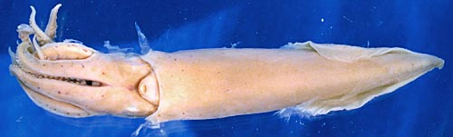
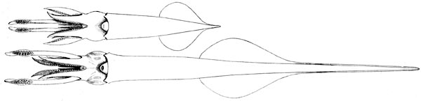

## Phylogeny 

-   « Ancestral Groups  
    -  [Loliginidae](../Loliginidae.md))
    -  [Myopsida](../../Myopsida.md))
    -  [Decapodiformes](../../../Decapodiformes.md))
    -  [Coleoidea](../../../../Coleoidea.md))
    -  [Cephalopoda](../../../../../Cephalopoda.md))
    -  [Mollusca](../../../../../../Mollusca.md))
    -  [Bilateria](../../../../../../../Bilateria.md))
    -  [Animals](../../../../../../../../Animals.md))
    -  [Eukarya](../../../../../../../../../Eukarya.md))
    -   [Tree of Life](../../../../../../../../../Tree_of_Life.md)

-   ◊ Sibling Groups of  Loliginidae
    -  [Loligo](Loligo.md))
    -   [Afrololigo mercatoris](Afrololigo_mercatoris)
    -   Alloteuthis
    -  [Doryteuthis](Doryteuthis.md))
    -   [Heterololigo bleekeri](Heterololigo_bleekeri)
    -  [Loliolus](Loliolus.md))
    -  [Lolliguncula](Lolliguncula.md))
    -  [Pickfordiateuthis](Pickfordiateuthis.md))
    -  [Sepioteuthis](Sepioteuthis.md))
    -  [Uroteuthis](Uroteuthis.md))

-   » Sub-Groups 

# *Alloteuthis* [Wulker, 1920] 

[Michael Vecchione]()

***Alloteuthis*** contains three species.

Type species. \-- ***Loligo media*** Linnè, 1758 by original designation
of Naef in an unpublished manuscript cited by Wulker \[see Vecchione et
al. (1998)\].

Containing group:[Loliginidae](../Loliginidae.md))

## Introduction

Small loliginids of the eastern Atlantic.\

#### Diagnosis

A loliginid \...

-   with posterior mantle elongated as a tail-like structure; fins
    longer than broad.
-   with a small conus someetimes apparent on gladius.
-   with an Eastern Atlantic distribution

### Characteristics

Arms

1.  Hectocotylus:
    1.  Ventral crest absent.
    2.  Proximal suckers unmodified.
    3.  Proximal region with 10 - 12 (usually 11) normal suckers in
        ventral series followed distally by papillae.

   )
    **Figure**. Ventral view of ***A. subulata*** showing dimorphism in
    the relative sizes and shapes of mature males. **Top** - Small male
    which we presume to be a sneaker male (sneakers are known in ***L.
    reynauldii*** - Hanlon, et al., 2002). **Bottom** - Large male with
    elongate tail. Females are approximately the same size and shape as
    the small male. Drawings from Naef (1921-3).

2.  Fins
    1.  Fins reach posterior tip of mantle.
    2.  Fins heart-shaped, lateral angles rounded, posterior borders
        concave, extending posteriorly along tail.\
        \
3.  Photophores
    1.  Photophores absent.\
        \
4.  Viscera
    1.  Eggs small.
    2.  Spermatophore with small cement gland.

#### Comments:

***Alloteuthis*** is morphologically very similar to ***Loligo*** and
was considered by Vecchione et al. (1998) to be a subgenus.  However,
molecular analyses by Anderson (2000) indicate that ***Alloteuthis***
should be a separate genus. This supports earlier inferences by Naef
(1921-23) and Alexeyev (1989) that the presence of a gladial conus in
***Alloteuthis*** should be considered a generic character. The conus in
***Alloteuthis*** would clearly separate the genera but it can be very
difficult to find and in some ***Alloteuthis*** specimens may be reduced
until it is essentially absent. The posterior tip of the mantle in
***Alloteuthis*** is elongate into a tail-like structure that tends to
be more pointed than in ***Loligo***.  This is particularly true for
males but identification of this character state can be subjective in
females.

### Distribution

Eastern Atlantic Ocean from about 55°-60°N to 20°S.

### References

Anderson, F.E. 2000. Phylogeny and Historical Biogeography of the
Loliginid Squids (Mollusca: Cephalopoda) Based on Mitochondrial DNA
Sequence Data. Molecular Phylogenetics and Evolution 15: 191-214.

Alexeyev, D.O. 1989. Advantages and limitations of using the gladius in
diagnosis of species and genera of the family Loliginidae (Cephalopoda).
Zoologichesky Zhurnal, 68(6):36-42.

Naef, A. 1921-1923. Die Cephalopoden. Fauna e Flora del Golfo di Napoli,
Monographie 35, Vol I, Parts I and II, Systematik, pp 1-863.

Vecchione, M., T. F. Brakoniecki, Y. Natsukari and R. T. Hanlon. 1998. A
provisional generic classification of the family Loliginidae. Smithson.
Contr. Zool., 586.

Vecchione, M., E. Shea, S. Bussarawit, F. Anderson, D. Alexeyev, C.-C.
Lu, T. Okutani, M. Roeleveld, C. Chotiyaputta, C. Roper, E. Jorgensen
and N. Sukramongkol. 2005. Systematics of Indo-West Pacific loliginids.
Phuket Mar. Biol. Cent. Res. Bull. 66: 23-26.

## Title Illustrations

)

  ------------------------------------------------------------------------------
  Scientific Name ::     Alloteuthis media
  Location ::           Gulf of Tunis, Mediterranear Sea
  Specimen Condition   Preserved
  Sex ::                Female
  View                 Ventral
  Size                 62 mm ML
  Copyright ::            © [Richard E. Young](http://www.soest.hawaii.edu/%7Eryoung/rey.html) 
  ------------------------------------------------------------------------------

## Confidential Links & Embeds: 

### #is_/same_as :: [Alloteuthis](/_Standards/bio/bio~Domain/Eukarya/Animal/Bilateria/Mollusca/Cephalopoda/Coleoidea/Decapodiformes/Myopsida/Loliginidae/Alloteuthis.md) 

### #is_/same_as :: [Alloteuthis.public](/_public/bio/bio~Domain/Eukarya/Animal/Bilateria/Mollusca/Cephalopoda/Coleoidea/Decapodiformes/Myopsida/Loliginidae/Alloteuthis.public.md) 

### #is_/same_as :: [Alloteuthis.internal](/_internal/bio/bio~Domain/Eukarya/Animal/Bilateria/Mollusca/Cephalopoda/Coleoidea/Decapodiformes/Myopsida/Loliginidae/Alloteuthis.internal.md) 

### #is_/same_as :: [Alloteuthis.protect](/_protect/bio/bio~Domain/Eukarya/Animal/Bilateria/Mollusca/Cephalopoda/Coleoidea/Decapodiformes/Myopsida/Loliginidae/Alloteuthis.protect.md) 

### #is_/same_as :: [Alloteuthis.private](/_private/bio/bio~Domain/Eukarya/Animal/Bilateria/Mollusca/Cephalopoda/Coleoidea/Decapodiformes/Myopsida/Loliginidae/Alloteuthis.private.md) 

### #is_/same_as :: [Alloteuthis.personal](/_personal/bio/bio~Domain/Eukarya/Animal/Bilateria/Mollusca/Cephalopoda/Coleoidea/Decapodiformes/Myopsida/Loliginidae/Alloteuthis.personal.md) 

### #is_/same_as :: [Alloteuthis.secret](/_secret/bio/bio~Domain/Eukarya/Animal/Bilateria/Mollusca/Cephalopoda/Coleoidea/Decapodiformes/Myopsida/Loliginidae/Alloteuthis.secret.md)

