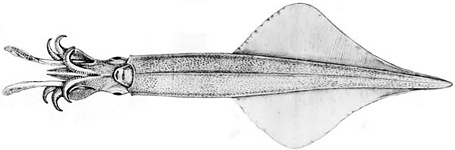
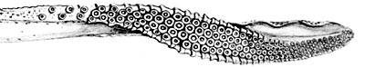

## Phylogeny 

-   « Ancestral Groups  
    -  [Loliginidae](../Loliginidae.md))
    -  [Myopsida](../../Myopsida.md))
    -  [Decapodiformes](../../../Decapodiformes.md))
    -  [Coleoidea](../../../../Coleoidea.md))
    -  [Cephalopoda](../../../../../Cephalopoda.md))
    -  [Mollusca](../../../../../../Mollusca.md))
    -  [Bilateria](../../../../../../../Bilateria.md))
    -  [Animals](../../../../../../../../Animals.md))
    -  [Eukarya](../../../../../../../../../Eukarya.md))
    -   [Tree of Life](../../../../../../../../../Tree_of_Life.md)

-   ◊ Sibling Groups of  Loliginidae
    -  [Loligo](Loligo.md))
    -   [Afrololigo mercatoris](Afrololigo_mercatoris)
    -  [Alloteuthis](Alloteuthis.md))
    -  [Doryteuthis](Doryteuthis.md))
    -   Heterololigo bleekeri
    -  [Loliolus](Loliolus.md))
    -  [Lolliguncula](Lolliguncula.md))
    -  [Pickfordiateuthis](Pickfordiateuthis.md))
    -  [Sepioteuthis](Sepioteuthis.md))
    -  [Uroteuthis](Uroteuthis.md))

-   » Sub-Groups 

## *Heterololigo* [Natsukari, 1984] 

# *Heterololigo bleekeri* [(Keferstein, 1866)] 

[Michael Vecchione]()
)

A single species is present in ***Heterololigo***.

Type species. \-- ***Loligo bleekeri*** Keferstein, 1866 by original
designation.

Containing group:[Loliginidae](../Loliginidae.md))

## Introduction

***H. bleekeri*** is one of the more common loliginids in Japan.

#### Diagnosis

A loliginid \...

-   of moderately large size (to 40 cm ML) with fins in adults
    rhomboidal, longer than broad, not round (length \<70% of ML);
    mantle elongate, pointed posteriorly; without photophores.
-   with unusual hectocotylus.
-   with a Northwest Pacific distribution.

### Characteristics

1.  Arms
    1.  Arms very short.
    2.  Arm suckers with blunt teeth around distal ring.
    3.  Hectocotylus:
        1.  Proximal suckers unmodified.
        2.  Ventral crest absent.
        3.  Distal suckers of reduced size and sucker stalks elongated
            to form papillae in dorsal series.
        4.  Dorsal series of papillae and trabeculae at distal tip form
            bicuspid lamelliform flaps separated from ventral series of
            suckers by serrated membrane.

   )
    **Figure**. Oral view of tentacular club of ***H. bleekeri***, ca
    300 mm ML, mature male, Sagami Bay. Drawing from Sasaki (1929).

Fins

1.  Fins extend to posterior tip of mantle.\
    \

Photophores

1.  Photophores absent.\
    \

Viscera

1.  Eggs less than 4 mm.
2.  Spermatophore cement body short

\

### Distribution

Off Japan, excluding northern half of Hokkaido; off southern Korea.

### References

Vecchione, M., E. Shea, S. Bussarawit, F. Anderson, D. Alexeyev, C.-C.
Lu, T. Okutani, M. Roeleveld, C. Chotiyaputta, C. Roper, E. Jorgensen
and N. Sukramongkol. 2005. Systematics of Indo-West Pacific loliginids.
Phuket Mar. Biol. Cent. Res. Bull. 66: 23-26.

## Title Illustrations

)

  ------------------------------------------------------------------
  Scientific Name ::   Heterololigo bleekeri
  Location ::         Sagami Bay, Japan
  Reference          Sasaki, M. 1929. A Monograph of the Dibranchiate Cephalopods of the Japanese and Adjacent Waters. Journal of the College of Agriculture, Hokkaido Imperial University, 20(supplement):357 pages.
  Sex ::              Male
  Life Cycle Stage ::   Mature
  View               Ventral
  Size               ca. 30 cm
  ------------------------------------------------------------------

## Confidential Links & Embeds: 

### #is_/same_as :: [Heterololigo](/_Standards/bio/bio~Domain/Eukarya/Animal/Bilateria/Mollusca/Cephalopoda/Coleoidea/Decapodiformes/Myopsida/Loliginidae/Heterololigo.md) 

### #is_/same_as :: [Heterololigo.public](/_public/bio/bio~Domain/Eukarya/Animal/Bilateria/Mollusca/Cephalopoda/Coleoidea/Decapodiformes/Myopsida/Loliginidae/Heterololigo.public.md) 

### #is_/same_as :: [Heterololigo.internal](/_internal/bio/bio~Domain/Eukarya/Animal/Bilateria/Mollusca/Cephalopoda/Coleoidea/Decapodiformes/Myopsida/Loliginidae/Heterololigo.internal.md) 

### #is_/same_as :: [Heterololigo.protect](/_protect/bio/bio~Domain/Eukarya/Animal/Bilateria/Mollusca/Cephalopoda/Coleoidea/Decapodiformes/Myopsida/Loliginidae/Heterololigo.protect.md) 

### #is_/same_as :: [Heterololigo.private](/_private/bio/bio~Domain/Eukarya/Animal/Bilateria/Mollusca/Cephalopoda/Coleoidea/Decapodiformes/Myopsida/Loliginidae/Heterololigo.private.md) 

### #is_/same_as :: [Heterololigo.personal](/_personal/bio/bio~Domain/Eukarya/Animal/Bilateria/Mollusca/Cephalopoda/Coleoidea/Decapodiformes/Myopsida/Loliginidae/Heterololigo.personal.md) 

### #is_/same_as :: [Heterololigo.secret](/_secret/bio/bio~Domain/Eukarya/Animal/Bilateria/Mollusca/Cephalopoda/Coleoidea/Decapodiformes/Myopsida/Loliginidae/Heterololigo.secret.md)

