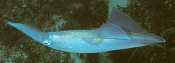
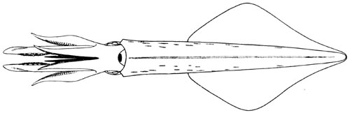

## Phylogeny 

-   « Ancestral Groups  
    -  [Loliginidae](../Loliginidae.md))
    -  [Myopsida](../../Myopsida.md))
    -  [Decapodiformes](../../../Decapodiformes.md))
    -  [Coleoidea](../../../../Coleoidea.md))
    -  [Cephalopoda](../../../../../Cephalopoda.md))
    -  [Mollusca](../../../../../../Mollusca.md))
    -  [Bilateria](../../../../../../../Bilateria.md))
    -  [Animals](../../../../../../../../Animals.md))
    -  [Eukarya](../../../../../../../../../Eukarya.md))
    -   [Tree of Life](../../../../../../../../../Tree_of_Life.md)

-   ◊ Sibling Groups of  Loliginidae
    -   Loligo
    -   [Afrololigo mercatoris](Afrololigo_mercatoris)
    -  [Alloteuthis](Alloteuthis.md))
    -  [Doryteuthis](Doryteuthis.md))
    -   [Heterololigo bleekeri](Heterololigo_bleekeri)
    -  [Loliolus](Loliolus.md))
    -  [Lolliguncula](Lolliguncula.md))
    -  [Pickfordiateuthis](Pickfordiateuthis.md))
    -  [Sepioteuthis](Sepioteuthis.md))
    -  [Uroteuthis](Uroteuthis.md))

-   » Sub-Groups 

# *Loligo* [Lamarck, 1798]

## Inshore squid 

[Michael Vecchione]()
)

The following three species are present in the genus.

Type species.\-- ***Loligo vulgaris*** Lamarck, 1798, by subsequent
designation of Hoyle (1910).

Containing group:[Loliginidae](../Loliginidae.md))

## Introduction

***Loligo*** species are the common inshore squids of the eastern
Atlantic Ocean. Several species are targets of substantial fisheries.
Although the biology of some species of ***Loligo*** (e.g., ***L.
vulgaris***, ***L. reynaudii*** ) is among the best known of any
cephalopod, considerable controversy remains about their taxonomy and
systematic relationships.

The genus is defined by geography and the absence of specific
modifications that define other genera.

#### Diagnosis

A loliginid \...

-   with rhomboidal fins in adults, longer than broad (length \<70% of
    ML); mantle elongate; without photophores.
-   with an Eastern Atlantic distribution.

### Characteristics

 

1.  Arms
    1.  Hectocotylus
        1.  Ventral crest absent.
        2.  Proximal suckers unmodified.
        3.  Modified suckers of reduced size and sucker stalks elongated
            to form papillae in either dorsal or both dorsal and ventral
            series.\
            \
2.  Tentacles
    1.  Tentacular clubs expanded; suckers in four series.\
        \
3.  Mantle
    1.  Elongate, posterior tip blunt.\
        \
4.  Fins
    1.  Fins in adults rhomboidal and longer than broad, tapering
        posteriorly.
    2.  Fins extend to posterior tip of mantle.

       )
        **Figure**. Ventral view of a mature male of ***L. vulgaris***.
        Drawing from Naef (1921-3).

5.  Photophores
    1.  Photophores absent.\
        \
6.  Viscera
    1.  Eggs less than 4 mm.
    2.  Spermatophore cement body short.

#### Comments:

***Alloteuthis*** is morphologically very similar to ***Loligo***. 
However, molecular analyses by Anderson (2000) indicate that
***Alloteuthis*** should be considered a separate genus. This supports
earlier inferences by Naef (1921-23) and Alexeyev (1989) that the
presence of a gladial conus in ***Alloteuthis*** should be considered a
generic character. The conus in ***Alloteuthis*** would clearly separate
the genera but it can be very difficult to find and in some
***Alloteuthis*** specimens may be reduced until it is essentially
absent. The posterior tip of the mantle in ***Alloteuthis*** is elongate
into a tail-like structure that tends to be more pointed than in
***Loligo***. This is particularly true for males but identification of
this character state can be subjective in females.\

### Nomenclature

According to Lesueur (1821), use of the name \"loligo\" for squids can
be traced to the classical Roman philosopher, Pliny (lib. IV, cap. XIX;
see also Naef, 1923:197). Linnaeus established ***Sepia loligo*** in
1758 to encompass all cephalopods with a cylindrical body and fins
(Hoyle, 1910:410). Subsequently, squids in general were often referred
to as \"loligos\" (e.g. Lesueur, 1821). Many authors have interpreted
Schneider\'s (1784) use of the name \"Loligo\" (capitalized and not
preceded by a generic name) as the establishment of the genus
***Loligo***. However, Hemming (1954) showed that ***Loligo***
Schneider, 1784 resulted from a misinterpretation of Schneider\'s work.
Schneider\'s intent was to remove ***Nautilus*** Linnaeus, 1758 and
***Argonauta*** Linnaeus, 1758 from the univalve molluscs and to include
them with all other cephalopods in a new genus, ***Octopodia***. Thus,
Schneider actually proposed the new combination ***Octopodia loligo***
but did not follow the convention of always using the generic name and
not capitalizing the species. ***Loligo*** was then formally described
by Lamarck in 1798 to distinguish four squid species, ***L. vulgaris***,
***L. subulata***, ***L. sagittata*** and ***L. sepiola*** from the
octopods (for which he erected the genus ***Octopus*** Lamarck, 1798)
and from the cuttlefishes of the genus ***Sepia***.

The only other squid genera that predate 1821 are ***Onychoteuthis***
Lichtenstein, 1818, which was established to distinguish cephalopods in
which hooks replace some of the suckers on the arms or tentacles, and
***Cranchia*** Leach, 1817, a very unusual squid.

### Discussion of Phylogenetic Relationships

Except for geographic distribution, ***Loligo*** species are unified in
their lack of the characters distinctive of some other genera
(photophores, spermatophore with long cement body, large eggs,
hectocotylus with ventral crest, etc.). The  most distinct of the three
species is ***L. forbesi***.  The southern African species, ***L.
reynaudii***, is very similar to ***L. vulgaris*** and , based on
electrophoresis, Augustyn and Grant (1988) concluded that ***L.
reynaudii*** should be considered a subspecies of ***L. vulgaris***.
However, ***L. reynaudii*** and ***L. vulgaris*** are allopatric and
distinct morphologically; we consider them to be distinct species.\

\

### Distribution

***Loligo*** includes species of the eastern Atlantic Ocean and forms a
nearly continuous distribution from southern Africa to 60°N.

### References

Anderson, F.E. 2000. Phylogeny and Historical Biogeography of the
Loliginid Squids (Mollusca: Cephalopoda) Based on Mitochondrial DNA
Sequence Data. Molecular Phylogenetics and Evolution 15: 191-214.

Alexeyev, D.O. 1989. Advantages and limitations of using the gladius in
diagnosis of species and genera of the family Loliginidae (Cephalopoda).
Zoologichesky Zhurnal, 68(6):36-42.

Augustyn, C.J. and W.S\> Grant. 1988. Biochemical and morphological
systematics of *Loligo vulgaris vulgaris* Lamarck and *Loligo vulgaris
reynaudii* d\'Orbigny nov. comb. (Cepahlopoda; Myopsida) Malacologia
29(1):215-233.

Brakoniecki, T.F. 1986. A Generic Revision of the Family Loliginidae
(Cephalopoda; Myopsida) Based Primarily on the Comparative Morphology of
the Hectocotylus. Ph.D.

Dissertation, University of Miami, Miami, FL, USA. 163 pages.

Brierley, A.S., and J.P. Thorp. 1994. Biochemical Genetic Evidence
Supporting the Taxonomic Separation of ***Loligo gahi*** from the Genus
***Loligo***. Antarctic Science, 6(2):143-148.

Naef, A. 1921-1923. Die Cephalopoden. Fauna e Flora del Golfo di Napoli,
Monographie 35, Vol I, Parts I and II, Systematik, pp 1-863.

Vecchione, M., T. F. Brakoniecki, Y. Natsukari and R. T. Hanlon. 1998. A
provisional generic classification of the family Loliginidae. Smithson.
Contr. Zool., 586.

Vecchione, M., E. Shea, S. Bussarawit, F. Anderson, D. Alexeyev, C.-C.
Lu, T. Okutani, M. Roeleveld, C. Chotiyaputta, C. Roper, E. Jorgensen
and N. Sukramongkol. 2005. Systematics of Indo-West Pacific loliginids.
Phuket Mar. Biol. Cent. Res. Bull. 66: 23-26.

## Title Illustrations

)

  -----------------
  Scientific Name ::     Loligo reynaudii
  Location ::           Off South Africa
  Specimen Condition   Live Specimen
  View                 side
  Copyright ::            © [Roger Hanlon](mailto:rhanlon@mbl.edu)
  -----------------

## Confidential Links & Embeds: 

### #is_/same_as :: [Loligo](/_Standards/bio/bio~Domain/Eukarya/Animal/Bilateria/Mollusca/Cephalopoda/Coleoidea/Decapodiformes/Myopsida/Loliginidae/Loligo.md) 

### #is_/same_as :: [Loligo.public](/_public/bio/bio~Domain/Eukarya/Animal/Bilateria/Mollusca/Cephalopoda/Coleoidea/Decapodiformes/Myopsida/Loliginidae/Loligo.public.md) 

### #is_/same_as :: [Loligo.internal](/_internal/bio/bio~Domain/Eukarya/Animal/Bilateria/Mollusca/Cephalopoda/Coleoidea/Decapodiformes/Myopsida/Loliginidae/Loligo.internal.md) 

### #is_/same_as :: [Loligo.protect](/_protect/bio/bio~Domain/Eukarya/Animal/Bilateria/Mollusca/Cephalopoda/Coleoidea/Decapodiformes/Myopsida/Loliginidae/Loligo.protect.md) 

### #is_/same_as :: [Loligo.private](/_private/bio/bio~Domain/Eukarya/Animal/Bilateria/Mollusca/Cephalopoda/Coleoidea/Decapodiformes/Myopsida/Loliginidae/Loligo.private.md) 

### #is_/same_as :: [Loligo.personal](/_personal/bio/bio~Domain/Eukarya/Animal/Bilateria/Mollusca/Cephalopoda/Coleoidea/Decapodiformes/Myopsida/Loliginidae/Loligo.personal.md) 

### #is_/same_as :: [Loligo.secret](/_secret/bio/bio~Domain/Eukarya/Animal/Bilateria/Mollusca/Cephalopoda/Coleoidea/Decapodiformes/Myopsida/Loliginidae/Loligo.secret.md)

