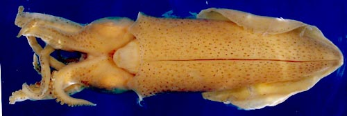
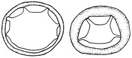
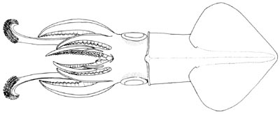
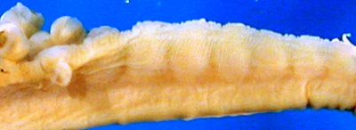

---
aliases:
  - Loliolus
title: Loliolus
---

## Phylogeny 

-   « Ancestral Groups  
    -  [Loliginidae](../Loliginidae.md) 
    -  [Myopsida](../../Myopsida.md) 
    -  [Decapodiformes](../../../Decapodiformes.md) 
    -  [Coleoidea](../../../../Coleoidea.md) 
    -  [Cephalopoda](../../../../../Cephalopoda.md) 
    -  [Mollusca](../../../../../../Mollusca.md) 
    -  [Bilateria](../../../../../../../Bilateria.md) 
    -  [Animals](../../../../../../../../Animals.md) 
    -  [Eukarya](../../../../../../../../../Eukarya.md) 
    -   [Tree of Life](../../../../../../../../../Tree_of_Life.md)

-   ◊ Sibling Groups of  Loliginidae
    -  [Loligo](Loligo.md) 
    -   [Afrololigo mercatoris](Afrololigo_mercatoris)
    -  [Alloteuthis](Alloteuthis.md) 
    -  [Doryteuthis](Doryteuthis.md) 
    -   [Heterololigo bleekeri](Heterololigo_bleekeri)
    -   Loliolus
    -  [Lolliguncula](Lolliguncula.md) 
    -  [Pickfordiateuthis](Pickfordiateuthis.md) 
    -  [Sepioteuthis](Sepioteuthis.md) 
    -  [Uroteuthis](Uroteuthis.md) 

-   » Sub-Groups 

# *Loliolus* [Steenstrup, 1856] 

[Michael Vecchione]()
 

***Loliolus*** has six species placed into two subgenera.

Type species.\-- Loliolus hardwickei (Gray) \[Note: according to Lu et
al. (1985), Steenstrup\'s originally designated type species, L. typus
Steenstrup 1856 = Loligo hardwickei Gray 1849\].[
]{style="font-size: 12pt; font-family: \"Times New Roman\"; color: black;"}

Containing group:[Loliginidae](../Loliginidae.md) 

## Introduction

These are generally small squids with heart-shaped fins.

#### Diagnosis

A loliginid \...

-   with short mantle, rounded posteriorly; fins wider than long but
    without posterior lobes.
-   with ventral crest on hectocotylus formed by fusion of the
    protective membrane with the ventral row of papillae.
-   with an Indo-Pacific distribution.

### Characteristics

1.  Arms
    1.  Arm sucker rings with square plate-like teeth on margin.

       ){width="226"}
        **Figure**. Oral view of large arm III suckers of ***L.
        hardwickei***, 33 mm ML, male. The **left** sucker is from the
        dorsal series and the **right** sucker from its pair in the
        ventral series. Drawings from Lu, et al. (1985).

    2.  Hectocotylus:
        1.  Ventral crest present, formed by fusion of protective
            membrane with ventral row of papillae such that original
            form of conical papillae is completely obscured (see below).

       )
        **Figure**. Dorsal view of ***L. (L.) hardwickei***, 33 mm ML,
        male. Drawing from Lu, et al. (1985).

2.  Photophores
    1.  Photophores absent.\
        \
3.  Viscera
    1.  Eggs small.
    2.  Spermatophore cement body short.

#### comments

Hectocotylization includes a crest along a portion of the ventral
surface of the arm and a modification of part of the dorsal row of
suckers into papillae. Modification of the proximal portion of the
hectocotylus varies between subgenera. In ***Loliolus (Loliolus)*** the
modified portion of the hectocotylus occupies the entire length of the
arm whereas in ***Loliolus (Nipponololigo)*** some proximal suckers are
unmodified.
 

**Figure**. Oral (**top**) and medial (**bottom**) views of a portion of
the hectocotylus crest of ***L. (N.) japonica***, same hectocotylus as
pictured above. Photographs by R. Young.
### Nomenclature

Steenstrup (1856) erected the genus ***Loliolus*** for his new species
***typus***. Lu et al. (1985) showed that ***L. typus*** is a junior
synonym for ***Loligo hardwickei*** Gray, 1849, making the latter
species the type for the genus ***Loliolus***.

Because the percentage of the arm hectocotylized is considered to be a
cline within this group of species with otherwise similar hectocotyli
and arm-sucker dentition, ***Loliolus*** and ***Nipponololigo*** were
combined by Vecchione et al. (1998) into a single genus that, by
priority, is named ***Loliolus***.

### Discussion of Phylogenetic Relationships

***Loliolus*** was originally erected to include species of small
loliginids with heart-shaped fins in which the entire left ventral arm
of the males is modified. However, as discussed by Brakoniecki (1986),
clines exist in the percentage of the arm hectocotylized within species
groups with similar hectocotyli. Thus, this character state is not
sufficient for generic status. The presence, though, of a distinctive
character, a ventral crest on the hectocotylus formed by fusion of the
protective membrane with the ventral row of papillae such that the
original form of the conical papillae is completely obscured, indicates
a close relationship among these species (Natsukari, 1983).

### Distribution

The species in this genus are all found in the Indo-West Pacific.

### References

Brakoniecki, T.F. 1986. A Generic Revision of the Family Loliginidae
(Cephalopoda; Myopsida) Based Primarily on the Comparative Morphology of
the Hectocotylus. Ph.D. Dissertation, University of Miami, Miami, FL,
USA. 163 pages.

Lu, C.C., C.F.E. Roper, and R.W. Tait. 1985. A Revision of
***Loliolus*** (Cephalopoda; Loliginidae), including ***L. noctiluca***,
a new species of squid from Australian waters. Proceedings of the Royal
Society of Victoria, 97(2):59-85.

Natsukari, Y. 1983. Taxonomical and morphological studies on the
loliginid squids\--III. ***Nipponololigo***, a new subgenus of the genus
***Loligo***. Venus, The Japanese Journal of Malacology, 42(4):313-318.

Vecchione, M., T. F. Brakoniecki, Y. Natsukari and R. T. Hanlon. 1998. A
provisional generic classification of the family Loliginidae. Smithson.
Contr. Zool., 586.

Vecchione, M., E. Shea, S. Bussarawit, F. Anderson, D. Alexeyev, C.-C.
Lu, T. Okutani, M. Roeleveld, C. Chotiyaputta, C. Roper, E. Jorgensen
and N. Sukramongkol. 2005. Systematics of Indo-West Pacific loliginids.
Phuket Mar. Biol. Cent. Res. Bull. 66: 23-26.

## Title Illustrations

 

  ------------------------------------------------------------------------------
  Scientific Name ::     Loliolus hardwickei
  Location ::           off Madras, India
  Specimen Condition   Preserved
  Sex ::                Male
  View                 Ventral
  Copyright ::            © [Richard E. Young](http://www.soest.hawaii.edu/%7Eryoung/rey.html) 
 
  ------------------------------------------------------------------------------

## Confidential Links & Embeds: 

### #is_/same_as :: [[/_Standards/bio/bio~Domain/Eukarya/Animal/Bilateria/Mollusca/Cephalopoda/Coleoidea/Decapodiformes/Myopsida/Loliginidae/Loliolus|Loliolus]] 

### #is_/same_as :: [[/_public/bio/bio~Domain/Eukarya/Animal/Bilateria/Mollusca/Cephalopoda/Coleoidea/Decapodiformes/Myopsida/Loliginidae/Loliolus.public|Loliolus.public]] 

### #is_/same_as :: [[/_internal/bio/bio~Domain/Eukarya/Animal/Bilateria/Mollusca/Cephalopoda/Coleoidea/Decapodiformes/Myopsida/Loliginidae/Loliolus.internal|Loliolus.internal]] 

### #is_/same_as :: [[/_protect/bio/bio~Domain/Eukarya/Animal/Bilateria/Mollusca/Cephalopoda/Coleoidea/Decapodiformes/Myopsida/Loliginidae/Loliolus.protect|Loliolus.protect]] 

### #is_/same_as :: [[/_private/bio/bio~Domain/Eukarya/Animal/Bilateria/Mollusca/Cephalopoda/Coleoidea/Decapodiformes/Myopsida/Loliginidae/Loliolus.private|Loliolus.private]] 

### #is_/same_as :: [[/_personal/bio/bio~Domain/Eukarya/Animal/Bilateria/Mollusca/Cephalopoda/Coleoidea/Decapodiformes/Myopsida/Loliginidae/Loliolus.personal|Loliolus.personal]] 

### #is_/same_as :: [[/_secret/bio/bio~Domain/Eukarya/Animal/Bilateria/Mollusca/Cephalopoda/Coleoidea/Decapodiformes/Myopsida/Loliginidae/Loliolus.secret|Loliolus.secret]] 

