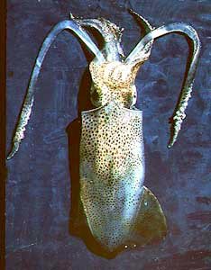
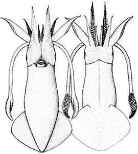
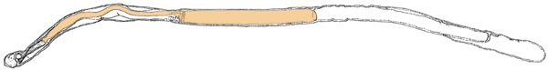
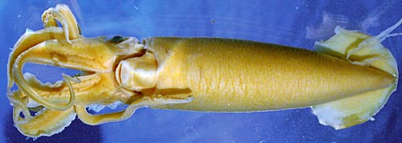

---
aliases:
  - Lolliguncula
title: Lolliguncula
---

## Phylogeny 

-   « Ancestral Groups  
    -  [Loliginidae](../Loliginidae.md) 
    -  [Myopsida](../../Myopsida.md) 
    -  [Decapodiformes](../../../Decapodiformes.md) 
    -  [Coleoidea](../../../../Coleoidea.md) 
    -  [Cephalopoda](../../../../../Cephalopoda.md) 
    -  [Mollusca](../../../../../../Mollusca.md) 
    -  [Bilateria](../../../../../../../Bilateria.md) 
    -  [Animals](../../../../../../../../Animals.md) 
    -  [Eukarya](../../../../../../../../../Eukarya.md) 
    -   [Tree of Life](../../../../../../../../../Tree_of_Life.md)

-   ◊ Sibling Groups of  Loliginidae
    -  [Loligo](Loligo.md) 
    -   [Afrololigo mercatoris](Afrololigo_mercatoris)
    -  [Alloteuthis](Alloteuthis.md) 
    -  [Doryteuthis](Doryteuthis.md) 
    -   [Heterololigo bleekeri](Heterololigo_bleekeri)
    -  [Loliolus](Loliolus.md) 
    -   Lolliguncula
    -  [Pickfordiateuthis](Pickfordiateuthis.md) 
    -  [Sepioteuthis](Sepioteuthis.md) 
    -  [Uroteuthis](Uroteuthis.md) 

-   » Sub-Groups 

# *Lolliguncula* [Steenstrup, 1881]

## Brief squids 

[Michael Vecchione]()
))

***Loliguncula*** contains four species placed in two subgenera.

Type species.\--***Loligo brevis*** Blainville, 1823, by original
designation.

Containing group:[Loliginidae](../Loliginidae.md) 

## Introduction

Species of ***Lolliguncula*** are rather small squids that generally
occupy warm, shallow waters and some invade regions of low salinity.

#### Diagnosis

A loliginid \...

-   with short mantle, rounded posteriorly; fins wider than long but
    without posterior lobes.
-   with a long cement body in the spermatophores.\
-   without ventral crest on hectocotylus.
-   with distribution only in American waters.

### Characteristics

Arms

1.  Sucker rings with square teeth on distal or entire margin.

   )
    **Figure**. Spermatophore of ***L. brevis***, 90 mm ML, showing the
    size of the cement body (amber color). Drawing modified from Hess
    (1987).

#### Comments

The cement body of ***Lolliguncula*** species, where known, varies
roughly between 30-50% of the spermatophore length. In other loliginid
genera with small cement bodies, the cement body typically is between
about 3-15% of the spermatophore lenght.

Members of ***Lolliguncula (Lolliguncula)*** have the modified portion
of the hectocotylus less than the entire arm (ie, the proximal portion
is not modified) while ***Lolliguncula (Loliolopsis)*** has the
hectocotylus modified along the entire arm.
)

**Figure**. Ventral view of ***Lolliguncula (Loliolopsis) diomedeae***
(holotype of ***Loliolopsis chiroctes***), preserved. Photograph by R.
Young.
### Nomenclature

Berry (1929) described a new species that he named chiroctes and erected
the genus ***Loliolopsis*** because of the distinctiveness of the new
species. Voss (1971) recognized that ***L. chiroctes*** is a junior
synonym of Hoyle\'s ***Loligo diomedeae*** but that Berry was correct in
establishing a new genus. Therefore, the type species of
***Loliolopsis*** (now a subgenus of ***Lolliguncula***) is
***Loliolopsis diomedeae*** (Hoyle, 1904).

### Discussion of Phylogenetic Relationships

The genus ***Lolliguncula*** was established to distinguish ***L.
brevis*** from the species of ***Loligo*** then known, based on body and
fin shape and spermatophore deposition site. These characters have since
proven to exhibit considerable variability, both within and among
species. However, all of the species in this genus are united and
distinguished from all other loliginids by the long cement body of their
spermatophores. Variability exists in hectocotylus morphology, and this
led Berry (1929) to erect the genus ***Loliolopsis*** and Brakoniecki
(1986) to erect ***Afrololigo***. This variability is extreme in ***L.
diomedeae***, but Brakoniecki (1986) has pointed out the similarities in
hectocotylization between this species and the others of
***Lolliguncula***.\

Many of the morphological characters of ***Afrololigo mercatoris*** are
shared with species of ***Lolliguncula***, the genus in which it was
originally described. However, DNA sequence analysis by Anderson (2000)
supports Brakoniecki\'s (1986) conclusion based on hectocotylus
morphology that ***Afrololigo*** is a distinct genus.\

### Distribution

These are all American species, with their low-latitude distribution
centered at Panama. One species, ***L. brevis***, is found on the
Atlantic side of the Americas whereas three, ***L. panamensis***, ***L.
diomedeae*** and ***L. argus*** are found on the Pacific side. All of
these species are found in warm, shallow, inshore waters. The genus is
noteworthy among cephalopods for its euryhalinity.

### References

Alexeyev, D.O. 1992. The Systematic Position of Bioluminescent Squids of
the Family Loliginidae (Cephalopoda, Myopsida). Zoologeskiy Zhurnal,
71(11):12-23. (In Russian).

Berry, S.S. 1929. ***Loliolopsis chiroctes***, a New Genus and Species
of Squid from the Gulf of California. Transactions of the San Diego
Society of Natural History, 5(18):263-282, plates 32-33.

Brakoniecki, T.F. 1986. A Generic Revision of the Family Loliginidae
(Cephalopoda; Myopsida) Based Primarily on the Comparative Morphology of
the Hectocotylus. Ph.D. Dissertation, University of Miami, Miami, FL,
USA. 163 pages.

Vecchione, M., T. F. Brakoniecki, Y. Natsukari and R. T. Hanlon. 1998. A
Provisional Generic Classification of the Family Loliginidae. Smithson.
Contr. Zool., 586: 215-222.

Vecchione, M., E. Shea, S. Bussarawit, F. Anderson, D. Alexeyev, C.-C.
Lu, T. Okutani, M. Roeleveld, C. Chotiyaputta, C. Roper, E. Jorgensen
and N. Sukramongkol. 2005. Systematics of Indo-West Pacific loliginids.
Phuket Mar. Biol. Cent. Res. Bull. 66: 23-26.

Voss, G. L. 1971. Cephalopods collected by the R/V JOHN ELLIOTT
PILLSBURY in the Gulf of Panama in 1967. Bull. Mar. Sci. 21:1-34.

## Title Illustrations

)

  ----------
  Scientific Name ::     Lollicuncula brevis
  Specimen Condition   Dead Specimen
  View                 Dorsal
  Copyright ::            © 1996 Gus Stacy
  ----------
)

  ----------------------------------------------------------------------
  Scientific Name ::  Lollicuncula brevis
  Reference         Vecchione, M., C. F. E. Roper and M. J. Sweeney (1989). Marine flora and fauna of the eastern United States. Mollusca: Cephalopoda. NOAA Tech. Rep., NMFS 73: 23 pp.
  View              Ventral, dorsal
  Copyright ::         © [Michael Vecchione](mailto:vecchiom@si.edu) 
 
  ----------------------------------------------------------------------

## Confidential Links & Embeds: 

### #is_/same_as :: [Lolliguncula](/_Standards/bio/bio~Domain/Eukarya/Animal/Bilateria/Mollusca/Cephalopoda/Coleoidea/Decapodiformes/Myopsida/Loliginidae/Lolliguncula.md) 

### #is_/same_as :: [Lolliguncula.public](/_public/bio/bio~Domain/Eukarya/Animal/Bilateria/Mollusca/Cephalopoda/Coleoidea/Decapodiformes/Myopsida/Loliginidae/Lolliguncula.public.md) 

### #is_/same_as :: [Lolliguncula.internal](/_internal/bio/bio~Domain/Eukarya/Animal/Bilateria/Mollusca/Cephalopoda/Coleoidea/Decapodiformes/Myopsida/Loliginidae/Lolliguncula.internal.md) 

### #is_/same_as :: [Lolliguncula.protect](/_protect/bio/bio~Domain/Eukarya/Animal/Bilateria/Mollusca/Cephalopoda/Coleoidea/Decapodiformes/Myopsida/Loliginidae/Lolliguncula.protect.md) 

### #is_/same_as :: [Lolliguncula.private](/_private/bio/bio~Domain/Eukarya/Animal/Bilateria/Mollusca/Cephalopoda/Coleoidea/Decapodiformes/Myopsida/Loliginidae/Lolliguncula.private.md) 

### #is_/same_as :: [Lolliguncula.personal](/_personal/bio/bio~Domain/Eukarya/Animal/Bilateria/Mollusca/Cephalopoda/Coleoidea/Decapodiformes/Myopsida/Loliginidae/Lolliguncula.personal.md) 

### #is_/same_as :: [Lolliguncula.secret](/_secret/bio/bio~Domain/Eukarya/Animal/Bilateria/Mollusca/Cephalopoda/Coleoidea/Decapodiformes/Myopsida/Loliginidae/Lolliguncula.secret.md)

