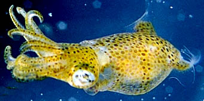
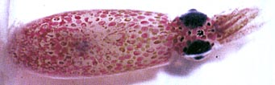

---
aliases:
  - Pickfordiateuthis
title: Pickfordiateuthis
---

## Phylogeny 

-   « Ancestral Groups  
    -  [Loliginidae](../Loliginidae.md))
    -  [Myopsida](../../Myopsida.md))
    -  [Decapodiformes](../../../Decapodiformes.md))
    -  [Coleoidea](../../../../Coleoidea.md))
    -  [Cephalopoda](../../../../../Cephalopoda.md))
    -  [Mollusca](../../../../../../Mollusca.md))
    -  [Bilateria](../../../../../../../Bilateria.md))
    -  [Animals](../../../../../../../../Animals.md))
    -  [Eukarya](../../../../../../../../../Eukarya.md))
    -   [Tree of Life](../../../../../../../../../Tree_of_Life.md)

-   ◊ Sibling Groups of  Loliginidae
    -  [Loligo](Loligo.md))
    -   [Afrololigo mercatoris](Afrololigo_mercatoris)
    -  [Alloteuthis](Alloteuthis.md))
    -  [Doryteuthis](Doryteuthis.md))
    -   [Heterololigo bleekeri](Heterololigo_bleekeri)
    -  [Loliolus](Loliolus.md))
    -  [Lolliguncula](Lolliguncula.md))
    -   Pickfordiateuthis
    -  [Sepioteuthis](Sepioteuthis.md))
    -  [Uroteuthis](Uroteuthis.md))

-   » Sub-Groups 

# *Pickfordiateuthis* [Voss, 1953]

## Grass squid 

[Michael Vecchione]()
)

The following four species have been described (one has not been named)
in ***Pickfordiateuthis***.

Type species.\-- ***Pickfordiateuths pulchella*** Voss, 1953, by
monotypy.

Containing group:[Loliginidae](../Loliginidae.md))

## Introduction

These are small (22 mm ML max.), muscular squids that occupy neritic
waters often in association with small patch reefs and seagrass (Voss,
1953). In spite of the accessible habitat, the squid is rarely captured
and little is known of its biology.

#### Diagnosis

A loliginid \...

-   of small size and with posterior fin lobes; fins not joined
    posteriorly.
-   with club suckers on manus in two series.

### Characteristics

Arms

1.  Suckers in two series.\
    \

Tentacles

Club suckers on manus in two series; suckers on dactylus in four series
or in two series.
)

**Figure**. Dorsal view of ***P. bayeri*** in a shipboard aquarium.

### References

Brakoniecki, T. F. 1996. A revision of the genus **Pickfordiateuthis**
Voss, 1953 (Cephalopoda; Myopsida). Bull. Mar. Sci. 58: 9-28.

Roper, C.F.E. and M. Vecchione. 2001. Pickfordiateuthis bayeri n. sp., a
new species of squid (Cephalopoda: Loliginidae) from the western North
Atlantic Ocean discovered by submersible. Bull. Biol. Soc. Wash.
10:301-310.

Voss, G. L. 1953. A new family, genus and species of myopsid squid from
the Florida keys. Bull. Mar. Sci. Gulf Carib. 2: 602-609.

## Title Illustrations

)

  ---------------------------------------------------------------------------
  Scientific Name ::     Pickfordiateuthis pulchella
  Location ::           off Florida
  Specimen Condition   Live Specimen
  Copyright ::            © 1996 [Clyde F. E. Roper](mailto:roper.clyde@nmnh.si.edu) 
  ---------------------------------------------------------------------------

## Confidential Links & Embeds: 

### #is_/same_as :: [Pickfordiateuthis](/_Standards/bio/bio~Domain/Eukarya/Animal/Bilateria/Mollusca/Cephalopoda/Coleoidea/Decapodiformes/Myopsida/Loliginidae/Pickfordiateuthis.md) 

### #is_/same_as :: [Pickfordiateuthis.public](/_public/bio/bio~Domain/Eukarya/Animal/Bilateria/Mollusca/Cephalopoda/Coleoidea/Decapodiformes/Myopsida/Loliginidae/Pickfordiateuthis.public.md) 

### #is_/same_as :: [Pickfordiateuthis.internal](/_internal/bio/bio~Domain/Eukarya/Animal/Bilateria/Mollusca/Cephalopoda/Coleoidea/Decapodiformes/Myopsida/Loliginidae/Pickfordiateuthis.internal.md) 

### #is_/same_as :: [Pickfordiateuthis.protect](/_protect/bio/bio~Domain/Eukarya/Animal/Bilateria/Mollusca/Cephalopoda/Coleoidea/Decapodiformes/Myopsida/Loliginidae/Pickfordiateuthis.protect.md) 

### #is_/same_as :: [Pickfordiateuthis.private](/_private/bio/bio~Domain/Eukarya/Animal/Bilateria/Mollusca/Cephalopoda/Coleoidea/Decapodiformes/Myopsida/Loliginidae/Pickfordiateuthis.private.md) 

### #is_/same_as :: [Pickfordiateuthis.personal](/_personal/bio/bio~Domain/Eukarya/Animal/Bilateria/Mollusca/Cephalopoda/Coleoidea/Decapodiformes/Myopsida/Loliginidae/Pickfordiateuthis.personal.md) 

### #is_/same_as :: [Pickfordiateuthis.secret](/_secret/bio/bio~Domain/Eukarya/Animal/Bilateria/Mollusca/Cephalopoda/Coleoidea/Decapodiformes/Myopsida/Loliginidae/Pickfordiateuthis.secret.md)

