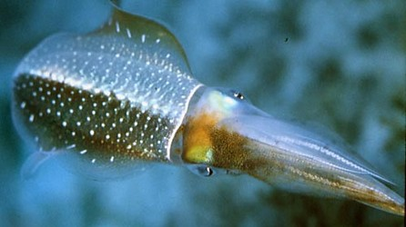

## Phylogeny 

-   « Ancestral Groups  
    -  [Loliginidae](../Loliginidae.md))
    -  [Myopsida](../../Myopsida.md))
    -  [Decapodiformes](../../../Decapodiformes.md))
    -  [Coleoidea](../../../../Coleoidea.md))
    -  [Cephalopoda](../../../../../Cephalopoda.md))
    -  [Mollusca](../../../../../../Mollusca.md))
    -  [Bilateria](../../../../../../../Bilateria.md))
    -  [Animals](../../../../../../../../Animals.md))
    -  [Eukarya](../../../../../../../../../Eukarya.md))
    -   [Tree of Life](../../../../../../../../../Tree_of_Life.md)

-   ◊ Sibling Groups of  Loliginidae
    -  [Loligo](Loligo.md))
    -   [Afrololigo mercatoris](Afrololigo_mercatoris)
    -  [Alloteuthis](Alloteuthis.md))
    -  [Doryteuthis](Doryteuthis.md))
    -   [Heterololigo bleekeri](Heterololigo_bleekeri)
    -  [Loliolus](Loliolus.md))
    -  [Lolliguncula](Lolliguncula.md))
    -  [Pickfordiateuthis](Pickfordiateuthis.md))
    -   Sepioteuthis
    -  [Uroteuthis](Uroteuthis.md))

-   » Sub-Groups 

# *Sepioteuthis* [Blainville, 1824]

## Reef squids 

[Michael Vecchione]()
)

Three nominal species are present in ***Sepioteuthis***.

Type species. \-- ***Loligo sepioidea*** Blainville, 1823 by original
designation.

Containing group:[Loliginidae](../Loliginidae.md))

## Introduction

***Sepioteuthis*** is distinctive; unlike in many loliginid genera,
controversy does not exists over which species should be included
(Vecchione et al., 1998). These loliginids have a rather broad,
posteriorly rounded mantle and fins that extend nearly the full length
of the mantle. This gives them a ***Sepia***-like appearance. They also
lay eggs that are much larger than those of other loliginids. They
usually are found in shallow tropical or subtropical regions.

#### Diagnosis

A loliginid \...

-   with fins in adults that occupy \>85% ML; combined fin shape broadly
    elliptical.

### Characteristics

1.  Arms
    1.  Arm sucker rings with pointed teeth around entire margin.
    2.  Hectocotylus:
        1.  Ventral crest absent.
        2.  Proximal suckers unmodified.
        3.  Distal suckers reduced, sucker stalks elongated along
            modified portion of arm to form papillae on both dorsal and
            ventral rows.\
            \
2.  Tentacles
    1.  Tentacular clubs expanded, with suckers in four series.\
        \
3.  Mantle
    1.  Posterior mantle not elongated into tail-like structure.\
        \
4.  Fins
    1.  Extend nearly full length of mantle (\>85% of ML) except in very
        young squid.

       )
        **Figure**. Dorsal view of ***S. lessoniana***, adult showing
        the large fins. Drawing from Roper, et al. (1984)

5.  Photophores
    1.  Photophores absent.\
        \
6.  Viscera
    1.  Eggs larger than 5 mm.
    2.  Eggs lie in single, straight series within egg strand.
    3.  Spermatophore cement body short.

### Discussion of Phylogenetic Relationships

Relationships among species are uncertain. Segawa et al. (1993) suggest
that ***S. lessioniana*** represents a species complex.

### Distribution

Because of their association with coral reefs, the common name for these
species is \"reef squids\". The distribution of the genus generally
follows that of coral reefs, warm, clear, tropical and subtropical
waters, but coral reefs are not a habitat requirement for all of these
squids. For example, ***S. lessoniana*** is common around the southern
part of Honshu and Kyushu in Japan, but is not associated with coral
reefs in those areas. There is one species, ***S. sepioidea***, in the
western Atlantic; the remaining species are found in Indo-West Pacific
waters.

### References

Nesis, K. N. 1982. Abridged key to the cephalopod mollusks of the
world\'s ocean. 385+ii pp. Light and Food Industry Publishing House,
Moscow. (In Russian.). Translated into English by B. S. Levitov, ed. by
L. A. Burgess (1987), Cephalopods of the world. T. F. H. Publications,
Neptune City, NJ, 351pp.

Segawa, S., S. Hirayama and T. Okutani. 1993. Is ***Sepioteuthis
lessoniana*** in Okinawa a single species? Pp. 513-521. In: T. Okutani,
R. K. O\'Dor and T. Kubodera (eds). Recent Advances in Cephalopod
Fisheries Biology. Tokai University Press, Tokyo.

Vecchione, M., T. F. Brakoniecki, Y. Natsukari and R. T. Hanlon. 1998. A
provisional generic classification of the family Loliginidae. Smithson.
Contr. Zool., 586

## Title Illustrations

)

  ------------
  Scientific Name ::     Sepioteuthis sepioidea
  Specimen Condition   Live Specimen
  View                 Anterodorsal
  Copyright ::            © Roger Hanlon
  ------------

## Confidential Links & Embeds: 

### #is_/same_as :: [Sepioteuthis](/_Standards/bio/bio~Domain/Eukarya/Animal/Bilateria/Mollusca/Cephalopoda/Coleoidea/Decapodiformes/Myopsida/Loliginidae/Sepioteuthis.md) 

### #is_/same_as :: [Sepioteuthis.public](/_public/bio/bio~Domain/Eukarya/Animal/Bilateria/Mollusca/Cephalopoda/Coleoidea/Decapodiformes/Myopsida/Loliginidae/Sepioteuthis.public.md) 

### #is_/same_as :: [Sepioteuthis.internal](/_internal/bio/bio~Domain/Eukarya/Animal/Bilateria/Mollusca/Cephalopoda/Coleoidea/Decapodiformes/Myopsida/Loliginidae/Sepioteuthis.internal.md) 

### #is_/same_as :: [Sepioteuthis.protect](/_protect/bio/bio~Domain/Eukarya/Animal/Bilateria/Mollusca/Cephalopoda/Coleoidea/Decapodiformes/Myopsida/Loliginidae/Sepioteuthis.protect.md) 

### #is_/same_as :: [Sepioteuthis.private](/_private/bio/bio~Domain/Eukarya/Animal/Bilateria/Mollusca/Cephalopoda/Coleoidea/Decapodiformes/Myopsida/Loliginidae/Sepioteuthis.private.md) 

### #is_/same_as :: [Sepioteuthis.personal](/_personal/bio/bio~Domain/Eukarya/Animal/Bilateria/Mollusca/Cephalopoda/Coleoidea/Decapodiformes/Myopsida/Loliginidae/Sepioteuthis.personal.md) 

### #is_/same_as :: [Sepioteuthis.secret](/_secret/bio/bio~Domain/Eukarya/Animal/Bilateria/Mollusca/Cephalopoda/Coleoidea/Decapodiformes/Myopsida/Loliginidae/Sepioteuthis.secret.md)

