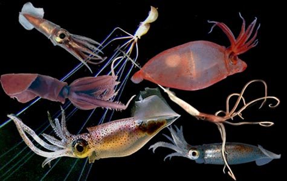

---
aliases:
  - Oegopsida
title: Oegopsida
---

## Phylogeny 

-   « Ancestral Groups  
    -  [Decapodiformes](../Decapodiformes.md) 
    -  [Coleoidea](../../Coleoidea.md) 
    -  [Cephalopoda](../../../Cephalopoda.md) 
    -  [Mollusca](../../../../Mollusca.md) 
    -  [Bilateria](../../../../../Bilateria.md) 
    -  [Animals](../../../../../../Animals.md) 
    -  [Eukarya](../../../../../../../Eukarya.md) 
    -   [Tree of Life](../../../../../../../Tree_of_Life.md)

-   ◊ Sibling Groups of  Decapodiformes
    -  [Bathyteuthoida](Bathyteuthoida.md) 
    -  [Idiosepiidae](Idiosepiidae.md) 
    -  [Myopsida](Myopsida.md) 
    -   Oegopsida
    -  [Sepioidea](Sepioidea.md) 
    -   [Spirula spirula](Spirula_spirula)

-   » Sub-Groups
    -   [Architeuthis](Architeuthis)
    -  [Brachioteuthidae](Oegopsida/Brachioteuthidae.md) 
    -   [Chiroteuthid families](Chiroteuthid_families)
    -  [Cranchiidae](Oegopsida/Cranchiidae.md) 
    -  [Cycloteuthidae](Oegopsida/Cycloteuthidae.md) 
    -   [Enoploteuthid families](Enoploteuthid_families)
    -   [Histioteuthid families](Histioteuthid_families)
    -  [Gonatidae](Oegopsida/Gonatidae.md) 
    -   [Lepidoteuthid families](Lepidoteuthid_families)
    -  [Neoteuthidae](Oegopsida/Neoteuthidae.md) 
    -  [Ommastrephidae](Oegopsida/Ommastrephidae.md) 
    -  [Onychoteuthidae](Oegopsida/Onychoteuthidae.md) 
    -   [Thysanoteuthis rhombus](Thysanoteuthis_rhombus)

# Oegopsida [Orbigny, 1845] 

[Richard E. Young and Michael Vecchione]()

Containing group:[Decapodiformes](../Decapodiformes.md) 

## Introduction

Among cephalopods, oegopsid squids dominate the pelagic, oceanic
environment. Diversity at the family and generic levels is very high
with 24 families and 69 genera. Although pelagic, some species are
consistently associated with and some occasionally sit on the ocean
floor.

#### Diagnosis

Decapodiforms \...

-   without cornea covering eyes.
-   with a gladius.

### Characteristics

1.  Arms
    1.  Suckers without circularis muscles.

    \
2.  Tentacles
    1.  Tentacular club usually with carpal (= proximal)
        locking-apparatus.
    2.  Oviducts paired.
    3.  Females without accessory nidamental glands.

    \
3.  Eggs
    1.  Eggs in pelagic egg masses.

#### Comments

**Comparisons of the major groups of the Oegopsida**

  -------- ---------- ------
  \                  Buccal       Funnel              Carpal              Gladius     Anterior fin
                     connective   locking-cartilage   locking-apparatus   conus       attachment
                     to arms IV                                                       

  Architeuthidae     Dorsal       Straight            Yes                 1° conus    Mantle

  Brachioteuthidae   Ventral      Straight            Yes/No              2° conus    Gladius

  Chiroteuthid       Ventral      Variable, usually   No                  2° conus    Gladius
  families                        oval, often with                                    
                                  knobs                                               

  Cranchiidae        Ventral      Fused               Yes                 2° conus    Gladius/Mantle
                                                                          /No         

  Cycloteuthidae     Ventral      Triangular          Yes                 2° conus    Gladius
                                                                          /No         

  Enoploteuthid      Dorsal       Straight            Yes                 1° conus    Gladius
  families                                                                            

  Gonatidae          Ventral      Straight            Yes                 1° conus    Gladius

  Histioteuthidae    Dorsal       Straight            Yes                 No          Gladius
  families                                                                            

  Lepidoteuthidae    Ventral      Straight            No                  2° conus    Gladius
  families                                                                            

  Neoteuthidae       Dorsal       Straight            Yes                 1° conus    Mantle

  Ommastrephidae     Dorsal       Inverted T          Yes/No              1° conus    Gladius

  Onychoteuthidae    Ventral      Straight            Yes                 1° conus    Gladius

  Thysanoteuthidae   Ventral      Lazy T              Yes                 No          Mantle
  -------- ---------- ------

[A key to the families of the Decapodiformes can be found here.](http://www.mnh.si.edu/cephs/cephkeyintro.html)

 

## Title Illustrations

 

  --------------------------------------------------------------------------------
  scientific_name ::   Pyroteuthis margaritifera, Promachoteuthis sp., Magnapinna ?, Helicocranchia pfefferi, Joubiniteuthis portieri, Onychoteuthis sp., Todarodes sagittatus
  Acknowledgements   J. portieri photograph by Frank Parish; Magnapinna (?) photograph from N.U.R.C., others photographed by R. Young.
  copyright ::          © 2004 [Richard E. Young](http://www.soest.hawaii.edu/%7Eryoung/rey.html) 
 
  --------------------------------------------------------------------------------

## Confidential Links & Embeds: 

### #is_/same_as :: [[/_Standards/bio/bio~Domain/Eukarya/Animal/Bilateria/Mollusca/Cephalopoda/Coleoidea/Decapodiformes/Oegopsida|Oegopsida]] 

### #is_/same_as :: [[/_public/bio/bio~Domain/Eukarya/Animal/Bilateria/Mollusca/Cephalopoda/Coleoidea/Decapodiformes/Oegopsida.public|Oegopsida.public]] 

### #is_/same_as :: [[/_internal/bio/bio~Domain/Eukarya/Animal/Bilateria/Mollusca/Cephalopoda/Coleoidea/Decapodiformes/Oegopsida.internal|Oegopsida.internal]] 

### #is_/same_as :: [[/_protect/bio/bio~Domain/Eukarya/Animal/Bilateria/Mollusca/Cephalopoda/Coleoidea/Decapodiformes/Oegopsida.protect|Oegopsida.protect]] 

### #is_/same_as :: [[/_private/bio/bio~Domain/Eukarya/Animal/Bilateria/Mollusca/Cephalopoda/Coleoidea/Decapodiformes/Oegopsida.private|Oegopsida.private]] 

### #is_/same_as :: [[/_personal/bio/bio~Domain/Eukarya/Animal/Bilateria/Mollusca/Cephalopoda/Coleoidea/Decapodiformes/Oegopsida.personal|Oegopsida.personal]] 

### #is_/same_as :: [[/_secret/bio/bio~Domain/Eukarya/Animal/Bilateria/Mollusca/Cephalopoda/Coleoidea/Decapodiformes/Oegopsida.secret|Oegopsida.secret]] 

