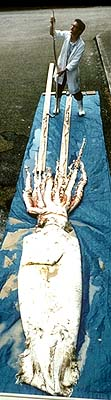
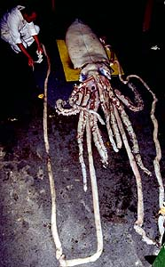
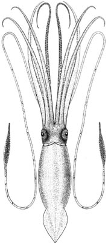
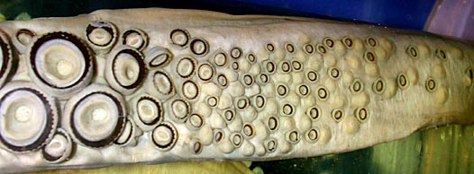
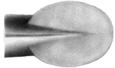
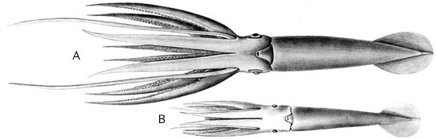

## Phylogeny 

-   « Ancestral Groups  
    -  [Oegopsida](../Oegopsida.md))
    -  [Decapodiformes](../../Decapodiformes.md))
    -  [Coleoidea](../../../Coleoidea.md))
    -  [Cephalopoda](../../../../Cephalopoda.md))
    -  [Mollusca](../../../../../Mollusca.md))
    -  [Bilateria](../../../../../../Bilateria.md))
    -  [Animals](../../../../../../../Animals.md))
    -  [Eukarya](../../../../../../../../Eukarya.md))
    -   [Tree of Life](../../../../../../../../Tree_of_Life.md)

-   ◊ Sibling Groups of  Oegopsida
    -   Architeuthis
    -  [Brachioteuthidae](Brachioteuthidae.md))
    -   [Chiroteuthid families](Chiroteuthid_families)
    -  [Cranchiidae](Cranchiidae.md))
    -  [Cycloteuthidae](Cycloteuthidae.md))
    -   [Enoploteuthid families](Enoploteuthid_families)
    -   [Histioteuthid families](Histioteuthid_families)
    -  [Gonatidae](Gonatidae.md))
    -   [Lepidoteuthid families](Lepidoteuthid_families)
    -  [Neoteuthidae](Neoteuthidae.md))
    -  [Ommastrephidae](Ommastrephidae.md))
    -  [Onychoteuthidae](Onychoteuthidae.md))
    -   [Thysanoteuthis rhombus](Thysanoteuthis_rhombus)

-   » Sub-Groups 

## Architeuthidae [Pfeffer 1900] 

# *Architeuthis*

## Giant squids 

[Clyde F. E. Roper]()
)
)

Twenty nominal species have been described in the family
Architeuthididae (Clarke, 1966), but the systematics of the group is so
poorly known that the actual number of valid species is uncertain. Nesis
(1982/1987) considers that only three are likely to be valid.

-   *Architeuthis dux*
-   *Architeuthis martensi*
-   *Architeuthis sanctipauli*

Containing group:[Oegopsida](../Oegopsida.md))

### Information on the Internet

-   [Search for Giant Squid. An Expedition into the Last     Frontier](http://www.mnh.si.edu/natural_partners/squid4/). About the
    1999 Smithsonian expedition to New Zealand.
-   [In Search of Giant Squid](http://seawifs.gsfc.nasa.gov/squid.html).
    Another web site about Smithsonian giant squid expeditions.
-   [Architeuthis (Giant Squid) reproduction, with notes on basic     anatomy and     behavior.](http://www.tonmo.com/science/public/architeuthisreproduction.php)
    [TONMO.com](http://www.tonmo.com/) article by Steve O\'Shea
-   [It Came From Down     Under](http://www.amnh.org/museum/press/breaking/squid/squid.html/).
    Giant squid at the American Museum of Natural History.

## Introduction

The Architeuthidae are the largest (in terms of weight) known
cephalopods, the largest known mollusks and probably the largest
invertebrates ever known to exist in the oceans. Largest specimens
attain mantle lengths up to 5 m and total lengths up to 18 m, but
animals of that size are seldom reported. Most records are in the 6-12 m
total length range. Architeuthids are characterized by having small,
ovoid fins, very long arms, exceptionally long tentacles, and
distinctive tentacular club structure.

Reviews are available of giant squid morphology, biology and
distribution (Roper & Boss, 1982), occurrence and morphology of
***Architeuthis*** in southern African waters (Roeleveld & Lipinski,
1991), systematics and biology of Newfoundland ***Architeuthis***
(Aldrich, 1992) and New Zealand (F?rsch, 1998) with a re-evaluation of
species world-wide. The huge size of these animals and their (former)
rarity, have engendered numerous myths and mysteries, both concerning
their dimensions and their antagonistic, violent behavior towards ships,
sailors and fishermen. Some of these accounts go back to the earliest
natural history volumes published in the mid-1500s. The books by Lane
(1960) and Ellis (1995, 1998) chronicle many of these stories.

#### Diagnosis

An oegopsid \...

-   with buccal connectives attaching to dorsal borders of arms IV.
-   with dense cluster of small suckers in 6-7 irregular series with
    interspersed locking knobs on carpal region of club.

### Characteristics

1.  Arms
    1.  Arms with suckers in two series.
    2.  Buccal connectives attach to dorsal borders of arms IV.
2.  Tentacles
    1.  Tentacular clubs elongate, narrow, with suckers in four
        longitudinal series.

    2.  Tentacular clubs divided into distinct carpus, manus and
        dactylus.

    3.  Manus with enlarged suckers in medial two rows.

    4.  Carpal region with dense cluster of suckers, in 6-7 irregular
        series; suckers with interspersed hemispherical knobs.

    5.  Alternating pairs of suckers and knobs distributed along nearly
        entire length of tentacle stalk, becoming more closely-set from
        proximal to distal ends.

       )

        **Figure**. Oral view of the carpal region of ***Architeuthis***
        sp. club, deposited in the Bergen Museum. Photograph by R.
        Young.
3.  Fins
    1.  Fins proportionally small, ovoid, without free anterior lobes.
        (In the title drawing, the fins have separated from the mantle
        anteriorly.)

    2.  Fins attach anteriorly to mantle rather than gladius.\

       )

        **Figure**. Dorsal view of the fins of a 57 mm ML
        ***Architeuthis*** sp. Drawing from Roper and Young, 1972.
4.  Photophores
    1.  No photophores.

### Nomenclature

Many, if not most, species of ***Architeuthis*** have been described
from a single specimen that was discovered stranded on shore, floating
on the surface, or taken from the stomach of a sperm whale. Until the
1980s, captures of specimens in fishing nets were very rare.
Consequently, no type specimen has been complete, and some species have
been named solely on the basis of parts only, e.g., a mangled head, or a
single beak. Without comparable characters, and with so badly damaged
specimens, early workers had no basis for comparison with other
"species", so they would name yet another new species of
***Architeuthis**.*

Not only were many species named in the architeuthids, but eight
different genera were created, as well. These were:

1.  ***Architeuthis*** Steenstrup, 1857
2.  ***Megaloteuthis*** Kent, 1874
3.  ***Dinoteuthis*** More,1875
4.  ***Mouchezis*** Velain, 1877
5.  ***Megateuthis*** Hilgendorf,1880
6.  ***Plectoteuthis*** Owen, 1881
7.  ***Steenstrupia*** Kirk,1882
8.  ***Dubioteuthis*** Joubin,1899

All these genera are synonyms of ***Architeuthis*** Steenstrup, 1857.

Nesis, (1982/1987) and others consider that perhaps three valid species
exist. But they are not well defined nor differentiated. These are ***A.
dux*** Steenstrup, 1857 in the North Atlantic Ocean, ***A. martensi***
(Hilgendorf, 1880) in the North Pacific and ***A. sanctipauli***
(Verlain, 1877) in the Southern Ocean. Clearly, a thorough study of all
existing specimens is required in order to understand the systematics of
this fascinating group of cephalopods.

[A list of all nominal genera and species in the Architeuthidae can be found here](http://www.tolweb.org/accessory/Architeuthidae_Taxa?acc_id=1798).
The list includes the current status and type species of all genera, and
the current status, type repository and type locality of all species and
all pertinent references.

### Relationship of Architeuthidae to Other Oegopsida

Roper & Young (1972) suggested that architeuthids are most closely
related to the Neoteuthidae based on the similarities of the carpal
cluster on the tentacular clubs and the absence of free anterior lobes
on the fins. While the relationship does not appear to be close, it
appears to be stronger than with any other family. For example,
Architeuthidae belong in a presumed clade represented by the shared
characters of a long, straight funnel-mantle locking apparatus and
buccal connectives that attach to the dorsal borders of arms IV:
Lycoteuthidae, Enoploteuthidae senso lato, Histioteuthidae,
Psychroteuthidae and Neoteuthidae. But to suggest any reasonably close
relationship among these families and Architeuthidae at this time is
unwarranted. However, the closest relatives of Architeuthidae seem to be
the small, deep-sea species of the Neoteuthidae.

### Life History

The early life history of ***Architeuthis*** is virtually unknown,
beginning with mating, fertilization, egg laying, embryonic development,
hatching, larval development. Are the eggs laid in huge gelatinous
masses or individually? Only one paralarva has been reported to date: Lu
(1986) recorded a single specimen of 10.3 mm ML taken in the Tasman Sea
off Australia at a depth of 20 m but provided no definitive
characteristics linking the specimen to ***Architeuthis**.* The
condition of the specimen did not permit a detailed illustration or
description, so it is difficult to derive conclusions about this form.

Two juveniles of ***Architeuthis*** were described from specimens of 57
mm ML from off Madeira Island, eastern North Atlantic and 45mm ML from
the eastern Pacific Ocean off Chile (Roper and Young, 1972). Both were
taken from the stomachs of deep-sea fishes, ***Alepisaurus ferox***, and
exhibited marked differences in body proportions suggesting that they
may represent two different species. The Atlantic specimen has arms as
long as the mantle, while in the Pacific form the longest arms (II-IV)
are about 60% of the ML; the Pacific specimen has tentacles less than
half as long as the Atlantic form.. These specimens when reported were
an order of magnitude smaller than the previously known smallest
architeuthid.
)

**Figure**. Oral view of two juvenile ***Architeuthis*** sp.. A -
Atlantic specimen. B - Pacific specimen. Drawings from Roper and Young
(1972).

Several small specimens have been reported as architeuthids, but close
inspection reveals them to belong to other families. One specimen
reported by Toll & Hess (1981) as ***Architeuthis*** is a mature male at
167 mm ML, a remarkably small size for a true architeuthid.

Cephalopods are known to be very fast growing animals. Some species of
small, shallow water forms reach sexual maturity in 6-8 months, and most
species about which growth, age and maturity data are available reach
reproductive capacity within 12-18 months. Many of the specimens of
***Architeuthis*** that have been recovered have been mature, especially
the females (which in any case are much more abundant in collections).
But the age at maturity of ***Architeuthis*** is not known with
certainty. One study suggests that adult size is attained within 3 years
(Gauldie, *et al.*, 1994). Even at the rapid growth rate expected in
cephalopods, the attainment of a mass of 500 kg or more in fewer than 3
years is impressive.

Females produce enormous quantities of whitish to cream-colored eggs,
about 0.5-1.4 mm long and 0.3-0.7 mm wide, depending on the stage of
their maturity. One female had over 5000 gm (over 11 pounds) of eggs in
her ovary, well in excess of a million eggs. As in most oegopsids,
females have a single median ovary in the posterior end of the mantle
cavity, paired, convoluted oviducts along which mature eggs pass, then
exit through the oviducal glands, and large nidamental glands that
produce quantities of gelatinous material. Whether the eggs are laid
into a large gelatinous matrix, as in most of the large oceanic squids,
e.g., ommastrephids and thysanoteuthids, or are released individually,
is unknown, although the large nidamental glands suggest the former
method (Roper & Boss, 1982 and new information).

Males tend to reach sexual maturity at a smaller size than do females.
The two ventral arms, arms IV, are reported to be modified
(=hectocotylized) to transfer very long, thin, cylindrical packets of
sperm, the spermatophores, to the female. As in most other cephalopods,
the single, posterior testis produces sperm that move into a complex
system of glands that manufacture the spermatophores. These are stored
in an elongate sac, Needham's sac, from which they are expelled during
mating. The Needham's sac of fully mature males is packed with hundreds
of spermatophores. Needham's sac terminates in the penis. The penis is
so elongate that it extends anteriorly beyond the mantle opening. While
mating has not been observed and the exact role of the penis is
uncertain, some females have been found with spermatangia, the
sperm-containing sacs of the spermatophore, embedded in the tissue
around the bases of the arms and the head (Norman & Lu, 1997).

Since the advent of commercial deep-sea trawling for orange roughy, hoki
and scampi in New Zealand and Australian waters in the early 1980s, a
number of ***Architeuthis*** specimens have been captured and landed for
teuthologists to examine. Total lengths range from 3-4 m to a maximum of
13-14 m. In many cases, not only from trawls but from the other sources,
the smaller specimens tend to be males. The reason for this must await
further analysis and sufficient material from a single geographic
region.

### Distribution

#### Vertical distribution

Since most records of ***Architeuthis*** prior to the late 20th century
are from strandings, floaters and sperm whale stomachs, it is difficult
to assess the vertical distribution of the architeuthids. Indirect
evidence has suggested a deep-sea habitat, and deep net captures, as
well as knowledge of sperm whale foraging behavior, now confirm that the
depth distribution of these huge animals must occupy a considerable
range. Certainly their occurrence in the zone of 300 to 1000 m is not
unrealistic. And captures in both bottom trawls and in midwater trawls
far off the bottom indicate a broad range of habitat selection.

#### Geographical distribution

The Architeuthidae are now known to be distributed around the world,
usually in association with continental and island slopes.
Concentrations of records are from the North Atlantic Ocean, especially
Newfoundland, Norway, northern British Isles and the oceanic islands of
the Azores and Madeira; the South Atlantic in southern African waters;
the North Pacific around Japan, and the southwestern Pacific around New
Zealand and Australia; circumglobal in the Southern Ocean. Specimens are
rare from tropical and high polar latitudes.

### References

Aldrich, F. A. 1992. Some aspects of the systematics and biology of
squid of the genus *Architeuthis* based on a study of specimens from
Newfoundland waters. Bulletin of Marine Science, 49 (1-2): 457-481.

Clarke, M.R. 1966. A review of the systematics and ecology of oceanic
squids. Advances in Marine Biology, 4: 91-300.

Ellis, R. 1995. Monsters of the Sea. Knopf

Ellis, R. 1998. The search for the giant squid. The Lyons Press, NY, 322
pp.

Förch, E. C. 1998. The marine fauna of New Zealand: Cephalopoda:
Oegopsida: Architeuthidae (giant squid). NIWA Biodiversity Memoir 110.
113 pp.

Gauldie, R.W., I.F. West and E.C. Forch, 1994. Statocyst, statolith, and
age estimation of the giant squid, *Architeuthis kirki*. The Veliger,
37(1):93-109.

Lane, F. W. 1960. Kingdom of the Octopus. The Life History of
Cephalopoda. Jarrolds, New York. 300pp.

Lu, C.C. 1986. Smallest of the largest---first record of giant squid
larval specimen. Australian Shell News, 53:9.

Nesis, K.N. 1982/1987. Abridged key to the cephalopod mollusks of the
world's oceans. Light and Food Industry Publishing House, Moscow, 358pp.
\[In Russian\]. Cephalopods of the World; Squids, Cuttlefishes,
Octopuses, and Allies. T.F.H. Publications, Inc., Neptune City, NJ, USA,
351 pp.

Roeleveld, M.C. & M.R. Lipinski, 1991. The giant squid *Architeuthis* in
southern African waters. Journal Zoology London, 224: 431-477.

Roper, C.F.E. & R.E. Young, 1972. First records of juvenile giant squid,
*Architeuthis* (Cephalopoda: Oegopsida). Proceedings of the Biological
Society of Washington, 85(16): 205-222.

Roper, C.F.E. & K.J. Boss, The giant squid. Scientific American, 246(4):
96-105.

Toll, R.B. & S.C. Hess, A small, mature male *Architeuthis*
(Cephalopoda: Oegopsida), with remarks on maturation in the family.
Proceedings of the Biological Society of Washington, 94: 753-760.

Verrill, A. E. 1879. The cephalopods of the north-eastern coast of
America. Part I. The gigantic squids (*Architeuthis*) and their allies;
with observations on similar large species from foreign localities.
Trans. Connecticut Acad. Sciences, 5: 23: 177-257.

## Title Illustrations

)

  -----------------------
  Scientific Name ::  Architeuthis
  Location ::        New Zealand
  Comments          Steve O\'Shea holding the tentacle of an **Architeuthis** sp.
  Copyright ::         © 1996 Martin Hunter, New Zealand Herald
  -----------------------
)

  --------------------------------------------------------------------------
  Scientific Name ::  Architeuthis
  Location ::        off south Australia
  Sex ::             Female
  Size              12m long (total length)
  Copyright ::         © 1996 [Mark D. Norman](mailto:mnorman@unimelb.edu.au) 
  --------------------------------------------------------------------------
)

  ------------------------------------------------------------------------------------
  Scientific Name ::  Architeuthis \"princeps\"
  Comments          Modified from Verrill, 1879.
  Reference         Verrill, A. E. 1879. The cephalopods of the north-eastern coast of America. Part I. The gigantic squids (Architeuthis) and their allies; with observations on similar large species from foreign localities. Trans. Connecticut Acad. Sciences 5:23:177-257.
  ------------------------------------------------------------------------------------

## Confidential Links & Embeds: 

### #is_/same_as :: [Architeuthidae](/_Standards/bio/bio~Domain/Eukarya/Animal/Bilateria/Mollusca/Cephalopoda/Coleoidea/Decapodiformes/Oegopsida/Architeuthidae.md) 

### #is_/same_as :: [Architeuthidae.public](/_public/bio/bio~Domain/Eukarya/Animal/Bilateria/Mollusca/Cephalopoda/Coleoidea/Decapodiformes/Oegopsida/Architeuthidae.public.md) 

### #is_/same_as :: [Architeuthidae.internal](/_internal/bio/bio~Domain/Eukarya/Animal/Bilateria/Mollusca/Cephalopoda/Coleoidea/Decapodiformes/Oegopsida/Architeuthidae.internal.md) 

### #is_/same_as :: [Architeuthidae.protect](/_protect/bio/bio~Domain/Eukarya/Animal/Bilateria/Mollusca/Cephalopoda/Coleoidea/Decapodiformes/Oegopsida/Architeuthidae.protect.md) 

### #is_/same_as :: [Architeuthidae.private](/_private/bio/bio~Domain/Eukarya/Animal/Bilateria/Mollusca/Cephalopoda/Coleoidea/Decapodiformes/Oegopsida/Architeuthidae.private.md) 

### #is_/same_as :: [Architeuthidae.personal](/_personal/bio/bio~Domain/Eukarya/Animal/Bilateria/Mollusca/Cephalopoda/Coleoidea/Decapodiformes/Oegopsida/Architeuthidae.personal.md) 

### #is_/same_as :: [Architeuthidae.secret](/_secret/bio/bio~Domain/Eukarya/Animal/Bilateria/Mollusca/Cephalopoda/Coleoidea/Decapodiformes/Oegopsida/Architeuthidae.secret.md)

