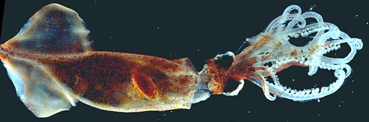
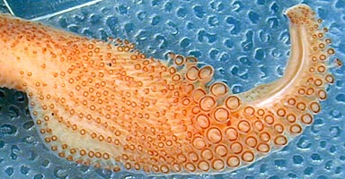
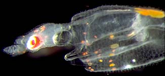

## Phylogeny 

-   « Ancestral Groups  
    -  [Oegopsida](../Oegopsida.md))
    -  [Decapodiformes](../../Decapodiformes.md))
    -  [Coleoidea](../../../Coleoidea.md))
    -  [Cephalopoda](../../../../Cephalopoda.md))
    -  [Mollusca](../../../../../Mollusca.md))
    -  [Bilateria](../../../../../../Bilateria.md))
    -  [Animals](../../../../../../../Animals.md))
    -  [Eukarya](../../../../../../../../Eukarya.md))
    -   [Tree of Life](../../../../../../../../Tree_of_Life.md)

-   ◊ Sibling Groups of  Oegopsida
    -   [Architeuthis](Architeuthis)
    -   Brachioteuthidae
    -   [Chiroteuthid families](Chiroteuthid_families)
    -  [Cranchiidae](Cranchiidae.md))
    -  [Cycloteuthidae](Cycloteuthidae.md))
    -   [Enoploteuthid families](Enoploteuthid_families)
    -   [Histioteuthid families](Histioteuthid_families)
    -  [Gonatidae](Gonatidae.md))
    -   [Lepidoteuthid families](Lepidoteuthid_families)
    -  [Neoteuthidae](Neoteuthidae.md))
    -  [Ommastrephidae](Ommastrephidae.md))
    -  [Onychoteuthidae](Onychoteuthidae.md))
    -   [Thysanoteuthis rhombus](Thysanoteuthis_rhombus)

-   » Sub-Groups 

# Brachioteuthidae [Pfeffer 1908] 

[Marek Lipinski and Richard E. Young]()

Two genera are presently recognized in this family.

Containing group:[Oegopsida](../Oegopsida.md))

## Introduction

Brachioteuthids are small to medium sized squids (ca. 15 cm ML). The
mantle is muscular but generally rather thin. The tentacular clubs are
unusual: The dactylus is normal (four sucker series) but the proximal
part of the manus is greatly expanded and carries numerous small suckers
on long stalks. Another unusual feature is the compact digestive gland
that is located well posterior to the cephalic cartilage in the mantle
cavity (note the spindle-shaped digestive gland in the above photo).

Little is known about the biology of brachioteuthids although Roper and
Vecchione (1996) describe an accumulation observed from a submersible
near the ocean floor at a depth of about 800 m. [An AVI format video clip of a squid from this aggregration is available here](http://www.mnh.si.edu/cephs/rv96/rv96.html#brachio1).

#### Diagnosis

An oegopsid \...

-   with buccal connectives attaching to ventral borders of arms IV.
-   with many series of irregular suckers on proximal manus; distal
    manus and dactylus with four regular series.

### Characteristics

1.  Arms
    1.  Arm suckers in two series.
    2.  Buccal-crown connectives attach to ventral borders of arms IV.
2.  Tentacles
    1.  Proximal region of manus of club greatly expanded with small
        suckers on long stalks in numerous irregular series.
    2.  Dactylus of club with suckers in four series.

       )
        **Figure**. Oral view of tentacular club of ***Brachioteuthis***
        sp., western North Atlantic. Photograph by M. Vecchione.

3.  Funnel
    1.  Funnel-locking cartilage with straight groove.
4.  Mantle
    1.  Mantle muscular but thin.
5.  Fins
    1.  Fins short; anterior lobes free.
6.  Photophores
    1.  Single, large, ventral ocular photophore may or may not be
        present.
7.  Viscera
    1.  Compact digestive gland located well posterior to cephalic
        cartilage.

### Nomenclature

[A list of all nominal genera and species in the Brachioteuthidae can be found here](http://www.tolweb.org/accessory/Brachioteuthidae_Taxa?acc_id=1801).
The list includes the current status and type species of all genera, and
the current status, type repository and type locality of all species and
all pertinent references.

### Life history

Members of the family have characteristic paralarvae. The paralarvae
have long necks containing a fluid-filled sac that extends as a
reservoir into the body (Young, *et al.*, 1985). Contraction of the
reservoir can greatly increase the length of the neck, thereby extending
the head from the mantle.
)

**Figure**. Lateral view of a paralarva of ***Brachioteuthis*** sp. just
a few days post-hatching, Hawaiian waters. Photograph by R. Young.
### References

Roper, C. F. E. and M. Vecchione (1996). In-situ observations on
*Brachioteuthis*: paired behavior, possibly mating. Am. Malac. Bull.,
13(12):55-60.

Young, R. E., R. F. Harman and K. M. Mangold (1985). The eggs and larvae
of Brachioteuthis sp. (Cephalopoda: Teuthoidea) from Hawaiian waters.
Vie Milieu, 35: 203-209.

## Title Illustrations

)

  -------------------------------------------------------------------------------
  Scientific Name ::  Brachioteuthis sp.
  View              Ventral
  Copyright ::         © 1996 [Richard E. Young](http://www.soest.hawaii.edu/%7Eryoung/rey.html) 
  -------------------------------------------------------------------------------

## Confidential Links & Embeds: 

### #is_/same_as :: [Brachioteuthidae](/_Standards/bio/bio~Domain/Eukarya/Animal/Bilateria/Mollusca/Cephalopoda/Coleoidea/Decapodiformes/Oegopsida/Brachioteuthidae.md) 

### #is_/same_as :: [Brachioteuthidae.public](/_public/bio/bio~Domain/Eukarya/Animal/Bilateria/Mollusca/Cephalopoda/Coleoidea/Decapodiformes/Oegopsida/Brachioteuthidae.public.md) 

### #is_/same_as :: [Brachioteuthidae.internal](/_internal/bio/bio~Domain/Eukarya/Animal/Bilateria/Mollusca/Cephalopoda/Coleoidea/Decapodiformes/Oegopsida/Brachioteuthidae.internal.md) 

### #is_/same_as :: [Brachioteuthidae.protect](/_protect/bio/bio~Domain/Eukarya/Animal/Bilateria/Mollusca/Cephalopoda/Coleoidea/Decapodiformes/Oegopsida/Brachioteuthidae.protect.md) 

### #is_/same_as :: [Brachioteuthidae.private](/_private/bio/bio~Domain/Eukarya/Animal/Bilateria/Mollusca/Cephalopoda/Coleoidea/Decapodiformes/Oegopsida/Brachioteuthidae.private.md) 

### #is_/same_as :: [Brachioteuthidae.personal](/_personal/bio/bio~Domain/Eukarya/Animal/Bilateria/Mollusca/Cephalopoda/Coleoidea/Decapodiformes/Oegopsida/Brachioteuthidae.personal.md) 

### #is_/same_as :: [Brachioteuthidae.secret](/_secret/bio/bio~Domain/Eukarya/Animal/Bilateria/Mollusca/Cephalopoda/Coleoidea/Decapodiformes/Oegopsida/Brachioteuthidae.secret.md)

