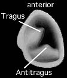

---
aliases:
  - Chiroteuthid
title: Chiroteuthid families
---

## Phylogeny 

-   « Ancestral Groups  
    -  [Oegopsida](../Oegopsida.md))
    -  [Decapodiformes](../../Decapodiformes.md))
    -  [Coleoidea](../../../Coleoidea.md))
    -  [Cephalopoda](../../../../Cephalopoda.md))
    -  [Mollusca](../../../../../Mollusca.md))
    -  [Bilateria](../../../../../../Bilateria.md))
    -  [Animals](../../../../../../../Animals.md))
    -  [Eukarya](../../../../../../../../Eukarya.md))
    -   [Tree of Life](../../../../../../../../Tree_of_Life.md)

-   ◊ Sibling Groups of  Oegopsida
    -   [Architeuthis](Architeuthis)
    -  [Brachioteuthidae](Brachioteuthidae.md))
    -   Chiroteuthid families
    -  [Cranchiidae](Cranchiidae.md))
    -  [Cycloteuthidae](Cycloteuthidae.md))
    -   [Enoploteuthid families](Enoploteuthid_families)
    -   [Histioteuthid families](Histioteuthid_families)
    -  [Gonatidae](Gonatidae.md))
    -   [Lepidoteuthid families](Lepidoteuthid_families)
    -  [Neoteuthidae](Neoteuthidae.md))
    -  [Ommastrephidae](Ommastrephidae.md))
    -  [Onychoteuthidae](Onychoteuthidae.md))
    -   [Thysanoteuthis rhombus](Thysanoteuthis_rhombus)

-   » Sub-Groups
    -   [Batoteuthis skolops](Batoteuthis_skolops)
    -  [Chiroteuthidae](Chiroteuthid/Chiroteuthidae.md))
    -   [Joubiniteuthis portieri](Joubiniteuthis_portieri)
    -   [Magnapinna](Magnapinna)
    -   [Mastigoteuthis](Mastigoteuthis)
    -   [Promachoteuthis](Promachoteuthis)

# Chiroteuthid families 

[Richard E. Young and Michael Vecchione]()

Containing group:[Oegopsida](../Oegopsida.md))

## Introduction

Chiroteuthid families are a group of seven families that share some
similar features but whose inclusion as a monophyletic clade has not
been firmly established. The most distinctive feature of the group is
the loss of the true tentacle club and its replacement by a variety of
unusual clubs that generally have more than four series of suckers.

#### Diagnosis

An oegopsid \...

-   without primary tentacular club (possible exception in
    ***Planctoteuthis**).*
-   with secondary tentacular club.

### Characteristics

1.  Arms
    1.  Suckers generally in two series (exceptions in Joubiniteuthidae
        and some Promachoteuthidae).
    2.  Buccal connectives attach to ventral borders of arms IV.\
        \
2.  Tentacles
    1.  Primary club apparently lost except in ***Planctoteuthis***;
        secondary club present and characterized by:
        1.  Protective membranes of club symmetrical (ie, dorsal and
            ventral membranes identical) when present.
        2.  Keel absent.
        3.  Terminal pad absent.
        4.  Club not expanded.
        5.  Club straight.
3.  Funnel
    1.  Locking-apparatus oval in most taxa but often with inward
        protruding knobs (tragus and antitragus) or other bumps making
        appearance highly variable.\

       )

        **Figure**. Ventral view of a funnel locking-apparatus of
        ***Chiroteuthis joubini***. Drawing by A. Hart modified.
4.  Fins
    1.  Fins usually terminal (muscular mantle terminates in anterior
        half of fins).\
        \
5.  Tail
    1.  A tail, often very long, and supported by the secondary conus of
        the gladius, generally present.

### Discussion of Phylogenetic Relationships

The relationships among the families of this apparent clade are obscure
with one exception. The Chiroteuthididae and Mastigoteuthididae have
sometimes been placed within the same family due to similarities in the
shape of the funnel locking-apparatus and the presence of elongate arms
IV (e.g., Chun, 1910).

### References

Chun, C. 1910. Die Cephalopoden. Oegopsida. Wissenschaftliche Ergebnisse
der Deutschen Tiefsee-Expedition, \"Valdivia\" 1898-1899, 18: 1-522 +
Atlas.

## Title Illustrations



  -------------------------------------------------------------------------------------------------------------
  Scientific Name ::   Batoteuthis scolops, Chiroteuthis veranyi, Joubiniteuthis portieri, Magnapinna pacifica, Mastigoteuthis glaukopis, Promachoteuthis megaptera
  Acknowledgements   Batoteuthis scolops illustration by A. D. Hart, Chiroteuthis veranyi photograph copyright © 1996, E. McSweeny, Joubiniteuthis portieri photograph copyright © 1996, R. E. Young, Megapinna pacifica photograph copyright © 1998, Richard E. Young), Mastigoteuthis glaukopis from Chun, 1910, Promachoteuthis megaptera from Okutani, 1983.
  Copyright ::          © 1996 [Richard E. Young](http://www.soest.hawaii.edu/%7Eryoung/rey.html) 
  -------------------------------------------------------------------------------------------------------------

## Confidential Links & Embeds: 

### #is_/same_as :: [Chiroteuthid](/_Standards/bio/bio~Domain/Eukarya/Animal/Bilateria/Mollusca/Cephalopoda/Coleoidea/Decapodiformes/Oegopsida/Chiroteuthid.md) 

### #is_/same_as :: [Chiroteuthid.public](/_public/bio/bio~Domain/Eukarya/Animal/Bilateria/Mollusca/Cephalopoda/Coleoidea/Decapodiformes/Oegopsida/Chiroteuthid.public.md) 

### #is_/same_as :: [Chiroteuthid.internal](/_internal/bio/bio~Domain/Eukarya/Animal/Bilateria/Mollusca/Cephalopoda/Coleoidea/Decapodiformes/Oegopsida/Chiroteuthid.internal.md) 

### #is_/same_as :: [Chiroteuthid.protect](/_protect/bio/bio~Domain/Eukarya/Animal/Bilateria/Mollusca/Cephalopoda/Coleoidea/Decapodiformes/Oegopsida/Chiroteuthid.protect.md) 

### #is_/same_as :: [Chiroteuthid.private](/_private/bio/bio~Domain/Eukarya/Animal/Bilateria/Mollusca/Cephalopoda/Coleoidea/Decapodiformes/Oegopsida/Chiroteuthid.private.md) 

### #is_/same_as :: [Chiroteuthid.personal](/_personal/bio/bio~Domain/Eukarya/Animal/Bilateria/Mollusca/Cephalopoda/Coleoidea/Decapodiformes/Oegopsida/Chiroteuthid.personal.md) 

### #is_/same_as :: [Chiroteuthid.secret](/_secret/bio/bio~Domain/Eukarya/Animal/Bilateria/Mollusca/Cephalopoda/Coleoidea/Decapodiformes/Oegopsida/Chiroteuthid.secret.md)

