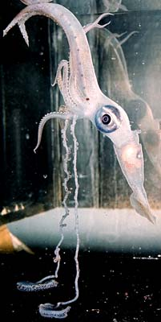
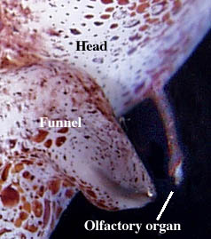
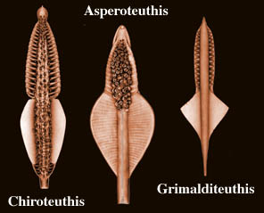
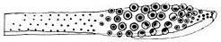
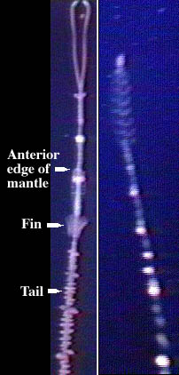

---
aliases:
  - Chiroteuthidae
title: Chiroteuthidae
---

## Phylogeny 

-   « Ancestral Groups  
    -   [Chiroteuthid families](Chiroteuthid_families)
    -  [Oegopsida](../../Oegopsida.md) 
    -  [Decapodiformes](../../../Decapodiformes.md) 
    -  [Coleoidea](../../../../Coleoidea.md) 
    -  [Cephalopoda](../../../../../Cephalopoda.md) 
    -  [Mollusca](../../../../../../Mollusca.md) 
    -  [Bilateria](../../../../../../../Bilateria.md) 
    -  [Animals](../../../../../../../../Animals.md) 
    -  [Eukarya](../../../../../../../../../Eukarya.md) 
    -   [Tree of Life](../../../../../../../../../Tree_of_Life.md)

-   ◊ Sibling Groups of  Chiroteuthid families
    -   [Batoteuthis skolops](Batoteuthis_skolops)
    -   Chiroteuthidae
    -   [Joubiniteuthis portieri](Joubiniteuthis_portieri)
    -   [Magnapinna](Magnapinna)
    -   [Mastigoteuthis](Mastigoteuthis)
    -   [Promachoteuthis](Promachoteuthis)

-   » Sub-Groups
    -  [Asperoteuthis](Chiroteuthidae/Asperoteuthis.md) 
    -  [Chiroteuthis](Chiroteuthidae/Chiroteuthis.md) 
    -   [Grimalditeuthis         bonplandi](Grimalditeuthis_bonplandi)
    -  [Planctoteuthis](Chiroteuthidae/Planctoteuthis.md) 
    -   [New Genus B](New_Genus_B)
    -   [New Genus C](New_Genus_C)

# Chiroteuthidae [Gray, 1849] 

[Richard E. Young and Clyde F. E. Roper]()

This family contains the following genera and about 19 species, but the
species-level taxonomy is poorly understood.

Containing group:[Chiroteuthid families](../Chiroteuthid.md) 

## Introduction

Chiroteuthids are small to medium in size (up to 78 cm ML), rather
gelatinous, slow moving, deep-sea squids usually with elongate necks and
slender bodies. Considerable morphological differences exist among
genera, three of which in the past were placed in separate families.
However, they all share a very distinctive paralarva known as the
doratopsis stage. Members of the family have numerous chambers in the
arms, head and mantle filled with a light-weight fluid, ammonium
cloride, that provides near-neutral buoyancy for the squids. Most
species have extremely long, slender tentacles.

#### Diagnosis

Member of the chiroteuthid families \...

-   with a doratopsis paralarva (unique character).

### Characteristics

1.  Arms
    1.  Arms with suckers in two series.\
        \
2.  Tentacles
    1.  Club very elongate and divided into two or three portions by
        symmetrical protective membranes except in ***Planctoteuthis**.*
    2.  Club suckers in four series or absent *(**Grimalditeuthis**)* in
        subadults.\
        \
3.  Head
    1.  Head with an elongate neck and usually a brachial pillar in
        subadults.\
        \
4.  Funnel
    1.  Funnel locking-apparatus often oval and with tragus and
        antitragus.\
        \
5.  Photophores
    1.  Present in some taxa.\
        \
6.  Paralarva
    1.  Doratopsis type (see Life History).

#### Comments

The presence of a doratopsis paralarva is the only character that is
unique to the family. Additional features of the family include an
indistinct eyelid sinus, absence of occipital folds, olfactory organs on
long stalks (=slender papillae).
 

**Figure**. Medial view of the olfactory organ of ***Chiroteuthis*** sp.
from Hawaiian waters. Photograph by R. Young.

The following table compares subadults of the five chiroteuthid genera.
Subadult characters for genus B, a paralarva, are assumed.

  ------------ ---------- -------- ----
  Character                  *Planctoteuthis*   *Chiroteuthis*        *Asperoteuthis*     *Grimalditeuthis*   Genus B      Genus C
  **Funnel valve**           Absent             Present               Present             Present             ????         ????
  **Tentacle pads**          Absent             Present               Present             Absent              ????         Absent?
  **Arm IV photophores**     Absent             Present               Absent              Absent              ????         Absent
  **Arms IV**                Variable           Enlarged              Not enlarged        Not enlarged        ????         ????
  **Visceral photophores**   Absent             Variable              Absent              Absent              ????         Absent
  **Funnel locking-app.**    Antitragus         Tragus & antitragus   Variable            Fused               Antitragus   ????
  **Arm IV suckers**         Absent distally    Present               Present             Present             ????         ????
  **Club suckers**           Present            Present               Absent proximally   Absent              Present      Present
  **Club sucker series**     4                  4                     4                   0                   6            4
  ------------ ---------- -------- ----

#### Comments

The position of the olfactory papilla is useful in separating genera in
the doratopsis stage: The organ lies near the funnel in
***Grimalditeuthis**,* just behind the eye in ***Chiroteuthis*** and
***Planctoteuthis*** and half-way between the funnel and eye in
***Asperoteuthis**.*

### Nomenclature

#### Uncertain species:

The taxonomic position of several specimens that anchor species names is
uncertain.

1.  Pfeffer (1912) described a small doratopsis as ***C. planctonica***
    that he later placed in ***Planctoteuthis*** with reservations. The
    proper placement of this specimen is uncertain.
2.  Goodrich described a young ***Chiroteuthis*** from the Bay of Bengal
    that he called ***Doratopsis pellucida***. The placement of this
    specimen is uncertain although it has often been assummed to be the
    young of ***C. macrosoma*** (= ***C. picteti***) (e.g., Nesis 1982),
    presumably due to the proximity of type localities.

[A list of all nominal genera and species in the Chiroteuthidae can be found here.](http://www.tolweb.org/accessory/Chiroteuthidae_Taxa?acc_id=1802)
The list includes the current status and type species of all genera, and
the current status, type repository and type locality of all species and
all pertinent references.

### Discussion of Phylogenetic Relationships

The relationships among the genera have not been examined with cladistic
methodology. Three genera, however, can be arranged in an ordered series
based on the progressive loss of suckers on the tentacular clubs. In
***Chiroteuthis*** spp. the oral surface of the club contains suckers in
four series throughout its length. In ***Asperoteuthis*** spp. the
proximal half of the club is bare and the distal half has suckers in
four series. In ***Grimalditeuthis*** the entire oral surface of the
club lacks suckers.
 

**Figure**. Oral views of the clubs of ***Chiroteuthis joubini***
(left), ***Asperoteuthis acanthoderma*** (middle) and ***Grimalditeuthis
bonplandi*** (right). Drawing from Young, et al. (1999).

Roper and Young (1967) suggested that ***Planktoteuthis*** is
essentially a mature doratopsis stage, based on features such as the
presence in the subadult of the doratopsid tentacular club and the
absence of photophores. They suggest, therefore, that the genus arose
via neoteny (strong heterochrony). This interpretation gains support
from the appearance, then disappearance, of suckers on the tentacular
stalks of the paralarva which typically form the secondary club (see
Young, 1991). The closest relative to ***Planktoteuthis*** among the
other genera is unknown.
 

**Figure**. Oral view of the doratopsid club of **Planctoteuthis** sp.
A. Drawing from Young (1991).

The distinctive doratopsid club poses a problem: Is this paralarval club
similar to the true adult club (i.e., the ancestral adult club) that is
absent in the chiroteuthid families? Suckers at the base of the subadult
club of ***Planctoteuthis*** have a distinctly different structure
(i.e., wider aperatures) from those of the remaining club. These basal
suckers may represent remnants of a carpal locking-apparatus and, if so,
provide an important clue about the relationships of the chiroteuthid
families to other oegopsid families.

### Unusual features

Doratopsis paralarvae and the adult stages of some species have a
gladius that extends well posterior to the fins and supports a
remarkable \"tail\" that bears a variety of ornamentation, mostly of
uncertain function. The ornamentation may be in the form of an oval
structure superficially resembling a pair of fins, or a series of small
flaps and/or oval bulbs. The latter contain anastomosing canals filled
with fluid that is lighter than seawater (Hunt, 1996). The overall
appearance in some cases is reminescent of a siphonophore (Vecchione, et
al., 1992)
 

**Figure**. Still frames from a videotape of a doratopsis (left) of
**Chiroteuthis calyx** and the siphonophore **Nanomia bijuga** (right)
recorded in-situ from a remotely operated vehicle (ROV) in the eastern
North Pacific off California (courtesy of the Monterey Bay Aquarium
Research Institute). [An AVI format video clip of this animal can be seen at Cephalopods in Action.](http://www.nmnh.si.edu/cephs/vrr92/cephs5.html#doratop1)

### Life history

[All species have doratopsis paralarvae](http://www.tolweb.org/accessory/Chiroteuthid_Doratopsis_Stage?acc_id=656)
(Young, 1991).

The paralarvae live in the upper few hundred meters of the open ocean.
They generally reach a very large size (up to 90 mm ML) and undergo a
marked but, perhaps, gradual transition to the subadult stage. Among the
changes that take place are the resorption of the paralarval tentacle
clubs and formation of new clubs along the tentacular stalks, great
elongation of the tentacles in most species, development of photophores
in some species, loss of the tail in most species and usually a marked
change in body proportions. The duration of the doratopsis stage is
unknown.

### References

Goodrich E. S. 1896. Report on a collection of Cephalopoda from the
Calcutta Museum. London, Transactions of the Linnean Society, series 2,
7: 1-24.

Hunt, J. C. 1996. The behavior and ecology of midwater cephalopods from
Monterey Bay: Submersible and laboratory observations. Ph. D.
Dissertation, Univ. Calif. Los Angeles. 231 pp.

Nesis, K. N. 1982. Abridged key to the cephalopod mollusks of the
world\'s ocean. 385+ii pp. Light and Food Industry Publishing House,
Moscow. (In Russian.). Translated into English by B. S. Levitov, ed. by
L. A. Burgess (1987), Cephalopods of the world. T. F. H. Publications,
Neptune City, NJ, 351pp.

Pfeffer, G. 1912. Die Cephalopoden der Plankton-Expedition. Ergebniss
der Plankton-Expedition der Humboldt-Stiftung. 2: 1-815.

Roper, C. F. E. and R. E. Young. 1967. A review of the Valbyteuthidae
and an evaluation of its relationship with the Chiroteuthidae. Proc.
U.S. Nat. Mus., 123: 1-9.

Vecchione, M., B. H. Robison, and C. F.E. Roper. 1992. A tale of two
species: tail morphology in paralarval *Chiroteuthis* (Cephalopoda:
Chiroteuthidae). Proceeding of the Biological Society of Washington
105(4): 683-692.

Verrill, A.E. 1884. Second catalogue of the Mollusca, recently added to
the fauna of the New England coast and the adjacent parts of the
Atlantic, consisting mostly of deep-sea species, with notes on others
previously recorded. Trans. Connecticut Academy Sciences, 6: 133-294.

Young, R. E. 1991. Chiroteuthid and related paralarvae from Hawaiian
waters. Bull. Mar. Sci., 49: 162-185.

Young, R. E., M. Vecchione and D. Donovan. 1998. The evolution of
coleoid cephalopods and their present biodiversity and ecology. South
African Jour. Mar. Sci., 20: 393-420.

## Title Illustrations

 

  ----------
  scientific_name ::  Chiroteuthis veranyi
  location ::        Antarctic waters
  copyright ::         © 1996 E. McSweeny
  ----------

## Confidential Links & Embeds: 

### #is_/same_as :: [[/_Standards/bio/bio~Domain/Eukarya/Animal/Bilateria/Mollusca/Cephalopoda/Coleoidea/Decapodiformes/Oegopsida/Chiroteuthid/Chiroteuthidae|Chiroteuthidae]] 

### #is_/same_as :: [[/_public/bio/bio~Domain/Eukarya/Animal/Bilateria/Mollusca/Cephalopoda/Coleoidea/Decapodiformes/Oegopsida/Chiroteuthid/Chiroteuthidae.public|Chiroteuthidae.public]] 

### #is_/same_as :: [[/_internal/bio/bio~Domain/Eukarya/Animal/Bilateria/Mollusca/Cephalopoda/Coleoidea/Decapodiformes/Oegopsida/Chiroteuthid/Chiroteuthidae.internal|Chiroteuthidae.internal]] 

### #is_/same_as :: [[/_protect/bio/bio~Domain/Eukarya/Animal/Bilateria/Mollusca/Cephalopoda/Coleoidea/Decapodiformes/Oegopsida/Chiroteuthid/Chiroteuthidae.protect|Chiroteuthidae.protect]] 

### #is_/same_as :: [[/_private/bio/bio~Domain/Eukarya/Animal/Bilateria/Mollusca/Cephalopoda/Coleoidea/Decapodiformes/Oegopsida/Chiroteuthid/Chiroteuthidae.private|Chiroteuthidae.private]] 

### #is_/same_as :: [[/_personal/bio/bio~Domain/Eukarya/Animal/Bilateria/Mollusca/Cephalopoda/Coleoidea/Decapodiformes/Oegopsida/Chiroteuthid/Chiroteuthidae.personal|Chiroteuthidae.personal]] 

### #is_/same_as :: [[/_secret/bio/bio~Domain/Eukarya/Animal/Bilateria/Mollusca/Cephalopoda/Coleoidea/Decapodiformes/Oegopsida/Chiroteuthid/Chiroteuthidae.secret|Chiroteuthidae.secret]] 

