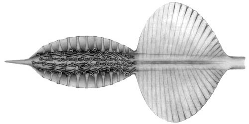
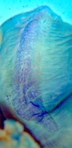
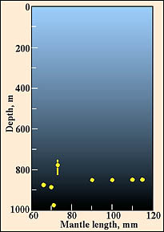

---
title: "Asperoteuthis mangoldae"
---

## Phylogeny 

-   « Ancestral Groups  
    -  [Asperoteuthis](../Asperoteuthis.md))
    -  [Chiroteuthidae](../../Chiroteuthidae.md))
    -   [Chiroteuthid families](Chiroteuthid_families)
    -  [Oegopsida](../../../../Oegopsida.md))
    -  [Decapodiformes](../../../../../Decapodiformes.md))
    -  [Coleoidea](../../../../../../Coleoidea.md))
    -  [Cephalopoda](../../../../../../../Cephalopoda.md))
    -  [Mollusca](../../../../../../../../Mollusca.md))
    -  [Bilateria](../../../../../../../../../Bilateria.md))
    -  [Animals](../../../../../../../../../../Animals.md))
    -  [Eukarya](../../../../../../../../../../../Eukarya.md))
    -   [Tree of Life](../../../../../../../../../../../Tree_of_Life.md)

-   ◊ Sibling Groups of  Asperoteuthis
    -   [Asperoteuthis         acanthoderma](Asperoteuthis_acanthoderma)
    -   Asperoteuthis mangoldae
    -   [Asperoteuthis sp. B](Asperoteuthis_sp._B)

-   » Sub-Groups 

# *Asperoteuthis mangoldae* [Young, Vecchione and Roper, 2007] 

[Richard E. Young, Michael Vecchione, and Clyde F. E. Roper]()
)

Containing group: [Asperoteuthis](../Asperoteuthis.md))*

## Introduction

***Asperoteuthis mangoldae*** (first known as ***Asperoteuthis*** sp. A
on this page) is very gelatinous, with about the same consistency as
***Grimalditeuthis bonplandi***. It has elongate ventral arms in small
squid, but these get relatively short in large squid. It lacks the
tubercles and elongate fins of ***A. acanthoderma***.

#### Brief diagnosis:

An ***Asperoteuthis*** \...

-   without integumental tubercules.
-   with comma-shaped groove in funnel locking-apparatus.

### Characteristics

1.  Arms
    1.  Largest arm suckers with 6-10 truncated teeth on distal half of
        ring.\
        \
2.  Tentacles
    1.  Suckers with ca. 8 large, truncated teeth on distal half of
        inner ring grading to ca. 17 small, truncated teeth on proximal
        half.

    2.  Club with very broad proximal protective membrane and long
        terminal papilla.\

       ){height="250" width="500"}

        \

        **Figure**. Oral view of tentacular club of ***A. mangoldae***,
        NMNH 729749, holotype. Drawing by A. Hart.
3.  Funnel
    1.  funnel-locking apparatus oval with a rounded ridge in the
        midline (tragus?) and an elongate, deep, curving groove
        laterally; mantle locking component with matching curved ridge.
        Antitragus absent.\

       ){height="250" width="122"}

        \

        **Figure**. Frontal views of the funnel-mantle locking apparatus
        of ***A. mangoldae***. **Left** - Funnel (left) and mantle
        (right) components, NMNH 729752. Drawings by A. Hart.
        **Right** - Funnel (left) and mantle (right) components, 100 mm
        ML, mature male, paratype, stained with methylene blue.
        Photographs by R. Young.
4.  Mantle
    1.  Mantle and other integument without tubercles.\
        \
5.  Fins
    1.  Fin length 40% of ML.
    2.  Fin width approximately equals fin length.\
        \
6.  Photophores
    1.  Club-tip photophore small, terminal papilla large.
    2.  Small embedded photophores present on aboral surface of club.
    3.  Ventral eyeball photophore present.
    4.  Luminescent pads present on tentacle stalks.

#### Comments

[More details of the description can be found here.](http://www.tolweb.org/notes/?note_id=2788)

***A. mangoldae*** apparently possesses a large secondary tail but a
specimen with an attached tail has not been captured.
)

**Figure**. The drawing is a reconstruction based on the collection of a
damaged tail in the same tow with a small (80 mm ML) ***A. mangoldae***.
The tail did not match the broken end of the gladius from the specimen
indicating that a piece of the tail was missing. Tentacular clubs
missing from specimen, added to drawing. Drawing by A. Hart.
)

**Figure**. The photograph shows the tail of a large ***Asperoteuthis***
from the same locality and possibly belonging to a large ***A.
mangoldae*** although the shape differs greatly from that of the small
specimen above.

Very few ***A. mangoldae*** have been captured with the clubs attached
as the long, thin tentacles are easily broken off during capture. With
tentacles missing, it can be confused with ***Grimalditeuthis
bomplandi*** in its general shape and consistency. However, many
differences easily separate them including presence of the funnel-mantle
fusion and three large papillae on each arm-sucker base in ***G.
bomplandi***.

In addition to the features listed in the Diagnosis, ***A. mangoldae***
differs from ***A. acanthoderma*** in (1) the weaker consistency of the
arms and mantle, (2) the dentition of the arm (6-10 vs 3-4) and club (25
vs 9 teeth) suckers, (3) the smaller and more circular terminal club
photophore, (4) the longer terminal papilla on the club and (5) the
broader fins (width ca 115% of length vs ca 75% of length). In addition,
the club suckers of ***A. acanthoderma*** are on shorter stalks, the
sucker rings are more elongated in the oral-aboal directiion and suckers
of arms IV are more densely packed.

### Life History

[Paralarvae are described here.](http://www.tolweb.org/notes/?note_id=2789)

### Distribution

#### Vertical distribution

Off Hawaii eight specimens were captured during a study to examine the
vertical distribution of cephalopods. All specimens were captured during
the day at depths between 775 and 975 m. The absence of captures in the
heavily sampled waters from 0-400m depth at night suggests that this
species is not a vertical migrator.
)

**Figure**. Vertical distribution chart of ***A. mangoldae***. Captures
were made with both open and opening/closing trawls. **Bars** - fishing
depth-range of opening/closing trawl. **Circle** - Modal fishing depth
for either trawl. **Yellow-filled circles** - Day capture.

#### Geographical distribution

Type locality: Hawaiian waters at 21°25\'N, 158°20.5\'W. The holotype
was captured in an opening-closing trawl between 820 and 870 m depth
during the day (1411-1616 hrs). This species is known only from the
waters off the Hawaiian Islands. Both ***A. mangoldae*** and
***Asperoteuthis acanthoderma*** occur in these waters but ***A.
mangoldae*** is much more abundant.

### References

Young, R. E. 1978. Vertical distribution and photosensitive vesicles of
pelagic cephalopods from Hawaiian waters. Fish. Bull., 76: 583-615.

## Title Illustrations

)

  --------------------------------------------------------------------------
  Scientific Name ::   Asperoteuthis mangoldae
  Location ::         Hawaiian waters
  Creator            A. D. Hart
  Sex ::              Male
  Life Cycle Stage ::   Immature
  View               Ventral
  Size               80 mm ML
  Collection         NMNH 729752
  Type               Holotype
  Copyright ::          © [Clyde F. E. Roper](mailto:roper.clyde@nmnh.si.edu) 
  --------------------------------------------------------------------------

## Confidential Links & Embeds: 

### #is_/same_as ::[mangoldae](mangoldae.md)) 

### #is_/same_as :: [mangoldae.public](/_public/bio/bio~Domain/Eukarya/Animal/Bilateria/Mollusca/Cephalopoda/Coleoidea/Decapodiformes/Oegopsida/Chiroteuthid/Chiroteuthidae/Asperoteuthis/mangoldae.public.md) 

### #is_/same_as :: [mangoldae.internal](/_internal/bio/bio~Domain/Eukarya/Animal/Bilateria/Mollusca/Cephalopoda/Coleoidea/Decapodiformes/Oegopsida/Chiroteuthid/Chiroteuthidae/Asperoteuthis/mangoldae.internal.md) 

### #is_/same_as :: [mangoldae.protect](/_protect/bio/bio~Domain/Eukarya/Animal/Bilateria/Mollusca/Cephalopoda/Coleoidea/Decapodiformes/Oegopsida/Chiroteuthid/Chiroteuthidae/Asperoteuthis/mangoldae.protect.md) 

### #is_/same_as :: [mangoldae.private](/_private/bio/bio~Domain/Eukarya/Animal/Bilateria/Mollusca/Cephalopoda/Coleoidea/Decapodiformes/Oegopsida/Chiroteuthid/Chiroteuthidae/Asperoteuthis/mangoldae.private.md) 

### #is_/same_as :: [mangoldae.personal](/_personal/bio/bio~Domain/Eukarya/Animal/Bilateria/Mollusca/Cephalopoda/Coleoidea/Decapodiformes/Oegopsida/Chiroteuthid/Chiroteuthidae/Asperoteuthis/mangoldae.personal.md) 

### #is_/same_as :: [mangoldae.secret](/_secret/bio/bio~Domain/Eukarya/Animal/Bilateria/Mollusca/Cephalopoda/Coleoidea/Decapodiformes/Oegopsida/Chiroteuthid/Chiroteuthidae/Asperoteuthis/mangoldae.secret.md)

