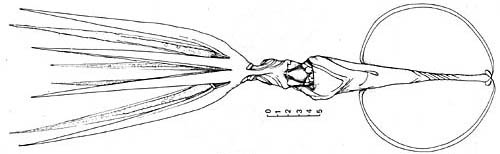
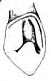

## Phylogeny 

-   « Ancestral Groups  
    -  [Asperoteuthis](../Asperoteuthis.md))
    -  [Chiroteuthidae](../../Chiroteuthidae.md))
    -   [Chiroteuthid families](Chiroteuthid_families)
    -  [Oegopsida](../../../../Oegopsida.md))
    -  [Decapodiformes](../../../../../Decapodiformes.md))
    -  [Coleoidea](../../../../../../Coleoidea.md))
    -  [Cephalopoda](../../../../../../../Cephalopoda.md))
    -  [Mollusca](../../../../../../../../Mollusca.md))
    -  [Bilateria](../../../../../../../../../Bilateria.md))
    -  [Animals](../../../../../../../../../../Animals.md))
    -  [Eukarya](../../../../../../../../../../../Eukarya.md))
    -   [Tree of Life](../../../../../../../../../../../Tree_of_Life.md)

-   ◊ Sibling Groups of  Asperoteuthis
    -   [Asperoteuthis         acanthoderma](Asperoteuthis_acanthoderma)
    -   [Asperoteuthis mangoldae](Asperoteuthis_mangoldae)
    -   Asperoteuthis sp. B

-   » Sub-Groups 

# *Asperoteuthis sp. B* 

[Richard E. Young and Clyde F. E. Roper]()

Containing group: [Asperoteuthis](../Asperoteuthis.md))*

## Introduction

Clarke (1980) described a squid as **Mastigoteuthis**? A. Nesis
(1982/87) indicated that this was the same as his **Chiroteuthis** sp.
n. mentioned in a 1974 paper. Clarke\'s specimen was incompletely
described as he had only two specimens from the stomach of a sperm whale
landed at the whaling station on South Georgia Island. The subequal
arms, the large, round fin, the presence of \"glandular discs\" on the
stubs of the tentacle stalks and the lack of arm IV photophores indicate
that this is a new species of **Asperoteuthis** whose large fin
distinguishes it from the other species of this genus.

### Characteristics

Species-level characters:

1.  Arms
    1.  Arms II and III longest
    2.  Sucker ring dentition unknown.

2.  Tentacular clubs
    1.  Unknown.

3.  ::::: 

   )
    Funnel locking-apparatus from Clarke, 1980.

    Funnel
    1.  funnel-locking apparatus with deep central groove and apparently
        a tragus and antitragus.

4.  Fins
    1.  Fin length ca 60-65% of ML; fin width ca. 50-55% of ML.\

5.  Measurements.
    1.  Mantle length = 175-185 mm. Arms I ca. 80-85% of ML. Arms III
        ca. 110-120% of ML. Arms IV ca. 95-105% 0f ML. Head length ca
        30-35% of ML

#### Comments

This species is known from two specimens (17.5 cm ML, mature male, 18.5
cm ML, sex ?) which had a reddish-brown color after preservation. They
have a unique small muscular pad on each side of the posterior tip of
the ventral mantle (see drawing). A funnel valve, ventral ocular
photophores and pads (photophores) on the tentacle stalk are present as
in all members of the genus. Clarke (1980) describes the beaks in
detail. This species should remain unnamed until tentacle clubs and
sucker dentition can be described.

### Distribution

This species is known only from the region of South Georgia and the
South Orkney islands in Antarctic waters.

### References

Clarke, M. R. 1980. Cephalopoda in the diet of sperm whales of the
Southern Hemisphere and their bearing on sperm whale biology. Discovery
Reports, 37: 1-324.

Nesis, K. N. 1974. Oceanic cephalopods of the southwestern Atlantic
Ocean. Trudy Inst. Okean. Shirshova Akad. Nauk SSSR, 98: 51-75.

Nesis, K. N. 1982. Abridged key to the cephalopod mollusks of the
world\'s ocean. 385+ii pp. Light and Food Industry Publishing House,
Moscow. (In Russian.). Translated into English by B. S. Levitov, ed. by
L. A. Burgess (1987), Cephalopods of the world. T. F. H. Publications,
Neptune City, NJ, 351pp.

## Title Illustrations

)

  ---------------------------------------------------------
  Scientific Name ::  Asperoteuthis sp. B
  Reference         Drawing from Clarke, M. R. 1980. Cephalopoda in the diet of sperm whales of the Southern Hemisphere and their bearing on sperm whale biology. Discovery Reports 37: 1-324.
  Copyright ::         © 1980 M.R. Clarke
  ---------------------------------------------------------

## Confidential Links & Embeds: 

### #is_/same_as :: [sp. B](/_Standards/bio/bio~Domain/Eukarya/Animal/Bilateria/Mollusca/Cephalopoda/Coleoidea/Decapodiformes/Oegopsida/Chiroteuthid/Chiroteuthidae/Asperoteuthis/sp. B.md) 

### #is_/same_as :: [sp. B.public](/_public/bio/bio~Domain/Eukarya/Animal/Bilateria/Mollusca/Cephalopoda/Coleoidea/Decapodiformes/Oegopsida/Chiroteuthid/Chiroteuthidae/Asperoteuthis/sp. B.public.md) 

### #is_/same_as :: [sp. B.internal](/_internal/bio/bio~Domain/Eukarya/Animal/Bilateria/Mollusca/Cephalopoda/Coleoidea/Decapodiformes/Oegopsida/Chiroteuthid/Chiroteuthidae/Asperoteuthis/sp. B.internal.md) 

### #is_/same_as :: [sp. B.protect](/_protect/bio/bio~Domain/Eukarya/Animal/Bilateria/Mollusca/Cephalopoda/Coleoidea/Decapodiformes/Oegopsida/Chiroteuthid/Chiroteuthidae/Asperoteuthis/sp. B.protect.md) 

### #is_/same_as :: [sp. B.private](/_private/bio/bio~Domain/Eukarya/Animal/Bilateria/Mollusca/Cephalopoda/Coleoidea/Decapodiformes/Oegopsida/Chiroteuthid/Chiroteuthidae/Asperoteuthis/sp. B.private.md) 

### #is_/same_as :: [sp. B.personal](/_personal/bio/bio~Domain/Eukarya/Animal/Bilateria/Mollusca/Cephalopoda/Coleoidea/Decapodiformes/Oegopsida/Chiroteuthid/Chiroteuthidae/Asperoteuthis/sp. B.personal.md) 

### #is_/same_as :: [sp. B.secret](/_secret/bio/bio~Domain/Eukarya/Animal/Bilateria/Mollusca/Cephalopoda/Coleoidea/Decapodiformes/Oegopsida/Chiroteuthid/Chiroteuthidae/Asperoteuthis/sp. B.secret.md)

