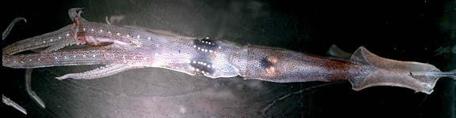
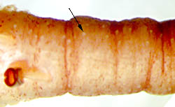
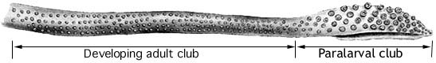
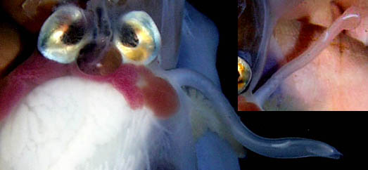

---
aliases:
  - Chiroteuthis
title: Chiroteuthis
---

## Phylogeny 

-   « Ancestral Groups  
    -  [Chiroteuthidae](../Chiroteuthidae.md) 
    -   [Chiroteuthid families](Chiroteuthid_families)
    -  [Oegopsida](../../../Oegopsida.md) 
    -  [Decapodiformes](../../../../Decapodiformes.md) 
    -  [Coleoidea](../../../../../Coleoidea.md) 
    -  [Cephalopoda](../../../../../../Cephalopoda.md) 
    -  [Mollusca](../../../../../../../Mollusca.md) 
    -  [Bilateria](../../../../../../../../Bilateria.md) 
    -  [Animals](../../../../../../../../../Animals.md) 
    -  [Eukarya](../../../../../../../../../../Eukarya.md) 
    -   [Tree of Life](../../../../../../../../../../Tree_of_Life.md)

-   ◊ Sibling Groups of  Chiroteuthidae
    -  [Asperoteuthis](Asperoteuthis.md) 
    -   Chiroteuthis
    -   [Grimalditeuthis         bonplandi](Grimalditeuthis_bonplandi)
    -  [Planctoteuthis](Planctoteuthis.md) 
    -   [New Genus B](New_Genus_B)
    -   [New Genus C](New_Genus_C)

-   » Sub-Groups
    -   [Chiroteuthis sp. B2](Chiroteuthis_sp._B2)
    -   [Chiroteuthis calyx](Chiroteuthis_calyx)
    -   [Chiroteuthis joubini](Chiroteuthis_joubini)
    -   [Chiroteuthis mega](Chiroteuthis_mega)
    -   [Chiroteuthis picteti](Chiroteuthis_picteti)
    -   [Chiroteuthis spoeli](Chiroteuthis_spoeli)
    -   [Chiroteuthis veranyi](Chiroteuthis_veranyi)

# *Chiroteuthis* [Orbigny, 1841] 

[Clyde F. E. Roper and Richard E. Young]()

This genus has six recognized species and at least one undescribed
species.

Containing group:[Chiroteuthidae](../Chiroteuthidae.md) 

## Introduction

Species of ***Chiroteuthis*** are the most commonly encountered species
of the family. They possess a variety of photophores that can produce
some unusual [bioluminescent displays](http://www.tolweb.org/accessory/Chiroteuthis_Bioluminescence?acc_id=686).
The title photograph shows the series of photophores along the ventral
arms, the rows of photophores on the ventral surface of the eyes (the
arrangement of ocular photophores, however, varies with the species) and
the visceral photophores (absent in ***C. mega***). The tentacles carry
a series of complex, peculiarly constructed, pad-like photophores along
the tentacular stalk that distally are mostly embedded in the aboral
surface of the club. The last member of this photophore series, the
club-tip photophore, however, is greatly enlarged and possesses muscular
lids that open and close over the organ. The function(s) of these
photophores are unknown although the club-tip photophore could act as a
lure to attract prey (Voss, 1956). The very long tentacles can be
completely retracted into elongate tubes formed by the broad lateral
membranes (=[tentacular sheath](http://www.tolweb.org/accessory/Chiroteuthis_Tentacular_Sheath?acc_id=687))
of the fourth arms. Arms IV (the ventral arms) are not only much longer
but, also, thicker than the other arms. The tentacular clubs are
distinctive at the generic level and often at the specific level. The
large fourth arms contain many large vesicles that hold ammonium
chloride. This low-density fluid apparently, is responsible for the
typical oblique orientation of the squid with the arms uppermost, as
observed from submersibles and as shown in the title photograph on the
family page.

#### Diagnosis

A chiroteuthid \...

-   with suckers on both proximal and distal regions of club.
-   with typical tragus and antitragus on funnel locking-apparatus.
-   with a row of photophores along each arm IV.

### Characteristics

1.  Arms
    1.  Arms IV much the longest and greatly thickened.\
2.  Tentacles
    1.  Suckers in four series throughout club.\
3.  Head
    1.  Olfactory organ located on stalk just posterior to each eye.\
4.  Funnel
    1.  Funnel valve present.
    2.  Locking-apparatus oval with typical tragus and antitragus.\
5.  Photophores
    1.  A series of silver photogenic spheres extends along arms IV
        (each photophore alternates with a lateral arm sucker).\

        

        **Figure**. Oral view of a portion of the abraided arm IV of
        ***C. picteti***, Hawaiian waters. Each spherical Arm IV
        photophore (arrows) is covered with chromatophores and paired
        with a sucker from the dorsal series on the arm (the middle
        sucker of the ventral series was lost during capture). Also note
        the broad lateral membrane (=tentacular sheath) at the base of
        the arrows. Photograph by R. Young.

    2.  Visceral photophores present in all but one species.

    3.  Ocular photophores present as stripes or series of round organs
        or combination of both.

    4.  Pad-like photophores present on tentacular stalk, distally
        embedded in club.\

       )

        **Figure**. Oral view of the tentacle-stalk at base of the club
        of ***Chiroteuthis*** sp., Hawaiian waters. The arrow points to
        one of many small, light-colored photophores present on the
        stalk but often difficult to detect.

### Discussion of Phylogenetic Relationships

A cladistic analysis has not been done on this group. Nevertheless, the
species can be grouped provisionally on the basis of the following
characters.

#### Group 1: ***C. picteti***, ***C. mega***

1.  Ocular photophores in three series/stripes on the eyeball.
2.  Clubs long with protective membranes in two sections with
    length:length ratios of \> 1:8.
    1.  Distal section with broad, triangular, closely-spaced
        trabeculae.
3.  All pigment on clubs in chromatophore organs rather than epithelial
    cells.
4.  One large central tooth on club sucker rings.

#### Group 2: ***C. joubini***, ***C. spoeli***, ***C***. sp. B2.

1.  Ocular photophores in two series on the eyeball.
2.  Clubs short with protective membranes in three sections.
    1.  Distal section with narrow, broadly spaced trabeculae.
3.  Much pigment on clubs in epithelial cells rather than
    chromatophores.
4.  No large central tooth on club sucker rings.

#### Group 3: ***C. veranyi***, ***C. calyx***

1.  Ocular photophores in two stripes and several round photophores.
2.  Club short with protective membranes in two, nearly equal, sections.
3.  One large central tooth on club sucker rings.

#### Speciation in *Chiroteuthis*

Within each of the three groups there exists considerable unexplained
variation. Our knowledge of speciation in this group is minimal. Future
detailed evaluation of the variation could indicate that some of the
species recognized above will be synonymized (e.g., all forms in the
***C. joubini*** group could represent a single, highly variable
species) or that additional new species will be recognized within the
forms now known. We caution anyone against naming species in this genus
until a better understanding of the variability is known.

### Life History

The late doratopsis stages of the paralarval period have tentacles that
possess a distal, expanded, paralarval club and a proximal presumptive
(developing) adult club. The latter   has four series of very small
suckers which are more regularly arranged and extensive than in
paralarvae of the other genera except New Genus B.
)

**Figure**. Oral view of a tentacle from an unidentified 28 mm ML
doratopsis. The paralarval club has large suckers and a keel (but
without division into manus and dactylus); the developing adult club on
the tentacular stalk has small suckers. Drawing from Roper and Young,
1967.

All members of the family lack hectocotylized arms. Species of
***Chiroteuthis**,* at least, have an elongate penis that can extend
beyond the mantle opening and probably compensates for the absence of a
hectocotylus.
)

**Figure**. Ventral view of the viscera of a mature male
***Chiroteuthis*** sp. with the long, slender penis extending to the
right. A relatively small gill lies beneath the penis. The testis is
white as are the spermatophores within Needham\'s sac to the right of
the testis. The insert to the right shows the penis at a different angle
where the broad, flat tip is more apparent. Also seen are the large
visceral photophores and the violet renal appendages.

### Distribution

Within two of the species groups, geographical distributions appear to
be non-overlapping although the data records are few for all species.

In the ***C. veranyi*** group, ***C. veranyi*** is known from the
Atlantic and Indian Oceans and in the Pacific Ocean from the South and
Equatorial Pacific. ***C. calyx*** is known only from the temperate and
boreal North Pacific.

In the ***C. picteti*** group, ***C. picteti*** is known from the
tropical and subtropical Indo-eastern Pacific while ***C. mega*** is
known from the Atlantic Ocean, the western Pacific and the temperate
South Pacific waters off New Zealand.

In contrast different distribution patterns do not separate all members
of the ***C. joubiniChiroteuthis spoeli*** group. is known from the
tropical Pacific and the tropical south Atlantic to the temperate North
Atlantic and the western Indian Ocean. ***Chiroteuthis**.* sp. B2 is
known from the subtropical and temperate South Atlantic. ***C.
joubini*** is known from the subtropical North and temperate South
Atlantic.

### References

Chun, C. 1910. Die Cephalopoden. Oegopsida. Wissenschaftliche Ergebnisse
der Deutschen Tiefsee-Expedition, \"Valdivia\" 1898-1899, 18: 1-522 +
Atlas.

Hunt, J. C. 1996. The behavior and ecology of midwater cephalopods from
Monterey Bay: Submersible and laboratory observations. Ph. D.
Dissertation, Univ. Calif. Los Angeles. 231 pp.

Vecchione, M., B. H. Robison, and C. F.E. Roper. 1992. A tale of two
species: tail morphology in paralarval *Chiroteuthis* (Cephalopoda:
Chiroteuthidae). Proceeding of the Biological Society of Washington
105(4): 683-692.

Roper, C. F. E. and R. E. Young (1967). A review of the Valbyteuthidae
and an evaluation of its relationship with the Chiroteuthidae. Proc.
U.S. Nat. Mus., 123: 1-9.

Voss, G. L. 1956. Review of the cephalopods of the Gulf of Mexico. Bull.
Mar. Sci. Gulf Carib. 6: 85-178.

Young, R. E. (1991). Chiroteuthid and related paralarvae from Hawaiian
waters. Bull. Mar. Sci., 49: 162-185.

## Title Illustrations

)

  -------------------------------------------------------------------------------
  Scientific Name ::  Chiroteuthis sp. B2
  Location ::        Hawaii
  View              ventral
  Copyright ::         © 1996 [Richard E. Young](http://www.soest.hawaii.edu/%7Eryoung/rey.html) 
 
  -------------------------------------------------------------------------------

## Confidential Links & Embeds: 

### #is_/same_as :: [[/_Standards/bio/bio~Domain/Eukarya/Animal/Bilateria/Mollusca/Cephalopoda/Coleoidea/Decapodiformes/Oegopsida/Chiroteuthid/Chiroteuthidae/Chiroteuthis|Chiroteuthis]] 

### #is_/same_as :: [[/_public/bio/bio~Domain/Eukarya/Animal/Bilateria/Mollusca/Cephalopoda/Coleoidea/Decapodiformes/Oegopsida/Chiroteuthid/Chiroteuthidae/Chiroteuthis.public|Chiroteuthis.public]] 

### #is_/same_as :: [[/_internal/bio/bio~Domain/Eukarya/Animal/Bilateria/Mollusca/Cephalopoda/Coleoidea/Decapodiformes/Oegopsida/Chiroteuthid/Chiroteuthidae/Chiroteuthis.internal|Chiroteuthis.internal]] 

### #is_/same_as :: [[/_protect/bio/bio~Domain/Eukarya/Animal/Bilateria/Mollusca/Cephalopoda/Coleoidea/Decapodiformes/Oegopsida/Chiroteuthid/Chiroteuthidae/Chiroteuthis.protect|Chiroteuthis.protect]] 

### #is_/same_as :: [[/_private/bio/bio~Domain/Eukarya/Animal/Bilateria/Mollusca/Cephalopoda/Coleoidea/Decapodiformes/Oegopsida/Chiroteuthid/Chiroteuthidae/Chiroteuthis.private|Chiroteuthis.private]] 

### #is_/same_as :: [[/_personal/bio/bio~Domain/Eukarya/Animal/Bilateria/Mollusca/Cephalopoda/Coleoidea/Decapodiformes/Oegopsida/Chiroteuthid/Chiroteuthidae/Chiroteuthis.personal|Chiroteuthis.personal]] 

### #is_/same_as :: [[/_secret/bio/bio~Domain/Eukarya/Animal/Bilateria/Mollusca/Cephalopoda/Coleoidea/Decapodiformes/Oegopsida/Chiroteuthid/Chiroteuthidae/Chiroteuthis.secret|Chiroteuthis.secret]] 

