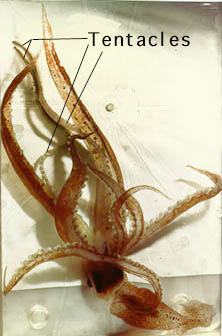
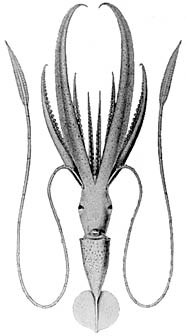
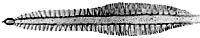
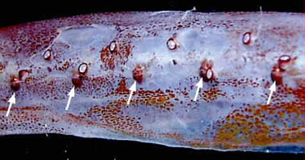
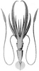

---
aliases:
  - calyx
title: Chiroteuthis calyx
---

## Phylogeny 

-   « Ancestral Groups  
    -  [Chiroteuthis](../Chiroteuthis.md) 
    -  [Chiroteuthidae](../../Chiroteuthidae.md) 
    -   [Chiroteuthid families](Chiroteuthid_families)
    -  [Oegopsida](../../../../Oegopsida.md) 
    -  [Decapodiformes](../../../../../Decapodiformes.md) 
    -  [Coleoidea](../../../../../../Coleoidea.md) 
    -  [Cephalopoda](../../../../../../../Cephalopoda.md) 
    -  [Mollusca](../../../../../../../../Mollusca.md) 
    -  [Bilateria](../../../../../../../../../Bilateria.md) 
    -  [Animals](../../../../../../../../../../Animals.md) 
    -  [Eukarya](../../../../../../../../../../../Eukarya.md) 
    -   [Tree of Life](../../../../../../../../../../../Tree_of_Life.md)

-   ◊ Sibling Groups of  Chiroteuthis
    -   [Chiroteuthis sp. B2](Chiroteuthis_sp._B2)
    -   Chiroteuthis calyx
    -   [Chiroteuthis joubini](Chiroteuthis_joubini)
    -   [Chiroteuthis mega](Chiroteuthis_mega)
    -   [Chiroteuthis picteti](Chiroteuthis_picteti)
    -   [Chiroteuthis spoeli](Chiroteuthis_spoeli)
    -   [Chiroteuthis veranyi](Chiroteuthis_veranyi)

-   » Sub-Groups 

# *Chiroteuthis calyx* [Young, 1972] 

[Clyde F. E. Roper and Richard E. Young]()

)

The holotype is deposited in the Santa Barbara Museum of Natural
History, California.

Containing group: [Chiroteuthis](../Chiroteuthis.md))*

## Introduction

***C. calyx*** is known only from the temperate waters of the North
Pacific. It is closely related to ***C. veranyi*** but is easily
separated by the presence of globular arm suckers and differences in the
structure of the proximal section of the protective membranes on the
tentacular club.

#### Diagnosis

A Chiroteuthis \...

-   with short club divided into two nearly equal sections by protective
    membranes.
-   with trabeculae, in the proximal protective membrane of the club,
    not fused at bases and divided at tips.\
-   with photophores on eyeball in strips and two photophores on
    viscera.\

### Characteristics

1.  Arms
    1.  Largest suckers with nearly smooth rings, proximal suckers with
        18-20 separate, truncate teeth on distal 2/3 of ring.
    2.  Largest suckers globular; largest suckers on arms III more than
        three times diameter of adjacent arm IV suckers.\
2.  Tentacular clubs
    1.  Suckers with 11-14 pointed teeth, with bases in contact, over
        distal 1/2-3/4 of ring; central tooth enlarged.
    2.  Sucker stalks in two distinct parts (stalk diameters differ);
        stalks of suckers in lateral series much longer than those in
        medial series.
    3.  Protective membranes
        1.  Membranes in two distinct sets of about equal lengths,
            proximal set slightly broader.\

           )

            **Figure**. Aboral view of the tentacular club of ***C.
            calyx***. Drawing from Young (1972).

        2.  Proximal set with separate trabeculae (approx. 17), each
            split distally into two or three parts, except for initial
            one or two.

        3.  Distal set with about 18 single, separate trabeculae.\
3.  Photophores
    1.  Eyeball: lateral series = stripe; medial series = stripe;
        intermediate series = one large round anterior, one large round
        posterior photophore and one small round photophore offset
        slightly medially near anterior photophore.
    2.  Viscera: two photophores on ink sac.\
4.  Pigmentation
    1.  Club sucker stalks pleated, otherwise stalks unpigmented.

#### Comments

[More details of the description are found here](http://www.tolweb.org/accessory/Chiroteuthis_calyx_Description?acc_id=693).

### Nomenclature

This species was originally described by Young (1972) for squids taken
off Oregon, California and Baja California. Prior records of ***C.
calyx*** (e.g., Berry, 1963; Pearcy, 1965) in these waters had been
referred to ***C. veranyi***, its close relative.

### Life history

Paralarval stages are typical for the family. The late doratopsis
paralarval stage attains a length of at least 60 mm ML (Berry, 1963).
Paralarval behavior has been described by Vecchione, *et. al*., 1992.

### Distribution

#### Geographical distribution

Type locality - off Southern California. This species is found
throughout the North Pacific Transition Zone from off Southern
California to the Gulf of Alaska, across the North Pacific to off
Honshu, Japan (Nesis, 1982; Seki, in prep.).

### References

Berry, S. S. 1963. A "Doratopsis" larva of the squid family
Chiroteuthidae in Californian waters. Calif. Fish. Game, 49: 128-139.

Pearcy, W. 1965. Species composition and distribution of pelagic
cephalopods from the Pacific Ocean off Oregon. Pac. Sci., 19: 261-266.

Vecchione, M., B. H. Robison, and C. F.E. Roper. 1992. A tale of two
species: tail morphology in paralarval *Chiroteuthis* (Cephalopoda:
Chiroteuthidae). Proceeding of the Biological Society of Washington
105(4): 683-692.

Young, R. E. (1972). The systematics and areal distribution of pelagic
cephalopods from the seas off Southern California. Smithson. Contr.
Zool., 97: 1-159.

## Title Illustrations



  ---------
  Scientific Name ::  Chiroteuthis calyx
  Creator           D. Galli
  ---------
)

  ------------------------------------------------------
  Scientific Name ::  Chiroteuthis calyx
  Reference         from Young, R. E. 1972. The systematics and areal distribution of pelagic cephalopods from the seas off Southern California. Smithson. Contr. Zool. 97:1-159.
  Size              54 mm ML
  ------------------------------------------------------

## Confidential Links & Embeds: 

### #is_/same_as :: [[/_Standards/bio/bio~Domain/Eukarya/Animal/Bilateria/Mollusca/Cephalopoda/Coleoidea/Decapodiformes/Oegopsida/Chiroteuthid/Chiroteuthidae/Chiroteuthis/calyx|calyx]] 

### #is_/same_as :: [[/_public/bio/bio~Domain/Eukarya/Animal/Bilateria/Mollusca/Cephalopoda/Coleoidea/Decapodiformes/Oegopsida/Chiroteuthid/Chiroteuthidae/Chiroteuthis/calyx.public|calyx.public]] 

### #is_/same_as :: [[/_internal/bio/bio~Domain/Eukarya/Animal/Bilateria/Mollusca/Cephalopoda/Coleoidea/Decapodiformes/Oegopsida/Chiroteuthid/Chiroteuthidae/Chiroteuthis/calyx.internal|calyx.internal]] 

### #is_/same_as :: [[/_protect/bio/bio~Domain/Eukarya/Animal/Bilateria/Mollusca/Cephalopoda/Coleoidea/Decapodiformes/Oegopsida/Chiroteuthid/Chiroteuthidae/Chiroteuthis/calyx.protect|calyx.protect]] 

### #is_/same_as :: [[/_private/bio/bio~Domain/Eukarya/Animal/Bilateria/Mollusca/Cephalopoda/Coleoidea/Decapodiformes/Oegopsida/Chiroteuthid/Chiroteuthidae/Chiroteuthis/calyx.private|calyx.private]] 

### #is_/same_as :: [[/_personal/bio/bio~Domain/Eukarya/Animal/Bilateria/Mollusca/Cephalopoda/Coleoidea/Decapodiformes/Oegopsida/Chiroteuthid/Chiroteuthidae/Chiroteuthis/calyx.personal|calyx.personal]] 

### #is_/same_as :: [[/_secret/bio/bio~Domain/Eukarya/Animal/Bilateria/Mollusca/Cephalopoda/Coleoidea/Decapodiformes/Oegopsida/Chiroteuthid/Chiroteuthidae/Chiroteuthis/calyx.secret|calyx.secret]] 

