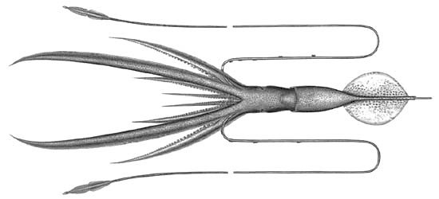
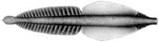

---
aliases:
  - joubini
title: Chiroteuthis joubini
---

## Phylogeny 

-   « Ancestral Groups  
    -  [Chiroteuthis](../Chiroteuthis.md) 
    -  [Chiroteuthidae](../../Chiroteuthidae.md) 
    -   [Chiroteuthid families](Chiroteuthid_families)
    -  [Oegopsida](../../../../Oegopsida.md) 
    -  [Decapodiformes](../../../../../Decapodiformes.md) 
    -  [Coleoidea](../../../../../../Coleoidea.md) 
    -  [Cephalopoda](../../../../../../../Cephalopoda.md) 
    -  [Mollusca](../../../../../../../../Mollusca.md) 
    -  [Bilateria](../../../../../../../../../Bilateria.md) 
    -  [Animals](../../../../../../../../../../Animals.md) 
    -  [Eukarya](../../../../../../../../../../../Eukarya.md) 
    -   [Tree of Life](../../../../../../../../../../../Tree_of_Life.md)

-   ◊ Sibling Groups of  Chiroteuthis
    -   [Chiroteuthis sp. B2](Chiroteuthis_sp._B2)
    -   [Chiroteuthis calyx](Chiroteuthis_calyx)
    -   Chiroteuthis joubini
    -   [Chiroteuthis mega](Chiroteuthis_mega)
    -   [Chiroteuthis picteti](Chiroteuthis_picteti)
    -   [Chiroteuthis spoeli](Chiroteuthis_spoeli)
    -   [Chiroteuthis veranyi](Chiroteuthis_veranyi)

-   » Sub-Groups 

# *Chiroteuthis joubini* [Voss, 1967] 

[Clyde F. E. Roper and Richard E. Young]()

The holotype is located at the Zoological Museum, University of
Copenhagen, Denmark.

Containing group: [Chiroteuthis](../Chiroteuthis.md))*

## Introduction

***C. joubini*** occurs in the tropical to subtropical waters of the
Atlantic and Indian Oceans. It is separated from its closest relatives
by the shortness of the proximal section of the tentacular club and by
the lack of globular arm suckers.

#### Diagnosis

A Chiroteuthis \...

-   with protective membranes of club in three sections; proximal
    section much shorter than others.
-   with circular ocular photophores in two series. 

### Characteristics

1.  Arms
    1.  Large arm suckers with 22-26 pointed, triangular teeth, in
        contact at bases, over distal 2/3 of ring.
    2.  Largest suckers not globular.\
2.  Tentacular clubs
    1.  Suckers with 7-8 pointed teeth, in contact at bases, over distal
        1/2 of ring; no enlarged central tooth.
    2.  Suckers with stalks in two distinct parts; stalks of lateral
        suckers about equal in length to stalks of medial suckers.
    3.  Protective membranes
        1.  Membranes in three distinctive sets.\

           )

            **Figure**. Aboral view of the tentacular club of C.
            joubini. Drawing by A. D. Hart (© C. Roper)\

        2.  Proximal set with 7-12 trabeculae (14-18% of club length).

        3.  Middle set without distinct trabeculae but opposite 9-12
            marginal suckers (32-36% of CL).

        4.  Distal set with 20-21 trabeculae (46-54% of CL).\
3.  Photophores
    1.  Eyeball with oval organs in 2 series: lateral series= 5 or 6
        organs; 1(enlarged)+4(or 3)+1; medial series = 5 or 4+1. Formula
        reads from posterior to anterior.
    2.  Viscera: two, large photophores.\
4.  Pigmentation
    1.  Club sucker stalks with epithelial pigment but not pleated;
        epithelial pigmentation diminishes then disappears in distal
        portions of club.

#### Comments

[More details of the description of ***C. joubini*** can be found here](http://www.tolweb.org/accessory/Chiroteuthis_joubini_Description?acc_id=699).

### Nomenclature

This species was originally described by Joubin (1933) although he
identified it as ***C. lacertosa*****.** Voss (1967) recognized that
Joubin\'s specimen did not conform to the true ***C. lacertosa*** (=
***C. veranyi***), nor to any other described species, so he renamed it
as a new species. Joubin\'s description becomes the type description and
Joubin\'s specimen is the holotype of ***C. joubini***.

### Life history

Paralarval stages are unknown.

### Distribution

The type locality is the tropical North Atlantic at 8°N, 44°W. This
species is known from the temperate north to temperate south Atlantic
Ocean.

### References

Joubin, L. 1933. Notes preliminaries sur les Cephalopodes des croisieres
du Dana (1921-1922). 4e Partie. Ann. Inst. Oceanogr., new series, 13(1):
1-49.

Voss, G. L. 1967. Some bathypelagic cephalopods from South African
waters. Ann. South African Mus., 50: 61-88.

## Title Illustrations

)

  ----------
  Scientific Name ::  Chiroteuthis joubini
  Creator           A. D. Hart
  ----------

## Confidential Links & Embeds: 

### #is_/same_as :: [[/_Standards/bio/bio~Domain/Eukarya/Animal/Bilateria/Mollusca/Cephalopoda/Coleoidea/Decapodiformes/Oegopsida/Chiroteuthid/Chiroteuthidae/Chiroteuthis/joubini|joubini]] 

### #is_/same_as :: [[/_public/bio/bio~Domain/Eukarya/Animal/Bilateria/Mollusca/Cephalopoda/Coleoidea/Decapodiformes/Oegopsida/Chiroteuthid/Chiroteuthidae/Chiroteuthis/joubini.public|joubini.public]] 

### #is_/same_as :: [[/_internal/bio/bio~Domain/Eukarya/Animal/Bilateria/Mollusca/Cephalopoda/Coleoidea/Decapodiformes/Oegopsida/Chiroteuthid/Chiroteuthidae/Chiroteuthis/joubini.internal|joubini.internal]] 

### #is_/same_as :: [[/_protect/bio/bio~Domain/Eukarya/Animal/Bilateria/Mollusca/Cephalopoda/Coleoidea/Decapodiformes/Oegopsida/Chiroteuthid/Chiroteuthidae/Chiroteuthis/joubini.protect|joubini.protect]] 

### #is_/same_as :: [[/_private/bio/bio~Domain/Eukarya/Animal/Bilateria/Mollusca/Cephalopoda/Coleoidea/Decapodiformes/Oegopsida/Chiroteuthid/Chiroteuthidae/Chiroteuthis/joubini.private|joubini.private]] 

### #is_/same_as :: [[/_personal/bio/bio~Domain/Eukarya/Animal/Bilateria/Mollusca/Cephalopoda/Coleoidea/Decapodiformes/Oegopsida/Chiroteuthid/Chiroteuthidae/Chiroteuthis/joubini.personal|joubini.personal]] 

### #is_/same_as :: [[/_secret/bio/bio~Domain/Eukarya/Animal/Bilateria/Mollusca/Cephalopoda/Coleoidea/Decapodiformes/Oegopsida/Chiroteuthid/Chiroteuthidae/Chiroteuthis/joubini.secret|joubini.secret]] 

