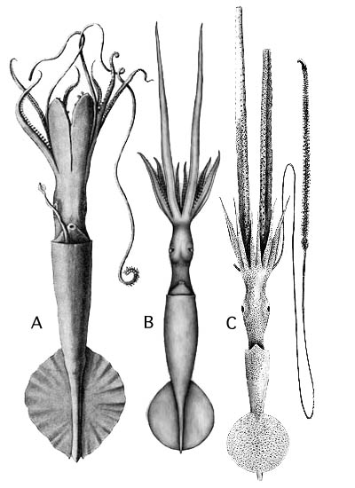

---
aliases:
  - mega
title: Chiroteuthis mega
---

## Phylogeny 

-   « Ancestral Groups  
    -  [Chiroteuthis](../Chiroteuthis.md) 
    -  [Chiroteuthidae](../../Chiroteuthidae.md) 
    -   [Chiroteuthid families](Chiroteuthid_families)
    -  [Oegopsida](../../../../Oegopsida.md) 
    -  [Decapodiformes](../../../../../Decapodiformes.md) 
    -  [Coleoidea](../../../../../../Coleoidea.md) 
    -  [Cephalopoda](../../../../../../../Cephalopoda.md) 
    -  [Mollusca](../../../../../../../../Mollusca.md) 
    -  [Bilateria](../../../../../../../../../Bilateria.md) 
    -  [Animals](../../../../../../../../../../Animals.md) 
    -  [Eukarya](../../../../../../../../../../../Eukarya.md) 
    -   [Tree of Life](../../../../../../../../../../../Tree_of_Life.md)

-   ◊ Sibling Groups of  Chiroteuthis
    -   [Chiroteuthis sp. B2](Chiroteuthis_sp._B2)
    -   [Chiroteuthis calyx](Chiroteuthis_calyx)
    -   [Chiroteuthis joubini](Chiroteuthis_joubini)
    -   Chiroteuthis mega
    -   [Chiroteuthis picteti](Chiroteuthis_picteti)
    -   [Chiroteuthis spoeli](Chiroteuthis_spoeli)
    -   [Chiroteuthis veranyi](Chiroteuthis_veranyi)

-   » Sub-Groups 

# *Chiroteuthis mega* [(Joubin, 1932)] 

[Clyde F. E. Roper and Richard E. Young]()

The holotype is deposited in the Zoological Museum, University of
Copenhagen, Denmark

Containing group: [Chiroteuthis](../Chiroteuthis.md))*

## Introduction

***C. mega*** has a similar tentacular club to that of ***C. picteti***
but is easily recognized by the absence of visceral photophores. Other
unusual features are the arrangement of ocular photophores, the
slenderness and elongation of the mantle, head and arms IV, and very
long clubs with an especially large club-tip photophore.

#### Diagnosis

A ***Chiroteuthis*** \...

-   without visceral photophores. 

### Characteristics

1.  Arms
    1.  Large arm suckers with 20-30 teeth around entire ring. Teeth
        slender, pointed, separate distally; truncated, separate
        laterally; broadly rounded, in contact proximally.
    2.  Largest suckers not globular.\
2.  Tentacular clubs
    1.  Suckers with enlarged, conspicuous central tooth.
    2.  Sucker stalks weakly divided into two parts: proximal portion
        with thick, delicate keel with terminal swelling (=flag). Stalks
        of lateral suckers much longer (ca 2X) than stalks of medial
        suckers.
    3.  Protective membranes in two sets with proximal set less than one
        tenth length of distal set and only slightly broader than distal
        set.
3.  Photophores
    1.  Eyeball: Lateral series= 8 separate organs (may coalesce to
        irregular stripe , 1); intermediate series = stripe with nearly
        separate photophore at posterior end; medial series = stripe.
    2.  Viscera: Photophores absent.\
4.  Pigmentation
    1.  Club sucker stalks without pigment.

#### Comments

[More details of the description of ***C. mega*** can be found here](http://www.tolweb.org/accessory/Chiroteuthis_mega_Description?acc_id=705).

### Nomenclature

***Chiropsis mega*** was described by Joubin in 1932 in a preliminary
note on the male reproductive system and subsequently described and
illustrated in detail in 1933. The single specimen, captured in the
Sargasso Sea of the North Atlantic, was unusual in having short, broad
ventral arms (thought to be hectocotylization by Joubin), a very short
tentacular club, a single visceral photophore and a large penis. Our
examination of the holotype found this squid to be an injured animal
that had begun to heal damaged ventral arms and its remaining single
club. The visceral photophore was actually a bend in the cephalic vein
and visceral photophores are lacking. The absence of the visceral
photophores is the main distinctive feature of the species. The large
penis seems to be a characteristic of the genus ***Chiroteuthis**.*
Therefore, the generic status of ***Chiropsis*** is untenable. MacDonald
and Clench (1934) described a new genus and species, ***Bigelowia
atlanticus***, from the western North Atlantic off Bermuda from the same
general region where ***C. mega*** was captured. The species was based
on a single, mutilated specimen and was characterized by its very
elongate, slender head and mantle. Roper *et al.* (1969) placed
***Bigelowia*** in the synonomy of ***Chiroteuthis**.* Our
re-examination of the holotype of ***B. atlanticus*** shows that
visceral photophores are absent and that the species is a synonym of
***C. mega***. Finally, Voss (1967) described ***Chiroteuthis
capensis*** from well preserved material from South Atlantic waters off
South Africa. The most distinctive feature was the absence of visceral
photophores which was thought to be a unique character at that time.
This species was placed in the synonomy of ***C. mega*** by
Salcedo-Vargas (1997) based on his re-examination of the holotypes of
***C. mega*** and ***C. capensis***.

### Distribution

***C. mega*** is known from the North and South Atlantic and eastern
North Pacific oceans. Relatively little geographical variation in sucker
dentition was noted in either club or arm suckers.

### References

Joubin, L. 1932. Note sur l\'appareil reproducteur d\'un céphalopode
nouveau: *Chiropsis mega*. Bull. Soc. zool. France, 57: 288-291.

Joubin, L. 1933. Notes préliminaires sur les céphalopodes des croisières
du DANA. Ann. Instit. Océanogr., 13: 1-49.

MacDonald, R. and W. J. Clench. 1934. Descriptions of a new genus and
two new species of squids from the North Atlantic. Occ. Pap. Boston Soc.
Nat. Hist., 8: 145-152.

Roper, C. F. E., R. E. Young and G. L. Voss. An illustrated key to the
families of the order Teuthoidea (Cephalopoda). Smithson. Contr. Zool.,
13: 1-32.

Salcedo-Vargas, M. A. 1997. Cephalopods from the Netherlands Indian
Ocean programme (NIOP)-II. Mastigoteuthid lineage and related forms.
Beaufortia, 47: 91-108.

Voss, G. L. 1967. Some bathypelagic cephalopods from South African
waters. Ann. South African Mus., 50: 61-88.

## Title Illustrations

 

  -------------------------------------------------------------------------------
  scientific_name ::  Chiroteuthis mega, Chiroteuthis mega (2), Chiroteuthis mega (3)
  Comments          Type illustration of Chiropsis mega, Illustration of the holotype of Bigelowia atlanticus (2), Type illustration of Chiroteuthis capensis (3)
  Reference         From Joubin, L. 1933. Notes préliminaires sur les céphalopodes des croisières du DANA. Ann. Instit. Océanogr. 13:1-49., from Voss, G. L. 1967. Some bathypelagic cephalopods from South African waters. Ann. South African Mus. 50:61-88. (3)
  Creator           J. R. Schroeder (2)
  -------------------------------------------------------------------------------

## Confidential Links & Embeds: 

### #is_/same_as :: [[/_Standards/bio/bio~Domain/Eukarya/Animal/Bilateria/Mollusca/Cephalopoda/Coleoidea/Decapodiformes/Oegopsida/Chiroteuthid/Chiroteuthidae/Chiroteuthis/mega|mega]] 

### #is_/same_as :: [[/_public/bio/bio~Domain/Eukarya/Animal/Bilateria/Mollusca/Cephalopoda/Coleoidea/Decapodiformes/Oegopsida/Chiroteuthid/Chiroteuthidae/Chiroteuthis/mega.public|mega.public]] 

### #is_/same_as :: [[/_internal/bio/bio~Domain/Eukarya/Animal/Bilateria/Mollusca/Cephalopoda/Coleoidea/Decapodiformes/Oegopsida/Chiroteuthid/Chiroteuthidae/Chiroteuthis/mega.internal|mega.internal]] 

### #is_/same_as :: [[/_protect/bio/bio~Domain/Eukarya/Animal/Bilateria/Mollusca/Cephalopoda/Coleoidea/Decapodiformes/Oegopsida/Chiroteuthid/Chiroteuthidae/Chiroteuthis/mega.protect|mega.protect]] 

### #is_/same_as :: [[/_private/bio/bio~Domain/Eukarya/Animal/Bilateria/Mollusca/Cephalopoda/Coleoidea/Decapodiformes/Oegopsida/Chiroteuthid/Chiroteuthidae/Chiroteuthis/mega.private|mega.private]] 

### #is_/same_as :: [[/_personal/bio/bio~Domain/Eukarya/Animal/Bilateria/Mollusca/Cephalopoda/Coleoidea/Decapodiformes/Oegopsida/Chiroteuthid/Chiroteuthidae/Chiroteuthis/mega.personal|mega.personal]] 

### #is_/same_as :: [[/_secret/bio/bio~Domain/Eukarya/Animal/Bilateria/Mollusca/Cephalopoda/Coleoidea/Decapodiformes/Oegopsida/Chiroteuthid/Chiroteuthidae/Chiroteuthis/mega.secret|mega.secret]] 

